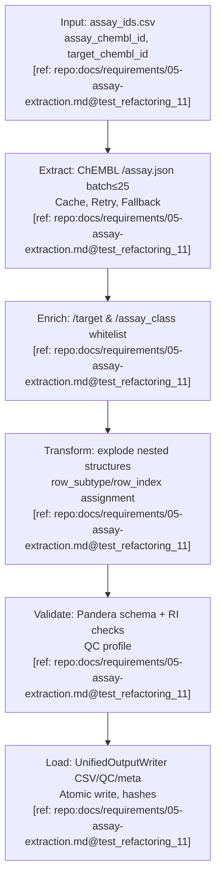
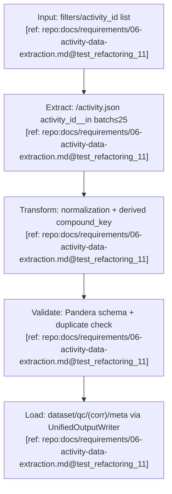
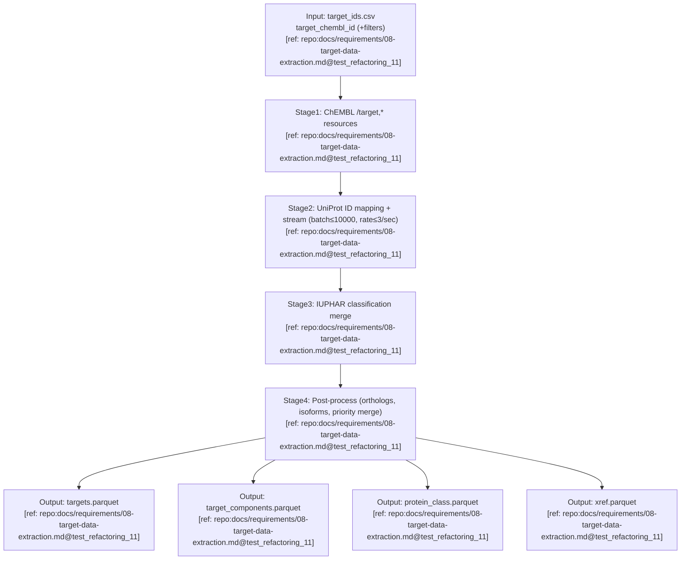

# IO Schemas and Diagrams

## Assay Pipeline

### A) Паспорт пайплайна
- **Название:** AssayPipeline
- **Назначение:** детерминированное извлечение, нормализация и выгрузка данных ассая из ChEMBL с whitelist обогащением. [ref: repo:docs/requirements/05-assay-extraction.md@test_refactoring_11]

### B) Диаграмма I/O


### C) Input Schema
schema:
  name: assay/input
  primary_key: [assay_chembl_id]
  foreign_keys: []
  column_order: [assay_chembl_id, target_chembl_id]
  fields:
    - name: assay_chembl_id
      dtype: string
      required: true
      units: null
      allowed_values: []
      constraints:
        regex: '^CHEMBL\\d+$'
      na_policy: forbid
      notes: "Основной идентификатор ассая"
      evidence: "[ref: repo:docs/requirements/05-assay-extraction.md@test_refactoring_11]"
    - name: target_chembl_id
      dtype: string
      required: false
      units: null
      allowed_values: []
      constraints:
        regex: '^CHEMBL\\d+$'
      na_policy: allow
      notes: "Опциональный фильтр по таргету"
      evidence: "[ref: repo:docs/requirements/05-assay-extraction.md@test_refactoring_11]"

### D) Output Schema
schema:
  name: assay/output
  primary_key: [assay_chembl_id, row_subtype, row_index]
  foreign_keys:
    - field: target_chembl_id
      references: target(target_chembl_id)
    - field: assay_class_id
      references: assay_class(assay_class_id)
  column_order: [assay_chembl_id, row_subtype, row_index, pref_name, hash_row, hash_business_key, chembl_release]
  fields:
    - name: assay_chembl_id
      dtype: string
      required: true
      units: null
      allowed_values: []
      constraints:
        regex: '^CHEMBL\\d+$'
      na_policy: forbid
      notes: "Первичный ключ (часть)"
      evidence: "[ref: repo:docs/requirements/05-assay-extraction.md@test_refactoring_11]"
    - name: row_subtype
      dtype: string
      required: true
      units: null
      allowed_values: ["assay", "param", "variant"]
      constraints: {}
      na_policy: forbid
      notes: "Тип развёрнутой строки"
      evidence: "[ref: repo:docs/requirements/05-assay-extraction.md@test_refactoring_11]"
    - name: row_index
      dtype: int
      required: true
      units: null
      allowed_values: []
      constraints:
        min: 0
      na_policy: forbid
      notes: "Индекс для детерминизма"
      evidence: "[ref: repo:docs/requirements/05-assay-extraction.md@test_refactoring_11]"
    - name: pref_name
      dtype: string
      required: false
      units: null
      allowed_values: []
      constraints: {}
      na_policy: allow
      notes: "Имя ассая из ChEMBL"
      evidence: "[ref: repo:docs/requirements/05-assay-extraction.md@test_refactoring_11]"
    - name: hash_row
      dtype: string
      required: true
      units: null
      allowed_values: []
      constraints:
        regex: '^[0-9a-f]{64}$'
      na_policy: forbid
      notes: "SHA256 канонической строки"
      evidence: "[ref: repo:docs/requirements/05-assay-extraction.md@test_refactoring_11]"
    - name: hash_business_key
      dtype: string
      required: true
      units: null
      allowed_values: []
      constraints:
        regex: '^[0-9a-f]{64}$'
      na_policy: forbid
      notes: "SHA256 от assay_chembl_id"
      evidence: "[ref: repo:docs/requirements/05-assay-extraction.md@test_refactoring_11]"
    - name: chembl_release
      dtype: string
      required: true
      units: null
      allowed_values: []
      constraints: {}
      na_policy: forbid
      notes: "Версия источника"
      evidence: "[ref: repo:docs/requirements/05-assay-extraction.md@test_refactoring_11]"
    - name: additional_columns
      dtype: string
      required: true
      units: null
      allowed_values: []
      constraints: {}
      na_policy: allow
      notes: "Совокупность полей ассая (hierarchy, parameters, variant_sequences, metadata)"
      evidence: "[ref: repo:docs/requirements/05-assay-extraction.md@test_refactoring_11]"

### E) Mapping Input→Output
| output_field | source_field(s) | transform_rule | unit_conversion | validation_rule | evidence |
|---|---|---|---|---|---|
| assay_chembl_id | assay_chembl_id | passthrough | none | regex `^CHEMBL\d+$` | [ref: repo:docs/requirements/05-assay-extraction.md@test_refactoring_11] |
| row_subtype | derived from nested structure type | assign literal per explode stage | none | value in {assay,param,variant} | [ref: repo:docs/requirements/05-assay-extraction.md@test_refactoring_11] |
| row_index | enumerate within subtype | enumerate starting 0 | none | integer >=0 | [ref: repo:docs/requirements/05-assay-extraction.md@test_refactoring_11] |
| pref_name | ChEMBL assay record.pref_name | whitespace trim | none | optional string | [ref: repo:docs/requirements/05-assay-extraction.md@test_refactoring_11] |
| hash_row | canonicalized row dict | SHA256(JSON, sort_keys, ISO8601, %.6f) | none | length 64 | [ref: repo:docs/requirements/05-assay-extraction.md@test_refactoring_11] |

### F) Контракты и детерминизм
- Batch запросы `≤25` ID, при превышении — откат к POST+Override; circuit breaker 5/60, retries уважают `Retry-After`. [ref: repo:docs/requirements/05-assay-extraction.md@test_refactoring_11]
- Сортировка `assay_chembl_id,row_subtype,row_index`, nullable dtypes, NA-policy `""/null`. [ref: repo:docs/requirements/05-assay-extraction.md@test_refactoring_11]
- AtomicWriter `os.replace`, run-scoped `.tmp_run_{run_id}`, meta.yaml с SHA256. [ref: repo:docs/requirements/02-io-system.md@test_refactoring_11]

---

## Activity Pipeline

### A) Паспорт пайплайна
- **Название:** ActivityPipeline
- **Назначение:** извлечение и нормализация ChEMBL activity c детерминированной выгрузкой и QC. [ref: repo:docs/requirements/06-activity-data-extraction.md@test_refactoring_11]

### B) Диаграмма I/O


### C) Input Schema
schema:
  name: activity/input
  primary_key: []
  foreign_keys: []
  column_order: [activity_id]
  fields:
    - name: activity_id
      dtype: int
      required: false
      units: null
      allowed_values: []
      constraints:
        min: 1
      na_policy: allow
      notes: "Опциональный список идентификаторов для batch извлечения"
      evidence: "[ref: repo:docs/requirements/06-activity-data-extraction.md@test_refactoring_11]"
    - name: filter_params
      dtype: string
      required: false
      units: null
      allowed_values: []
      constraints: {}
      na_policy: allow
      notes: "Параметры фильтрации (molecule_chembl_id, target_chembl_id, etc.)"
      evidence: "[ref: repo:docs/requirements/06-activity-data-extraction.md@test_refactoring_11]"

### D) Output Schema
schema:
  name: activity/output
  primary_key: [activity_id]
  foreign_keys:
    - field: molecule_chembl_id
      references: molecule(molecule_chembl_id)
    - field: assay_chembl_id
      references: assay(assay_chembl_id)
    - field: target_chembl_id
      references: target(target_chembl_id)
    - field: document_chembl_id
      references: document(document_chembl_id)
  column_order: [activity_id, molecule_chembl_id, assay_chembl_id, target_chembl_id, document_chembl_id, standard_type, standard_relation, standard_value, standard_units, pchembl_value, canonical_smiles, ligand_efficiency, bao_endpoint, bao_format, bao_label, target_organism, target_tax_id, data_validity_comment, activity_properties, compound_key, is_citation, high_citation_rate, exact_data_citation, rounded_data_citation]
  fields:
    - name: activity_id
      dtype: int
      required: true
      units: null
      allowed_values: []
      constraints:
        min: 1
      na_policy: forbid
      notes: "Уникальный идентификатор активности"
      evidence: "[ref: repo:docs/requirements/06-activity-data-extraction.md@test_refactoring_11]"
    - name: molecule_chembl_id
      dtype: string
      required: false
      units: null
      allowed_values: []
      constraints:
        regex: '^CHEMBL\\d+$'
      na_policy: allow
      notes: "FK на молекулу"
      evidence: "[ref: repo:docs/requirements/06-activity-data-extraction.md@test_refactoring_11]"
    - name: standard_value
      dtype: float
      required: false
      units: "as provided (nM, µM, etc.)"
      allowed_values: []
      constraints:
        min: 0
      na_policy: allow
      notes: "Стандартизированное значение, единицы из standard_units"
      evidence: "[ref: repo:docs/requirements/06-activity-data-extraction.md@test_refactoring_11]"
    - name: standard_units
      dtype: string
      required: false
      units: null
      allowed_values: []
      constraints: {}
      na_policy: allow
      notes: "Единицы (nM, µM, …)"
      evidence: "[ref: repo:docs/requirements/06-activity-data-extraction.md@test_refactoring_11]"
    - name: pchembl_value
      dtype: float
      required: false
      units: null
      allowed_values: []
      constraints:
        min: 0
      na_policy: allow
      notes: "-log10 нормированное значение"
      evidence: "[ref: repo:docs/requirements/06-activity-data-extraction.md@test_refactoring_11]"
    - name: compound_key
      dtype: string
      required: true
      units: null
      allowed_values: []
      constraints: {}
      na_policy: forbid
      notes: "Бизнес-ключ (молекула+тип+таргет)"
      evidence: "[ref: repo:docs/requirements/06-activity-data-extraction.md@test_refactoring_11]"
    - name: ligand_efficiency
      dtype: string
      required: false
      units: null
      allowed_values: []
      constraints: {}
      na_policy: allow
      notes: "JSON dump метрик эффективности"
      evidence: "[ref: repo:docs/requirements/06-activity-data-extraction.md@test_refactoring_11]"
    - name: quality_flags
      dtype: string
      required: true
      units: null
      allowed_values: []
      constraints: {}
      na_policy: forbid
      notes: "Флаги is_citation/high_citation_rate/exact/rounded"
      evidence: "[ref: repo:docs/requirements/06-activity-data-extraction.md@test_refactoring_11]"
    - name: additional_fields
      dtype: string
      required: true
      units: null
      allowed_values: []
      constraints: {}
      na_policy: allow
      notes: "Прочие поля ChEMBL (bao_*, target_*, activity_properties)"
      evidence: "[ref: repo:docs/requirements/06-activity-data-extraction.md@test_refactoring_11]"

### E) Mapping Input→Output
| output_field | source_field(s) | transform_rule | unit_conversion | validation_rule | evidence |
|---|---|---|---|---|---|
| activity_id | API activity_id | passthrough | none | unique, >=1 | [ref: repo:docs/requirements/06-activity-data-extraction.md@test_refactoring_11] |
| standard_value | API standard_value | to float with NaN handling | none | >=0 or null | [ref: repo:docs/requirements/06-activity-data-extraction.md@test_refactoring_11] |
| standard_units | API standard_units | normalize synonyms | convert synonyms to canonical tokens | isin allowed list | [ref: repo:docs/requirements/06-activity-data-extraction.md@test_refactoring_11] |
| compound_key | molecule_chembl_id + standard_type + target_chembl_id | concatenate with pipe | none | non-empty string | [ref: repo:docs/requirements/06-activity-data-extraction.md@test_refactoring_11] |
| ligand_efficiency | API ligand_efficiency | stable json dumps | none | json parseable | [ref: repo:docs/requirements/06-activity-data-extraction.md@test_refactoring_11] |

### F) Контракты и детерминизм
- Batch `activity_id__in` ≤25, fallback split, respect Retry-After, duplicates запрещены (`duplicated()==0`). [ref: repo:docs/requirements/06-activity-data-extraction.md@test_refactoring_11]
- Сортировка `activity_id`, QC отчёты фиксируют duplicates и coverage. [ref: repo:docs/requirements/06-activity-data-extraction.md@test_refactoring_11]
- OutputWriter стандарт/extended режимы с correlation по feature flag. [ref: repo:docs/requirements/06-activity-data-extraction.md@test_refactoring_11]

---

## Testitem Pipeline

### A) Паспорт пайплайна
- **Название:** TestitemPipeline
- **Назначение:** извлечение молекул ChEMBL с опциональным PubChem enrichment и строгой нормализацией. [ref: repo:docs/requirements/07a-testitem-extraction.md@test_refactoring_11]

### B) Диаграмма I/O
```mermaid
flowchart TB
  IN["Input: testitem_ids.csv<br/>molecule_chembl_id (+nstereo, salt_chembl_id)<br/>[ref: repo:docs/requirements/07a-testitem-extraction.md@test_refactoring_11]"] --> EX["Extract: ChEMBL /molecule.json batch≤25<br/>[ref: repo:docs/requirements/07a-testitem-extraction.md@test_refactoring_11]"]
  EX --> PC{PubChem enabled?<br/>[ref: repo:docs/requirements/07a-testitem-extraction.md@test_refactoring_11]}
  PC -->|Yes| EN["PubChem enrichment (CID resolve, properties)<br/>batch≤100, rate≤5/sec<br/>[ref: repo:docs/requirements/07b-testitem-data-extraction.md@test_refactoring_11]"]
  PC -->|No| TR
  EN --> TR["Transform: flatten hierarchies, merge pubchem_*, apply NA policy<br/>[ref: repo:docs/requirements/07a-testitem-extraction.md@test_refactoring_11]"]
  TR --> VL["Validate: Pandera output schema, QC fail_on duplicates<br/>[ref: repo:docs/requirements/07a-testitem-extraction.md@test_refactoring_11]"]
  VL --> LD["Load: deterministic CSV/QC/(corr)/meta via AtomicWriter<br/>[ref: repo:docs/requirements/07a-testitem-extraction.md@test_refactoring_11]"]
```

### C) Input Schema
schema:
  name: testitem/input
  primary_key: [molecule_chembl_id]
  foreign_keys: []
  column_order: [molecule_chembl_id, nstereo, salt_chembl_id]
  fields:
    - name: molecule_chembl_id
      dtype: string
      required: true
      units: null
      allowed_values: []
      constraints:
        regex: '^CHEMBL\\d+$'
      na_policy: forbid
      notes: "Уникальный идентификатор молекулы"
      evidence: "[ref: repo:docs/requirements/07a-testitem-extraction.md@test_refactoring_11]"
    - name: nstereo
      dtype: int
      required: false
      units: null
      allowed_values: []
      constraints:
        min: 0
      na_policy: allow
      notes: "Количество стереоизомеров"
      evidence: "[ref: repo:docs/requirements/07a-testitem-extraction.md@test_refactoring_11]"
    - name: salt_chembl_id
      dtype: string
      required: false
      units: null
      allowed_values: []
      constraints:
        regex: '^CHEMBL\\d+$'
      na_policy: allow
      notes: "Идентификатор соли"
      evidence: "[ref: repo:docs/requirements/07a-testitem-extraction.md@test_refactoring_11]"

### D) Output Schema
schema:
  name: testitem/output
  primary_key: [molecule_chembl_id]
  foreign_keys:
    - field: parent_chembl_id
      references: molecule(molecule_chembl_id)
  column_order: [molecule_chembl_id, molregno, pref_name, parent_chembl_id, max_phase, structure_type, molecule_type, mw_freebase, qed_weighted, pubchem_cid, standardized_smiles, hash_row, hash_business_key, chembl_release]
  fields:
    - name: molecule_chembl_id
      dtype: string
      required: true
      units: null
      allowed_values: []
      constraints:
        regex: '^CHEMBL\\d+$'
      na_policy: forbid
      notes: "Первичный ключ"
      evidence: "[ref: repo:docs/requirements/07a-testitem-extraction.md@test_refactoring_11]"
    - name: molregno
      dtype: int
      required: true
      units: null
      allowed_values: []
      constraints:
        min: 1
      na_policy: forbid
      notes: "Внутренний регистровый номер"
      evidence: "[ref: repo:docs/requirements/07a-testitem-extraction.md@test_refactoring_11]"
    - name: pref_name
      dtype: string
      required: false
      units: null
      allowed_values: []
      constraints: {}
      na_policy: allow
      notes: "Предпочтительное название"
      evidence: "[ref: repo:docs/requirements/07a-testitem-extraction.md@test_refactoring_11]"
    - name: parent_chembl_id
      dtype: string
      required: false
      units: null
      allowed_values: []
      constraints:
        regex: '^CHEMBL\\d+$'
      na_policy: allow
      notes: "Связь с родительской молекулой"
      evidence: "[ref: repo:docs/requirements/07a-testitem-extraction.md@test_refactoring_11]"
    - name: max_phase
      dtype: int
      required: false
      units: null
      allowed_values: []
      constraints:
        min: 0
      na_policy: allow
      notes: "Максимальная стадия разработки"
      evidence: "[ref: repo:docs/requirements/07a-testitem-extraction.md@test_refactoring_11]"
    - name: mw_freebase
      dtype: float
      required: false
      units: "as provided"
      allowed_values: []
      constraints:
        min: 0
      na_policy: allow
      notes: "Молекулярная масса"
      evidence: "[ref: repo:docs/requirements/07a-testitem-extraction.md@test_refactoring_11]"
    - name: pubchem_cid
      dtype: int
      required: false
      units: null
      allowed_values: []
      constraints:
        min: 1
      na_policy: allow
      notes: "Идентификатор PubChem (enrichment)"
      evidence: "[ref: repo:docs/requirements/07b-testitem-data-extraction.md@test_refactoring_11]"
    - name: standardized_smiles
      dtype: string
      required: false
      units: null
      allowed_values: []
      constraints: {}
      na_policy: allow
      notes: "Стандартизированная структура"
      evidence: "[ref: repo:docs/requirements/07a-testitem-extraction.md@test_refactoring_11]"
    - name: hash_row
      dtype: string
      required: true
      units: null
      allowed_values: []
      constraints:
        regex: '^[0-9a-f]{64}$'
      na_policy: forbid
      notes: "SHA256 канонической записи"
      evidence: "[ref: repo:docs/requirements/07a-testitem-extraction.md@test_refactoring_11]"
    - name: chembl_release
      dtype: string
      required: true
      units: null
      allowed_values: []
      constraints: {}
      na_policy: forbid
      notes: "Версия источника"
      evidence: "[ref: repo:docs/requirements/07a-testitem-extraction.md@test_refactoring_11]"
    - name: extended_columns
      dtype: string
      required: true
      units: null
      allowed_values: []
      constraints: {}
      na_policy: allow
      notes: "Остальные ~90 полей (properties, flags, JSON, metadata)"
      evidence: "[ref: repo:docs/requirements/07a-testitem-extraction.md@test_refactoring_11]"

### E) Mapping Input→Output
| output_field | source_field(s) | transform_rule | unit_conversion | validation_rule | evidence |
|---|---|---|---|---|---|
| molecule_chembl_id | molecule_chembl_id | uppercase & trim | none | regex `^CHEMBL\d+$` | [ref: repo:docs/requirements/07a-testitem-extraction.md@test_refactoring_11] |
| molregno | ChEMBL response.molregno | passthrough | none | integer >=1 | [ref: repo:docs/requirements/07a-testitem-extraction.md@test_refactoring_11] |
| pubchem_cid | PubChem properties.CID | first successful CID | none | integer >=1 or null | [ref: repo:docs/requirements/07b-testitem-data-extraction.md@test_refactoring_11] |
| standardized_smiles | molecule_structures + chemistry normalizer | canonicalize SMILES | none | non-empty or null | [ref: repo:docs/requirements/07a-testitem-extraction.md@test_refactoring_11] |
| hash_row | canonicalized row | SHA256 | none | length 64 | [ref: repo:docs/requirements/07a-testitem-extraction.md@test_refactoring_11] |

### F) Контракты и детерминизм
- ChEMBL batch ≤25, PubChem batch ≤100 (5 req/sec), многоуровневый cache и graceful degradation. [ref: repo:docs/requirements/07a-testitem-extraction.md@test_refactoring_11] [ref: repo:docs/requirements/07b-testitem-data-extraction.md@test_refactoring_11]
- Сортировка `molecule_chembl_id`, column_order фиксирован, NA-policy строгая (nullable dtypes). [ref: repo:docs/requirements/07a-testitem-extraction.md@test_refactoring_11]
- QC fail_on `missing_molecule_chembl_id`, `duplicate_primary_keys`; optional correlation выключен по умолчанию. [ref: repo:docs/requirements/07a-testitem-extraction.md@test_refactoring_11]

---

## Target Pipeline

### A) Паспорт пайплайна
- **Название:** TargetPipeline
- **Назначение:** объединение ChEMBL таргетов с UniProt и IUPHAR enrichment в четыре согласованные таблицы. [ref: repo:docs/requirements/08-target-data-extraction.md@test_refactoring_11]

### B) Диаграмма I/O


### C) Input Schema
schema:
  name: target/input
  primary_key: [target_chembl_id]
  foreign_keys: []
  column_order: [target_chembl_id, organism, target_type]
  fields:
    - name: target_chembl_id
      dtype: string
      required: true
      units: null
      allowed_values: []
      constraints:
        regex: '^CHEMBL\\d+$'
      na_policy: forbid
      notes: "Уникальный идентификатор таргета"
      evidence: "[ref: repo:docs/requirements/08-target-data-extraction.md@test_refactoring_11]"
    - name: organism
      dtype: string
      required: false
      units: null
      allowed_values: []
      constraints: {}
      na_policy: allow
      notes: "Опциональный фильтр"
      evidence: "[ref: repo:docs/requirements/08-target-data-extraction.md@test_refactoring_11]"
    - name: target_type
      dtype: string
      required: false
      units: null
      allowed_values: []
      constraints: {}
      na_policy: allow
      notes: "Опциональный фильтр (SINGLE PROTEIN, COMPLEX и др.)"
      evidence: "[ref: repo:docs/requirements/08-target-data-extraction.md@test_refactoring_11]"

### D) Output Schemas
schema:
  name: target/targets
  primary_key: [target_chembl_id]
  foreign_keys: []
  column_order: [target_chembl_id, pref_name, organism, tax_id, uniprot_id_primary, uniprot_ids_all, gene_symbol, hgnc_id, protein_class_pred_L1, isoform_count, chembl_release]
  fields:
    - name: target_chembl_id
      dtype: string
      required: true
      units: null
      allowed_values: []
      constraints:
        regex: '^CHEMBL\\d+$'
      na_policy: forbid
      notes: "Первичный ключ"
      evidence: "[ref: repo:docs/requirements/08-target-data-extraction.md@test_refactoring_11]"
    - name: pref_name
      dtype: string
      required: false
      units: null
      allowed_values: []
      constraints: {}
      na_policy: allow
      notes: "Название таргета"
      evidence: "[ref: repo:docs/requirements/08-target-data-extraction.md@test_refactoring_11]"
    - name: organism
      dtype: string
      required: false
      units: null
      allowed_values: []
      constraints: {}
      na_policy: allow
      notes: "Организм"
      evidence: "[ref: repo:docs/requirements/08-target-data-extraction.md@test_refactoring_11]"
    - name: uniprot_id_primary
      dtype: string
      required: false
      units: null
      allowed_values: []
      constraints:
        regex: '^[A-Z0-9]{6,10}(-[0-9]+)?$'
      na_policy: allow
      notes: "Основной UniProt accession"
      evidence: "[ref: repo:docs/requirements/08-target-data-extraction.md@test_refactoring_11]"
    - name: protein_class_pred_L1
      dtype: string
      required: false
      units: null
      allowed_values: []
      constraints: {}
      na_policy: allow
      notes: "Классификация верхнего уровня"
      evidence: "[ref: repo:docs/requirements/08-target-data-extraction.md@test_refactoring_11]"
    - name: isoform_count
      dtype: int
      required: false
      units: null
      allowed_values: []
      constraints:
        min: 0
      na_policy: allow
      notes: "Количество изоформ"
      evidence: "[ref: repo:docs/requirements/08-target-data-extraction.md@test_refactoring_11]"
    - name: chembl_release
      dtype: string
      required: true
      units: null
      allowed_values: []
      constraints: {}
      na_policy: forbid
      notes: "Версия источника"
      evidence: "[ref: repo:docs/requirements/08-target-data-extraction.md@test_refactoring_11]"

schema:
  name: target/target_components
  primary_key: [target_chembl_id, component_id]
  foreign_keys:
    - field: target_chembl_id
      references: targets(target_chembl_id)
  column_order: [target_chembl_id, component_id, component_type, accession, sequence, is_canonical, isoform_variant, data_origin]
  fields:
    - name: component_id
      dtype: int
      required: true
      units: null
      allowed_values: []
      constraints:
        min: 0
      na_policy: forbid
      notes: "Идентификатор компонента"
      evidence: "[ref: repo:docs/requirements/08-target-data-extraction.md@test_refactoring_11]"
    - name: accession
      dtype: string
      required: false
      units: null
      allowed_values: []
      constraints:
        regex: '^[A-Z0-9]{6,10}(-[0-9]+)?$'
      na_policy: allow
      notes: "UniProt accession (canonical/isoform/ortholog)"
      evidence: "[ref: repo:docs/requirements/08-target-data-extraction.md@test_refactoring_11]"
    - name: data_origin
      dtype: string
      required: true
      units: null
      allowed_values: ["chembl", "uniprot", "ortholog", "fallback"]
      constraints: {}
      na_policy: forbid
      notes: "Источник компонента"
      evidence: "[ref: repo:docs/requirements/08-target-data-extraction.md@test_refactoring_11]"

schema:
  name: target/protein_class
  primary_key: [target_chembl_id, class_level, class_name]
  foreign_keys:
    - field: target_chembl_id
      references: targets(target_chembl_id)
  column_order: [target_chembl_id, class_level, class_name, full_path]
  fields:
    - name: class_level
      dtype: int
      required: true
      units: null
      allowed_values: []
      constraints:
        min: 1
      na_policy: forbid
      notes: "Уровень иерархии"
      evidence: "[ref: repo:docs/requirements/08-target-data-extraction.md@test_refactoring_11]"
    - name: full_path
      dtype: string
      required: true
      units: null
      allowed_values: []
      constraints: {}
      na_policy: forbid
      notes: "Полный путь классификации"
      evidence: "[ref: repo:docs/requirements/08-target-data-extraction.md@test_refactoring_11]"

schema:
  name: target/xref
  primary_key: [target_chembl_id, xref_src_db, xref_id]
  foreign_keys:
    - field: target_chembl_id
      references: targets(target_chembl_id)
  column_order: [target_chembl_id, xref_src_db, xref_id]
  fields:
    - name: xref_src_db
      dtype: string
      required: true
      units: null
      allowed_values: []
      constraints: {}
      na_policy: forbid
      notes: "Источник внешней ссылки"
      evidence: "[ref: repo:docs/requirements/08-target-data-extraction.md@test_refactoring_11]"
    - name: xref_id
      dtype: string
      required: true
      units: null
      allowed_values: []
      constraints: {}
      na_policy: forbid
      notes: "Идентификатор во внешней БД"
      evidence: "[ref: repo:docs/requirements/08-target-data-extraction.md@test_refactoring_11]"

### E) Mapping Input→Output
| output_field | source_field(s) | transform_rule | unit_conversion | validation_rule | evidence |
|---|---|---|---|---|---|
| target_chembl_id | input.target_chembl_id | passthrough | none | regex `^CHEMBL\d+$` | [ref: repo:docs/requirements/08-target-data-extraction.md@test_refactoring_11] |
| uniprot_id_primary | UniProt stream.accession | prefer canonical > secondary > ortholog | none | regex UniProt | [ref: repo:docs/requirements/08-target-data-extraction.md@test_refactoring_11] |
| protein_class_pred_L1 | ChEMBL protein_classification.l1 | map to predicted levels | none | string | [ref: repo:docs/requirements/08-target-data-extraction.md@test_refactoring_11] |
| accession (components) | UniProt/ChEMBL mapping | select per priority, mark data_origin | none | regex UniProt or null | [ref: repo:docs/requirements/08-target-data-extraction.md@test_refactoring_11] |
| xref_id | ChEMBL cross_references + UniProt xrefs | normalize IDs, dedupe | none | non-empty string | [ref: repo:docs/requirements/08-target-data-extraction.md@test_refactoring_11] |

### F) Контракты и детерминизм
- ChEMBL pagination (`limit/offset` with adaptive chunking); UniProt idmapping batch ≤10000 with 5s polling; rate ≤3/sec. [ref: repo:docs/requirements/08-target-data-extraction.md@test_refactoring_11]
- Merge priority: chembl > uniprot > iuphar > ortholog; fallback taxonomy/gene symbol logged WARNING. [ref: repo:docs/requirements/08-target-data-extraction.md@test_refactoring_11]
- AtomicWriter для всех parquet, referential integrity между таблицами, QC coverage ≥80% UniProt, duplicates=0. [ref: repo:docs/requirements/08-target-data-extraction.md@test_refactoring_11]

---

## Document Pipeline

### A) Паспорт пайплайна
- **Название:** DocumentPipeline
- **Назначение:** извлечение метаданных документов из ChEMBL и внешних источников с детерминированным экспортом. [ref: repo:docs/requirements/09-document-chembl-extraction.md@test_refactoring_11]

### B) Диаграмма I/O
```mermaid
flowchart TB
  IN["Input: document_ids.csv<br/>document_chembl_id<br/>[ref: repo:docs/requirements/09-document-chembl-extraction.md@test_refactoring_11]"] --> EX["Extract: ChEMBL /document.json batch≤25<br/>[ref: repo:docs/requirements/09-document-chembl-extraction.md@test_refactoring_11]"]
  EX --> EN{mode = all?<br/>[ref: repo:docs/requirements/09-document-chembl-extraction.md@test_refactoring_11]}
  EN -->|Yes| EXT["Enrichment adapters: PubMed, Crossref, OpenAlex, S2<br/>independent fetchers<br/>[ref: repo:docs/requirements/09-document-chembl-extraction.md@test_refactoring_11]"]
  EN -->|No| TR
  EXT --> TR["Normalize & merge by DOI/PMID priority<br/>[ref: repo:docs/requirements/09-document-chembl-extraction.md@test_refactoring_11]"]
  TR --> VL["Validate: Pandera raw/normalized schemas, QC coverage/conflicts<br/>[ref: repo:docs/requirements/09-document-chembl-extraction.md@test_refactoring_11]"]
  VL --> LD["Load: dataset/qc/(corr)/meta via AtomicWriter<br/>[ref: repo:docs/requirements/09-document-chembl-extraction.md@test_refactoring_11]"]
```

### C) Input Schema
schema:
  name: document/input
  primary_key: [document_chembl_id]
  foreign_keys: []
  column_order: [document_chembl_id]
  fields:
    - name: document_chembl_id
      dtype: string
      required: true
      units: null
      allowed_values: []
      constraints:
        regex: '^CHEMBL\\d+$'
      na_policy: forbid
      notes: "Уникальный идентификатор документа"
      evidence: "[ref: repo:docs/requirements/09-document-chembl-extraction.md@test_refactoring_11]"

### D) Output Schema
schema:
  name: document/output
  primary_key: [document_chembl_id]
  foreign_keys: []
  column_order: [document_chembl_id, doi_clean, pubmed_id, title, journal, year, source_priority, fallback_reason, hash_row, chembl_release]
  fields:
    - name: document_chembl_id
      dtype: string
      required: true
      units: null
      allowed_values: []
      constraints:
        regex: '^CHEMBL\\d+$'
      na_policy: forbid
      notes: "Первичный ключ"
      evidence: "[ref: repo:docs/requirements/09-document-chembl-extraction.md@test_refactoring_11]"
    - name: doi_clean
      dtype: string
      required: false
      units: null
      allowed_values: []
      constraints:
        regex: '^10\\.'
      na_policy: allow
      notes: "Нормализованный DOI"
      evidence: "[ref: repo:docs/requirements/09-document-chembl-extraction.md@test_refactoring_11]"
    - name: pubmed_id
      dtype: int
      required: false
      units: null
      allowed_values: []
      constraints:
        min: 1
      na_policy: allow
      notes: "PMID из ChEMBL/PubMed"
      evidence: "[ref: repo:docs/requirements/09-document-chembl-extraction.md@test_refactoring_11]"
    - name: title
      dtype: string
      required: false
      units: null
      allowed_values: []
      constraints: {}
      na_policy: allow
      notes: "Заголовок публикации"
      evidence: "[ref: repo:docs/requirements/09-document-chembl-extraction.md@test_refactoring_11]"
    - name: journal
      dtype: string
      required: false
      units: null
      allowed_values: []
      constraints: {}
      na_policy: allow
      notes: "Название журнала"
      evidence: "[ref: repo:docs/requirements/09-document-chembl-extraction.md@test_refactoring_11]"
    - name: year
      dtype: int
      required: false
      units: null
      allowed_values: []
      constraints:
        min: 1800
      na_policy: allow
      notes: "Год публикации"
      evidence: "[ref: repo:docs/requirements/09-document-chembl-extraction.md@test_refactoring_11]"
    - name: source_priority
      dtype: string
      required: true
      units: null
      allowed_values: ["chembl", "pubmed", "crossref", "openalex", "semantic_scholar"]
      constraints: {}
      na_policy: forbid
      notes: "Источник победитель по приоритетной матрице"
      evidence: "[ref: repo:docs/requirements/09-document-chembl-extraction.md@test_refactoring_11]"
    - name: fallback_reason
      dtype: string
      required: false
      units: null
      allowed_values: []
      constraints: {}
      na_policy: allow
      notes: "Причина fallback (timeout, access_denied, etc.)"
      evidence: "[ref: repo:docs/requirements/09-document-chembl-extraction.md@test_refactoring_11]"
    - name: hash_row
      dtype: string
      required: true
      units: null
      allowed_values: []
      constraints:
        regex: '^[0-9a-f]{64}$'
      na_policy: forbid
      notes: "SHA256 канонической строки"
      evidence: "[ref: repo:docs/requirements/09-document-chembl-extraction.md@test_refactoring_11]"
    - name: chembl_release
      dtype: string
      required: true
      units: null
      allowed_values: []
      constraints: {}
      na_policy: forbid
      notes: "Версия ChEMBL"
      evidence: "[ref: repo:docs/requirements/09-document-chembl-extraction.md@test_refactoring_11]"
    - name: enrichment_columns
      dtype: string
      required: true
      units: null
      allowed_values: []
      constraints: {}
      na_policy: allow
      notes: "Поля адаптеров (PubMed.*, Crossref.*, OpenAlex.*, S2.*)"
      evidence: "[ref: repo:docs/requirements/09-document-chembl-extraction.md@test_refactoring_11]"

### E) Mapping Input→Output
| output_field | source_field(s) | transform_rule | unit_conversion | validation_rule | evidence |
|---|---|---|---|---|---|
| document_chembl_id | input.document_chembl_id | uppercase & trim | none | regex `^CHEMBL\d+$` | [ref: repo:docs/requirements/09-document-chembl-extraction.md@test_refactoring_11] |
| doi_clean | ChEMBL doi / PubMed DOI / Crossref DOI | normalize case, strip prefixes | none | regex `^10\.` or null | [ref: repo:docs/requirements/09-document-chembl-extraction.md@test_refactoring_11] |
| pubmed_id | ChEMBL pubmed_id / PubMed PMID | cast to int | none | >=1 or null | [ref: repo:docs/requirements/09-document-chembl-extraction.md@test_refactoring_11] |
| source_priority | priority matrix (chembl>pubmed>crossref>openalex>semantic_scholar) | select first non-null per hierarchy | none | value in priority list | [ref: repo:docs/requirements/09-document-chembl-extraction.md@test_refactoring_11] |
| fallback_reason | adapter errors | capture error context | none | optional string | [ref: repo:docs/requirements/09-document-chembl-extraction.md@test_refactoring_11] |

### F) Контракты и детерминизм
- Batch ≤25, recursive split на timeouts, respect Retry-After, circuit breaker 5/60. [ref: repo:docs/requirements/09-document-chembl-extraction.md@test_refactoring_11]
- mode=all запускает независимые адаптеры с rate limits (PubMed batch 200, Crossref cursor rows≤1000, OpenAlex per_page≤200, Semantic Scholar graceful degradation). [ref: repo:docs/requirements/09-document-chembl-extraction.md@test_refactoring_11]
- QC отчёты: coverage (doi_coverage, pmid_coverage, title_coverage, journal_coverage), conflicts (doi, pmid), duplicates (CHEMBL, DOI+year, PMID), access_denied; meta.yaml фиксирует metrics и checksum. [ref: repo:docs/requirements/09-document-chembl-extraction.md@test_refactoring_11]
- AtomicWriter `.tmp` per run, deterministic CSV/Parquet; correlation report опционален. [ref: repo:docs/requirements/02-io-system.md@test_refactoring_11] [ref: repo:docs/requirements/09-document-chembl-extraction.md@test_refactoring_11]
