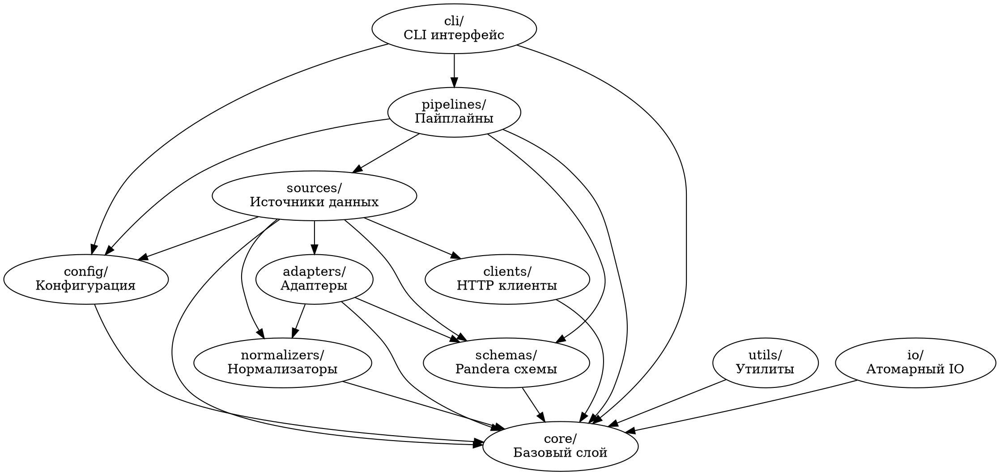

# Матрица зависимостей слоев BioETL

## Граф зависимостей (DOT)



## Матрица разрешенных зависимостей

| От | К | Разрешенно | Примечание |
|---|---|------------|------------|
| cli | pipelines | ✅ Да | CLI использует пайплайны |
| cli | config | ✅ Да | CLI использует конфигурацию |
| cli | core | ✅ Да | CLI использует core компоненты |
| pipelines | sources | ✅ Да | Пайплайны используют источники |
| pipelines | schemas | ✅ Да | Пайплайны валидируют через схемы |
| pipelines | config | ✅ Да | Пайплайны используют конфигурацию |
| pipelines | core | ✅ Да | Пайплайны используют core |
| sources | clients | ✅ Да | Источники используют HTTP клиенты |
| sources | adapters | ✅ Да | Источники используют адаптеры |
| sources | normalizers | ✅ Да | Источники используют нормализаторы |
| sources | schemas | ✅ Да | Источники используют схемы |
| sources | config | ✅ Да | Источники используют конфигурацию |
| sources | core | ✅ Да | Источники используют core |
| adapters | normalizers | ✅ Да | Адаптеры используют нормализаторы |
| adapters | schemas | ✅ Да | Адаптеры используют схемы |
| adapters | core | ✅ Да | Адаптеры используют core |
| clients | core | ✅ Да | Клиенты используют core |
| schemas | core | ✅ Да | Схемы регистрируются в core |
| config | core | ✅ Да | Конфигурация использует core.logger |
| utils | core | ✅ Да | Утилиты используют core |
| io | core | ✅ Да | IO использует core |
| normalizers | core | ✅ Да | Нормализаторы используют core |
| core | * | ❌ Нет | Core - базовый слой, не зависит ни от чего |
| cli | sources | ❌ Нет | CLI не должен импортировать sources напрямую |
| cli | adapters | ❌ Нет | CLI не должен импортировать adapters напрямую |
| pipelines | clients | ❌ Нет | Пайплайны используют sources, а не clients напрямую |
| pipelines | adapters | ❌ Нет | Пайплайны используют sources, а не adapters напрямую |
| sources | pipelines | ❌ Нет | Обратная зависимость запрещена |

## Запрещенные зависимости

### Обратные зависимости
- `core` → любой другой слой `bioetl`
- Любой слой → `cli` (кроме самого `cli`)
- Любой слой → `pipelines` (кроме `cli`)

### Циклические зависимости между слоями одного уровня
- `sources` ↔ `adapters` - запрещено
- `utils` ↔ `io` - запрещено
- `schemas` ↔ `config` - запрещено

### Прямые импорты через слои
- `pipelines` → `clients` (должно быть через `sources`)
- `pipelines` → `adapters` (должно быть через `sources`)
- `cli` → `sources` (должно быть через `pipelines`)

## Выявленные циклические зависимости

### 1. config/configs цикл
**Проблема**:
- `src/bioetl/configs/__init__.py` импортирует `bioetl.config.loader`
- `src/bioetl/configs/models.py` импортирует `bioetl.config.models`
- `src/bioetl/config/loader.py` импортирует `bioetl.config.models`

**Решение**:
- Объединить `config/` и `configs/` в единый `config/`
- Переместить YAML файлы в `/configs/`
- Создать реэкспорт `bioetl.configs` → `bioetl.config` с deprecation

### 2. schemas/registry и core/unified_schema дублирование
**Проблема**:
- `src/bioetl/schemas/registry.py` реализует `SchemaRegistry`
- `src/bioetl/core/unified_schema.py` импортирует из `schemas/registry`
- `core/unified_schema.py` создает фасад поверх `schemas/registry`

**Решение**:
- Объединить логику в `core/unified_schema.py`
- `schemas/registry.py` оставить как реэкспорт с deprecation

### 3. transform/adapters и adapters/ дублирование
**Проблема**:
- `src/bioetl/transform/adapters/` содержит ChEMBL адаптеры
- `src/bioetl/adapters/` содержит внешние адаптеры
- Оба используются в пайплайнах

**Решение**:
- Переместить `transform/adapters/chembl_*.py` → `adapters/chembl_*.py`
- Реэкспортировать из `transform/adapters/` для обратной совместимости
- Удалить `transform/` после миграции

## План разрыва циклических зависимостей

### Этап 1: Консолидация config
1. Объединить `configs/models.py` → `config/models.py` (слияние классов)
2. Переместить YAML из `src/bioetl/configs/` → `/configs/`
3. Обновить импорты в `configs/__init__.py` на реэкспорт из `config/`
4. Добавить deprecation warning в `configs/__init__.py`

### Этап 2: Консолидация схем
1. Переместить логику `schemas/registry.py` → `core/unified_schema.py`
2. Обновить `core/unified_schema.py` для включения всех функций из `schemas/registry.py`
3. Создать реэкспорт в `schemas/registry.py` с deprecation warning
4. Обновить все импорты на `core.unified_schema`

### Этап 3: Консолидация adapters
1. Переместить `transform/adapters/chembl_*.py` → `adapters/chembl_*.py`
2. Обновить импорты в пайплайнах
3. Создать реэкспорты в `transform/adapters/` с deprecation warning
4. Удалить `transform/` после миграционного периода

## Проверка матрицы зависимостей

Команды для проверки соблюдения матрицы:

```bash
# Проверка обратных зависимостей core → другие слои
rg -n "from bioetl\.(cli|pipelines|sources|adapters|clients|schemas|config|utils|io|normalizers)" src/bioetl/core/

# Проверка прямых импортов pipelines → clients/adapters (должно быть через sources)
rg -n "from bioetl\.(clients|adapters)" src/bioetl/pipelines/ | rg -v "imports via sources"

# Проверка прямых импортов cli → sources (должно быть через pipelines)
rg -n "from bioetl\.sources\." src/bioetl/cli/

# Проверка циклических зависимостей между слоями одного уровня
rg -n "from bioetl\.(utils|io)" src/bioetl/io/
rg -n "from bioetl\.(io|utils)" src/bioetl/utils/
```

## Текущие нарушения (до миграции)

1. ✅ `configs/__init__.py` → `config/loader.py` - будет устранено при объединении
2. ✅ `core/unified_schema.py` → `schemas/registry.py` - будет устранено при объединении
3. ✅ `pipelines/chembl_*.py` → `transform/adapters/` - будет устранено при консолидации
4. ✅ `sources/chembl/*/normalizer/` → `transform/adapters/` - будет устранено при консолидации

## После миграции

Все циклические зависимости должны быть устранены, матрица зависимостей соблюдена. Единственные разрешенные зависимости:
- Вертикальные (сверху вниз): cli → pipelines → sources → adapters/clients → core
- Горизонтальные внутри одного слоя разрешены
- Обратные и циклические запрещены
