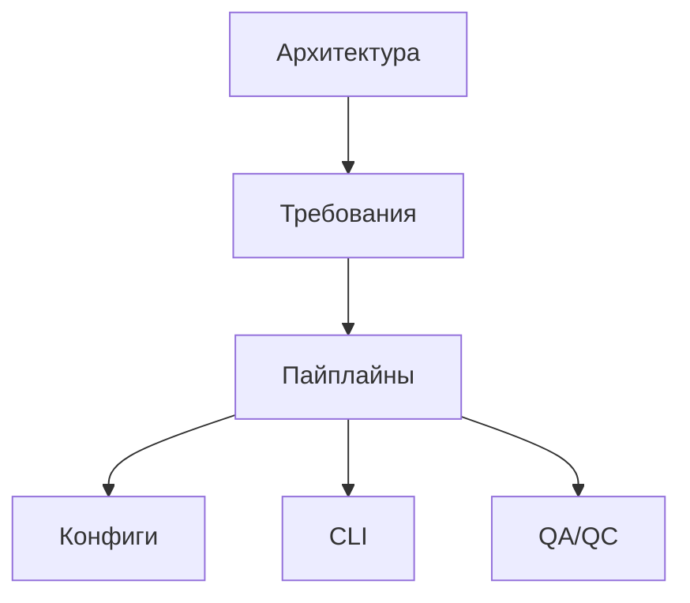

# documentation-index

## навигация

### Основные разделы

- [Архитектура и требования](requirements/00-architecture-overview.md) — архитектура уровней, поток данных, компоненты и глоссарий
- [Источники данных и схемы](requirements/03-data-sources-and-spec.md) — референтный документ по источникам, сущностям и бизнес-ключам
- [Контракты пайплайнов](pipelines/PIPELINES.md) — интерфейсы пайплайнов, примеры конфигов
- [Конфигурации](configs/CONFIGS.md) — структура конфигов, профили, наследование
- [CLI](cli/CLI.md) — команды, флаги, примеры использования
- [Валидация и QC](qc/QA_QC.md) — тесты, golden-сеты, QC-метрики
- [Determinism Policy](determinism/01-determinism-policy.md) — The policy for ensuring byte-for-byte reproducible outputs.

### Дополнительные материалы

- [Архитектурные документы](architecture/00-architecture-overview.md) — детальные архитектурные документы (дублируют [`requirements/`][ref: repo:docs/requirements/@test_refactoring_32])
- [Устаревшие материалы](architecture/refactoring/README.md) — указатели на актуальную документацию в [`requirements/`][ref: repo:docs/requirements/@test_refactoring_32]

## карта-документации

## как-поддерживать-согласованность

1. При изменении кода обновляйте соответствующие разделы и ссылку на файл.
2. Перед коммитом запускайте `python -m tools.qa.check_required_docs` и

   `npx markdownlint-cli2 "**/*.md"`.

3. Если добавляете новый источник, расширьте таблицы в [`requirements/03-data-sources-and-spec.md`][ref: repo:docs/requirements/03-data-sources-and-spec.md@test_refactoring_32] и [`pipelines/PIPELINES.md`][ref: repo:docs/pipelines/PIPELINES.md@test_refactoring_32].

4. Refactoring-документы теперь служат указателями и дублировать данные в них

   нельзя.
