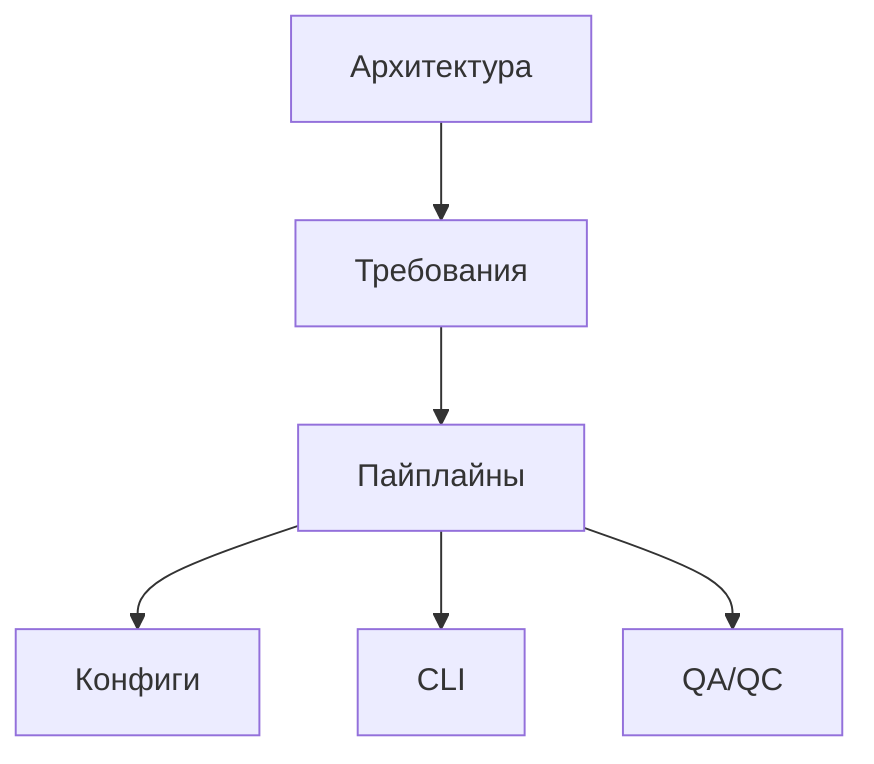

# Documentation Index

## Navigation

### Main Sections

- [Architecture and Requirements](requirements/00-architecture-overview.md) — System architecture, data flow, components, and glossary.
- [Data Sources and Schemas](requirements/03-data-sources-and-spec.md) — Reference for data sources, entities, and business keys.
- [Pipeline Contracts](pipelines/PIPELINES.md) — Pipeline interfaces and configuration examples.
  - [ChEMBL Pipelines Catalog](pipelines/10-chembl-pipelines-catalog.md) — A detailed catalog of all ChEMBL extraction pipelines.
- [Source Architecture](sources/00-sources-architecture.md) — The component stack for data sources (Client, Parser, Normalizer).
- [Configurations](configs/CONFIGS.md) — Configuration structure, profiles, and inheritance.
- [CLI Overview](cli/00-cli-overview.md) — Architecture, configuration, and exit codes.
  - [Command Reference](cli/01-cli-commands.md) — Detailed reference for all commands and flags.
- [Validation and QC](qc/QA_QC.md) — Testing, golden sets, and QC metrics.
- [Determinism Policy](determinism/01-determinism-policy.md) — The policy for ensuring byte-for-byte reproducible outputs.
- [HTTP Clients](http/00-http-clients-and-retries.md) — Specification for HTTP clients, retries, and backoff.

### Additional Materials

- [Architectural Documents (Legacy)](architecture/00-architecture-overview.md) — Detailed architectural documents (duplicates [`requirements/`][ref: repo:docs/requirements/@test_refactoring_32])
- [Outdated Materials](architecture/refactoring/README.md) — Pointers to the current documentation in [`requirements/`][ref: repo:docs/requirements/@test_refactoring_32]

## карта-документации

## как-поддерживать-согласованность

1. При изменении кода обновляйте соответствующие разделы и ссылку на файл.
2. Перед коммитом запускайте `python -m tools.qa.check_required_docs` и

   `npx markdownlint-cli2 "**/*.md"`.

3. Если добавляете новый источник, расширьте таблицы в [`requirements/03-data-sources-and-spec.md`][ref: repo:docs/requirements/03-data-sources-and-spec.md@test_refactoring_32] и [`pipelines/PIPELINES.md`][ref: repo:docs/pipelines/PIPELINES.md@test_refactoring_32].

4. Refactoring-документы теперь служат указателями и дублировать данные в них

   нельзя.
