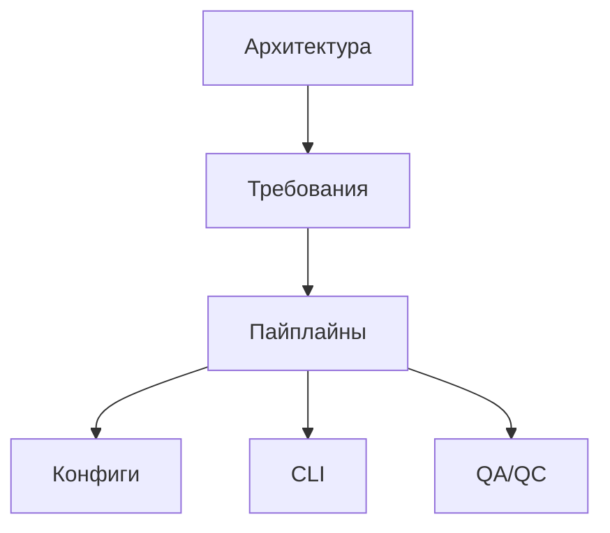

# documentation-index

## навигация

- [Архитектура](requirements/00-architecture-overview.md)
- [Требования к источникам и схемам](requirements/03-data-sources-and-spec.md)
- [Контракты пайплайнов](pipelines/PIPELINES.md)
- [Конфигурации](configs/CONFIGS.md)
- [CLI](cli/CLI.md)
- [Валидация и QC](qc/QA_QC.md)

## карта-документации

## как-поддерживать-согласованность

1. При изменении кода обновляйте соответствующие разделы и ссылку на файл.
2. Перед коммитом запускайте `python -m scripts.qa.check_required_docs` и

   `npx markdownlint-cli2 "**/*.md"`.

3. Если добавляете новый источник, расширьте таблицы в

   `requirements/03-data-sources-and-spec.md` и `pipelines/PIPELINES.md`.

4. Refactoring-документы теперь служат указателями и дублировать данные в них

   нельзя.
