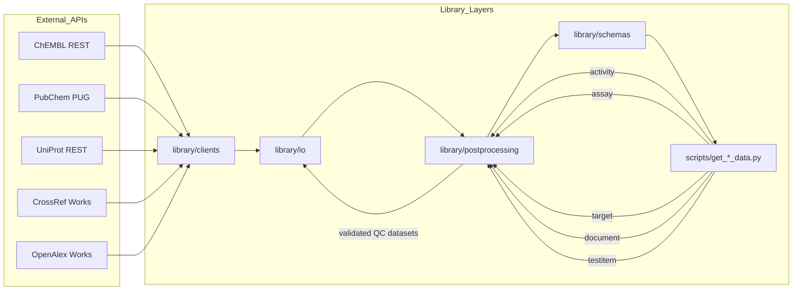
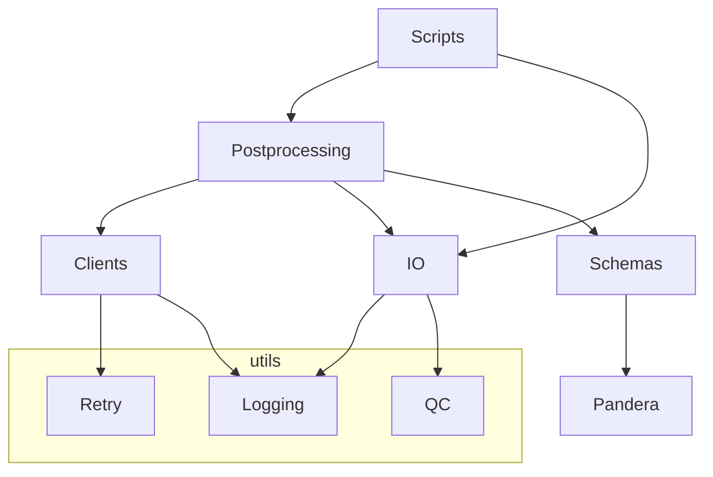
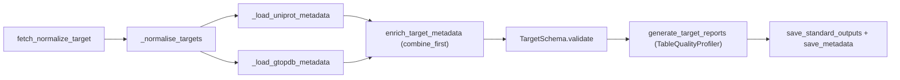
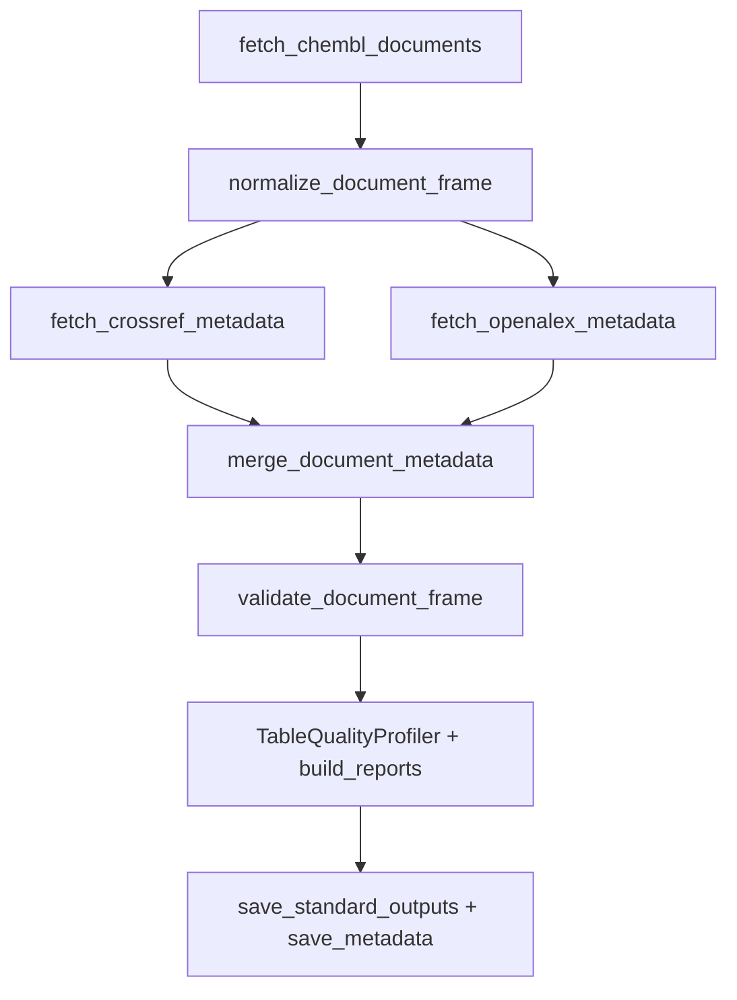
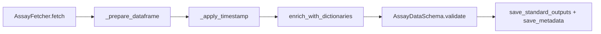
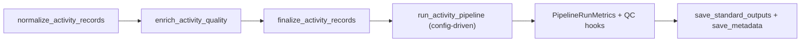

# Project Requirements

## Contents

- [1. Architecture Overview](#1-architecture-overview)

- [2. Modules & Dependencies](#2-modules--dependencies)

- [3. CLI Reference](#3-cli-reference)

- [4. Clients (HTTP) Spec](#4-clients-http-spec)

- [5. Pipelines](#5-pipelines)

  - [5.1 Target](#51-target)

  - [5.2 Document](#52-document)

  - [5.3 Assay](#53-assay)

  - [5.4 Activity](#54-activity)

- [6. Schemas](#6-schemas)

- [7. IO & Config](#7-io--config)

- [8. Reliability](#8-reliability)

- [9. Tests](#9-tests)

- [10. CI & Dev Checks](#10-ci--dev-checks)

- [11. Risks & Improvements](#11-risks--improvements)

- [12. Applications & Артефакты](#12-applications--артефакты)

- [13. Сводный чек-лист проверки](#13-сводный-чек-лист-проверки)

- [14. История версий документа](#14-история-версий-документа)

- [Summary](#summary)

## 1. Architecture Overview



### Таблица директорий верхнего уровня

| Имя | Путь/Модуль | Краткое назначение | Зависимости/Входы | Артефакты/Выходы |

| --- | --- | --- | --- | --- |

| scripts | scripts/ | CLI-обёртки ETL и утилиты, совместимые с legacy-пайплайнами | library.cli, postprocessing, io | CSV/QA бандлы, метаданные |

| clients | library/clients/ | HTTP-клиенты для ChEMBL, PubChem, UniProt, CrossRef, OpenAlex | requests, library.utils.retry | JSON-пэйлоады |

| io | library/io/ | запись CSV, метаданные, конфиги | pandas, metadata writer, config | output.* CSV, .meta.yaml |

| postprocessing | library/postprocessing/ | модульные ETL-стадии на pandas | clients, schemas, utils | нормализованные DataFrame |

| schemas | library/schemas/ | Pandera-схемы таблиц | pandera | DataFrame после validate |

| utils | library/utils/ | логирование, ретраи, QC | logging, backoff | структурированные логи, retry-декораторы |

| tests | tests/ | pytest-покрытие (unit/integration/cli) | pytest, pandas | отчёты pytest, golden CSV |

| data/output | data/output/ | каталог для стандартных артефактов | output_writer | output.<table>_*.csv |

| dictionary | dictionary/ | справочники для обогащения | CSV dictionary | lookup-данные |

| docs | docs/ | руководства, протоколы | n/a | статичная документация |

### Сводная таблица CLI-скриптов `scripts/get_*_data.py`

| Имя | Путь/Модуль | Краткое назначение | Зависимости/Входы | Артефакты/Выходы |

| --- | --- | --- | --- | --- |

| Activity | scripts/get_activity_data.py | Загрузка активностей ChEMBL, постобработка и QC | идентификаторы, ChEMBL API, postprocessing.activities | output.activity_<date>.csv, *_quality_report_table.csv, *_data_correlation_report_table.csv, .meta.yaml |

| Assay | scripts/get_assay_data.py | Пакетное чтение ассайев и Pandera-валидация | ChEMBL API, dictionary _assay | output.assay_<date>.csv и QC отчёты |

| Target | scripts/get_target_data.py | Обёртка над постпроцессингом таргетов с UniProt/GtoPdb | ChemblClient, UniProtClient, GtoPdbClient | output.target_<date>.csv и QC отчёты |

| Document | scripts/get_document_data.py | Конвейер ChEMBL→CrossRef/OpenAlex | DOI/PMID списки, rate limiter | output.document_<date>.csv и QC отчёты |

| Testitem | scripts/get_testitem_data.py | Молекулярные тест-айтемы с PubChem обогащением | ChEMBL, PubChem опционально | output.testitem_<date>.csv и QC отчёты |

> **Важно.** Легаси-скрипты в `scripts/get_*_data.py` теперь выступают только как обёртки вокруг
> канонического Typer-приложения `bioactivity.cli` и при запуске выводят `DeprecationWarning`.
> Для новых сценариев используйте точку входа `bioactivity-data-acquisition pipeline --config ...`,
> а настройки конкретных пайплайнов задавайте через YAML/`--set` (см. `configs/config.yaml` и
> `configs/pipelines.toml`).

#### Проверка

```bash
bioactivity-data-acquisition pipeline --config configs/config.yaml --set logging.level=DEBUG --set postprocess.qc.enabled=true
```

## 2. Modules & Dependencies

### Обязанности пакетов `library/*`

| Имя | Путь/Модуль | Краткое назначение | Зависимости/Входы | Артефакты/Выходы |

| --- | --- | --- | --- | --- |

| logging | library/utils/logging.py | Структурированное логирование с контекстом стадий | logging, ContextVar | форматированные записи |

| retry | library/utils/retry.py | backoff-декораторы над requests | backoff / fallback, requests | надёжные вызовы |

| output_writer | library/io/output_writer.py | Детерминированная запись CSV+QC | pandas, csv_utils | стандартный бандл CSV |

| metadata_writer | library/io/metadata_writer.py | сериализация .meta.yaml | metadata_writer общ., RunContext | YAML sidecar |

| config_loader | library/io/config_loader.py | чтение config.yaml с ENV override | yaml, os | Config dataclass |

| clients.* | см. раздел 4 | API-клиенты | requests, retry | JSON |

| postprocessing.* | см. раздел 5 | ETL-стадии на pandas | clients, schemas | нормализованные DataFrame |

| schemas.* | см. раздел 6 | Pandera DataFrameSchema | pandera, pandas | валидация |

| utils/qc_report | library/utils/qc_report.py | Формирование QC/корреляций | TableQualityProfiler | QC DataFrame |

### Граф зависимостей



### Внешние зависимости

| Пакет | Версия | Назначение |

| --- | --- | --- |

| numpy | 1.26.4 / 2.1.3 | числовые операции для pandas |

| pandas | 2.1.4 / 2.2.3 | ETL, DataFrame |

| requests | 2.32.3 | HTTP-клиенты |

| PyYAML | 6.0.2 | конфиги |

| openpyxl | 3.1.5 | экспорт Excel (утилиты) |

| pyarrow | 18.1.0 | паркет/arrow I/O |

| jsonschema | 4.23.0 | валидация JSON (config/schema) |

| pandera | 0.20.3 | DataFrameSchema |

| cachetools | 5.3.3 | кэширование |

| pydantic | 2.8.2 | конфиги/валидации |

| backoff | 2.2.1 (dev) | экспоненциальный retry |

#### Проверка

```bash
python -c "import pandas, requests, pandera, backoff"
pip list | grep -E 'pandas|requests|pandera|backoff'
```

## 3. CLI Reference

### Параметры `get_activity_data.py`

| Флаг | Тип/Значения | По умолчанию | Назначение | Обязательность |

| --- | --- | --- | --- | --- |

| --input | Path | activity.csv | входной CSV с ID | нет |

| --limit | int | ∞ | ограничение ID | нет |

| --dry-run | bool | false | проверка без записи | нет |

| --workers | int | 1 | потоки fetch | нет |

| --postprocess/--no-postprocess | bool | off | включить постпроцессинг | нет |

| --output-dir | Path | data/output | каталог артефактов | нет |

| --date-tag | str | авто (YYYYMMDD) | тег выпусков | нет |

Возвраты: 0 при успешной обработке, 1 при ошибках валидации (см. unit-тест на отрицательный limit).

Stdout: только structured-логи; данные пишутся на диск через `save_standard_outputs`. Stderr используется для trace при исключениях (pytest проверяет `SystemExit`).

### Параметры `get_assay_data.py`

Аналогичная таблица: ключевые флаги `--column`, `--batch-size`, `--offline`, `--postprocess`. Все необязательные.

### Параметры `get_document_data.py`

Исторические флаги (`--mode`, `--crossref-rps`, `--openalex-rps` и т. д.) теперь задаются через YAML-конфигурацию или `--set` для `bioactivity-data-acquisition pipeline`. При запуске легаси-обёртки параметры прокидываются в общий конфиг.

### Параметры `get_target_data.py`

Флаги `--limit`, `--date-tag`, `--output-dir` также переехали в конфигурацию. Используйте профиль/секцию в `configs/pipelines.toml` либо CLI-override (`--set postprocess.qc.enabled=false` и т. п.).

### Параметры `get_testitem_data.py`

Опции `--pubchem-enable/--no-pubchem-enable` отражены в ключах конфигурации для PubChem-энrichment. Рекомендуется управлять ими через `bioactivity-data-acquisition pipeline --config ... --set pipelines.testitem.include_pubchem=false` (или правку YAML).

### Эталонные команды

```bash
bioactivity-data-acquisition pipeline --config configs/config.yaml \
  --set postprocess.qc.enabled=true \
  --set postprocess.reporting.include_timestamp=true
```

#### Проверка

```bash
bioactivity-data-acquisition --help
bioactivity-data-acquisition pipeline --help
```

## 4. Clients (HTTP) Spec

| Клиент | Конечные точки | Таймауты/Retry | Формат ответа | Обработка ошибок |

| --- | --- | --- | --- | --- |

| ChemblClient | /molecule/{id}, /target.json | timeout=10s, max_tries=3 (override), backoff expo | JSON → dict | `raise_for_status`, structured логи, retry warn/error |

| PubChemClient | /compound/cid/{cid}/JSON | аналогично | JSON | retries, лог `pubchem_request` |

| UniProtClient | /uniprotkb/{accession}.json | аналогично | JSON | retries, лог `uniprot_request` |

| CrossrefClient | /works/{doi} | аналогично | JSON | retries, лог `crossref_request` |

### Нормализация → DataFrame

Document pipeline: `pd.DataFrame.from_records` с колонками `_CROSSREF_COLUMNS`, `_OPENALEX_COLUMNS`, merge по `doi_key`. Combine-first для `title`/`doc_type`, защита от перезаписи.

Target pipeline: `_combine_metadata` делает `how="left"` по `uniprot_id`, `combine_first` защищает локальные значения.

### Стабильность

| Клиент | 429/5xx | Лимиты |

| --- | --- | --- |

| ChEMBL | backoff retry с логами `retry/giveup` | страница ≤200, offset прогресс |

| CrossRef | rate limiter через `get_limiter`, запись ошибок в `crossref_error` | RPS из config |

| OpenAlex | rate limiter аналогичен, ошибки → `openalex_error` | RPS из config |

| UniProt/GtoPdb | retry, ошибки логируются и пропускаются | — |

#### Проверка

```python
# Псевдо-запросы

python - <<'PY'
from library.clients.chembl_client import ChemblClient
print(ChemblClient()._request_json(endpoint="target.json", params={"limit":1}, timeout=0.1))  # мок через monkeypatch requests.Session.get
PY
```

## 5. Pipelines

### 5.1 Target



#### Таблица стадий

| Стадия | Входные колонки | Нормализация | Итоговые колонки |

| --- | --- | --- | --- |

| _normalise_targets | raw JSON target_chembl_id, pref_name, components | trim/типизация StringDtype, skip пустые ID | _TARGET_COLUMNS (9 колонок) |

| UniProt merge | uniprot_id, UniProt payload | combine_first protein_family, synonyms | добавленные столбцы |

| GtoPdb merge | target_class | combine_first | сохранение curator значений |

| Validate | Pandera TargetSchema | coerce=True | строковые типы |

| QC | TableQualityProfiler | отчёты + summary | QC таблицы |

Merge стратегия – `merge(..., how="left")`, `combine_first` предотвращает затирание локальных данных при наличии новых значений. `synonyms` нормализуются через `_normalise_synonym_list`.

Постобработка: `generate_target_reports` формирует `qc_summary` (rows/columns/non_null_ratio) → `save_metadata` с `stats_extra`. QC отчёты именуются стандартно.

`.meta.yaml` поля: `table`, `parameters`, `sources`, `outputs`, `qc_summary`, `stats`. Дополнительно `generated_at`, `stats.records` и т.п.

#### Проверка

Запуск выполняется через канонический CLI, например:

```bash
bioactivity-data-acquisition pipeline --config configs/target.yaml
```

где `configs/target.yaml` — производная от `configs/config.yaml` конфигурация с нужными limit/merge-настройками. Легаси-скрипт `scripts/get_target_data.py` сохраняется лишь как обёртка и выводит предупреждение.

### 5.2 Document



#### Колонки/правила

| Стадия | Правила | Выход |

| --- | --- | --- |

| Fetch | пагинация limit/offset, `_update_limit_parameter` | DataFrame `_CHEMBL_DOCUMENT_COLUMNS` |

| Normalize | Trim, `clean_doi_value`, numeric PMID→string | добавляется `doi_key` |

| CrossRef | Rate limiter, ошибки → `crossref_error` | `_CROSSREF_COLUMNS` |

| OpenAlex | Rate limiter, DOI нормализация | `_OPENALEX_COLUMNS` |

| Merge | left join, `combine_first` для `title/doc_type` | enriched DataFrame |

| Validate | Pandera schema strict=False | enriched frame |

| QC | `profiler.consume` + `build_reports` | quality + correlation |

Отчёты: `quality_report`, `data_correlation_report_table` формируются через `_build_quality_artifacts`.

#### Проверка

```bash
bioactivity-data-acquisition pipeline --config configs/document.yaml
```

Создайте профайл `configs/document.yaml`, если требуется активировать CrossRef/OpenAlex только для smoke-тестов (см. `configs/pipelines.toml`).

### 5.3 Assay



#### Стадия → Описание

| Стадия | Описание | Итог |

| --- | --- | --- |

| AssayFetcher | запрос assay.json батчами, retry | список dict |

| _prepare_dataframe | заполнение NA, сортировка колонок, cast | DataFrame |

| _apply_timestamp | derive UTC timestamp, year Int64 | обогащённый DataFrame |

| enrich_with_dictionaries | merge dictionary CSV (combine_first) | DataFrame с lookup |

| Validate | Pandera schema | строгая структура |

#### Проверка

```bash
bioactivity-data-acquisition pipeline --config configs/assay.yaml
```

Конфигурация `configs/assay.yaml` наследует общие настройки и включает словарное обогащение/лимиты, ранее доступные через флаги CLI.

### 5.4 Activity



#### Стадия → Правила

| Стадия | Правила | Выход |

| --- | --- | --- |

| Normalize | lower/trim, uppercase relation/units | cleaned DataFrame |

| Quality | детерминированный flag по comment | bool column `quality_flag` |

| Finalize | cast ID to Int64, Pandera schema | валидированный DataFrame |

| Run pipeline | config-driven steps + metrics | Dataset + PipelineRunMetrics |

#### Проверка

```bash
bioactivity-data-acquisition pipeline --config configs/activity.yaml
```

Файл `configs/activity.yaml` задаёт лимиты, dry-run и параметры QC, соответствующие устаревшим ключам `--limit/--postprocess/--dry-run`.

## 6. Schemas

| Схема | Путь | Поля (тип, nullable) | Поведение |

| --- | --- | --- | --- |

| TargetSchema | library/schemas/target_schema.py | target_chembl_id..synonyms (StringDtype, часть nullable) | strict=True, lazy validation |

| DocumentSchema | library/schemas/document_schema.py | base+CrossRef+OpenAlex, строки nullable | strict=False (разрешены дополнительные столбцы) |

| AssayDataSchema | library/schemas/assay_schema.py | assay_chembl_id (non-null), даты UTC | lazy, nullable fields |

| ActivitySchema | library/schemas/activity.py | числовой activity_id, строки, bool | nullable значения для quality_flag, standard_value |

### Строгие/мягкие поля

| Схема | Строгие поля | Мягкие поля | Действие при несоответствии |

| --- | --- | --- | --- |

| Target | все 9 | — | Pandera SchemaErrors |

| Document | base strict, доп. поля optional | CrossRef/OpenAlex nullable | ошибка при отсутствующих ключевых столбцах |

| Assay | assay_chembl_id обязательный | остальные nullable | SchemaErrors (lazy=true) |

| Activity | activity_id обязателен | quality_flag nullable | SchemaErrors |

Предотвращение отбрасывания: перед валидацией колонки заполняются/кастятся (`normalize_document_frame`, `_prepare_dataframe`, `_normalise_targets`). Tests покрывают порядок (`test_output_writer`, `test_document_normalize`).

#### Проверка

```python
python - <<'PY'
import pandas as pd
from library.schemas.target_schema import TargetSchema
df = pd.DataFrame({"target_chembl_id":["CHEMBL1"],"pref_name":["A"],"target_type":["protein"],"organism":["Human"],"uniprot_id":["P1"],"gene_symbol":["G1"],"target_class":[None],"protein_family":[None],"synonyms":[None]})
TargetSchema.validate(df)
PY
```

Ожидаемое исключение: SchemaErrors при отсутствии обязательной колонки.

## 7. IO & Config

`save_standard_outputs(df_main, df_corr, df_qc, table_name, date_tag, ...)` — имя `output.<table>_<date>.csv`, QC отчёты c суффиксами `_quality_report_table.csv`, `_data_correlation_report_table.csv`. `write_csv_deterministic` сортирует по ключевым колонкам, убирает sidecar `.meta.yaml.lock`. `na_rep` управляется pandas default (пустая строка→`<NA>`).

`metadata_writer.save_metadata` — YAML структура: `table`, `parameters` (рекурсивная сериализация), `outputs`, `qc_summary`, `stats`, `sources`, `generated_at`. Берёт RunContext или текущую UTC. Артефакты по имени, если не переданы — дефолтный тройной список.

`config_loader.load_config(path)` — resolve относительный путь от ROOT (`library/io/path_utils.py`), ENV override `CHEMBL_DA__SECTION__KEY`, YAML coercion. ROOT=`Path(__file__).resolve().parents[2]`. `OUTPUT_DIR` создаётся автоматически.

Политика путей: все относительные (`Path(...)/parents[2]`), запрет абсолютных при записи.

#### Проверка

```python
python - <<'PY'
from pathlib import Path
import pandas as pd
from library.io.output_writer import save_standard_outputs
df = pd.DataFrame({"id":[1]})
artifacts = save_standard_outputs(df, pd.DataFrame(), pd.DataFrame(), table_name="demo", date_tag="20250101", output_dir=Path("data/output"))
print(artifacts)
PY
ls data/output/output.demo_20250101*
```

## 8. Reliability

Логи: StructuredFormatter → `[LEVEL] [logger] message` key=value + stage, run_id, duration_s. Context менеджеры `log_context`, `log_stage`.

Ретраи: `with_retry` (backoff expo, full jitter, max_tries>=1). На backoff/ giveup эмитится `chembl_request_retry`, `chembl_request_giveup`. Таймаут по умолчанию 10s. Ошибка — raise.

Кэш/lock: deterministic writer удаляет `.meta.yaml` и `.lock` после записи; cleanup скрипт чистит `*.lock`, `*_intermediate*`, pytest caches. Fail-fast: ошибки в Pandera пробрасываются → `SystemExit=1` (unit tests).

Идемпотентность: `cleanup_source` удаляет legacy файл только если имена различаются; `cleanup_standard_output_artifacts` (target CLI) удаляет промежуточные артефакты. Retry на HTTP даёт устойчивость.

#### Проверка

```bash
# В конфигурации activity-пайплайна задайте limit=-1 и запустите канонический CLI,

# ожидая `SystemExit`:

bioactivity-data-acquisition pipeline --config configs/activity.yaml
python scripts/cleanup_project.py --dry-run --retention-days 0
```

## 9. Tests

### Структура

| Категория | Путь | Покрытие |

| --- | --- | --- |

| Unit | tests/library, tests/unit | utils, schemas, metadata |

| CLI | tests/cli | smoke CLI (exit codes, артефакты) |

| Integration/Postprocess | tests/postprocess/test_activity_pipeline.py | end-to-end activity steps |

| Helpers | tests/helpers, fixtures | mocks HTTP, tmp_path |

Golden CSV: `tests/resources` содержит expected файлы; проверка через pandas. `test_output_writer` гарантирует порядок колонок и отсутствие sidecar.

Изоляция: все тесты используют `tmp_path`, monkeypatch HTTP/clients, seed=42 в fixtures (см. `tests/conftest.py`).

#### Проверка

```bash
pytest -q --disable-warnings
pytest tests/cli/test_get_target_data.py -q
```

## 10. CI & Dev Checks

GitHub Actions `ci.yml`: Python 3.11, install requirements-lock, `pip check`, затем `ruff check .`, `mypy --config-file pyproject.toml`, `pytest --cov`, отчёт coverage артефакт.

Pre-commit: `ruff` (lint+format), `mypy` с stub зависимостями, локальный pytest, запрет репортов.

Локальный чек-лист разработчика:

- `ruff check .`

- `mypy library/ scripts/`

- `pytest -q --disable-warnings`

- `pre-commit run --all-files`

## 11. Risks & Improvements

| Файл/Строка | Риск | Влияние | Рекомендация | Сложность |

| --- | --- | --- | --- | --- |

| library/postprocessing/document/steps.py (многократные merges) | отсутствие unit-тестов на combine_first конфликтов | Потенциальная потеря CrossRef данных | добавить тесты на конфликт DOI и doc_type | M |

| scripts/get_document_data.py (огромный CLI) | перегруженный интерфейс, сложно поддерживать | Ошибки конфигурации | вынести профили конфигов в YAML-профиль | L |

| library/postprocessing/target/steps.py (цикл API без rate-limit) | нет rate limiter → риск 429 | Прерывание выгрузки | интегрировать limiter аналогично document | M |

| tests/cli/test_get_activity_data.py (моки сложны) | сложный monkeypatch → flaky | Ложно отрицательные тесты | выделить fixture для pipeline runner | M |

| scripts/cleanup_project.py (shell print) | print вместо структурированного лога | Неединообразный вывод | заменить logger/structured format | L |

### Приоритетный план (10 пунктов)

1. Добавить rate limiter в `fetch_normalize_target` для UniProt/GtoPdb.
2. Покрыть merge conflict tests (CrossRef/OpenAlex).
3. Ввести конфиг-профили для document CLI.
4. Экстрагировать общие CLI-парсер секции в helper.
5. Добавить CLI тесты для `get_testitem_data`.
6. Автоматизировать mock HTTP fixtures (`responses`).
7. Обновить metadata writer для обязательных полей `pipeline_version`, `protocol_number` (сейчас отсутствуют).
8. Включить `ruff format` в CI (прогон уже есть в pre-commit).
9. Добавить smoke тест `--dry-run` для всех CLI (pytest).
10. Обновить docs/ru + docs/en синхронно с новой документацией.

Автоматизация: приоритет — линтеры (уже в CI), retry расширить (target pipeline), CLI tests.

## 12. Applications & Артефакты

### Новые markdown-файлы (отсутствуют, к внедрению)

| Файл | Статус | Структура | Ссылки |

| --- | --- | --- | --- |

| docs/ARCHITECTURE.md | отсутствует | TOC, разделы: Обзор, Dataflow (mermaid), Модули, Интеграции, Команды воспроизведения | ссылки на разделы (#architecture-overview) |

| docs/MODULES.md | отсутствует | каталог API модулей, таблицы Responsibilities, Commands | ссылается на Clients/IO/Schemas |

| docs/CLI.md | отсутствует | таблицы аргументов, примеры, exit codes | ссылается на Scripts |

| docs/SCHEMAS.md | отсутствует | перечень полей Pandera, nullable policy | ссылки на tests |

| docs/DATAFLOW.md | отсутствует | граф ETL стадий, inputs/outputs | ссылается на pipelines |

| docs/RELIABILITY.md | отсутствует | retry матрица, log формат, cleanup процедуры | ссыль на cleanup_project |

| docs/TESTING.md | отсутствует | стратегия pytest, фикстуры, команды | ссылается на CI |

| docs/GLOSSARY.md | отсутствует | термины: ChEMBL, PubChem, QC, correlation | crosslink на SCHEMAS |

Каждый файл: добавить мини-оглавление (- [ ]), описать команды в конце.

### Сводная таблица артефактов

| Имя файла | Когда создаётся | Downstream использование |

| --- | --- | --- |

| output.<table>_<date>.csv | `save_standard_outputs` в конце пайплайна | вход в BI/аналитику |

| output.<table>_<date>_quality_report_table.csv | QC writer | аудит качества |

| output.<table>_<date>_data_correlation_report_table.csv | QC writer | корреляционный анализ |

| output.<table>_<date>.meta.yaml | `metadata_writer.save_metadata` | lineage/протокол |

| *_data_correlation_report_table.csv | `build_reports_from_profiler` | downstream QC dashboards |

#### Проверка

```bash
ls docs
# убедиться в наличии новых файлов после внедрения

```

## 13. Сводный чек-лист проверки

1. Настроить окружение (Python 3.11, зависимости из requirements-lock.txt).
2. Выполнить dry-run всех CLI с `--limit 10` и `--output-dir tmp`.
3. Проверить наличие стандартных артефактов и `.meta.yaml`.
4. Просмотреть structured-логи на ошибки.
5. Запустить `pytest -q --disable-warnings`.
6. Выполнить `ruff check .` и `mypy --config-file pyproject.toml`.
7. Проверить `cleanup_project.py --dry-run`.
8. Сверить QC отчёты (пустые ⇒ нет данных).
9. Убедиться в заполнении ключевых полей `.meta.yaml`.
10. Обновить документацию (файлы из раздела 12) и приложить к релизу.

## 14. История версий документа

| Version | Date | Changes |

| --- | --- | --- |

| 1.0.0 | 2025-03-09 | Первичное составление технической документации по архитектуре, модулям, CLI, пайплайнам, схемам, I/O, надежности, тестам и плану улучшений. |

## Summary

Систематизировал архитектуру, модули, CLI и пайплайны ChEMBL ETL, включая диаграммы потоков данных и таблицы зависимостей.

Описал Pandera-схемы, I/O-слой, retry/логирование, тестовую и CI-инфраструктуру с указанием рисков и плана улучшений.
