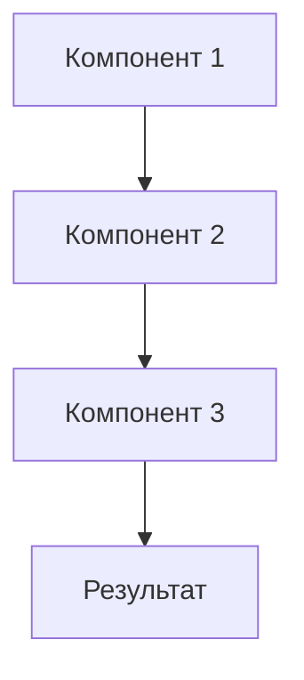

# [Название объяснения]

## Проблема

[Описание проблемы или концепции, которую нужно объяснить]

## Решение

[Описание решения или подхода]

### Как это работает

[Детальное объяснение механизма]

### Почему именно так

[Обоснование выбора решения]

**Преимущества:**

- [Преимущество 1]
- [Преимущество 2]
- [Преимущество 3]

**Недостатки:**

- [Недостаток 1]
- [Недостаток 2]

## Альтернативы

### Альтернатива 1: [Название]

[Описание альтернативы]

**Когда использовать:**

- [Условие 1]
- [Условие 2]

**Когда не использовать:**

- [Условие 1]
- [Условие 2]

### Альтернатива 2: [Название]

[Описание альтернативы]

**Когда использовать:**

- [Условие 1]
- [Условие 2]

**Когда не использовать:**

- [Условие 1]
- [Условие 2]

## Последствия

### Влияние на производительность

[Объяснение влияния на производительность]

### Влияние на безопасность

[Объяснение влияния на безопасность]

### Влияние на поддерживаемость

[Объяснение влияния на поддерживаемость]

## История изменений

- **Версия X.Y**: [Описание изменения]
- **Версия X.Z**: [Описание изменения]

## Связанные темы

- [Ссылка на related tutorial]
- [Ссылка на related how-to]
- [Ссылка на related reference]
- [Ссылка на related explanation]
