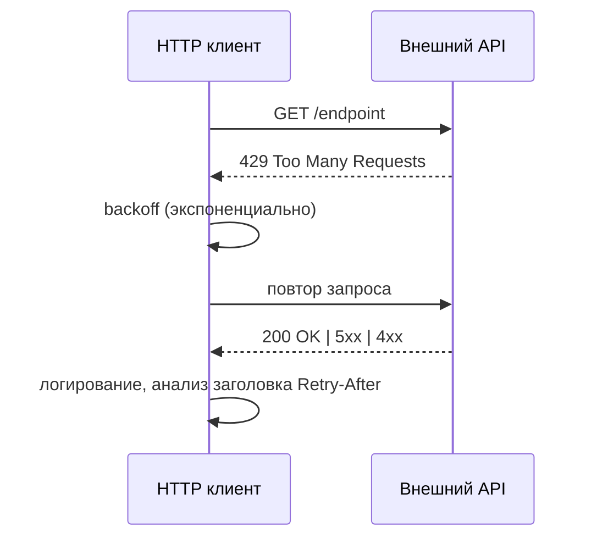

# Архитектура и поток данных

Следующая диаграмма показывает общий поток ETL и обработку ошибок/лимитов.

```mermaid
flowchart LR
  A[Источники API (ChEMBL, Crossref, PubMed...)] --> B[HTTP клиенты (requests + backoff)]
  B --> C[ETL: извлечение/нормализация]
  C --> D[Pandera валидация]
  D --> E[Экспорт CSV (детерминированный)]
  E --> F[Авто QC отчёты]
  E --> G[Авто корреляции]
  B --> H{Ошибки/лимиты}
  H -->|retry/backoff| B
  H -->|логирование| I[Логи/метрики]
```

## Потоки ошибок и ретраи



## Точки расширения

- Клиенты API: `src/library/clients/*`
- Трансформации/ETL: `src/library/etl/*`
- Схемы данных: `src/library/schemas/*`
- Запись и авто‑артефакты: `src/library/etl/load.py` (`write_deterministic_csv`, авто‑QC/корреляции)

## Потоки ошибок

- 4xx/5xx → экспоненциальный backoff, ограничение попыток
- 429 (rate limit) → пауза/джиттер, повтор; чтение `Retry-After`
- Фолы валидации Pandera → отчёты/логи, корректирующие действия
