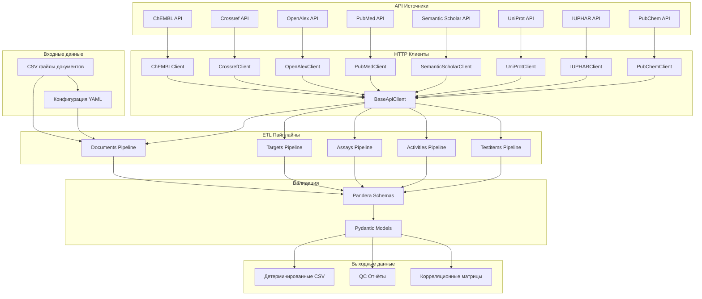
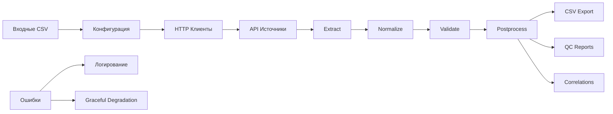

# Архитектура системы

## Обзор

Bioactivity Data Acquisition — это модульный ETL-пайплайн для извлечения, валидации, трансформации и загрузки биоактивностных данных из множественных API источников. Система построена по принципам модульности, детерминизма и воспроизводимости.

## Архитектурная диаграмма

## Звёздная схема данных

Система формирует измерения для звёздной схемы:

### Измерения (Dimensions)

1. **document_dim** — документы и публикации
   - Источники: Crossref, OpenAlex, PubMed, Semantic Scholar
   - Поля: document_chembl_id, title, doi, journal, authors, publication_date

2. **target_dim** — белковые мишени
   - Источники: ChEMBL, UniProt, IUPHAR
   - Поля: target_chembl_id, pref_name, target_type, protein_classifications

3. **assay_dim** — биохимические ассеи
   - Источники: ChEMBL
   - Поля: assay_chembl_id, assay_type, relationship_type, confidence_score

4. **testitem_dim** — молекулярные соединения
   - Источники: ChEMBL, PubChem
   - Поля: molecule_chembl_id, pref_name, max_phase, molecular_properties

### Факты (Facts)

1. **activity_fact** — биоактивностные данные
   - Источники: ChEMBL
   - Поля: activity_id, standard_value, standard_units, activity_type
   - Связи: FK к document_dim, target_dim, assay_dim, testitem_dim

## Слои архитектуры

### 1. Слой источников данных (Data Sources Layer)

**Назначение**: Абстракция над внешними API

**Компоненты**:
- `src/library/clients/` — HTTP клиенты для каждого API
- `src/library/clients/base.py` — базовый функционал (retry, rate limiting, circuit breaker)
- Специализированные клиенты: ChEMBLClient, CrossrefClient, OpenAlexClient, etc.

**Принципы**:
- Graceful degradation при недоступности API
- Rate limiting и retry logic
- Кэширование ответов
- Структурированное логирование

### 2. Слой ETL (ETL Layer)

**Назначение**: Извлечение, трансформация и загрузка данных

**Компоненты**:
- `src/library/etl/` — общие ETL утилиты
- `src/library/{documents,targets,assays,activities,testitems}/` — специализированные пайплайны
- `src/library/schemas/` — Pandera схемы валидации

**Этапы ETL**:
1. **Extract** — извлечение данных из API
2. **Normalize** — нормализация и стандартизация
3. **Validate** — валидация с помощью Pandera
4. **Postprocess** — создание QC отчётов и корреляций

### 3. Слой конфигурации (Configuration Layer)

**Назначение**: Управление настройками и параметрами

**Компоненты**:
- `configs/*.yaml` — конфигурационные файлы для каждого пайплайна
- `src/library/config.py` — Pydantic модели конфигурации
- Переменные окружения для секретов

**Принципы**:
- Валидация конфигурации через Pydantic
- Разделение секретов и настроек
- Версионирование конфигураций

### 4. Слой валидации (Validation Layer)

**Назначение**: Обеспечение качества и консистентности данных

**Компоненты**:
- Pandera схемы для валидации DataFrame
- Pydantic модели для валидации конфигурации
- Инварианты и бизнес-правила

**Типы валидации**:
- **Структурная**: типы данных, обязательные поля
- **Семантическая**: диапазоны значений, форматы
- **Бизнес-логика**: инварианты, связи между полями

### 5. Слой мониторинга (Monitoring Layer)

**Назначение**: Наблюдаемость и диагностика

**Компоненты**:
- `src/library/telemetry.py` — OpenTelemetry интеграция
- `src/library/logging_setup.py` — структурированное логирование
- QC отчёты и метрики качества

**Метрики**:
- Производительность: время выполнения, throughput
- Качество: fill rate, дубликаты, ошибки валидации
- Доступность: статус API, успешность запросов

## Принципы дизайна

### 1. Модульность

- Каждый пайплайн — независимый модуль
- Общие утилиты вынесены в `src/library/etl/`
- Чёткое разделение ответственности

### 2. Детерминизм

- Воспроизводимые результаты при одинаковых входах
- Фиксированный порядок колонок и сортировка
- Контролируемое форматирование чисел и дат

### 3. Валидация

- Строгая валидация на каждом этапе
- Pandera схемы для DataFrame
- Pydantic модели для конфигурации

### 4. Graceful Degradation

- Продолжение работы при недоступности части источников
- Логирование ошибок без остановки пайплайна
- Fallback стратегии для критических компонентов

### 5. Конфигурируемость

- YAML конфигурации для каждого пайплайна
- Переменные окружения для секретов
- Валидация конфигурации

## Поток данных

## Точки расширения

### Добавление нового источника данных

1. Создать клиент в `src/library/clients/`
2. Наследовать от `BaseApiClient`
3. Реализовать специфичную логику API
4. Добавить в конфигурацию пайплайна

### Добавление нового пайплайна

1. Создать модуль в `src/library/{name}/`
2. Реализовать этапы ETL
3. Создать Pandera схемы
4. Добавить конфигурацию
5. Создать CLI команду

### Кастомные трансформации

1. Добавить функцию в `src/library/etl/transform.py`
2. Зарегистрировать в конфигурации
3. Создать Pandera схему для результата

## Ограничения и компромиссы

### Технические ограничения

- **Память**: Загрузка всех данных в память (pandas)
- **Потоки**: Синхронные HTTP запросы
- **Размер**: Ограничения на размер ответов API
- **Сеть**: Зависимость от стабильности внешних API

### Архитектурные компромиссы

- **Простота vs Производительность**: Синхронные запросы для простоты
- **Гибкость vs Стабильность**: Модульная архитектура vs сложность
- **Полнота vs Скорость**: Валидация всех данных vs производительность

## Мониторинг и алертинг

### Метрики

- **Производительность**: Время выполнения, throughput
- **Ошибки**: Количество и типы ошибок
- **API Health**: Доступность внешних сервисов
- **Качество данных**: Fill rate, дубликаты

### Дашборды

- **Grafana**: Визуализация метрик
- **Jaeger**: Трейсинг запросов
- **Prometheus**: Сбор метрик

### Алерты

- **API недоступность**: Уведомления о недоступности источников
- **Высокий уровень ошибок**: Превышение пороговых значений
- **Деградация качества**: Падение fill rate
