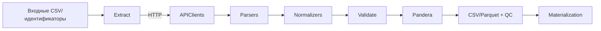

# architecture-overview

## слои-системы

```mermaid
graph TD
    CLI[CLI (Typer)] --> ConfigLoader[Config loader & PipelineConfig]
    ConfigLoader --> Pipelines[PipelineBase subclasses]
    Pipelines --> Stages[extract / transform / validate / write]
    Stages --> Core[Core services: UnifiedAPIClient, logger, output writer]
    Core --> Sources[Source adapters & clients]
    Sources --> Storage[Materialization manager & deterministic outputs]
```

- CLI основан на Typer и реестре `PIPELINE_COMMAND_REGISTRY`, что обеспечивает

  единый вход для всех пайплайнов.[ref: repo:src/scripts/__init__.py@test_refactoring_32]

- Конфигурации загружаются через `PipelineConfig` с Pydantic-валидацией и

  поддержкой include/extends.[ref: repo:src/bioetl/config/models.py@test_refactoring_32]

- Базовый класс `PipelineBase` реализует стандартные стадии и обработку

  дополнительных артефактов, что формирует общий контракт выполнения.[ref: repo:src/bioetl/pipelines/base.py@test_refactoring_32]

- Core-службы (`UnifiedAPIClient`, `UnifiedLogger`, `OutputWriter`) обеспечивают

  ретраи, структурированное логирование и детерминированную запись.[ref: repo:src/bioetl/core/api_client.py@test_refactoring_32]

## поток-данных



1. `extract()` получает идентификаторы из CSV или API и использует клиентов с

   `backoff`-ретраями и пагинацией.[ref: repo:src/bioetl/utils/io.py@test_refactoring_32]

2. Парсеры и нормализаторы приводят payload к промежуточным фреймам, применяя

   правила сопоставления идентификаторов и очистки типов.[ref: repo:src/bioetl/sources/chembl/document/normalizer.py@test_refactoring_32]

3. `validate()` выполняет Pandera-проверки, подстраивая порядок столбцов и

   собирая QC-метрики.[ref: repo:src/bioetl/pipelines/base.py@test_refactoring_32]

4. `export()` сохраняет датасеты через `OutputWriter`, дополняя метаданными,

   QC-отчётами и вспомогательными таблицами.[ref: repo:src/bioetl/core/output_writer.py@test_refactoring_32]

## компоненты

### cli-и-оркестрация

- Typer-команды генерируются динамически и поддерживают общий набор флагов

  (`--config`, `--input`, `--output`, `--mode`, `--dry-run`).[ref: repo:src/bioetl/cli/command.py@test_refactoring_32]

- Ограничения `limit`/`sample` обрабатываются в базовом классе и логируются.

### конфигурация

- YAML-файлы в `src/bioetl/configs/` используют `extends` и include-фрагменты

  (`includes/chembl_source.yaml`, `includes/determinism.yaml`).[ref: repo:src/bioetl/configs/pipelines/activity.yaml@test_refactoring_32]

- `TargetSourceConfig` поддерживает ключи для rate limit, circuit breaker и

  извлечение секретов из переменных окружения `env:`.[ref: repo:src/bioetl/config/models.py@test_refactoring_32]

### клиенты-и-адаптеры

- `UnifiedAPIClient` инкапсулирует timeout, ретраи, rate limit и кэширование.[ref: repo:src/bioetl/core/api_client.py@test_refactoring_32]
- Внешние адаптеры наследуют `ExternalAdapter`, реализуя батчевую работу и

  нормализацию (PubMed, Crossref, OpenAlex, Semantic Scholar).[ref: repo:src/bioetl/adapters/base.py@test_refactoring_32]

- Специализированные билдеры запросов выполняют требования API (например,

  `PubMedRequestBuilder` добавляет `tool`/`email`).[ref: repo:src/bioetl/sources/pubmed/request/builder.py@test_refactoring_32]

### нормализация-и-мерджинг

- Каждая сущность имеет Pandera-схему и порядок колонок, регистрируемые в

  `schema_registry`.[ref: repo:src/bioetl/pipelines/chembl_activity.py@test_refactoring_32]

- Merge-политики (`merge_with_precedence`, сервисы IUPHAR/UniProt) обеспечивают

  детерминированные приоритеты источников.[ref: repo:src/bioetl/sources/chembl/document/merge/policy.py@test_refactoring_32]

### материализация-и-qc

- `MaterializationManager` управляет слоями silver/gold/QC и расширениями

  датасетов.[ref: repo:src/bioetl/core/materialization.py@test_refactoring_32]

- QC-метрики агрегируются функциями `update_summary_metrics` и `duplicate_summary`

  для включения в отчёты.[ref: repo:src/bioetl/utils/qc.py@test_refactoring_32]

## глоссарий

- **Бизнес-ключ** — минимальный набор колонок, идентифицирующий запись в рамках

  сущности (например, `document_chembl_id` + `doi_clean`).

- **Энрихер** — внешний источник, добавляющий поля к базовому датасету.
- **Fallback** — детерминированная запись, создаваемая при ошибке запроса.
- **Materialization stage** — именованная директория (`silver`, `gold`, `qc`) с

  определённым форматом и колонками.

- **Runtime options** — временные флаги исполнения пайплайна (`limit`, `mode`),

  не влияющие на конфигурацию.
