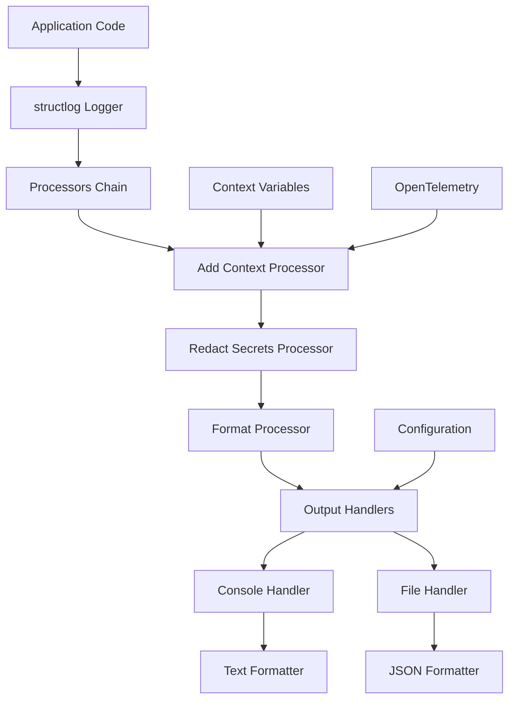

# Архитектура системы логирования

## Обзор архитектуры

Система логирования в `bioactivity-data-acquisition` построена на основе `structlog` с поддержкой структурированного JSON-логирования, файлового вывода с ротацией и интеграцией с OpenTelemetry для трассировки.

## Компоненты системы

### 1. Унифицированная конфигурация (`logging_setup.py`)

Центральный модуль для настройки логирования:

```python
# Основные функции
configure_logging()     # Инициализация системы логирования
set_run_context()       # Установка контекстных переменных
bind_stage()           # Привязка к этапу выполнения
cleanup_old_logs()     # Очистка старых логов
```

### 2. Контекстные переменные (contextvars)

```python
run_id_var: ContextVar[str | None]    # Уникальный ID запуска
stage_var: ContextVar[str | None]     # Текущий этап выполнения
```

### 3. Фильтры

#### RedactSecretsFilter
- Маскирует чувствительную информацию в логах
- Поддерживает regex-паттерны для различных типов секретов
- Применяется к консольному и файловому выводу

#### AddContextFilter
- Добавляет контекстные метаданные в log records
- Интегрирует run_id, stage, trace_id из OpenTelemetry

### 4. Processors (structlog)

```python
processors = [
    TimeStamper(fmt="iso"),           # ISO timestamp
    _add_context_processor,           # Контекстные переменные
    _redact_secrets_processor,        # Маскирование секретов
    add_log_level,                    # Уровень логирования
    StackInfoRenderer(),              # Stack trace для ошибок
    format_exc_info,                  # Форматирование исключений
    JSONRenderer() / ConsoleRenderer() # Формат вывода
]
```

## Поток данных



## Конфигурация

### Иерархия конфигурации

1. **YAML конфиг** (`config/logging.yaml`) - базовая конфигурация
2. **Переменные окружения** (`BIOACTIVITY__LOGGING__*`) - переопределения
3. **CLI флаги** (`--log-level`, `--log-file`) - приоритетные переопределения

### Структура конфигурации

```yaml
logging:
  level: INFO                    # Глобальный уровень
  file:
    enabled: true               # Включить файловое логирование
    path: logs/app.log          # Путь к файлу
    max_bytes: 10485760        # Размер для ротации (10MB)
    backup_count: 10           # Количество backup файлов
    rotation_strategy: size    # Стратегия ротации
  console:
    format: text               # Формат консоли
  cleanup_on_start: true       # Автоочистка при старте
```

## Handlers и форматы

### Console Handler

**Назначение**: Человекочитаемый вывод для разработки и отладки

**Формат**:
```
2024-01-15 10:30:45 INFO library.etl.extract — Fetching data from ChEMBL API
```

**Конфигурация**:
```python
console_handler = logging.StreamHandler()
console_handler.setFormatter(console_formatter)
console_handler.addFilter(RedactSecretsFilter())
console_handler.addFilter(AddContextFilter())
```

### File Handler

**Назначение**: Структурированные JSON логи для анализа и мониторинга

**Формат**:
```json
{
  "timestamp": "2024-01-15T10:30:45.123456Z",
  "level": "info",
  "logger": "library.etl.extract",
  "event": "Fetching data from ChEMBL API",
  "run_id": "a1b2c3d4",
  "stage": "extract",
  "trace_id": "1234567890abcdef1234567890abcdef"
}
```

**Ротация**:
- **Размерная**: `RotatingFileHandler` (maxBytes=10MB, backupCount=10)
- **Временная**: `TimedRotatingFileHandler` (when='midnight', backupCount=14)

## Интеграция с OpenTelemetry

### Trace ID корреляция

```python
def _add_context_processor(logger, method_name, event_dict):
    # Добавляем trace_id из OpenTelemetry
    try:
        from library.telemetry import get_current_trace_id
        event_dict["trace_id"] = get_current_trace_id() or "unknown"
    except ImportError:
        event_dict["trace_id"] = "unknown"
```

### Span атрибуты

```python
# В HTTP клиентах
add_span_attribute("http.method", method)
add_span_attribute("http.url", url)
add_span_attribute("http.status_code", response.status_code)
```

## Безопасность

### Маскирование секретов

**Паттерны маскирования**:
```python
sensitive_patterns = [
    (r'(?i)(token|api_key|password|secret|key)\s*=\s*([^\s,}]+)', r'\1=[REDACTED]'),
    (r'(?i)(authorization|bearer)\s*:\s*([^\s,}]+)', r'\1: [REDACTED]'),
    (r'(?i)(password|pwd)\s*=\s*([^\s,}]+)', r'\1=[REDACTED]'),
]
```

**Применение**:
- К консольному выводу
- К файловому выводу
- К структурированным полям в JSON

### Фильтрация по уровням

```python
# Разные уровни для разных компонентов
loggers:
  library: DEBUG              # Детальные логи библиотеки
  library.clients: INFO       # Умеренные логи HTTP клиентов
  requests: WARNING           # Только предупреждения от requests
  urllib3: WARNING            # Только предупреждения от urllib3
```

## Производительность

### Оптимизации

1. **Кэширование логгеров**: `cache_logger_on_first_use=True`
2. **Асинхронная запись**: Использование `BatchSpanProcessor` для OpenTelemetry
3. **Условная инициализация**: Логирование настраивается только один раз

### Мониторинг производительности

```python
# Логирование времени выполнения
logger.info("Operation completed", elapsed_ms=1234, records_processed=1000)

# HTTP метрики
logger.info("HTTP request", 
           method="GET", 
           url="/api/data", 
           status_code=200, 
           response_time_ms=456)
```

## Масштабирование

### Распределенное логирование

```python
# Уникальные run_id для каждого запуска
run_id = generate_run_id()  # "a1b2c3d4"

# Корреляция между сервисами
logger.info("Cross-service call", 
           target_service="chembl-api", 
           correlation_id=run_id)
```

### Агрегация логов

**По run_id**:
```bash
grep "run_id.*a1b2c3d4" logs/app.log | jq '.'
```

**По этапу**:
```bash
grep '"stage":"extract"' logs/app.log | jq '.timestamp, .event'
```

**По ошибкам**:
```bash
grep '"level":"error"' logs/app.log | jq '.error, .exc_info'
```

## CI/CD интеграция

### GitHub Actions

```yaml
- name: Upload logs
  if: always()
  uses: actions/upload-artifact@v3
  with:
    name: test-logs-${{ matrix.python-version }}
    path: logs/
```

### Переменные окружения

```yaml
env:
  BIOACTIVITY__LOGGING__LEVEL: DEBUG
  BIOACTIVITY__LOGGING__FILE__ENABLED: true
  BIOACTIVITY__LOGGING__FILE__PATH: /tmp/ci-logs/app.log
```

## Troubleshooting

### Диагностика проблем

1. **Проверка конфигурации**:
   ```python
   logger.debug("Logging configuration", 
                level=logging.getLevelName(logger.level),
                handlers=[h.__class__.__name__ for h in logger.handlers])
   ```

2. **Проверка контекста**:
   ```python
   logger.debug("Current context", **get_run_context())
   ```

3. **Проверка производительности**:
   ```python
   import time
   start = time.time()
   # ... операция
   logger.info("Operation timing", elapsed_ms=(time.time() - start) * 1000)
   ```

### Логирование ошибок

```python
try:
    # ... операция
    pass
except Exception as e:
    logger.error("Operation failed", 
                error=str(e), 
                exc_info=True,  # Включает stack trace
                context=get_run_context())
```

## Будущие улучшения

### Планируемые функции

1. **Асинхронное логирование**: Использование `asyncio` для неблокирующей записи
2. **Метрики логирования**: Интеграция с Prometheus для мониторинга
3. **Централизованное логирование**: Отправка в ELK Stack или аналогичные системы
4. **Структурированные исключения**: Специальные типы исключений с контекстом

### Расширяемость

```python
# Кастомные processors
def custom_processor(logger, method_name, event_dict):
    event_dict["custom_field"] = "custom_value"
    return event_dict

# Добавление в конфигурацию
structlog.configure(
    processors=[
        # ... стандартные processors
        custom_processor,
    ]
)
```
