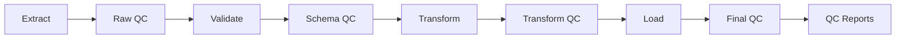

# Контроль качества данных

## Обзор

Система контроля качества (QC) обеспечивает автоматическую проверку данных на всех этапах ETL пайплайна. QC включает проверки полноты, уникальности, диапазонов значений и связей между полями.

## Типы проверок качества

### 1. Базовые проверки

**Расположение**: `src/library/etl/qc.py`

#### Проверки полноты (Fill Rate)

```python
def build_qc_report(df: pd.DataFrame) -> pd.DataFrame:
    """Генерация QC отчёта с базовыми метриками полноты."""
    
    # Для данных документов
    if "document_chembl_id" in df.columns:
        key_columns = ["document_chembl_id", "doi", "title"]
        metrics = {
            "row_count": len(df),
            "missing_document_chembl_id": int(df["document_chembl_id"].isna().sum()),
            "missing_doi": int(df["doi"].isna().sum()),
            "missing_title": int(df["title"].isna().sum()),
            "duplicates": int(df[available_key_columns].duplicated().sum()),
        }
```

#### Проверки уникальности

- **Дубликаты по ключевым полям**: `document_chembl_id`, `doi`
- **Дубликаты по составным ключам**: Комбинации полей
- **Статистика дубликатов**: Процент дублированных записей

#### Проверки диапазонов

- **Годы публикации**: 1900-2030
- **Объёмы журналов**: Положительные числа
- **Страницы**: first_page ≤ last_page

### 2. Расширенные проверки

**Расположение**: `src/library/etl/enhanced_qc.py`

#### Анализ паттернов

```python
def build_enhanced_qc_summary(df: pd.DataFrame) -> pd.DataFrame:
    """Расширенный QC анализ с паттернами и статистикой."""
    
    # Анализ паттернов в данных
    pattern_analysis = {
        "doi_pattern_coverage": analyze_doi_patterns(df),
        "journal_name_variations": analyze_journal_variations(df),
        "author_name_patterns": analyze_author_patterns(df),
        "year_distribution": analyze_year_distribution(df),
    }
```

#### Статистический анализ

- **Распределения**: Гистограммы числовых полей
- **Топ значения**: Наиболее частые значения категориальных полей
- **Выбросы**: Статистические аномалии
- **Корреляции**: Связи между полями

### 3. Валидация связей

#### DOI валидация

```python
def validate_doi_format(doi_series: pd.Series) -> pd.Series:
    """Валидация формата DOI."""
    doi_pattern = r'^10\.\d{4,}/.+'
    return doi_series.str.match(doi_pattern, na=False)
```

#### Связи между источниками

- **DOI консистентность**: Одинаковые DOI в разных источниках
- **Названия журналов**: Сопоставление между источниками
- **Авторы**: Сравнение списков авторов
- **Временные метки**: Консистентность дат публикации

## Автоматический отчёт QC

### Структура отчёта

**Расположение**: `src/library/etl/load.py` → `write_qc_artifacts`

```python
def write_qc_artifacts(
    df: pd.DataFrame,
    qc_path: Path,
    corr_path: Path,
    output: OutputSettings,
    validation: QCValidationSettings,
    logger: BoundLogger,
) -> None:
    """Запись QC артефактов."""
    
    # Базовый QC отчёт
    qc_report = build_qc_report(df)
    qc_report.to_csv(qc_path, index=False)
    
    # Расширенный QC (если включён)
    if output.enhanced_qc:
        enhanced_qc = build_enhanced_qc_summary(df)
        enhanced_qc.to_csv(qc_path.with_suffix('_enhanced.csv'), index=False)
    
    # Корреляционный анализ
    if output.correlation:
        correlation_report = build_correlation_report(df)
        correlation_report.to_csv(corr_path, index=False)
```

### Типы QC отчётов

| Тип отчёта | Файл | Описание |
|------------|------|----------|
| **Базовый QC** | `*_qc_report.csv` | Основные метрики полноты и дубликатов |
| **Расширенный QC** | `*_qc_report_enhanced.csv` | Статистический анализ и паттерны |
| **Детальный QC** | `*_qc_report_detailed/` | Подробные отчёты по колонкам |
| **Корреляции** | `*_correlation_report.csv` | Корреляционные матрицы |
| **Расширенные корреляции** | `*_correlation_report_enhanced/` | Детальный корреляционный анализ |

### Пример QC отчёта

```csv
metric,value,threshold,status
row_count,1000,,
missing_document_chembl_id,0,0,pass
missing_doi,150,100,warning
missing_title,5,10,pass
duplicates,25,50,pass
fill_rate_doi,0.85,0.80,pass
fill_rate_title,0.995,0.95,pass
```

## Обработка ошибок QC

### Классификация ошибок

#### Критические ошибки (Critical)

- **Отсутствие обязательных полей**: `document_chembl_id`, `title`
- **Нарушение схемы данных**: Несоответствие Pandera схеме
- **Системные ошибки**: Ошибки API, сетевые проблемы

#### Предупреждения (Warning)

- **Низкий fill rate**: Заполненность < порогового значения
- **Высокий уровень дубликатов**: > допустимого процента
- **Аномальные значения**: Выбросы в числовых полях

#### Информационные (Info)

- **Статистические аномалии**: Необычные распределения
- **Новые паттерны**: Неожиданные комбинации значений
- **Метрики производительности**: Время выполнения, throughput

### Стратегии обработки

#### Автоматическое исправление

```python
def auto_fix_common_issues(df: pd.DataFrame) -> pd.DataFrame:
    """Автоматическое исправление типичных проблем."""
    
    # Нормализация DOI
    df['doi'] = df['doi'].str.strip().str.lower()
    
    # Исправление годов
    df['year'] = df['year'].clip(lower=1900, upper=2030)
    
    # Удаление дубликатов
    df = df.drop_duplicates(subset=['document_chembl_id'])
    
    return df
```

#### Ручное вмешательство

- **Алерты**: Уведомления о критических проблемах
- **Отчёты**: Детальные отчёты для анализа
- **Логи**: Структурированные логи для отладки

### Конфигурация QC

```yaml
validation:
  strict: true
  qc:
    max_missing_fraction: 0.05      # Максимальная доля пропусков
    max_duplicate_fraction: 0.01    # Максимальная доля дубликатов
    min_fill_rate: 0.80             # Минимальный fill rate
    enable_enhanced_qc: true        # Расширенный QC
    enable_correlation: true        # Корреляционный анализ
```

## Мониторинг качества

### Метрики QC

#### Основные метрики

- **Fill Rate**: Процент заполненных полей
- **Duplicate Rate**: Процент дублированных записей
- **Validation Success Rate**: Процент успешных валидаций
- **Data Freshness**: Актуальность данных

#### Детальные метрики

- **Field-level Fill Rate**: Заполненность по каждому полю
- **Source Quality**: Качество данных по источникам
- **Temporal Trends**: Динамика качества во времени
- **Error Patterns**: Паттерны ошибок

### Дашборды

#### Grafana панели

- **QC Overview**: Общий обзор качества данных
- **Field Analysis**: Анализ по полям
- **Source Comparison**: Сравнение источников
- **Trend Analysis**: Временные тренды

#### Алерты

- **Критический уровень ошибок**: > 5% ошибок валидации
- **Деградация качества**: Падение fill rate > 10%
- **Новые типы ошибок**: Неожиданные проблемы
- **API недоступность**: Проблемы с источниками

## Интеграция с ETL

### Точки контроля



### QC на каждом этапе

1. **Extract QC**: Проверка сырых данных от API
2. **Schema QC**: Валидация Pandera схем
3. **Transform QC**: Проверка после трансформации
4. **Final QC**: Итоговая проверка перед экспортом

### Интеграция с логированием

```python
def log_qc_metrics(qc_report: pd.DataFrame, logger: BoundLogger) -> None:
    """Логирование QC метрик."""
    
    for _, row in qc_report.iterrows():
        logger.info(
            "qc_metric",
            metric=row['metric'],
            value=row['value'],
            threshold=row.get('threshold'),
            status=row.get('status'),
        )
```

## Расширение QC

### Добавление новых проверок

1. **Создать функцию проверки**: В `src/library/etl/qc.py`
2. **Добавить в отчёт**: Интеграция в `build_qc_report`
3. **Конфигурация**: Добавить параметры в конфиг
4. **Тесты**: Проверка новой функциональности

### Кастомные валидаторы

```python
def custom_field_validator(df: pd.DataFrame, field: str, rules: dict) -> dict:
    """Кастомный валидатор поля."""
    
    results = {
        'field': field,
        'total_records': len(df),
        'valid_records': 0,
        'invalid_records': 0,
        'errors': []
    }
    
    # Применение правил валидации
    for rule_name, rule_func in rules.items():
        valid_mask = rule_func(df[field])
        results['valid_records'] += valid_mask.sum()
        results['invalid_records'] += (~valid_mask).sum()
        
        if not valid_mask.all():
            results['errors'].append({
                'rule': rule_name,
                'count': (~valid_mask).sum(),
                'examples': df[~valid_mask][field].head().tolist()
            })
    
    return results
```

## Лучшие практики

### Проектирование QC

1. **Раннее обнаружение**: QC на каждом этапе ETL
2. **Автоматизация**: Минимизация ручного вмешательства
3. **Мониторинг**: Непрерывное отслеживание качества
4. **Документирование**: Чёткие критерии качества

### Оптимизация производительности

1. **Ленивая валидация**: Проверка только при необходимости
2. **Параллелизация**: Параллельные проверки для больших датасетов
3. **Кэширование**: Кэширование результатов проверок
4. **Сэмплирование**: Проверка выборок для больших объёмов

### Управление качеством

1. **SLA**: Соглашения об уровне качества
2. **Эскалация**: Процедуры при нарушении SLA
3. **Отчёты**: Регулярные отчёты о качестве
4. **Улучшения**: Непрерывное улучшение процессов QC
