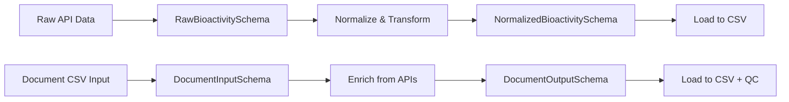

# Схемы данных и валидация

## Обзор

Проект использует Pandera для валидации данных на всех этапах ETL пайплайна. Схемы обеспечивают типизацию, проверку инвариантов и документацию структуры данных.

## Источники данных

### API Источники

| Источник | Тип данных | Основные поля | Особенности |
|----------|------------|---------------|-------------|
| **ChEMBL** | Биоактивности, Документы | `target_pref_name`, `standard_value`, `document_chembl_id` | Основной источник биоактивностей |
| **Crossref** | Метаданные публикаций | `doi`, `title`, `journal`, `authors` | DOI регистрация |
| **OpenAlex** | Академические работы | `openalex_id`, `title`, `abstract`, `venue` | Открытый доступ |
| **PubMed** | Биомедицинские статьи | `pmid`, `title`, `abstract`, `mesh_terms` | MeSH дескрипторы |
| **Semantic Scholar** | Научные публикации | `semantic_scholar_id`, `title`, `abstract`, `venue` | AI-обогащённые данные |

## Схемы входных данных

### RawBioactivitySchema

**Расположение**: `src/library/schemas/input_schema.py`

Схема для сырых данных биоактивностей из ChEMBL API:

```python
class RawBioactivitySchema(pa.DataFrameModel):
    # Основные поля из ChEMBL API
    target_pref_name: Series[str] = pa.Field(nullable=True)
    standard_value: Series[float] = pa.Field(nullable=True)  # activity_value
    standard_units: Series[str] = pa.Field(nullable=True)    # activity_units
    canonical_smiles: Series[str] = pa.Field(nullable=True)  # smiles
    source: Series[str]
    retrieved_at: Series[pd.Timestamp]
    
    # Дополнительные поля из ChEMBL API
    activity_id: Series[int] = pa.Field(nullable=True)
    assay_chembl_id: Series[str] = pa.Field(nullable=True)
    document_chembl_id: Series[str] = pa.Field(nullable=True)
    standard_type: Series[str] = pa.Field(nullable=True)
    standard_relation: Series[str] = pa.Field(nullable=True)
    target_chembl_id: Series[str] = pa.Field(nullable=True)
    target_organism: Series[str] = pa.Field(nullable=True)
    target_tax_id: Series[str] = pa.Field(nullable=True)
```

**Поведение**: `strict = False`, `coerce = True` (дополнительные колонки допускаются, типы приводятся).

### DocumentInputSchema

**Расположение**: `src/library/schemas/document_schema.py`

Схема для входных данных документов:

```python
class DocumentInputSchema(pa.DataFrameModel):
    # Обязательные поля
    document_chembl_id: Series[str] = pa.Field(description="ChEMBL document identifier")
    title: Series[str] = pa.Field(description="Document title")
    
    # Опциональные поля
    doi: Series[str] = pa.Field(nullable=True, description="Digital Object Identifier")
    document_pubmed_id: Series[str] = pa.Field(nullable=True, description="PubMed identifier")
    chembl_doc_type: Series[str] = pa.Field(nullable=True, description="Document type from ChEMBL")
    journal: Series[str] = pa.Field(nullable=True, description="Journal name")
    year: Series[int] = pa.Field(nullable=True, description="Publication year")
    
    # Legacy поля (для обратной совместимости)
    abstract: Series[str] = pa.Field(nullable=True, description="Document abstract")
    pubmed_authors: Series[str] = pa.Field(nullable=True, description="Document authors from PubMed")
    # ... дополнительные поля
```

**Поведение**: `strict = True`, `coerce = True`.

## Схемы выходных данных

### NormalizedBioactivitySchema

**Расположение**: `src/library/schemas/output_schema.py`

Схема для нормализованных данных биоактивностей:

```python
class NormalizedBioactivitySchema(pa.DataFrameModel):
    target: Series[str] = pa.Field(nullable=True)
    activity_value: Series[float] = pa.Field(nullable=True)  # Разрешаем NULL значения
    activity_unit: Series[str] = pa.Field(nullable=True)     # Разрешаем другие единицы
    source: Series[str]
    retrieved_at: Series[pd.Timestamp]
    smiles: Series[str] = pa.Field(nullable=True)
```

**Поведение**: `strict = False`, `coerce = True`.

### DocumentOutputSchema

**Расположение**: `src/library/schemas/document_schema.py`

Схема для обогащённых данных документов из всех источников:

```python
class DocumentOutputSchema(pa.DataFrameModel):
    # Оригинальные поля ChEMBL
    document_chembl_id: Series[str] = pa.Field(description="ChEMBL document identifier")
    title: Series[str] = pa.Field(description="Document title")
    doi: Series[str] = pa.Field(nullable=True, description="Digital Object Identifier")
    
    # Поля от OpenAlex
    openalex_doi: Series[str] = pa.Field(nullable=True, description="DOI from OpenAlex")
    openalex_title: Series[str] = pa.Field(nullable=True, description="Title from OpenAlex")
    openalex_abstract: Series[str] = pa.Field(nullable=True, description="Abstract from OpenAlex")
    # ... множество полей от всех источников
    
    # Поля валидации
    invalid_doi: Series[bool] = pa.Field(nullable=True, description="DOI validation flag")
    valid_doi: Series[str] = pa.Field(nullable=True, description="Valid DOI value")
    # ... поля валидации для других атрибутов
```

**Поведение**: `strict = True`, `coerce = True`.

## Карта трансформации данных



### Этапы трансформации

1. **Raw → Validated**: Pandera валидация входящих данных
2. **Validated → Transformed**: Нормализация и обогащение
3. **Transformed → Loaded**: Детерминированный экспорт

## Примеры валидаторов

### Валидный CSV (фрагмент)

```csv
target,activity_value,activity_unit,source,retrieved_at,smiles
Protein X,12.3,nM,chembl,2024-01-01T00:00:00Z,C1=CC=CC=C1
```

### Невалидный CSV (тип не приводится)

```csv
target,activity_value,activity_unit,source,retrieved_at,smiles
Protein X,not_a_number,nM,chembl,2024-01-01T00:00:00Z,C1=CC=CC=C1
```

**Ошибка Pandera**: `SchemaError: expected series 'activity_value' to have type float64, got object`

### Валидация документов

```python
# Пример валидации входных данных документов
import pandas as pd
from library.schemas.document_schema import DocumentInputSchema

# Валидные данные
valid_data = pd.DataFrame({
    'document_chembl_id': ['CHEMBL123456'],
    'title': ['Sample Article'],
    'doi': ['10.1000/example'],
    'journal': ['Nature'],
    'year': [2024]
})

# Валидация
schema = DocumentInputSchema.to_schema()
validated = schema.validate(valid_data, lazy=True)
```

## Ограничения и типы

### Типы данных

| Pandera тип | Python тип | Описание | Nullable |
|-------------|------------|----------|----------|
| `Series[str]` | `str` | Строковые данные | Да/Нет |
| `Series[float]` | `float` | Числовые данные | Да/Нет |
| `Series[int]` | `int` | Целые числа | Да/Нет |
| `Series[bool]` | `bool` | Булевы значения | Да/Нет |
| `Series[pd.Timestamp]` | `datetime` | Временные метки | Нет |

### Инварианты

1. **DOI валидация**: Проверка формата DOI через регулярные выражения
2. **Годы публикации**: Диапазон 1900-2030
3. **SMILES**: Валидация химических структур
4. **Временные метки**: ISO 8601 формат

### Ограничения

1. **Размер данных**: Ограничения памяти pandas
2. **Типы**: Строгая типизация с приведением типов
3. **Null значения**: Явное указание nullable полей
4. **Дополнительные колонки**: Контроль через `strict` режим

## Обработка ошибок валидации

### Типы ошибок

1. **SchemaError**: Несоответствие схеме (типы, обязательные поля)
2. **ValidationError**: Нарушение инвариантов (диапазоны, форматы)
3. **CoercionError**: Невозможность приведения типов

### Стратегии обработки

```python
# Ленивая валидация с накоплением ошибок
try:
    validated = schema.validate(data, lazy=True)
except pa.errors.SchemaErrors as e:
    # Обработка множественных ошибок
    for error in e.schema_errors:
        logger.error(f"Validation error: {error}")
```

### Логирование ошибок

- **Структурированные логи**: Контекст ошибки, источник данных
- **Метрики**: Количество ошибок валидации по типам
- **Отчёты**: Детальные отчёты о проблемах в данных

## Расширение схем

### Добавление нового поля

1. **Обновить схему**: Добавить поле в Pandera модель
2. **Обновить трансформацию**: Обработка нового поля
3. **Тесты**: Проверка валидации
4. **Документация**: Описание нового поля

### Кастомные валидаторы

```python
import pandera as pa
from pandera.typing import Series

def validate_doi(series: Series[str]) -> Series[str]:
    """Кастомный валидатор для DOI."""
    import re
    doi_pattern = r'^10\.\d{4,}/.+'
    invalid_dois = series[~series.str.match(doi_pattern, na=False)]
    if not invalid_dois.empty:
        raise pa.errors.SchemaError(
            schema=DocumentOutputSchema,
            data=series,
            message=f"Invalid DOI format: {invalid_dois.tolist()}"
        )
    return series

class DocumentOutputSchema(pa.DataFrameModel):
    doi: Series[str] = pa.Field(nullable=True, check=validate_doi)
```

## Мониторинг качества данных

### Метрики валидации

- **Fill Rate**: Процент заполненных полей
- **Type Coercion Rate**: Процент успешных приведений типов
- **Validation Errors**: Количество и типы ошибок
- **Schema Compliance**: Соответствие схеме

### Алерты

- **Высокий уровень ошибок**: Превышение пороговых значений
- **Деградация качества**: Падение fill rate
- **Новые типы ошибок**: Неожиданные проблемы валидации
