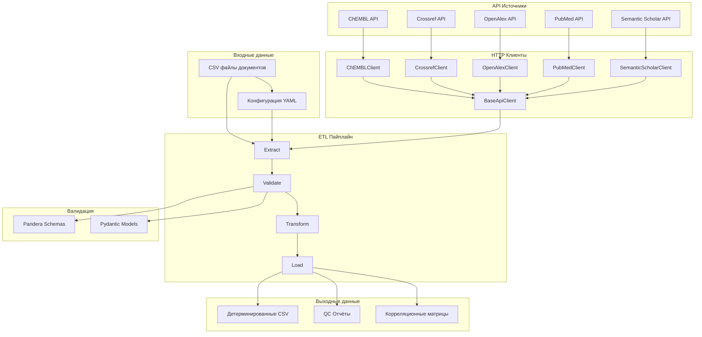
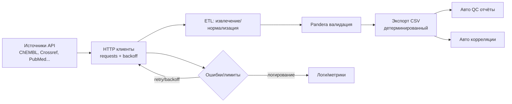
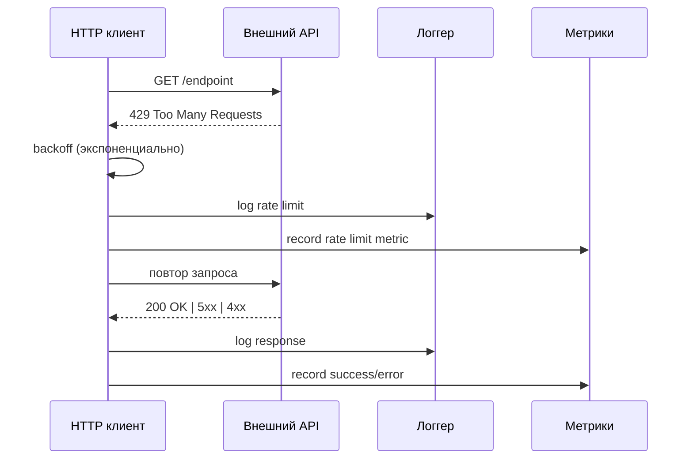

# Архитектура и поток данных

## Обзор системы

Bioactivity Data Acquisition — это модульный ETL-пайплайн для извлечения, валидации, трансформации и загрузки биоактивностных данных из множественных API источников.

## Архитектурная диаграмма



## Поток данных ETL



## Этапы ETL

### 1. Extract (Извлечение)

**Расположение**: `src/library/etl/extract.py`

- **HTTP клиенты**: Специализированные клиенты для каждого API (`src/library/clients/`)
- **Rate Limiting**: Контроль скорости запросов через `RateLimiter`
- **Retry Logic**: Экспоненциальный backoff с `backoff` библиотекой
- **Session Management**: Переиспользование HTTP сессий

**Ключевые компоненты**:

- `BaseApiClient`: Базовый функционал для всех клиентов
- `RateLimiter`: Thread-safe ограничение скорости
- `FallbackManager`: Адаптивная стратегия обработки ошибок

### 2. Validate (Валидация)

**Расположение**: `src/library/schemas/`

**Pandera схемы**:

- `RawBioactivitySchema`: Сырые данные из API
- `NormalizedBioactivitySchema`: Нормализованные данные
- `DocumentInputSchema`: Входные данные документов
- `DocumentOutputSchema`: Обогащённые данные документов

**Pydantic модели**:

- `Config`: Конфигурация пайплайна
- `APIClientConfig`: Настройки API клиентов
- `RetrySettings`: Параметры повторных попыток

### 3. Transform (Трансформация)

**Расположение**: `src/library/etl/transform.py`

- **Нормализация**: Приведение данных к единому формату
- **DOI валидация**: Проверка и нормализация DOI
- **Journal нормализация**: Унификация названий журналов
- **Citation форматирование**: Создание библиографических ссылок

### 4. Load (Загрузка)

**Расположение**: `src/library/etl/load.py`

- **Детерминированный экспорт**: Стабильная сортировка и порядок колонок
- **QC отчёты**: Автоматическая генерация отчётов качества
- **Корреляционный анализ**: Статистический анализ связей между полями

## Схемы Pandera

### RawBioactivitySchema

```python
class RawBioactivitySchema(pa.DataFrameModel):
    target_pref_name: Series[str] = pa.Field(nullable=True)
    standard_value: Series[float] = pa.Field(nullable=True)
    standard_units: Series[str] = pa.Field(nullable=True)
    canonical_smiles: Series[str] = pa.Field(nullable=True)
    source: Series[str]
    retrieved_at: Series[pd.Timestamp]
    # ... дополнительные поля
```

### DocumentOutputSchema

```python
class DocumentOutputSchema(pa.DataFrameModel):
    document_chembl_id: Series[str] = pa.Field(description="ChEMBL document identifier")
    title: Series[str] = pa.Field(description="Document title")
    doi: Series[str] = pa.Field(nullable=True, description="Digital Object Identifier")
    # ... поля от всех источников
```

## Логирование и мониторинг

### Структурированное логирование

**Расположение**: `src/library/utils/logging.py`

- **Structlog**: Структурированные логи в JSON формате
- **Контекстная информация**: source, command, operation_id
- **Уровни логирования**: DEBUG, INFO, WARNING, ERROR

### OpenTelemetry

**Расположение**: `src/library/telemetry.py`

- **Distributed Tracing**: Jaeger для трейсинга запросов
- **Метрики**: Prometheus метрики производительности
- **Инструментация**: Автоматическая инструментация HTTP запросов

## Потоки ошибок и ретраи



### Обработка ошибок

1. **4xx/5xx ошибки**: Экспоненциальный backoff, ограничение попыток
2. **429 Rate Limit**: Пауза/джиттер, повтор; чтение `Retry-After` заголовка
3. **Таймауты**: Настраиваемые таймауты для каждого источника
4. **Валидация Pandera**: Отчёты/логи, корректирующие действия

## Детерминизм

### Контроль детерминизма

**Расположение**: `configs/config.yaml` → `determinism`

```yaml
determinism:
  sort:
    by:
      - document_chembl_id
      - title
    ascending:
      - true
      - true
    na_position: last
  column_order:
    - document_chembl_id
    - title
    - doi
    - journal
    # ... фиксированный порядок
```

### Гарантии воспроизводимости

1. **Стабильная сортировка**: Фиксированные ключи и порядок
2. **Порядок колонок**: Явно заданный `column_order`
3. **Форматирование**: Консистентное форматирование чисел и дат
4. **Хеширование**: SHA256 для проверки целостности

## Ограничения

### API Ограничения

| Источник | Rate Limit | Таймаут | Особенности |
|----------|------------|---------|-------------|
| **ChEMBL** | Нет лимита | 60s | Требует токен для больших объёмов |
| **Crossref** | 50/сек | 30s | Политес API |
| **OpenAlex** | Нет лимита | 30s | Открытый API |
| **PubMed** | 3/сек (10/сек с ключом) | 60s | Требует User-Agent |
| **Semantic Scholar** | 1/5сек | 60s | Строгие лимиты |

### Технические ограничения

1. **Память**: Загрузка всех данных в память (pandas)
2. **Потоки**: Синхронные HTTP запросы
3. **Размер**: Ограничения на размер ответов API
4. **Сеть**: Зависимость от стабильности внешних API

## Точки расширения

### Добавление нового источника

1. **Создать клиент**: Наследовать от `BaseApiClient`
2. **Добавить схему**: Pandera схема для валидации
3. **Обновить конфиг**: Добавить в `sources` секцию
4. **Тесты**: Интеграционные тесты для нового API

### Кастомные трансформации

1. **Создать функцию**: В `src/library/etl/transform.py`
2. **Добавить в конфиг**: Секция `transforms`
3. **Валидация**: Pandera схема для результата
4. **Документация**: Описание в docs/

### Новые артефакты

1. **Создать генератор**: В `src/library/etl/load.py`
2. **Добавить в конфиг**: Секция `postprocess`
3. **Интеграция**: В основной пайплайн
4. **Тесты**: Проверка генерации артефактов

## Мониторинг и алертинг

### Метрики

- **Производительность**: Время выполнения, throughput
- **Ошибки**: Количество и типы ошибок
- **API Health**: Доступность внешних сервисов
- **Качество данных**: Fill rate, дубликаты

### Дашборды

- **Grafana**: Визуализация метрик
- **Jaeger**: Трейсинг запросов
- **Prometheus**: Сбор метрик

### Алерты

- **API недоступность**: Уведомления о недоступности источников
- **Высокий уровень ошибок**: Превышение пороговых значений
- **Деградация качества**: Падение fill rate
