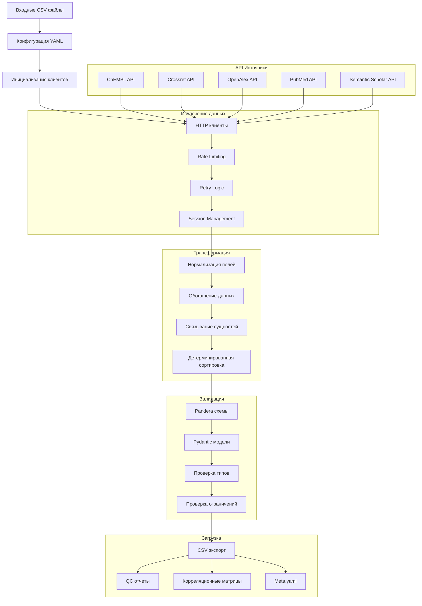

# Поток данных в пайплайне

## Обзор

Данный документ описывает детальный поток данных через ETL-пайплайн проекта Bioactivity Data Acquisition, включая этапы извлечения, трансформации, валидации и загрузки.

## Архитектурная диаграмма потока данных



## Этапы обработки данных

### 1. Извлечение (Extract)

**Расположение**: `src/library/etl/extract.py`

**Процесс:**
1. **Инициализация клиентов** — создание HTTP клиентов для каждого API источника
2. **Rate Limiting** — контроль скорости запросов через `RateLimiter`
3. **Retry Logic** — экспоненциальный backoff при ошибках
4. **Session Management** — переиспользование HTTP сессий

**Ключевые компоненты:**
- `BaseApiClient`: Базовый функционал для всех клиентов
- `RateLimiter`: Thread-safe ограничение скорости
- `FallbackManager`: Адаптивная стратегия обработки ошибок

**Пример потока извлечения:**
```python
# Инициализация клиента
client = ChEMBLClient(config.api_settings)

# Извлечение данных с контролем скорости
raw_data = fetch_bioactivity_data(client, logger=logger)
```

### 2. Трансформация (Transform)

**Расположение**: `src/library/etl/transform.py`

**Процесс:**
1. **Нормализация полей** — приведение данных к единому формату
2. **Обогащение данных** — добавление метаданных и связей
3. **Связывание сущностей** — установка связей между молекулами, мишенями и активностями
4. **Детерминированная сортировка** — стабильная сортировка по ключевым полям

**Нормализаторы:**
- `StringNormalizers`: Очистка и стандартизация строк
- `NumericNormalizers`: Приведение числовых значений
- `DateTimeNormalizers`: Форматирование дат
- `IdentifierNormalizers`: Нормализация идентификаторов

**Пример трансформации:**
```python
# Нормализация данных
normalized = normalize_bioactivity_data(
    raw_frame,
    transforms=config.transforms,
    determinism=config.determinism,
    logger=logger
)
```

### 3. Валидация (Validate)

**Расположение**: `src/library/schemas/`

**Процесс:**
1. **Pandera схемы** — проверка структуры и типов данных
2. **Pydantic модели** — валидация конфигурации
3. **Проверка ограничений** — бизнес-правила и инварианты

**Схемы валидации:**
- `RawBioactivitySchema`: Сырые данные из API
- `NormalizedBioactivitySchema`: Нормализованные данные
- `DocumentInputSchema`: Входные данные документов
- `DocumentOutputSchema`: Обогащённые данные документов

**Пример валидации:**
```python
# Валидация по Pandera схеме
validated_data = schema.validate(dataframe, lazy=True)
```

### 4. Загрузка (Load)

**Расположение**: `src/library/etl/load.py`

**Процесс:**
1. **CSV экспорт** — детерминированная запись в CSV
2. **QC отчеты** — генерация отчетов о качестве данных
3. **Корреляционные матрицы** — анализ корреляций
4. **Meta.yaml** — метаданные о пайплайне

**Детерминированность:**
- Сортировка по стабильным ключам: `[assay_id, molecule_id, activity_id]`
- Генерация хешей для контроля целостности
- Сохранение метаданных в `meta.yaml`

**Пример загрузки:**
```python
# Детерминированный экспорт
write_deterministic_csv(
    dataframe=combined_data,
    output_path=output_settings.data_path,
    csv_format=config.io.output.csv_format
)

# QC отчеты
write_qc_artifacts(
    dataframe=combined_data,
    qc_path=output_settings.qc_report_path,
    correlation_path=output_settings.correlation_path
)
```

## Специализированные пайплайны

### Documents Pipeline

**Особенности:**
- Обогащение документов из множественных источников
- Связывание с PubMed, Crossref, OpenAlex, Semantic Scholar
- Нормализация библиографических данных

**Поток данных:**


### Activity Pipeline

**Особенности:**
- Связывание активностей с молекулами и мишенями
- Корреляционный анализ
- QC метрики для активностей

### Target Pipeline

**Особенности:**
- Маппинг на UniProt идентификаторы
- Интеграция с STRING базой данных
- Классификация белков по IUPHAR

## Контроль качества данных

### QC метрики

1. **Полнота данных** — процент заполненных полей
2. **Уникальность** — проверка дубликатов
3. **Консистентность** — соответствие схемам
4. **Корреляции** — анализ связей между полями

### Отчеты качества

- **Базовые QC** — основные метрики качества
- **Расширенные QC** — детальный анализ данных
- **Корреляционные матрицы** — визуализация связей

## Мониторинг и логирование

### Структурированное логирование

- **Этапы пайплайна** — extract, transform, load
- **Источники данных** — ChEMBL, PubMed, Crossref
- **Метрики производительности** — время выполнения, объем данных
- **Ошибки и предупреждения** — детальная диагностика

### Телеметрия

- **OpenTelemetry** — трейсинг операций
- **Метрики** — производительность и использование ресурсов
- **Логи** — структурированные логи для анализа

## Примеры трансформаций

### Нормализация строк

```python
# До нормализации
"  ChEMBL123  " -> "ChEMBL123"

# После нормализации
normalized_string = string_normalizer.clean_whitespace(raw_string)
```

### Нормализация числовых значений

```python
# До нормализации
"1.23e-6" -> 1.23e-06

# После нормализации
normalized_value = numeric_normalizer.parse_scientific_notation(raw_value)
```

### Связывание сущностей

```python
# Связывание активности с молекулой и мишенью
activity_data["molecule_id"] = molecule_mapping[activity_data["chembl_id"]]
activity_data["target_id"] = target_mapping[activity_data["target_chembl_id"]]
```

## Обработка ошибок

### Стратегии восстановления

1. **Retry с backoff** — повторные попытки с экспоненциальной задержкой
2. **Circuit Breaker** — временное отключение проблемных источников
3. **Graceful Degradation** — продолжение работы с доступными источниками
4. **Fallback данные** — использование резервных источников

### Мониторинг ошибок

- **Трекинг ошибок** — детальная информация об ошибках
- **Алерты** — уведомления о критических проблемах
- **Метрики** — статистика ошибок по источникам

## Производительность

### Оптимизации

1. **Батчевая обработка** — обработка данных порциями
2. **Параллелизация** — одновременная работа с несколькими источниками
3. **Кэширование** — сохранение промежуточных результатов
4. **Ленивая загрузка** — загрузка данных по требованию

### Масштабирование

- **Горизонтальное** — распределение нагрузки между узлами
- **Вертикальное** — увеличение ресурсов узла
- **Адаптивное** — автоматическое масштабирование по нагрузке
