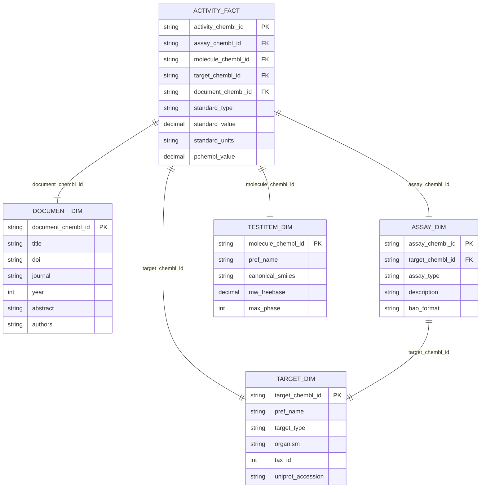

# Star Schema Integration

## Обзор

Документация по интеграции данных в звездную схему (star schema) для ETL пайплайнов bioactivity_data_acquisition. Описывает связи между таблицами, внешние ключи и методы контроля целостности.

## Архитектура схемы

### Центральная таблица (Fact Table)
```yaml
activity_fact:
  description: "Центральная таблица с измерениями биоактивности"
  primary_key: "activity_chembl_id"
  foreign_keys:
    - "assay_chembl_id → assay_dim.assay_chembl_id"
    - "molecule_chembl_id → testitem_dim.molecule_chembl_id"
    - "target_chembl_id → target_dim.target_chembl_id"
    - "document_chembl_id → document_dim.document_chembl_id"
```

### Измерительные таблицы (Dimension Tables)
```yaml
dimensions:
  document_dim:
    description: "Метаданные научных публикаций и патентов"
    primary_key: "document_chembl_id"
  
  target_dim:
    description: "Биологические мишени (белки, ферменты, рецепторы)"
    primary_key: "target_chembl_id"
  
  assay_dim:
    description: "Экспериментальные методы измерения биоактивности"
    primary_key: "assay_chembl_id"
    foreign_key: "target_chembl_id → target_dim.target_chembl_id"
  
  testitem_dim:
    description: "Химические соединения и молекулы"
    primary_key: "molecule_chembl_id"
```

## Схема связей

### ER диаграмма


## Внешние ключи и ограничения

### Primary Keys
```yaml
primary_keys:
  activity_fact:
    - activity_chembl_id: "string, NOT NULL, UNIQUE"
  
  document_dim:
    - document_chembl_id: "string, NOT NULL, UNIQUE"
  
  target_dim:
    - target_chembl_id: "string, NOT NULL, UNIQUE"
  
  assay_dim:
    - assay_chembl_id: "string, NOT NULL, UNIQUE"
  
  testitem_dim:
    - molecule_chembl_id: "string, NOT NULL, UNIQUE"
```

### Foreign Keys
```yaml
foreign_keys:
  activity_fact:
    - assay_chembl_id: "→ assay_dim.assay_chembl_id"
    - molecule_chembl_id: "→ testitem_dim.molecule_chembl_id"
    - target_chembl_id: "→ target_dim.target_chembl_id"
    - document_chembl_id: "→ document_dim.document_chembl_id"
  
  assay_dim:
    - target_chembl_id: "→ target_dim.target_chembl_id"
```

### Уникальные ограничения
```yaml
unique_constraints:
  document_dim:
    - doi: "UNIQUE, если не NULL"
    - pmid: "UNIQUE, если не NULL"
  
  target_dim:
    - uniprot_accession: "UNIQUE, если не NULL"
    - iuphar_target_id: "UNIQUE, если не NULL"
  
  testitem_dim:
    - pubchem_cid: "UNIQUE, если не NULL"
    - standard_inchi_key: "UNIQUE, если не NULL"
```

## Контроль целостности

### Referential Integrity
```python
# src/library/schemas/integrity.py
import pandas as pd
from typing import Dict, List, Tuple

class ReferentialIntegrityChecker:
    def __init__(self):
        self.violations = []
    
    def check_foreign_keys(self, fact_df: pd.DataFrame, dim_dfs: Dict[str, pd.DataFrame]) -> List[Tuple]:
        """Проверка внешних ключей между fact и dimension таблицами"""
        
        violations = []
        
        # Проверка document_chembl_id
        if 'document_chembl_id' in fact_df.columns:
            doc_dim = dim_dfs.get('document_dim')
            if doc_dim is not None:
                missing_docs = fact_df[~fact_df['document_chembl_id'].isin(doc_dim['document_chembl_id'])]
                if not missing_docs.empty:
                    violations.append(('document_chembl_id', missing_docs['activity_chembl_id'].tolist()))
        
        # Проверка target_chembl_id
        if 'target_chembl_id' in fact_df.columns:
            target_dim = dim_dfs.get('target_dim')
            if target_dim is not None:
                missing_targets = fact_df[~fact_df['target_chembl_id'].isin(target_dim['target_chembl_id'])]
                if not missing_targets.empty:
                    violations.append(('target_chembl_id', missing_targets['activity_chembl_id'].tolist()))
        
        # Проверка assay_chembl_id
        if 'assay_chembl_id' in fact_df.columns:
            assay_dim = dim_dfs.get('assay_dim')
            if assay_dim is not None:
                missing_assays = fact_df[~fact_df['assay_chembl_id'].isin(assay_dim['assay_chembl_id'])]
                if not missing_assays.empty:
                    violations.append(('assay_chembl_id', missing_assays['activity_chembl_id'].tolist()))
        
        # Проверка molecule_chembl_id
        if 'molecule_chembl_id' in fact_df.columns:
            testitem_dim = dim_dfs.get('testitem_dim')
            if testitem_dim is not None:
                missing_molecules = fact_df[~fact_df['molecule_chembl_id'].isin(testitem_dim['molecule_chembl_id'])]
                if not missing_molecules.empty:
                    violations.append(('molecule_chembl_id', missing_molecules['activity_chembl_id'].tolist()))
        
        return violations
    
    def check_unique_constraints(self, df: pd.DataFrame, table_name: str) -> List[Tuple]:
        """Проверка уникальных ограничений"""
        
        violations = []
        
        if table_name == 'document_dim':
            # Проверка уникальности DOI
            if 'doi' in df.columns:
                duplicate_dois = df[df['doi'].duplicated(keep=False) & df['doi'].notna()]
                if not duplicate_dois.empty:
                    violations.append(('doi', duplicate_dois['document_chembl_id'].tolist()))
            
            # Проверка уникальности PMID
            if 'pmid' in df.columns:
                duplicate_pmids = df[df['pmid'].duplicated(keep=False) & df['pmid'].notna()]
                if not duplicate_pmids.empty:
                    violations.append(('pmid', duplicate_pmids['document_chembl_id'].tolist()))
        
        elif table_name == 'target_dim':
            # Проверка уникальности UniProt accession
            if 'uniprot_accession' in df.columns:
                duplicate_uniprot = df[df['uniprot_accession'].duplicated(keep=False) & df['uniprot_accession'].notna()]
                if not duplicate_uniprot.empty:
                    violations.append(('uniprot_accession', duplicate_uniprot['target_chembl_id'].tolist()))
        
        return violations
```

### Валидация связей
```python
def validate_star_schema_integrity(fact_df: pd.DataFrame, dim_dfs: Dict[str, pd.DataFrame]) -> Dict:
    """Валидация целостности звездной схемы"""
    
    checker = ReferentialIntegrityChecker()
    
    # Проверка внешних ключей
    fk_violations = checker.check_foreign_keys(fact_df, dim_dfs)
    
    # Проверка уникальных ограничений
    unique_violations = {}
    for table_name, df in dim_dfs.items():
        violations = checker.check_unique_constraints(df, table_name)
        if violations:
            unique_violations[table_name] = violations
    
    # Результат валидации
    result = {
        'valid': len(fk_violations) == 0 and len(unique_violations) == 0,
        'foreign_key_violations': fk_violations,
        'unique_constraint_violations': unique_violations,
        'summary': {
            'total_fk_violations': len(fk_violations),
            'total_unique_violations': sum(len(v) for v in unique_violations.values())
        }
    }
    
    return result
```

## Сборка fact таблиц

### Процесс сборки
```python
# src/library/star_schema/builder.py
import pandas as pd
from typing import Dict, List

class StarSchemaBuilder:
    def __init__(self, config: dict):
        self.config = config
        self.dimension_tables = {}
        self.fact_table = None
    
    def build_dimensions(self, raw_data: Dict[str, pd.DataFrame]) -> Dict[str, pd.DataFrame]:
        """Построение dimension таблиц"""
        
        # Documents dimension
        if 'documents' in raw_data:
            self.dimension_tables['document_dim'] = self._build_document_dimension(raw_data['documents'])
        
        # Targets dimension
        if 'targets' in raw_data:
            self.dimension_tables['target_dim'] = self._build_target_dimension(raw_data['targets'])
        
        # Assays dimension
        if 'assays' in raw_data:
            self.dimension_tables['assay_dim'] = self._build_assay_dimension(raw_data['assays'])
        
        # Testitems dimension
        if 'testitems' in raw_data:
            self.dimension_tables['testitem_dim'] = self._build_testitem_dimension(raw_data['testitems'])
        
        return self.dimension_tables
    
    def build_fact_table(self, raw_data: Dict[str, pd.DataFrame]) -> pd.DataFrame:
        """Построение fact таблицы"""
        
        if 'activities' not in raw_data:
            raise ValueError("Activities data is required for fact table")
        
        activities_df = raw_data['activities']
        
        # Валидация внешних ключей
        self._validate_foreign_keys(activities_df)
        
        # Построение fact таблицы
        fact_table = self._build_activity_fact(activities_df)
        
        self.fact_table = fact_table
        return fact_table
    
    def _validate_foreign_keys(self, activities_df: pd.DataFrame):
        """Валидация внешних ключей"""
        
        required_fks = ['assay_chembl_id', 'molecule_chembl_id', 'target_chembl_id', 'document_chembl_id']
        
        for fk in required_fks:
            if fk not in activities_df.columns:
                raise ValueError(f"Required foreign key {fk} not found in activities data")
            
            # Проверка на NULL значения
            null_count = activities_df[fk].isnull().sum()
            if null_count > 0:
                raise ValueError(f"Foreign key {fk} has {null_count} NULL values")
    
    def _build_activity_fact(self, activities_df: pd.DataFrame) -> pd.DataFrame:
        """Построение activity fact таблицы"""
        
        fact_table = activities_df.copy()
        
        # Добавление служебных полей
        fact_table['extracted_at'] = pd.Timestamp.now(tz='UTC').isoformat()
        fact_table['source_system'] = 'chembl'
        fact_table['chembl_release'] = self.config.get('chembl_release', 'ChEMBL_33')
        
        # Расчёт хешей
        fact_table['hash_row'] = fact_table.apply(self._calculate_row_hash, axis=1)
        fact_table['hash_business_key'] = fact_table.apply(
            lambda row: self._calculate_business_key_hash(row, ['activity_chembl_id']), axis=1
        )
        
        return fact_table
```

## Денормализация

### Создание денормализованных представлений
```python
def create_denormalized_view(fact_df: pd.DataFrame, dim_dfs: Dict[str, pd.DataFrame]) -> pd.DataFrame:
    """Создание денормализованного представления"""
    
    # Начало с fact таблицы
    denormalized = fact_df.copy()
    
    # Присоединение document_dim
    if 'document_dim' in dim_dfs:
        doc_dim = dim_dfs['document_dim']
        denormalized = denormalized.merge(
            doc_dim[['document_chembl_id', 'title', 'doi', 'journal', 'year']],
            on='document_chembl_id',
            how='left',
            suffixes=('', '_doc')
        )
    
    # Присоединение target_dim
    if 'target_dim' in dim_dfs:
        target_dim = dim_dfs['target_dim']
        denormalized = denormalized.merge(
            target_dim[['target_chembl_id', 'pref_name', 'target_type', 'organism']],
            on='target_chembl_id',
            how='left',
            suffixes=('', '_target')
        )
    
    # Присоединение assay_dim
    if 'assay_dim' in dim_dfs:
        assay_dim = dim_dfs['assay_dim']
        denormalized = denormalized.merge(
            assay_dim[['assay_chembl_id', 'assay_type', 'description']],
            on='assay_chembl_id',
            how='left',
            suffixes=('', '_assay')
        )
    
    # Присоединение testitem_dim
    if 'testitem_dim' in dim_dfs:
        testitem_dim = dim_dfs['testitem_dim']
        denormalized = denormalized.merge(
            testitem_dim[['molecule_chembl_id', 'pref_name', 'canonical_smiles', 'mw_freebase']],
            on='molecule_chembl_id',
            how='left',
            suffixes=('', '_molecule')
        )
    
    return denormalized
```

## Оптимизация запросов

### Индексы
```yaml
indexes:
  activity_fact:
    primary: "activity_chembl_id"
    foreign_keys:
      - "assay_chembl_id"
      - "molecule_chembl_id"
      - "target_chembl_id"
      - "document_chembl_id"
    composite:
      - ["target_chembl_id", "molecule_chembl_id"]
      - ["assay_chembl_id", "standard_type"]
  
  document_dim:
    primary: "document_chembl_id"
    unique:
      - "doi"
      - "pmid"
  
  target_dim:
    primary: "target_chembl_id"
    unique:
      - "uniprot_accession"
  
  assay_dim:
    primary: "assay_chembl_id"
    foreign_key: "target_chembl_id"
  
  testitem_dim:
    primary: "molecule_chembl_id"
    unique:
      - "pubchem_cid"
      - "standard_inchi_key"
```

### Партиционирование
```yaml
partitioning:
  activity_fact:
    strategy: "range"
    column: "extracted_at"
    partitions:
      - "2025-01-01 to 2025-03-31"
      - "2025-04-01 to 2025-06-30"
      - "2025-07-01 to 2025-09-30"
      - "2025-10-01 to 2025-12-31"
```

## Мониторинг целостности

### Метрики целостности
```yaml
integrity_metrics:
  foreign_key_violations:
    description: "Количество нарушений внешних ключей"
    threshold: 0
    severity: "error"
  
  unique_constraint_violations:
    description: "Количество нарушений уникальных ограничений"
    threshold: 0
    severity: "error"
  
  orphaned_records:
    description: "Количество записей без связей"
    threshold: 0.01
    severity: "warning"
  
  data_quality_score:
    description: "Общая оценка качества данных"
    threshold: 0.95
    severity: "warning"
```

### Автоматические проверки
```python
def run_integrity_checks(fact_df: pd.DataFrame, dim_dfs: Dict[str, pd.DataFrame]) -> Dict:
    """Запуск проверок целостности"""
    
    results = {
        'timestamp': pd.Timestamp.now(tz='UTC').isoformat(),
        'checks': {},
        'summary': {}
    }
    
    # Проверка внешних ключей
    fk_violations = validate_foreign_keys(fact_df, dim_dfs)
    results['checks']['foreign_keys'] = {
        'violations': len(fk_violations),
        'details': fk_violations
    }
    
    # Проверка уникальных ограничений
    unique_violations = validate_unique_constraints(dim_dfs)
    results['checks']['unique_constraints'] = {
        'violations': len(unique_violations),
        'details': unique_violations
    }
    
    # Проверка orphaned записей
    orphaned_count = count_orphaned_records(fact_df, dim_dfs)
    results['checks']['orphaned_records'] = {
        'count': orphaned_count,
        'rate': orphaned_count / len(fact_df) if len(fact_df) > 0 else 0
    }
    
    # Общая оценка
    total_violations = len(fk_violations) + len(unique_violations) + orphaned_count
    results['summary']['total_violations'] = total_violations
    results['summary']['quality_score'] = max(0, 1 - (total_violations / len(fact_df))) if len(fact_df) > 0 else 1
    
    return results
```

## Лучшие практики

### 1. Проектирование схемы
- Используйте естественные ключи (ChEMBL ID)
- Минимизируйте количество dimension таблиц
- Обеспечьте стабильность ключей

### 2. Контроль целостности
- Валидируйте внешние ключи на каждом этапе
- Проверяйте уникальные ограничения
- Мониторьте orphaned записи

### 3. Производительность
- Создавайте индексы для часто используемых полей
- Используйте партиционирование для больших таблиц
- Оптимизируйте запросы с JOIN

### 4. Мониторинг
- Отслеживайте метрики целостности
- Настройте алерты на нарушения
- Регулярно проверяйте качество данных

### 5. Тестирование
- Тестируйте целостность на каждом этапе
- Валидируйте связи между таблицами
- Проверяйте производительность запросов
