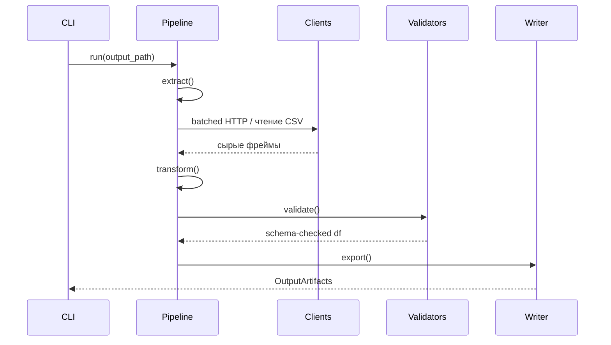

# pipelines-contracts

## Каталог ChEMBL пайплайнов

**Для детального описания каждого ChEMBL-пайплайна, включая его CLI-команду, конфигурацию, эндпоинт и примеры запуска, обратитесь к основному каталогу:**

- **[ChEMBL Pipelines Catalog](./10-chembl-pipelines-catalog.md)**

---

## стандартный-интерфейс

| Метод | Вход | Выход | Обязательные поля | Побочные артефакты |
| --- | --- | --- | --- | --- |
| `extract()` | CSV/идентификаторы, runtime `limit` | DataFrame сырых записей | Идентификаторы сущности | `stage_context`, статистика времени |
| `transform()` | DataFrame после extract | Нормализованный DataFrame | Зависит от пайплайна | Доп. таблицы, QC-метрики |
| `validate()` | Нормализованный DataFrame | DataFrame, прошедший Pandera | Порядок колонок `schema_registry` | `validation_issues` |
| `export()` | Проверенный DataFrame, `output_path` | `OutputArtifacts` (csv/json/qc) | Колонки из `determinism.column_order` | QC-отчёты, метаданные |
| `run()` | `output_path`, `extended` флаг | `OutputArtifacts` | Все вышеперечисленные | Время стадий, debug JSON |

`PipelineBase` гарантирует детерминированные столбцы, сортировку и фиксацию
времени стадий. Ошибки Pandera уровня `error` MUST прерывать выполнение.[ref: repo:src/bioetl/pipelines/base.py@test_refactoring_32]

## жизненный-цикл-пайплайна



## пайплайны-по-умолчанию

### activity-pipeline

- `extract()` считывает `activity.csv` или путь CLI и подтягивает детали по
  списку `activity_id` через `ActivityChEMBLClient`.[ref: repo:src/bioetl/pipelines/chembl_activity.py@test_refactoring_32]

- `transform()` нормализует числовые поля, переводит пустые значения и собирает
  fallback-метрики.[ref: repo:src/bioetl/transform/adapters/chembl_activity.py@test_refactoring_32]

- `validate()` использует `ActivitySchema` и при необходимости добавляет
  отсутствующие колонки согласно `determinism.column_order`.[ref: repo:src/bioetl/pipelines/chembl_activity.py@test_refactoring_32]

- `export()` пишет CSV и JSON debug при `extended`, добавляя QC (`duplicates`,
  `null_rate`).[ref: repo:src/bioetl/core/output_writer.py@test_refactoring_32]

Пример минимальной конфигурации:

```yaml
extends:
  - ../base.yaml
  - ../includes/determinism.yaml
  - ../includes/chembl_source.yaml

pipeline:
  name: activity
  entity: activity
sources:
  chembl:
    batch_size: 20
```

[ref: repo:src/bioetl/configs/pipelines/chembl/activity.yaml@test_refactoring_32]

### document-pipeline

- `extract()` валидирует `document_chembl_id`, вызывает ChEMBL и при режиме
  `all` запускает внешние адаптеры PubMed, Crossref, OpenAlex, Semantic Scholar.[ref: repo:src/bioetl/sources/chembl/document/pipeline.py@test_refactoring_32]

- `transform()` объединяет ответы, применяет приоритеты (`merge_with_precedence`)
  и нормализует DOI/PMID.[ref: repo:src/bioetl/sources/chembl/document/merge/policy.py@test_refactoring_32]

- `validate()` сначала проверяет сырые данные по `DocumentRawSchema`, затем
  нормализованный фрейм по `DocumentNormalizedSchema`.[ref: repo:src/bioetl/sources/chembl/document/pipeline.py@test_refactoring_32]

- `export()` сохраняет основную таблицу и QC-файлы (`qc_missing_mappings.csv`,
  `qc_enrichment_metrics.csv`) через `OutputWriter`.[ref: repo:src/bioetl/core/output_writer.py@test_refactoring_32]

Минимальная конфигурация с внешними адаптерами:

```yaml
extends:
  - ../base.yaml
  - ../includes/determinism.yaml
  - ../includes/chembl_source.yaml

pipeline:
  name: document
  entity: document
sources:
  pubmed:
    base_url: "<https://eutils.ncbi.nlm.nih.gov/entrez/eutils>"
    tool: "${PUBMED_TOOL}"
    email: "${PUBMED_EMAIL}"
  crossref:
    base_url: "<https://api.crossref.org>"
    mailto: "${CROSSREF_MAILTO}"
```

[ref: repo:src/bioetl/configs/pipelines/chembl/document.yaml@test_refactoring_32]

### target-pipeline

- `extract()` получает таргеты из ChEMBL и готовит идентификаторы для UniProt.
  Клиенты регистрируются в `PipelineBase` для корректного закрытия.[ref: repo:src/bioetl/sources/chembl/target/pipeline.py@test_refactoring_32]

- `transform()` делегирует enrichment `TargetEnricher`, который
  подтягивает UniProt и IUPHAR данные, строит классификации и QC метрики.[ref: repo:src/bioetl/sources/chembl/target/normalizer/enrichment.py@test_refactoring_32]

- `validate()` применяет Pandera-схему для `TargetSchema` и проверяет согласованность
  колонок со слоями materialization.[ref: repo:src/bioetl/sources/chembl/target/pipeline.py@test_refactoring_32]

- `export()` сохраняет несколько датасетов (`targets_final`, `target_components`,
  `protein_class`) через `MaterializationManager`.[ref: repo:src/bioetl/core/materialization.py@test_refactoring_32]

Выдержка из конфигурации с отключаемыми стадиями:

```yaml
sources:
  chembl:
    stage: primary
  uniprot:
    enabled: true
    stage: enrichment
  iuphar:
    enabled: true
    stage: enrichment
materialization:
  pipeline_subdir: "target"
  stages:
    gold:
      datasets:
        targets:
          formats:
            parquet: "targets_final.parquet"
```

[ref: repo:src/bioetl/configs/pipelines/chembl/target.yaml@test_refactoring_32]

### pubchem-pipeline

- `extract()` принимает InChIKey из входного CSV и для каждого lookup вызывает

  `PubChemRequestBuilder` для CID и свойств.[ref: repo:src/bioetl/sources/pubchem/pipeline.py@test_refactoring_32]

- `transform()` объединяет свойства, синонимы и registry ID, нормализует типы и

  сортирует поля.[ref: repo:src/bioetl/sources/pubchem/normalizer/pubchem_normalizer.py@test_refactoring_32]

- `validate()` использует Pandera схему для обогащения и проверяет наличие CID.[ref: repo:src/bioetl/sources/pubchem/schema/pubchem_schema.py@test_refactoring_32]
- `export()` пишет CSV и QC-отчёт о полноте CID/свойств.[ref: repo:src/bioetl/core/output_writer.py@test_refactoring_32]

### gtp-iuphar-pipeline

- `extract()` использует `PageNumberPaginator` для `/targets` и `/targets/families`,

  собирая `stage_context` для энрихмента.[ref: repo:src/bioetl/sources/iuphar/pipeline.py@test_refactoring_32]

- `transform()` вызывает `IupharService.enrich_targets`, формирует главную таблицу

  и дополнительные (`classification`, `gold`).[ref: repo:src/bioetl/sources/iuphar/service.py@test_refactoring_32]

- `validate()` проверяет схему `IupharTargetSchema` и добавляет `iuphar_target_id`.
- `export()` сохраняет базовый датасет + дополнительные таблицы через

  `MaterializationManager`.[ref: repo:src/bioetl/sources/iuphar/pipeline.py@test_refactoring_32]

### testitem-пайплайн

- `extract()` подтягивает molecule ID из CSV и ChEMBL, затем вызывает PubChem

  для актуальных CID.[ref: repo:src/bioetl/sources/chembl/testitem/pipeline.py@test_refactoring_32]

- `transform()` нормализует синонимы, родитель/соль и формирует бизнес ключи.[ref: repo:src/bioetl/sources/chembl/testitem/normalizer/dataframe.py@test_refactoring_32]
- `validate()` применяет `TestItemSchema`; коллизии помечаются в QC.
- `export()` создаёт deterministic CSV и QC отчёт по совпадениям.[ref: repo:src/bioetl/core/output_writer.py@test_refactoring_32]

### document-enrichment-modes

Режим CLI `--mode=chembl` отключает внешние адаптеры, `--mode=all` включает их.
Валидация проверяет наличие хотя бы одного идентификатора (`doi` или `pmid`).[ref: repo:src/bioetl/sources/chembl/document/pipeline.py@test_refactoring_32]

## требования-к-io

- Все пайплайны MUST принимать входные CSV в кодировке UTF-8 и с заголовком.
- Выходные CSV детерминированно отсортированы и используют `,` как разделитель.
- Параметр `--extended` SHOULD включать запись доп. таблиц и debug JSON, если

  пайплайн поддерживает расширенную материализацию.
