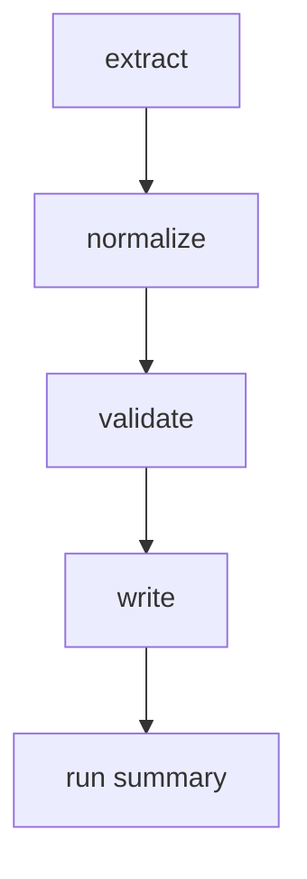

# Публичные контракты пайплайнов

## lifecycle

```mermaid
flowchart TD
    A[extract] --> B[normalize]
    B --> C[validate]
    C --> D[write]
    D --> E[run summary]
```

- Базовый класс `PipelineBase` определяет шаги `extract`, `transform` (нормализация), `validate`, `export`, `run` ([ref: repo:src/bioetl/pipelines/base.py@test_refactoring_32]).
- Каждый шаг **MUST** возвращать `pd.DataFrame` с детерминированным порядком столбцов.
- `run()` **MUST** формировать `meta.yaml` и QC-артефакты через `UnifiedOutputWriter` ([ref: repo:src/bioetl/core/output_writer.py@test_refactoring_32]).

## шаги

| Шаг | Контракт | Инварианты |
| --- | --- | --- |
| `extract(input_file: Path | None)` | Читает CSV/Parquet или вызывает внешнее API | Лимиты и пагинация регулируются конфигом (`sources.*`). Request-ID **MUST** логироваться ([ref: repo:src/bioetl/sources/common/request.py@test_refactoring_32]). |
| `transform(df: DataFrame)` | Нормализация и обогащение | Должна сохранять бизнес-ключ, приводить идентификаторы к канону. |
| `validate(df: DataFrame)` | Валидация Pandera + QC | Схемы берутся из `schema_registry`; ошибки с уровнем ≥ configured threshold прерывают run. |
| `export(df: DataFrame, output_dir: Path, extended: bool)` | Детерминированная запись | `write_dataset` обеспечивает атомарный `os.replace`, формирует `meta.yaml`, QC sidecar. |
| `run(...)` | Оркестрация и отчёт | Возвращает `RunResult` с путями артефактов и метриками.

## контракты-по-пайплайнам

### activity

- Класс: `ActivityPipeline` ([ref: repo:src/bioetl/sources/chembl/activity/pipeline.py@test_refactoring_32]).
- Схема: `ActivitySchema` ([ref: repo:src/bioetl/schemas/activity.py@test_refactoring_32]).
- Вход: CSV `data/input/activity.csv` с колонкой `activity_id` (используется для вызова API ChEMBL).
- Бизнес-ключ: `activity_id`.
- Выход: `data/output/activity/dataset.csv` + QC (`quality_report.csv`, `meta.yaml`).
- Особенности: поддержка fallback-записей (`FallbackRecordBuilder`), жёсткий контроль метрик `fallback.count` / `fallback.rate`.

### assay

- Класс: `AssayPipeline` ([ref: repo:src/bioetl/sources/chembl/assay/pipeline.py@test_refactoring_32]).
- Схема: `AssaySchema` ([ref: repo:src/bioetl/schemas/assay.py@test_refactoring_32]).
- Вход: `data/input/assay.csv` (идентификаторы ассайев).
- Бизнес-ключ: `assay_chembl_id`.
- Обогащение: BAO-онтология через нормализатор (`assay.normalizer`).
- Выход: `data/output/assay`.

### target

- Класс: `TargetPipeline` ([ref: repo:src/bioetl/sources/chembl/target/pipeline.py@test_refactoring_32]).
- Схемы: `TargetSchema`, `TargetComponentSchema`, `TargetProteinClassSchema` ([ref: repo:src/bioetl/schemas/target.py@test_refactoring_32]).
- Вход: `data/input/target.csv` (список target_chembl_id).
- Обогащение: UniProt ([ref: repo:src/bioetl/sources/uniprot/pipeline.py@test_refactoring_32]), IUPHAR ([ref: repo:src/bioetl/sources/iuphar/pipeline.py@test_refactoring_32]).
- Бизнес-ключ: `target_chembl_id`.
- Запись: несколько датасетов (`targets`, `target_components`, `protein_class`) согласно материализации в `base.yaml`.

### testitem

- Класс: `TestItemPipeline` ([ref: repo:src/bioetl/sources/chembl/testitem/pipeline.py@test_refactoring_32]).
- Схема: `TestItemSchema` ([ref: repo:src/bioetl/schemas/testitem.py@test_refactoring_32]).
- Вход: `data/input/testitem.csv` (`molecule_chembl_id`).
- Обогащение: PubChem через `TestItemPubChemEnricher` ([ref: repo:src/bioetl/sources/pubchem/pipeline.py@test_refactoring_32]).
- Бизнес-ключ: `molecule_chembl_id`.
- Особенности: дедупликация с учётом связей `parent`/`salt` и контроль катион/анион.

### document

- Класс: `DocumentPipeline` ([ref: repo:src/bioetl/sources/chembl/document/pipeline.py@test_refactoring_32]).
- Схемы: `DocumentSchema`, вспомогательные таблицы авторов/ключевых слов ([ref: repo:src/bioetl/schemas/document.py@test_refactoring_32]).
- Вход: `data/input/document.csv` (список `document_chembl_id`).
- Обогащения:
  - PubMed (`pubmed.pipeline`)
  - Crossref (`crossref.pipeline`)
  - OpenAlex (`openalex.pipeline`)
  - Semantic Scholar (`semantic_scholar.pipeline`)
- Бизнес-ключ: `document_chembl_id`; при отсутствии – совокупность (`doi_clean`, `pmid`).
- Конфликты разрешаются стратегиями из модуля merge ([ref: repo:src/bioetl/sources/chembl/document/merge/__init__.py@test_refactoring_32]).

### pubchem

- Класс: `PubChemPipeline` ([ref: repo:src/bioetl/sources/pubchem/pipeline.py@test_refactoring_32]).
- Вход: `data/input/pubchem_lookup.csv` (CID/SID).
- Используется для автономного обогащения атрибутов молекул.

### gtp_iuphar

- Класс: `GtpIupharPipeline` ([ref: repo:src/bioetl/sources/iuphar/pipeline.py@test_refactoring_32]).
- Формирует классификации для мишеней; бизнес-ключи мапятся на UniProt accession.

### uniprot

- Класс: `UniProtPipeline` ([ref: repo:src/bioetl/sources/uniprot/pipeline.py@test_refactoring_32]).
- Получает аннотации белков, используется как вспомогательный источник для таргетов.

## требования-к-I/O

- Столбцы **MUST** сортироваться согласно `determinism.column_order` конфигурации пайплайна.
- Данные **MUST** быть отсортированы по бизнес-ключу, указанному в `determinism.sort.by`.
- Дополнительные артефакты (`qc/*`) **MUST** присутствовать, если `extended=true` или конфиг явно включает связь (`postprocess.qc`).
- В случае пустого результата `extract` шаг обязан вернуть DataFrame с корректными столбцами (см. защитные ветки в `ActivityPipeline.extract`).

## связь-с-конфигами

- Материализация датасетов и дополнительные форматы задаются в `materialization` конфигурации (см. [ref: repo:src/bioetl/configs/base.yaml@test_refactoring_32]).
- `PipelineMetadata` фиксирует версию контракта; изменение структуры **MUST** сопровождаться увеличением `pipeline.version` в YAML.

