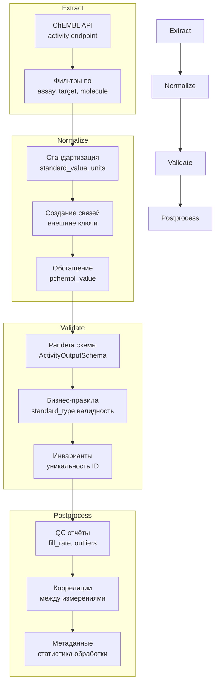
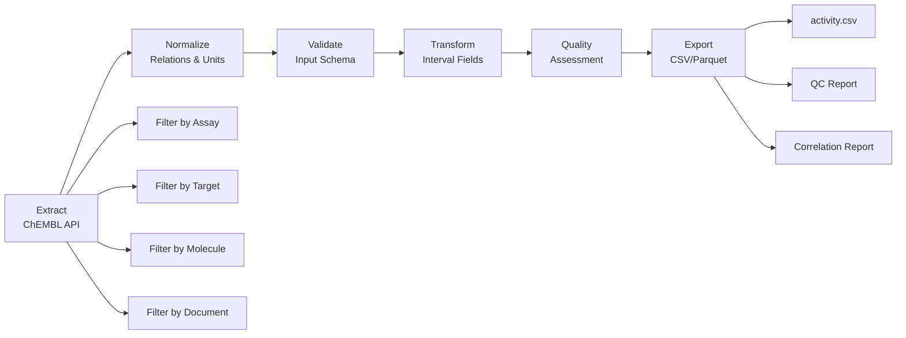

# Пайплайн Activities

## 1. Назначение и границы

### Что делает пайплайн

Пайплайн Activities извлекает и обрабатывает данные о биологической активности соединений из ChEMBL, создавая стандартизированную и валидированную базу данных для анализа структура-активность (SAR) и разработки лекарств.

### Входы и выходы

**Входы:**

- ChEMBL API endpoint `/activity` с фильтрами по assay, target, molecule, document
- CSV файлы с фильтрами (опционально): `assay_ids.csv`, `target_ids.csv`, `molecule_ids.csv`

**Выходы:**

- `activity_<date>.csv` — нормализованные данные активности
- `activity_<date>_meta.yaml` — метаданные о процессе обработки
- `activity_<date>_qc.csv` — отчёт о качестве данных
- `activity_<date>_correlation_report/` — корреляционный анализ

### Место в общей архитектуре

Activities является центральной фактовой таблицей в star-schema архитектуре, связывающей измерения:
- `assay_dim` (через `assay_chembl_id`)
- `target_dim` (через `target_chembl_id`) 
- `testitem_dim` (через `molecule_chembl_id`)
- `document_dim` (через `document_chembl_id`)

## 2. Источники данных и маппинги

### Таблица источников

| Источник | Обязательность | API Endpoint | Rate Limits | Основные поля |
|----------|----------------|--------------|-------------|---------------|
| **ChEMBL** | Обязательный | `/activity` | 3 req/15s | `activity_chembl_id`, `standard_value`, `standard_type`, `standard_units` |

## 3. Граф ETL



### Маппинг полей по источникам

**Обязательные поля (ChEMBL):**
- `activity_chembl_id` → первичный ключ
- `standard_value` → значение активности (IC50, Ki, etc.)
- `standard_type` → тип активности
- `standard_units` → единицы измерения
- `standard_relation` → отношение (=, <, >, etc.)

**Внешние ключи:**
- `assay_chembl_id` → связь с assay_dim
- `target_chembl_id` → связь с target_dim
- `molecule_chembl_id` → связь с testitem_dim
- `document_chembl_id` → связь с document_dim

**Дополнительные поля:**
- `published_*` → оригинальные опубликованные значения
- `pchembl_value` → логарифмическое значение активности
- `data_validity_comment` → комментарии о валидности данных
- `activity_comment` → комментарии активности
- `bao_*` → BioAssay Ontology атрибуты

### Политика graceful degradation

При недоступности ChEMBL API система логирует ошибки и предоставляет fallback данные с информацией об ошибках.

## 3. Граф ETL



## 4. Схемы данных

### Входная схема (RawBioactivitySchema)

| Поле | Тип | Nullable | Описание |
|------|-----|----------|----------|
| `activity_chembl_id` | str | ❌ | Идентификатор активности ChEMBL |
| `assay_chembl_id` | str | ✅ | Идентификатор ассея ChEMBL |
| `molecule_chembl_id` | str | ✅ | Идентификатор молекулы ChEMBL |
| `target_chembl_id` | str | ✅ | Идентификатор мишени ChEMBL |
| `document_chembl_id` | str | ✅ | Идентификатор документа ChEMBL |
| `published_type` | str | ✅ | Опубликованный тип активности |
| `published_relation` | str | ✅ | Опубликованное отношение |
| `published_value` | float | ✅ | Опубликованное значение |
| `published_units` | str | ✅ | Опубликованные единицы |
| `standard_type` | str | ✅ | Стандартизованный тип |
| `standard_relation` | str | ✅ | Стандартизованное отношение |
| `standard_value` | float | ✅ | Стандартизованное значение |
| `standard_units` | str | ✅ | Стандартизованные единицы |
| `standard_flag` | bool | ✅ | Флаг стандартизации |
| `pchembl_value` | float | ✅ | pChEMBL значение |
| `data_validity_comment` | str | ✅ | Комментарий валидности |
| `activity_comment` | str | ✅ | Комментарий активности |
| `bao_endpoint` | str | ✅ | BAO endpoint |
| `bao_format` | str | ✅ | BAO format |
| `bao_label` | str | ✅ | BAO label |

### Выходная схема (NormalizedBioactivitySchema)

**Исходные поля** + **Нормализованные поля:**

| Группа полей | Примеры | Описание |
|--------------|---------|----------|
| **Интервальные поля** | `lower_bound`, `upper_bound`, `is_censored` | Представление цензурированных данных |
| **Внешние ключи** | `assay_key`, `target_key`, `document_key`, `testitem_key` | Связи с измерениями |
| **Качество** | `quality_flag`, `quality_reason` | Оценка качества данных |

### Политика NA

- **Строки:** пустая строка `""`
- **Числа:** `None`
- **Булевы:** `None`
- **Даты:** `None`

## 5. Конфигурация

### Пример configs/config_activity_full.yaml

```yaml
# HTTP настройки
http:
  global:
    timeout_sec: 60.0
    retries:
      total: 5
      backoff_multiplier: 3.0
      rate_limit:
        max_calls: 3
        period: 15.0

# Источник данных
sources:
  chembl:
    name: chembl
    endpoint: activity
    params:
      format: json
    pagination:
      page_param: offset
      size_param: limit
      size: 1000
      max_size: 1000
      max_pages: null
    http:
      base_url: https://www.ebi.ac.uk/chembl/api/data
      timeout_sec: 60.0
      headers:
        Authorization: "Bearer {chembl_api_token}"

# Настройки ввода-вывода
io:
  input:
    assay_ids_csv: data/input/assay_ids_example.csv
    molecule_ids_csv: data/input/testitem_keys_example.csv
    target_ids_csv: data/input/target_ids_example.csv
  output:
    dir: data/output/activity
    format: csv
    csv:
      encoding: utf-8
      float_format: "%.6f"
      date_format: "%Y-%m-%dT%H:%M:%SZ"
  cache:
    raw_dir: data/cache/activity/raw
    enabled: true

# Настройки выполнения
runtime:
  workers: 4
  batch_size: 1000
  limit: null
  dry_run: false

# Валидация
validation:
  strict: true
  qc:
    max_missing_fraction: 0.02
    max_duplicate_fraction: 0.005
    min_foreign_key_coverage: 0.95

# Нормализация
normalization:
  relation_mapping:
    "=":
      lower_bound: "standard_value"
      upper_bound: "standard_value"
      is_censored: false
    ">=":
      lower_bound: "standard_value"
      upper_bound: null
      is_censored: true
    ">":
      lower_bound: "standard_value"
      upper_bound: null
      is_censored: true
    "<=":
      lower_bound: null
      upper_bound: "standard_value"
      is_censored: true
    "<":
      lower_bound: null
      upper_bound: "standard_value"
      is_censored: true
  strict_activity_types:
    - IC50
    - Ki
  rejected_activity_comments:
    - inconclusive
    - undetermined
    - unevaluated

# Профили качества
quality_profiles:
  strict:
    enabled: true
    required_fields:
      - assay_chembl_id
      - testitem_chembl_id
      - standard_type
      - standard_relation
      - standard_value
    allowed_activity_types: "strict_activity_types"
    allowed_relations:
      - "="
    required_data_validity_comment: null
    rejected_activity_comments: "rejected_activity_comments"
  
  moderate:
    enabled: true
    required_fields:
      - standard_type
      - standard_value
    allow_unknown_types: true
    allow_unknown_relations: true
    allowed_data_validity_warnings:
      - "Manually curated"
      - "Potential false positive"
```

### Переменные окружения

```bash
# API ключи (опционально)
CHEMBL_API_TOKEN=your_chembl_token_here

# Конфигурация
ENV=development
LOG_LEVEL=INFO
```

### Настройки кэша

- **Кэш HTTP:** автоматическое кэширование ответов ChEMBL API
- **Кэш нормализации:** сохранение результатов нормализации отношений
- **Кэш валидации:** кэширование результатов валидации полей

## 6. Валидация

### Pandera схемы

```python
from library.schemas.input_schema import RawBioactivitySchema
from library.schemas.output_schema import NormalizedBioactivitySchema
from library.activity.validate import ActivityValidator

# Валидация входных данных
input_schema = RawBioactivitySchema()
validated_input = input_schema.validate(df_input)

# Валидация выходных данных
output_schema = NormalizedBioactivitySchema()
validated_output = output_schema.validate(df_output)

# Валидация с профилями качества
validator = ActivityValidator(config)
strict_validated = validator.validate_strict_quality(df)
moderate_validated = validator.validate_moderate_quality(df)
```

### Инварианты

1. **Уникальность:** `activity_chembl_id` должен быть уникальным
2. **Положительные значения:** `standard_value` и `published_value` должны быть > 0
3. **Интервальная консистентность:** цензурированные записи должны иметь ровно одну границу
4. **Отношения:** `standard_relation` должен соответствовать интервальным полям
5. **pChEMBL диапазон:** `pchembl_value` должен быть в диапазоне 0-15

### Дедупликация

**Ключи дедупликации:**
1. `activity_chembl_id` (первичный ключ)

**Проверки дублей:**
- Дублирующиеся `activity_chembl_id`
- Одинаковые комбинации assay + molecule + target + document

## 7. Детерминизм

### Сортировка

```python
# Ключи сортировки
sort_columns = ['activity_chembl_id', 'assay_chembl_id', 'testitem_chembl_id']
sort_ascending = [True, True, True]
na_position = 'last'
```

### Формат float

```python
float_format = "%.6f"  # 6 знаков после запятой для точности
```

### Порядок колонок

Фиксированный порядок определён в `config.determinism.column_order`:

1. Основные идентификаторы (`activity_chembl_id`, `assay_chembl_id`, `target_chembl_id`, `document_chembl_id`)
2. Опубликованные значения (`published_type`, `published_relation`, `published_value`, `published_units`)
3. Стандартизованные значения (`standard_type`, `standard_relation`, `standard_value`, `standard_units`, `standard_flag`)
4. Интервальные поля (`lower_bound`, `upper_bound`, `is_censored`)
5. Дополнительные поля (`pchembl_value`, `data_validity_comment`, `activity_comment`)
6. BAO атрибуты (`bao_endpoint`, `bao_format`, `bao_label`)
7. Метаданные (`retrieved_at`, `quality_flag`, `quality_reason`)

### Локаль и таймзона

- **Локаль:** `en_US.UTF-8`
- **Таймзона:** `UTC`
- **Формат дат:** ISO 8601 (`%Y-%m-%dT%H:%M:%SZ`)

## 8. CLI/Make команды

### Стандартизованные цели

```bash
# Извлечение данных
make activities-extract

# Нормализация
make activities-normalize

# Валидация
make activities-validate

# Постпроцессинг
make activities-postprocess

# Полный пайплайн
make activities-all
```

### CLI команды

```bash
# Базовый запуск
python scripts/get_activity_data.py --config configs/config_activity_full.yaml

# С фильтрами по ассеям
python scripts/get_activity_data.py \
  --config configs/config_activity_full.yaml \
  --assay-ids data/input/assay_ids.csv

# С фильтрами по мишеням
python scripts/get_activity_data.py \
  --config configs/config_activity_full.yaml \
  --target-ids data/input/target_ids.csv

# С фильтрами по молекулам
python scripts/get_activity_data.py \
  --config configs/config_activity_full.yaml \
  --molecule-ids data/input/molecule_ids.csv

# С ограничением количества записей
python scripts/get_activity_data.py \
  --config configs/config_activity_full.yaml \
  --limit 10000

# Тестовый запуск
python scripts/get_activity_data.py \
  --config configs/config_activity_full.yaml \
  --dry-run
```

### Параметры командной строки

| Параметр | Описание | По умолчанию |
|----------|----------|--------------|
| `--config` | Путь к конфигурации | Обязательный |
| `--assay-ids` | CSV с ID ассеев для фильтрации | `None` |
| `--target-ids` | CSV с ID мишеней для фильтрации | `None` |
| `--molecule-ids` | CSV с ID молекул для фильтрации | `None` |
| `--document-ids` | CSV с ID документов для фильтрации | `None` |
| `--limit` | Ограничение количества записей | `None` |
| `--dry-run` | Тестовый запуск без записи | `False` |
| `--output` | Директория вывода | `data/output/activity` |
| `--format` | Формат вывода (csv/parquet) | `csv` |

## 9. Артефакты

### Куда пишем файлы

```
data/output/activity/
├── activity_20250121.csv                    # Основной файл с данными
├── activity_20250121.parquet                # Эталонный формат
├── activity_20250121_meta.yaml              # Метаданные процесса
├── activity_20250121_qc.csv                 # QC отчёт
└── activity_20250121_correlation_report/    # Корреляционный анализ
    ├── correlation_summary.csv
    ├── categorical_cramers_v.csv
    └── correlation_insights.json
```

### Формат имён файлов

```python
# Шаблон имени файла
filename_template = "{entity}_{date_tag}.{extension}"

# Примеры
activity_20250121.csv
activity_20250121_meta.yaml
activity_20250121_qc.csv
```

### meta.yaml структура

```yaml
pipeline: activity
version: "0.1.0"
run_id: "run_20250121_103045_abc123"
started_at: "2025-01-21T10:30:45Z"
completed_at: "2025-01-21T10:45:30Z"
duration_seconds: 885

input:
  source: "ChEMBL API"
  endpoint: "/activity"
  filters:
    assay_ids: 1000
    target_ids: 500
    molecule_ids: 2000
    document_ids: 800

output:
  file: "data/output/activity/activity_20250121.csv"
  rows: 50000
  columns: 25

quality:
  fill_rate: 0.98
  duplicate_rate: 0.001
  validation_errors: 5
  qc_status: "PASS"
  foreign_key_coverage:
    assay_key: 0.98
    target_key: 0.95
    document_key: 0.97
    testitem_key: 0.99

profiles:
  strict:
    rows: 45000
    percentage: 90.0
  moderate:
    rows: 48000
    percentage: 96.0
```

### Отчёты в metadata/

- `metadata/manifests/quality_manifest.json` — манифест качества данных
- `metadata/manifests/cleanup_manifest.json` — манифест очистки данных
- `metadata/reports/config_audit.csv` — аудит конфигурации

## 10. Контроль качества

### Чек-лист QC

**Обязательные проверки:**
- [ ] Все тесты проходят
- [ ] Линтеры не выдают ошибок
- [ ] Документация обновлена
- [ ] meta.yaml корректен

**Проверки качества данных:**
- [ ] Fill rate >= 98%
- [ ] Дубликаты <= 0.1%
- [ ] Внешние ключи покрытие >= 95%
- [ ] Валидация схемы прошла успешно

**Детерминизм:**
- [ ] Повторный запуск даёт тот же CSV (байтово)
- [ ] Имена файлов стабильны
- [ ] Порядок колонок фиксирован

**Отчётность:**
- [ ] QC отчёты сгенерированы
- [ ] Корреляционные отчёты присутствуют
- [ ] Логи структурированы

### Ожидаемые инварианты

1. **Количество записей:** выходные записи ≤ входные записи (из-за фильтрации)
2. **Уникальность:** все `activity_chembl_id` уникальны
3. **Положительные значения:** все значения активности > 0
4. **Интервальная консистентность:** цензурированные записи имеют ровно одну границу
5. **Внешние ключи:** покрытие связей с измерениями >= 95%

### Метрики качества

```python
qc_metrics = {
    "row_count": 50000,
    "fill_rate": 0.98,
    "duplicate_rate": 0.001,
    "validation_errors": 5,
    "foreign_key_coverage": {
        "assay_key": 0.98,
        "target_key": 0.95,
        "document_key": 0.97,
        "testitem_key": 0.99
    },
    "quality_profiles": {
        "strict": 45000,
        "moderate": 48000
    },
    "censoring_distribution": {
        "censored": 0.15,
        "non_censored": 0.85
    },
    "qc_status": "PASS"
}
```

## 11. Ограничения и типичные ошибки

### Rate limits API

| API | Лимит | Период | Решение |
|-----|-------|--------|---------|
| ChEMBL | 3 запроса | 15 секунд | Экспоненциальная задержка |

### Таймауты

- **ChEMBL:** 60 секунд (стандартные запросы)
- **Пакетная обработка:** 1000 записей за раз

### Типовые фейлы и решения

**1. HTTP 429 (Too Many Requests)**
```python
# Решение: экспоненциальная задержка
backoff_multiplier = 3.0
total_retries = 5
```

**2. HTTP 500 (Internal Server Error)**
```python
# Решение: graceful degradation
if chembl_error:
    log_warning("ChEMBL API unavailable, using cached data")
    use_cached_data()
```

**3. Валидация схемы Pandera**
```python
# Решение: детальное логирование ошибок
try:
    validated_df = schema.validate(df)
except pa.errors.SchemaError as e:
    log_error(f"Schema validation failed: {e}")
    if strict_mode:
        raise
    else:
        continue_with_warnings()
```

**4. Проблемы с интервальными полями**
```python
# Решение: валидация консистентности
def validate_interval_consistency(df):
    censored = df['is_censored'] == True
    non_censored = df['is_censored'] == False
    
    # Цензурированные должны иметь ровно одну границу
    assert censored.sum() == (df[censored]['lower_bound'].notna() ^ 
                             df[censored]['upper_bound'].notna()).sum()
    
    # Нецензурированные должны иметь обе границы
    assert (df[non_censored]['lower_bound'].notna() & 
            df[non_censored]['upper_bound'].notna()).all()
```

**5. Проблемы с памятью**
```python
# Решение: пакетная обработка
batch_size = 1000
for batch in pd.read_csv(file, chunksize=batch_size):
    process_batch(batch)
```

**6. Недоступность API ключей**
```python
# Решение: работа без ключей с ограничениями
if not api_key:
    log_warning("API key not provided, using rate-limited access")
    use_rate_limited_access()
```

### Рекомендации по мониторингу

1. **Мониторинг API статуса:** проверка доступности ChEMBL
2. **Мониторинг rate limits:** отслеживание использования квот
3. **Мониторинг качества данных:** регулярные QC проверки
4. **Мониторинг производительности:** время выполнения этапов
5. **Мониторинг ошибок:** агрегация и анализ ошибок
6. **Мониторинг профилей качества:** отслеживание распределения по профилям

## 12. Детерминизм

### Сортировка данных

```python
# Детерминированная сортировка по составному ключу
df_sorted = df.sort_values([
    'activity_chembl_id',
    'assay_chembl_id',
    'molecule_chembl_id'
], na_position='last')
```

### Формат чисел

```python
# Стандартизация числовых полей
df['activity_chembl_id'] = df['activity_chembl_id'].astype('string')
df['standard_value'] = df['standard_value'].astype('float64')
df['pchembl_value'] = df['pchembl_value'].astype('float64')
```

### Порядок колонок

```python
# Фиксированный порядок колонок в выходном CSV
column_order = [
    'activity_chembl_id',
    'assay_chembl_id',
    'target_chembl_id',
    'molecule_chembl_id',
    'document_chembl_id',
    'standard_value',
    'standard_type',
    'standard_units',
    'standard_relation',
    'pchembl_value',
    'is_censored',
    'lower_bound',
    'upper_bound'
]
df_output = df[column_order]
```

### Временные зоны

```python
# Все временные метки в UTC
from datetime import datetime, timezone
timestamp = datetime.now(timezone.utc).isoformat()
```

## 13. Запуск

### CLI команды

```bash
# Полный запуск пайплайна
make run ENTITY=activities CONFIG=configs/config_activity_full.yaml

# Через CLI напрямую
bioactivity-data-acquisition pipeline --config configs/config_activity_full.yaml

# Тестовый запуск с ограниченными данными
make run ENTITY=activities CONFIG=configs/config_test.yaml
```

### Docker/Compose

```bash
# Запуск в Docker контейнере
docker-compose run --rm bioactivity-pipeline activities

# Или через Makefile
make docker-run ENTITY=activities CONFIG=configs/config_activity_full.yaml
```

### Ожидаемые артефакты

После успешного выполнения в `data/output/activity_YYYYMMDD/`:

```
activity_20241201/
├── activity_20241201.csv                    # Основные данные активностей
├── activity_20241201_meta.yaml             # Метаданные пайплайна
├── activity_20241201_qc.csv                # QC отчёт
└── activity_correlation_report_20241201/   # Корреляционный анализ
    ├── correlation_matrix.csv
    ├── source_comparison.csv
    └── quality_metrics.csv
```

## 14. QC чек-лист

### Перед запуском

- [ ] Проверить наличие связанных данных (assays, targets, testitems, documents)
- [ ] Убедиться в корректности конфигурации `configs/config_activity_full.yaml`
- [ ] Проверить доступность ChEMBL API
- [ ] Настроить фильтры по необходимости (assay_ids, target_ids, molecule_ids)

### После выполнения

- [ ] Проверить количество записей в выходном файле
- [ ] Убедиться в отсутствии критических ошибок в QC отчёте
- [ ] Проверить fill rate для обязательных полей (≥80%)
- [ ] Убедиться в отсутствии дубликатов по `activity_chembl_id`
- [ ] Проверить корректность связей с измерениями

### Специфичные проверки для Activities

- [ ] Все `activity_chembl_id` уникальны
- [ ] `standard_value` в разумных пределах для каждого `standard_type`
- [ ] `standard_units` соответствуют `standard_type`
- [ ] `pchembl_value` рассчитан корректно
- [ ] Интервальные данные (`is_censored`) консистентны
- [ ] Связи с assays, targets, testitems, documents корректны

## 15. Ссылки

### Модули в src/

- **Основной пайплайн**: `src/library/activity/pipeline.py`
- **API клиенты**: `src/library/clients/chembl.py`
- **Схемы валидации**: `src/library/schemas/input_schema.py`, `src/library/schemas/output_schema.py`
- **ETL утилиты**: `src/library/etl/`

### Конфигурация

- **Основной конфиг**: `configs/config_activity_full.yaml`
- **Тестовый конфиг**: `configs/config_test.yaml`

### Тесты

- **Unit тесты**: `tests/test_activity_extraction.py`, `tests/test_activity_pipeline_smoke.py`
- **Интеграционные тесты**: `tests/integration/test_activity_pipeline.py`
- **Тестовые данные**: `tests/fixtures/activity.csv`
