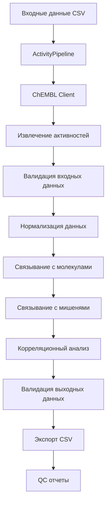

# Activity Pipeline

## Обзор

Activity Pipeline обрабатывает данные о биологической активности молекул, включая извлечение из ChEMBL, связывание с молекулами и мишенями, корреляционный анализ и генерацию QC отчетов.

## Назначение

**Основная цель**: Обработка и анализ данных о биологической активности для создания структурированных датасетов активности молекул против различных мишеней.

**Ключевые задачи**:
- Извлечение данных активностей из ChEMBL API
- Связывание активностей с молекулами и мишенями
- Корреляционный анализ между различными типами активностей
- Генерация QC отчетов о качестве данных активностей
- Детерминированный экспорт результатов

## Архитектура

### Основные компоненты



### Модули

**Расположение**: `src/library/activity/`

- `pipeline.py`: Основной класс пайплайна
- `config.py`: Конфигурация пайплайна
- `client.py`: ChEMBL API клиент
- `normalize.py`: Нормализация данных активностей
- `validate.py`: Валидация данных
- `quality.py`: QC анализ
- `writer.py`: Экспорт данных

## Конфигурация

### Базовые параметры

**Файл**: `configs/config_activity.yaml`

```yaml
version: "1.0.0"

sources:
  chembl:
    base_url: "https://www.ebi.ac.uk/chembl/api/data"
    timeout: 60
    retries: 5
    rate_limit: 10

io:
  input:
    data_path: "data/input/activities.csv"
  output:
    data_path: "data/output/activities_processed.csv"
    qc_report_path: "data/output/activities_qc_report.json"
    correlation_path: "data/output/activities_correlation.json"

transforms:
  enable_normalization: true
  enable_enrichment: true
  batch_size: 100

validation:
  enable_pandera_validation: true
  strict_mode: false
```

### Специфичные параметры активностей

```yaml
activity:
  correlation_analysis:
    enable_correlation_matrix: true
    correlation_method: "pearson"
    significance_threshold: 0.05
    min_sample_size: 10
  
  activity_types:
    include_types: ["IC50", "EC50", "Ki", "Kd", "AC50"]
    exclude_types: ["Potency"]
  
  value_ranges:
    min_value: 0.001
    max_value: 1000000
    unit_normalization: true
  
  quality_filters:
    min_confidence_score: 0.5
    exclude_inactive: false
    exclude_outliers: true
```

## Входные данные

### Формат входного CSV

**Обязательные поля**:
- `activity_id`: Уникальный идентификатор активности
- `assay_id`: Идентификатор эксперимента
- `molecule_id`: Идентификатор молекулы
- `target_id`: Идентификатор мишени
- `activity_value`: Значение активности
- `activity_type`: Тип активности (IC50, EC50, Ki и др.)
- `activity_units`: Единицы измерения

**Опциональные поля**:
- `activity_relation`: Отношение (=, <, >, <=, >=)
- `confidence_score`: Уровень уверенности
- `standard_type`: Стандартный тип
- `standard_relation`: Стандартное отношение
- `standard_value`: Стандартное значение
- `standard_units`: Стандартные единицы

### Пример входных данных

```csv
activity_id,assay_id,molecule_id,target_id,activity_value,activity_type,activity_units,activity_relation
CHEMBL123456,CHEMBL789012,CHEMBL345678,CHEMBL901234,1.234567,IC50,nM,=
CHEMBL123457,CHEMBL789013,CHEMBL345679,CHEMBL901235,2.345678,EC50,uM,<
CHEMBL123458,CHEMBL789014,CHEMBL345680,CHEMBL901236,3.456789,Ki,nM,=
```

## Процесс обработки

### 1. Извлечение данных

```python
def extract_activity_data(client: ChEMBLClient, config: ActivityConfig) -> pd.DataFrame:
    """Извлекает данные активностей из ChEMBL."""
    
    activities = []
    
    # Извлечение по батчам
    for batch in client.get_activity_batches(config.batch_size):
        activities.extend(batch)
    
    return pd.DataFrame(activities)
```

### 2. Валидация входных данных

```python
def validate_input_data(dataframe: pd.DataFrame) -> pd.DataFrame:
    """Валидирует входные данные активностей."""
    
    from library.schemas.activity_schema import ActivityInputSchema
    
    try:
        validated_df = ActivityInputSchema.validate(dataframe, lazy=True)
        return validated_df
    except pa.errors.SchemaError as e:
        logger.error(f"Ошибка валидации входных данных: {e}")
        raise
```

### 3. Нормализация данных

```python
def normalize_activity_data(dataframe: pd.DataFrame) -> pd.DataFrame:
    """Нормализует данные активностей."""
    
    normalized_df = dataframe.copy()
    
    # Нормализация значений активности
    normalized_df['activity_value'] = normalize_activity_values(
        normalized_df['activity_value'],
        normalized_df['activity_units']
    )
    
    # Нормализация единиц измерения
    normalized_df['activity_units'] = normalize_activity_units(
        normalized_df['activity_units']
    )
    
    # Нормализация типов активности
    normalized_df['activity_type'] = normalize_activity_types(
        normalized_df['activity_type']
    )
    
    return normalized_df
```

### 4. Связывание с молекулами

```python
def link_with_molecules(activities_df: pd.DataFrame, molecules_df: pd.DataFrame) -> pd.DataFrame:
    """Связывает активности с данными молекул."""
    
    linked_df = activities_df.merge(
        molecules_df[['molecule_id', 'molecule_name', 'molecule_smiles', 'molecular_weight']],
        on='molecule_id',
        how='left'
    )
    
    return linked_df
```

### 5. Связывание с мишенями

```python
def link_with_targets(activities_df: pd.DataFrame, targets_df: pd.DataFrame) -> pd.DataFrame:
    """Связывает активности с данными мишеней."""
    
    linked_df = activities_df.merge(
        targets_df[['target_id', 'target_name', 'target_type', 'uniprot_id']],
        on='target_id',
        how='left'
    )
    
    return linked_df
```

### 6. Корреляционный анализ

```python
def perform_correlation_analysis(dataframe: pd.DataFrame) -> dict:
    """Выполняет корреляционный анализ активностей."""
    
    # Группировка по типам активности
    activity_types = dataframe['activity_type'].unique()
    correlations = {}
    
    for activity_type in activity_types:
        type_data = dataframe[dataframe['activity_type'] == activity_type]
        
        if len(type_data) >= config.activity.correlation_analysis.min_sample_size:
            # Расчет корреляций с молекулярными свойствами
            molecular_properties = ['molecular_weight', 'logp', 'tpsa', 'heavy_atom_count']
            
            correlations[activity_type] = calculate_correlations(
                type_data['activity_value'],
                type_data[molecular_properties]
            )
    
    return correlations
```

## Выходные данные

### Структура выходного CSV

**Дополнительные поля**:
- `molecule_name`: Название молекулы
- `molecule_smiles`: SMILES структура
- `molecular_weight`: Молекулярный вес
- `target_name`: Название мишени
- `target_type`: Тип мишени
- `uniprot_id`: UniProt идентификатор
- `normalized_value`: Нормализованное значение активности
- `confidence_score`: Уровень уверенности

### QC отчеты

**Файл**: `data/output/activities_qc_report.json`

```json
{
  "pipeline_info": {
    "version": "1.0.0",
    "timestamp": "2024-01-15T10:30:00Z",
    "pipeline_type": "activity"
  },
  "data_overview": {
    "total_activities": 12345,
    "unique_molecules": 5678,
    "unique_targets": 234,
    "activity_types": 5
  },
  "completeness": {
    "overall_completeness": 0.95,
    "activity_value_completeness": 0.98,
    "molecule_linkage_completeness": 0.92,
    "target_linkage_completeness": 0.89
  },
  "activity_distribution": {
    "IC50": 4567,
    "EC50": 2345,
    "Ki": 1234,
    "Kd": 567,
    "AC50": 1232
  },
  "value_statistics": {
    "mean_ic50": 1234.56,
    "median_ic50": 567.89,
    "std_ic50": 2345.67,
    "min_value": 0.001,
    "max_value": 100000
  },
  "correlation_analysis": {
    "molecular_weight_correlation": 0.234,
    "logp_correlation": -0.123,
    "tpsa_correlation": 0.345
  }
}
```

### Корреляционные отчеты

**Файл**: `data/output/activities_correlation.json`

```json
{
  "correlation_matrix": {
    "activity_value": {
      "molecular_weight": 0.234,
      "logp": -0.123,
      "tpsa": 0.345,
      "heavy_atom_count": 0.456
    }
  },
  "significant_correlations": [
    {
      "variable1": "activity_value",
      "variable2": "molecular_weight",
      "correlation": 0.234,
      "p_value": 0.012,
      "activity_type": "IC50"
    }
  ],
  "correlation_insights": [
    "Положительная корреляция между активностью и молекулярным весом для IC50",
    "Отрицательная корреляция между активностью и липофильностью"
  ]
}
```

## Использование

### Запуск через CLI

```bash
# Базовый запуск
bioactivity-data-acquisition pipeline --config configs/config_activity.yaml

# С дополнительными параметрами
bioactivity-data-acquisition pipeline \
  --config configs/config_activity.yaml \
  --input data/input/activities.csv \
  --output data/output/activities_processed.csv \
  --log-level INFO
```

### Программный запуск

```python
from library.activity.pipeline import ActivityPipeline
from library.activity.config import ActivityConfig
from library.logging_setup import get_logger

# Загрузка конфигурации
config = ActivityConfig.from_file("configs/config_activity.yaml")

# Создание логгера
logger = get_logger("activity_pipeline")

# Создание и запуск пайплайна
pipeline = ActivityPipeline(config, logger)
output_path = pipeline.run()

print(f"Результаты сохранены в: {output_path}")
```

### Настройка параметров

```python
# Изменение параметров программно
config.activity.correlation_analysis.enable_correlation_matrix = True
config.activity.correlation_analysis.correlation_method = "spearman"
config.transforms.batch_size = 200

# Запуск с измененными параметрами
pipeline = ActivityPipeline(config, logger)
result = pipeline.run()
```

## Мониторинг и отладка

### Логирование

```python
# Структурированное логирование
logger.info("Starting activity pipeline",
           config_file="config_activity.yaml",
           batch_size=config.transforms.batch_size)

logger.info("Data extraction completed",
           rows_extracted=5000,
           sources=["chembl"])

logger.info("Correlation analysis completed",
           correlations_calculated=15,
           significant_correlations=3)

logger.info("Pipeline completed successfully",
           output_path=str(output_path),
           processing_time=45.2)
```

### Метрики производительности

```python
# Отслеживание метрик
metrics = {
    "rows_processed": len(processed_data),
    "processing_time_seconds": processing_time,
    "throughput_rows_per_second": len(processed_data) / processing_time,
    "memory_usage_mb": memory_usage,
    "api_requests": api_request_count,
    "validation_errors": validation_error_count
}

logger.info("Pipeline metrics", **metrics)
```

## Обработка ошибок

### Типичные ошибки

1. **Ошибки валидации данных**:
   - Некорректные значения активности
   - Отсутствующие обязательные поля
   - Неподдерживаемые типы активности

2. **Ошибки API**:
   - Превышение лимитов запросов
   - Таймауты соединения
   - Недоступность ChEMBL API

3. **Ошибки связывания**:
   - Отсутствующие молекулы
   - Отсутствующие мишени
   - Некорректные идентификаторы

### Стратегии восстановления

```python
def run_pipeline_with_error_handling(pipeline: ActivityPipeline):
    """Запускает пайплайн с обработкой ошибок."""
    
    try:
        return pipeline.run()
    except ValidationError as e:
        logger.error(f"Ошибка валидации: {e}")
        # Попытка исправления данных
        corrected_data = fix_validation_errors(e.failure_cases)
        return pipeline.run_with_corrected_data(corrected_data)
    except APIError as e:
        logger.error(f"Ошибка API: {e}")
        # Повторная попытка с экспоненциальной задержкой
        return pipeline.run_with_retry(max_retries=3)
    except Exception as e:
        logger.error(f"Неожиданная ошибка: {e}")
        raise
```

## Тестирование

### Unit тесты

```python
import pytest
from library.activity.pipeline import ActivityPipeline
from library.activity.config import ActivityConfig

def test_activity_pipeline():
    """Тест пайплайна активностей."""
    
    # Создание тестовой конфигурации
    config = ActivityConfig(
        sources={"chembl": {"base_url": "test_url"}},
        io={"input": {"data_path": "test_input"}}
    )
    
    # Создание пайплайна
    pipeline = ActivityPipeline(config, logger)
    
    # Запуск пайплайна
    result = pipeline.run()
    
    # Проверки
    assert result.exists()
    assert result.suffix == ".csv"
```

### Интеграционные тесты

```python
def test_activity_correlation_analysis():
    """Тест корреляционного анализа."""
    
    # Создание тестовых данных
    test_data = create_test_activity_data()
    
    # Запуск анализа
    correlations = perform_correlation_analysis(test_data)
    
    # Проверки
    assert "IC50" in correlations
    assert "molecular_weight" in correlations["IC50"]
    assert isinstance(correlations["IC50"]["molecular_weight"], float)
```

## Лучшие практики

### Производительность

1. **Оптимизация размера батча**: Используйте подходящий размер батча для ваших данных
2. **Параллелизация**: Настройте количество параллельных процессов
3. **Кэширование**: Кэшируйте результаты API запросов
4. **Мониторинг памяти**: Отслеживайте использование памяти при обработке больших датасетов

### Качество данных

1. **Валидация**: Всегда валидируйте входные и выходные данные
2. **Нормализация**: Приводите данные к единому формату
3. **Фильтрация**: Удаляйте некорректные или подозрительные данные
4. **QC отчеты**: Регулярно анализируйте качество данных

### Надежность

1. **Обработка ошибок**: Реализуйте стратегии восстановления
2. **Логирование**: Ведите детальные логи выполнения
3. **Мониторинг**: Отслеживайте метрики производительности
4. **Тестирование**: Покрывайте код тестами
