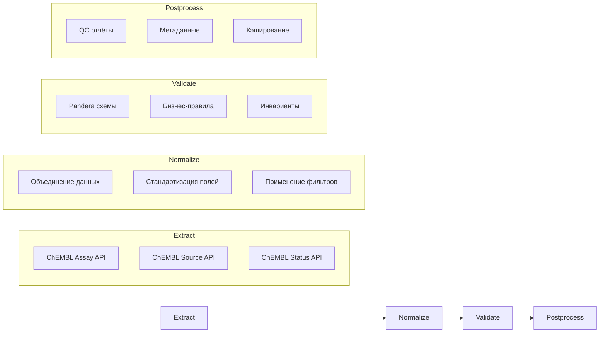

# Пайплайн Assays

Пайплайн для извлечения и нормализации данных ассев из ChEMBL API в соответствии со стандартами проекта.

## 1. Назначение и границы

### Что делает пайплайн

Пайплайн Assays формирует измерение `assay_dim` для звёздной схемы данных, извлекая информацию о биохимических ассеях из ChEMBL:

- **Извлечение по идентификаторам ассев** или **по таргетам**
- **Профили фильтрации** для различных сценариев использования
- **Детерминированная сериализация** для воспроизводимости результатов
- **Строгая валидация** с помощью Pandera схем
- **Graceful degradation** при ошибках API

### Входы и выходы

**Входы**:

- CSV файл с ChEMBL идентификаторами ассев (`assay_chembl_id`)
- Или ChEMBL идентификатор таргета (`target_chembl_id`)
- Конфигурация `configs/config_assay.yaml` (v2)

**Выходы**:

- `assays_YYYYMMDD.csv` — основные данные ассев
- `assays_YYYYMMDD_qc.csv` — отчёт о качестве данных
- `assays_YYYYMMDD_meta.yaml` — метаданные пайплайна

### Место в архитектуре

Пайплайн Assays является одним из пяти основных пайплайнов системы, формируя измерение для звёздной схемы данных. Результаты используются в пайплайне Activities для связывания биоактивностных данных с ассеями.

## 2. Источники данных и маппинги

| Источник | Статус | Endpoint | Основные поля | Обязательность |
|----------|--------|----------|---------------|----------------|
| **ChEMBL** | ✅ Обязательный | `/assay` | `assay_chembl_id`, `assay_type`, `relationship_type`, `confidence_score` | Да |

## 3. Граф ETL

```mermaid
graph TD
    A[Extract] --> B[Normalize]
    B --> C[Validate]
    C --> D[Postprocess]
    
    subgraph "Extract"
        A1[ChEMBL API<br/>assay_chembl_id]
    end
    
    subgraph "Normalize"
        B1[Стандартизация<br/>assay_type, confidence_score]
        B2[Создание связей<br/>target_chembl_id]
        B3[Обогащение<br/>src_description]
    end
    
    subgraph "Validate"
        C1[Pandera схемы<br/>AssayOutputSchema]
        C2[Бизнес-правила<br/>assay_type ∈ {B,F,P,U}]
        C3[Инварианты<br/>уникальность ID]
    end
    
    subgraph "Postprocess"
        D1[QC отчёты<br/>fill_rate, duplicates]
        D2[Корреляции<br/>с targets, documents]
        D3[Метаданные<br/>статистика обработки]
    end
    
    A1 --> B1
    B1 --> B2
    B2 --> B3
    B3 --> C1
    C1 --> C2
    C2 --> C3
    C3 --> D1
    D1 --> D2
    D2 --> D3
```

### Маппинг полей

**ChEMBL → assay_dim**:

- `assay_chembl_id` → `assay_chembl_id`
- `assay_type` → `assay_type`
- `assay_category` → `assay_category`
- `assay_cell_type` → `assay_cell_type`
- `assay_classifications` → `assay_classifications` (JSON)
- `assay_group` → `assay_group`
- `assay_organism` → `assay_organism`
- `assay_parameters` → `assay_parameters_json` (JSON)
- `assay_strain` → `assay_strain`
- `assay_subcellular_fraction` → `assay_subcellular_fraction`
- `assay_tax_id` → `assay_tax_id`
- `assay_test_type` → `assay_test_type`
- `assay_tissue` → `assay_tissue`
- `assay_type_description` → `assay_type_description`
- `bao_format` → `bao_format`
- `bao_label` → `bao_label`
- `cell_chembl_id` → `cell_chembl_id`
- `confidence_description` → `confidence_description`
- `confidence_score` → `confidence_score`
- `description` → `assay_description`
- `bao_endpoint` → `bao_endpoint`
- `document_chembl_id` → `document_chembl_id`
- `relationship_description` → `relationship_description`
- `relationship_type` → `relationship_type`
- `src_assay_id` → `src_assay_id`
- `src_id` → `src_id`
- `target_chembl_id` → `target_chembl_id`
- `tissue_chembl_id` → `tissue_chembl_id`
- `variant_sequence` → `variant_sequence_json` (JSON)

### Расширенный маппинг полей

**ASSAY_PARAMETERS** (развернуто из массива, берется первый элемент):

- `assay_parameters[0].type` → `assay_param_type`
- `assay_parameters[0].relation` → `assay_param_relation`
- `assay_parameters[0].value` → `assay_param_value`
- `assay_parameters[0].units` → `assay_param_units`
- `assay_parameters[0].text_value` → `assay_param_text_value`
- `assay_parameters[0].standard_type` → `assay_param_standard_type`
- `assay_parameters[0].standard_value` → `assay_param_standard_value`
- `assay_parameters[0].standard_units` → `assay_param_standard_units`

**ASSAY_CLASS** (JOIN по assay_classifications → /assay_class endpoint):

- `assay_class.assay_class_id` → `assay_class_id`
- `assay_class.bao_id` → `assay_class_bao_id`
- `assay_class.class_type` → `assay_class_type`
- `assay_class.l1` → `assay_class_l1`
- `assay_class.l2` → `assay_class_l2`
- `assay_class.l3` → `assay_class_l3`
- `assay_class.description` → `assay_class_description`

**VARIANT_SEQUENCES** (развернуто из объекта):

- `variant_sequence.variant_id` → `variant_id`
- `variant_sequence.accession` → `variant_base_accession`
- `variant_sequence.mutation` → `variant_mutation`
- `variant_sequence.sequence` → `variant_sequence`
- `variant_sequence.accession` → `variant_accession_reported`

### Профили фильтрации

```yaml
filter_profiles:
  human_single_protein:
    target_organism: "Homo sapiens"
    target_type: "SINGLE PROTEIN"
    relationship_type: "D"
    confidence_score__range: "7,9"
    assay_type__in: "B,F"
  
  binding_assays:
    assay_type: "B"
    relationship_type: "D"
    confidence_score__range: "5,9"
  
  high_quality:
    confidence_score__range: "7,9"
    relationship_type: "D"
    assay_type__in: "B,F"
```

## 3. Граф ETL (детализация)



## 4. Схемы данных

### Входная схема

| Поле | Тип | Nullable | Описание |
|------|-----|----------|----------|
| `assay_chembl_id` | str | No | ChEMBL идентификатор ассая |

### Выходная схема

| Поле | Тип | Nullable | Описание | Источник |
|------|-----|----------|----------|----------|
| `assay_chembl_id` | str | No | ChEMBL ID ассая | ChEMBL |
| `assay_type` | str | Yes | Тип ассая (B/F/P/U) | ChEMBL |
| `assay_category` | str | Yes | Категория ассая | ChEMBL |
| `assay_cell_type` | str | Yes | Тип клеток | ChEMBL |
| `assay_classifications` | str | Yes | Классификации ассая (JSON) | ChEMBL |
| `assay_group` | str | Yes | Группа ассая | ChEMBL |
| `assay_organism` | str | Yes | Организм ассая | ChEMBL |
| `assay_parameters_json` | str | Yes | Параметры ассая (JSON) | ChEMBL |
| `assay_strain` | str | Yes | Штамм организма | ChEMBL |
| `assay_subcellular_fraction` | str | Yes | Субклеточная фракция | ChEMBL |
| `assay_tax_id` | int | Yes | Таксономический ID организма | ChEMBL |
| `assay_test_type` | str | Yes | Тип теста ассая | ChEMBL |
| `assay_tissue` | str | Yes | Ткань ассая | ChEMBL |
| `assay_type_description` | str | Yes | Описание типа ассая | ChEMBL |
| `bao_format` | str | Yes | BAO формат | ChEMBL |
| `bao_label` | str | Yes | BAO метка | ChEMBL |
| `cell_chembl_id` | str | Yes | ChEMBL ID клетки | ChEMBL |
| `confidence_description` | str | Yes | Описание уверенности | ChEMBL |
| `confidence_score` | int | Yes | Уровень уверенности (0-9) | ChEMBL |
| `assay_description` | str | Yes | Описание ассая | ChEMBL |
| `bao_endpoint` | str | Yes | BAO endpoint | ChEMBL |
| `document_chembl_id` | str | Yes | ChEMBL ID документа | ChEMBL |
| `relationship_description` | str | Yes | Описание связи | ChEMBL |
| `relationship_type` | str | Yes | Тип связи с таргетом | ChEMBL |
| `src_assay_id` | str | Yes | ID ассая в источнике | ChEMBL |
| `src_id` | int | Yes | ID источника | ChEMBL |
| `target_chembl_id` | str | Yes | ChEMBL ID таргета | ChEMBL |
| `tissue_chembl_id` | str | Yes | ChEMBL ID ткани | ChEMBL |
| `variant_sequence_json` | str | Yes | Последовательность варианта (JSON) | ChEMBL |
| `assay_param_type` | str | Yes | Тип параметра ассея | ChEMBL |
| `assay_param_relation` | str | Yes | Отношение параметра | ChEMBL |
| `assay_param_value` | float | Yes | Значение параметра | ChEMBL |
| `assay_param_units` | str | Yes | Единицы параметра | ChEMBL |
| `assay_param_text_value` | str | Yes | Текстовое значение параметра | ChEMBL |
| `assay_param_standard_type` | str | Yes | Стандартизованный тип параметра | ChEMBL |
| `assay_param_standard_value` | float | Yes | Стандартизованное значение параметра | ChEMBL |
| `assay_param_standard_units` | str | Yes | Единицы стандартизованного параметра | ChEMBL |
| `assay_class_id` | int | Yes | Идентификатор класса ассея | ChEMBL |
| `assay_class_bao_id` | str | Yes | BAO ID класса ассея | ChEMBL |
| `assay_class_type` | str | Yes | Тип класса ассея | ChEMBL |
| `assay_class_l1` | str | Yes | Иерархия 1 класса ассея | ChEMBL |
| `assay_class_l2` | str | Yes | Иерархия 2 класса ассея | ChEMBL |
| `assay_class_l3` | str | Yes | Иерархия 3 класса ассея | ChEMBL |
| `assay_class_description` | str | Yes | Описание класса ассея | ChEMBL |
| `variant_id` | int | Yes | Идентификатор варианта | ChEMBL |
| `variant_base_accession` | str | Yes | UniProt акцессия базовой последовательности | ChEMBL |
| `variant_mutation` | str | Yes | Мутация варианта | ChEMBL |
| `variant_sequence` | str | Yes | Аминокислотная последовательность варианта | ChEMBL |
| `variant_accession_reported` | str | Yes | Сообщённая акцессия варианта | ChEMBL |
| `source_system` | str | No | Система-источник | Система |
| `chembl_release` | str | Yes | Версия ChEMBL (формат: CHEMBL_XX) | ChEMBL API |
| `extracted_at` | datetime | No | Время извлечения | Система |

### Политика NA

- **ChEMBL поля**: Обязательные, NA не допускается
- **Системные поля**: Обязательные, NA не допускается
- **Опциональные поля**: NA разрешено для `src_id`, `src_name`, `description`

### Нормализация и валидация полей

#### Системные поля

| Поле | Нормализация | Валидация | Описание |
|------|--------------|-----------|----------|
| `chembl_release` | `upper` | `^CHEMBL_\d+$` | Версия ChEMBL в формате CHEMBL_XX |
| `source_system` | - | - | Система-источник данных |
| `extracted_at` | - | ISO 8601 | Время извлечения в UTC |

#### ChEMBL поля

| Поле | Нормализация | Валидация | Описание |
|------|--------------|-----------|----------|
| `assay_chembl_id` | - | `^CHEMBL\d+$` | Идентификатор ассея |
| `assay_description` | HTML strip, trim | max 4000 chars | Описание ассея |
| `bao_endpoint` | `upper` | `^BAO_\d{7}$` | BAO endpoint ID |
| `assay_param_relation` | normalize | `[=,>,>=,<,<=,~]` | Отношение параметра |
| `assay_param_type` | `upper` | - | Тип параметра ассея |
| `assay_param_units` | `lower` | - | Единицы измерения |
| `assay_class_type` | `lower` | - | Тип классификации |
| `assay_class_l1/l2/l3` | `lower` | - | Уровни классификации |
| `variant_mutation` | `upper` | - | Мутация варианта |
| `variant_base_accession` | `upper` | UniProt format | UniProt акцессия |
| `variant_sequence` | `upper` | `^[A-Z\*]+$` | Аминокислотная последовательность |

## 5. Конфигурация

### Основные настройки

```yaml
# configs/config_assay.yaml
http:
  global:
    timeout_sec: 60.0
    retries:
      total: 10
      backoff_multiplier: 3.0
    rate_limit:
      max_calls: 3
      period: 15.0

sources:
  chembl:
    name: chembl
    endpoint: assay
    http:
      base_url: https://www.ebi.ac.uk/chembl/api/data
      timeout_sec: 60.0
      retries:
        total: 5
        backoff_multiplier: 2.0

io:
  input:
    assay_ids_csv: data/input/assay_ids.csv
    target_ids_csv: data/input/target_ids.csv
  output:
    dir: data/output/assays
    format: csv

validation:
  strict: true
  qc:
    max_missing_fraction: 0.02
    max_duplicate_fraction: 0.005
```

### Переменные окружения

```bash
# Опционально
CHEMBL_API_TOKEN=your_chembl_token_here
```

### Настройки кэша

```yaml
runtime:
  cache_dir: .cache/chembl
  cache_ttl: 86400  # 24 часа
```

## 6. Валидация

### Pandera схемы

```python
# src/library/schemas/assay_schema.py
class AssayOutputSchema(pa.DataFrameModel):
    assay_chembl_id: Series[str] = pa.Field(description="ChEMBL assay identifier")
    src_id: Series[int] = pa.Field(nullable=True, description="Source ID")
    src_name: Series[str] = pa.Field(nullable=True, description="Source name")
    assay_type: Series[str] = pa.Field(nullable=True, description="Assay type")
    # ... остальные поля
```

### Инварианты

1. **Уникальность**: `assay_chembl_id` должен быть уникальным
2. **Связность**: Все записи должны иметь данные из ChEMBL
3. **Консистентность**: `assay_type` должен быть одним из: B, F, P, U
4. **Диапазон**: `confidence_score` должен быть в диапазоне 0-9

### Дедупликация

- По `assay_chembl_id` (основной ключ)
- Автоматическое удаление дубликатов
- Логирование удалённых записей

## 7. Детерминизм

### Сортировка

```yaml
determinism:
  sort:
    by: [assay_chembl_id, src_id]
    ascending: [true, true]
    na_position: last
```

### Формат float

```yaml
io:
  output:
    csv:
      float_format: "%.3f"
      date_format: "%Y-%m-%dT%H:%M:%SZ"
```

### Порядок колонок

```yaml
determinism:
  column_order:
    - assay_chembl_id
    - src_id
    - src_name
    - assay_type
    - relationship_type
    - confidence_score
    # ... фиксированный порядок
```

### Локаль и таймзона

- **Локаль**: UTF-8
- **Таймзона**: UTC для всех временных меток
- **Формат даты**: ISO 8601

## 8. CLI/Make команды

### Унифицированный интерфейс

```bash
# Установка зависимостей
make install-dev

# Валидация конфигурации
make run ENTITY=assays CONFIG=configs/config_assay.yaml --dry-run

# Запуск с примером данных
make run ENTITY=assays CONFIG=configs/config_assay.yaml INPUT=data/input/assay.csv

# Извлечение по таргету
make run ENTITY=assays CONFIG=configs/config_assay.yaml FLAGS="--target CHEMBL231"

# Тестовый запуск без записи
make run ENTITY=assays CONFIG=configs/config_assay.yaml FLAGS="--dry-run"

# Запуск тестов
make test ENTITY=assays

# Очистка артефактов
make clean ENTITY=assays

# Справка
make help
```

### CLI команды

```bash
# Извлечение по идентификаторам ассев
python src/scripts/get_assay_data.py \
  --input data/input/assay_ids.csv \
  --config configs/config_assay.yaml

# Извлечение по таргету
python src/scripts/get_assay_data.py \
  --target CHEMBL231 \
  --config configs/config_assay.yaml

# Использование профилей фильтрации
python src/scripts/get_assay_data.py \
  --target CHEMBL231 \
  --filters human_single_protein \
  --config configs/config_assay.yaml
```

### Параметры командной строки

| Параметр | Описание | Обязательный | По умолчанию |
|----------|----------|--------------|--------------|
| `--input` | CSV с assay_chembl_id | Нет* | - |
| `--target` | ChEMBL ID таргета | Нет* | - |
| `--config` | Путь к конфигурации | Да | - |
| `--filters` | Профиль фильтрации | Нет | - |
| `--output-dir` | Директория вывода | Нет | Из конфига |
| `--limit` | Ограничение записей | Нет | null |
| `--dry-run` | Тестовый режим | Нет | false |

*Обязателен либо `--input`, либо `--target`

## 9. Артефакты

### Структура выходных файлов

```text
data/output/assay/
├── assay_20251020.csv          # Основные данные
├── assay_20251020_qc.csv       # QC метрики
└── assay_20251020_meta.yaml    # Метаданные
```

### Формат имён файлов

- **Основной CSV**: `assay_{YYYYMMDD}.csv`
- **QC отчёт**: `assay_{YYYYMMDD}_qc.csv`
- **Метаданные**: `assay_{YYYYMMDD}_meta.yaml`

### meta.yaml структура

```yaml
pipeline:
  name: assays
  version: 1.0.0
  run_date: "2025-10-20T12:00:00Z"
  
sources:
  chembl:
    enabled: true
    records_processed: 500
    records_successful: 495
    records_failed: 5

quality:
  total_records: 500
  valid_records: 495
  invalid_records: 5
  fill_rate: 0.99
  duplicate_rate: 0.0

filters:
  applied: human_single_protein
  records_before_filter: 1000
  records_after_filter: 500
```

### Отчёты в reports/

- **QC отчёты**: Автоматически генерируемые метрики качества
- **Метаданные**: Информация о запуске пайплайна

## 10. Контроль качества

### Чек-лист QC

- [ ] ChEMBL источник включён
- [ ] Fill rate >= 95%
- [ ] Дубликаты <= 0.5%
- [ ] Все assay_chembl_id валидны
- [ ] Confidence score в диапазоне 0-9
- [ ] Assay type соответствует стандарту

### Ожидаемые инварианты

1. **Полнота ChEMBL**: 100% записей должны иметь данные из ChEMBL
2. **Уникальность**: Нет дубликатов по `assay_chembl_id`
3. **Валидность**: Все `assay_chembl_id` соответствуют формату CHEMBL\d+
4. **Типизация**: `assay_type` должен быть B, F, P или U

### Метрики качества

- **Fill Rate**: Процент заполненных полей
- **Source Coverage**: Покрытие по источникам
- **Validation Success**: Процент успешных валидаций
- **Processing Time**: Время обработки
- **Filter Effectiveness**: Эффективность фильтрации

## 11. Ограничения и типичные ошибки

### Rate limits API

| Источник | Лимит | Таймаут | Особенности |
|----------|-------|---------|-------------|
| **ChEMBL** | Нет лимита | 60s | Требует токен для больших объёмов |

### Типовые фейлы и решения

1. **Ошибка "API Error"**

   ```bash
   # Решение: Увеличить таймаут
   python src/scripts/get_assay_data.py --target CHEMBL231 --timeout 120
   ```

2. **Медленная работа**

   ```bash
   # Решение: Ограничить количество записей
   python src/scripts/get_assay_data.py --target CHEMBL231 --limit 100
   ```

3. **Ошибка валидации**

   ```bash
   # Решение: Проверить конфигурацию
   make run ENTITY=assays CONFIG=configs/config_assay.yaml --dry-run
   ```

4. **Проблемы с фильтрацией**

   ```bash
   # Решение: Проверить доступные профили
   python src/scripts/get_assay_data.py --help | grep -A 20 "Examples:"
   ```

5. **Ошибки кэширования**

   ```bash
   # Решение: Очистить кэш
   make clean ENTITY=assays
   ```

### Troubleshooting

```bash
# Проверка статуса ChEMBL
make health CONFIG=configs/config_assay.yaml

# Проверка конфигурации
make run ENTITY=assays CONFIG=configs/config_assay.yaml --dry-run

# Проверка зависимостей
make install-dev

# Тестовый запуск
make run ENTITY=assays CONFIG=configs/config_assay.yaml FLAGS="--dry-run"

# Просмотр справки
make help

# Просмотр примеров
make run ENTITY=assays CONFIG=configs/config_assay.yaml --help
```

### Производительность

#### Рекомендации

- Используйте профили фильтрации для уменьшения объема данных
- Настройте кэширование для повторных запросов
- Ограничивайте количество записей при тестировании
- Используйте Parquet формат для больших объемов данных

#### Мониторинг

```bash
# Проверка статуса ChEMBL
make health CONFIG=configs/config_assay.yaml

# Тестовый запуск
make run ENTITY=assays CONFIG=configs/config_assay.yaml FLAGS="--dry-run"
```

## 12. Детерминизм

### Сортировка данных

```python
# Детерминированная сортировка по assay_chembl_id
df_sorted = df.sort_values(['assay_chembl_id'], na_position='last')
```

### Формат чисел

```python
# Стандартизация числовых полей
df['assay_chembl_id'] = df['assay_chembl_id'].astype('string')
df['confidence_score'] = df['confidence_score'].astype('float64')
```

### Порядок колонок

```python
# Фиксированный порядок колонок в выходном CSV
column_order = [
    'assay_chembl_id',
    'src_id',
    'src_name',
    'assay_type',
    'relationship_type',
    'confidence_score',
    'target_chembl_id',
    'document_chembl_id'
]
df_output = df[column_order]
```

### Временные зоны

```python
# Все временные метки в UTC
from datetime import datetime, timezone
timestamp = datetime.now(timezone.utc).isoformat()
```

## 13. Запуск

### CLI команды

```bash
# Полный запуск пайплайна
make run ENTITY=assays CONFIG=configs/config_assay.yaml

# Через CLI напрямую
bioactivity-data-acquisition pipeline --config configs/config_assay.yaml

# Тестовый запуск с ограниченными данными
make run ENTITY=assays CONFIG=configs/config_test.yaml
```

### Docker/Compose

```bash
# Запуск в Docker контейнере
docker-compose run --rm bioactivity-pipeline assays

# Или через Makefile
make docker-run ENTITY=assays CONFIG=configs/config_assay.yaml
```

### Ожидаемые артефакты

После успешного выполнения в `data/output/assays_YYYYMMDD/`:

```text
assays_20241201/
├── assays_20241201.csv                    # Основные данные ассев
├── assays_20241201_meta.yaml             # Метаданные пайплайна
├── assays_20241201_qc.csv                # QC отчёт
└── assays_correlation_report_20241201/   # Корреляционный анализ
    ├── correlation_matrix.csv
    ├── source_comparison.csv
    └── quality_metrics.csv
```

## 14. QC чек-лист

### Перед запуском

- [ ] Проверить наличие входного файла `data/input/assay.csv`
- [ ] Убедиться в корректности конфигурации `configs/config_assay.yaml`
- [ ] Проверить доступность ChEMBL API
- [ ] Убедиться в наличии связанных данных (targets, documents)

### После выполнения

- [ ] Проверить количество записей в выходном файле
- [ ] Убедиться в отсутствии критических ошибок в QC отчёте
- [ ] Проверить fill rate для обязательных полей (≥80%)
- [ ] Убедиться в отсутствии дубликатов по `assay_chembl_id`
- [ ] Проверить корректность связей с targets и documents

### Специфичные проверки для Assays

- [ ] Все `assay_chembl_id` уникальны
- [ ] `assay_type` соответствует допустимым значениям (B, F, P, U)
- [ ] `relationship_type` валиден
- [ ] `confidence_score` в диапазоне 0-9
- [ ] Связи с `target_chembl_id` корректны

## 15. Ссылки

### Модули в src/

- **Основной пайплайн**: `src/library/assay/pipeline.py`
- **API клиенты**: `src/library/clients/chembl.py`
- **Схемы валидации**: `src/library/schemas/assay_schema.py`
- **ETL утилиты**: `src/library/etl/`

### Конфигурация

- **Основной конфиг**: `configs/config_assay.yaml`
- **Тестовый конфиг**: `configs/config_test.yaml`

### Тесты

- **Unit тесты**: `tests/test_assay_pipeline.py`
- **Интеграционные тесты**: `tests/integration/test_assay_pipeline.py`
- **Тестовые данные**: `tests/fixtures/assay.csv`
