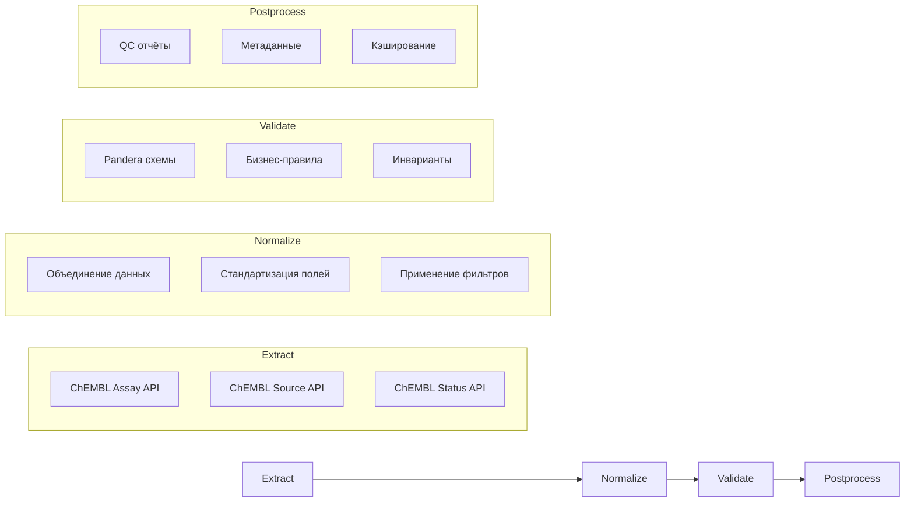

# Пайплайн Assays

Пайплайн для извлечения и нормализации данных ассев из ChEMBL API в соответствии со стандартами проекта.

## 1. Назначение и границы

### Что делает пайплайн

Пайплайн Assays формирует измерение `assay_dim` для звёздной схемы данных, извлекая информацию о биохимических ассеях из ChEMBL:

- **Извлечение по идентификаторам ассев** или **по таргетам**
- **Профили фильтрации** для различных сценариев использования
- **Детерминированная сериализация** для воспроизводимости результатов
- **Строгая валидация** с помощью Pandera схем
- **Graceful degradation** при ошибках API

### Входы и выходы

**Входы**:
- CSV файл с ChEMBL идентификаторами ассев (`assay_chembl_id`)
- Или ChEMBL идентификатор таргета (`target_chembl_id`)
- Конфигурация `configs/config_assay_full.yaml`

**Выходы**:
- `assay_YYYYMMDD.csv` — основные данные ассев
- `assay_YYYYMMDD_qc.csv` — отчёт о качестве данных
- `assay_YYYYMMDD_meta.yaml` — метаданные пайплайна

### Место в архитектуре

Пайплайн Assays является одним из пяти основных пайплайнов системы, формируя измерение для звёздной схемы данных. Результаты используются в пайплайне Activities для связывания биоактивностных данных с ассеями.

## 2. Источники данных и маппинги

| Источник | Статус | Endpoint | Основные поля | Обязательность |
|----------|--------|----------|---------------|----------------|
| **ChEMBL** | ✅ Обязательный | `/assay` | `assay_chembl_id`, `assay_type`, `relationship_type`, `confidence_score` | Да |

### Маппинг полей

**ChEMBL → assay_dim**:
- `assay_chembl_id` → `assay_chembl_id`
- `src_id` → `src_id`
- `src_description` → `src_name`
- `assay_type` → `assay_type`
- `relationship_type` → `relationship_type`
- `confidence_score` → `confidence_score`
- `assay_organism` → `assay_organism`
- `description` → `description`

### Профили фильтрации

```yaml
filter_profiles:
  human_single_protein:
    target_organism: "Homo sapiens"
    target_type: "SINGLE PROTEIN"
    relationship_type: "D"
    confidence_score__range: "7,9"
    assay_type__in: "B,F"
  
  binding_assays:
    assay_type: "B"
    relationship_type: "D"
    confidence_score__range: "5,9"
  
  high_quality:
    confidence_score__range: "7,9"
    relationship_type: "D"
    assay_type__in: "B,F"
```

## 3. Граф ETL



## 4. Схемы данных

### Входная схема

| Поле | Тип | Nullable | Описание |
|------|-----|----------|----------|
| `assay_chembl_id` | str | No | ChEMBL идентификатор ассая |

### Выходная схема

| Поле | Тип | Nullable | Описание | Источник |
|------|-----|----------|----------|----------|
| `assay_chembl_id` | str | No | ChEMBL ID ассая | ChEMBL |
| `src_id` | int | Yes | ID источника | ChEMBL |
| `src_name` | str | Yes | Название источника | ChEMBL |
| `assay_type` | str | Yes | Тип ассая (B/F/P/U) | ChEMBL |
| `relationship_type` | str | Yes | Тип связи с таргетом | ChEMBL |
| `confidence_score` | int | Yes | Уровень уверенности (0-9) | ChEMBL |
| `assay_organism` | str | Yes | Организм ассая | ChEMBL |
| `description` | str | Yes | Описание ассая | ChEMBL |
| `source_system` | str | No | Система-источник | Система |
| `chembl_release` | str | No | Версия ChEMBL | ChEMBL |
| `extracted_at` | datetime | No | Время извлечения | Система |

### Политика NA

- **ChEMBL поля**: Обязательные, NA не допускается
- **Системные поля**: Обязательные, NA не допускается
- **Опциональные поля**: NA разрешено для `src_id`, `src_name`, `description`

## 5. Конфигурация

### Основные настройки

```yaml
# configs/config_assay_full.yaml
http:
  global:
    timeout_sec: 60.0
    retries:
      total: 10
      backoff_multiplier: 3.0
    rate_limit:
      max_calls: 3
      period: 15.0

sources:
  chembl:
    name: chembl
    endpoint: assay
    http:
      base_url: https://www.ebi.ac.uk/chembl/api/data
      timeout_sec: 60.0
      retries:
        total: 5
        backoff_multiplier: 2.0

io:
  input:
    assay_ids_csv: data/input/assay_ids.csv
    target_ids_csv: data/input/target_ids.csv
  output:
    dir: data/output/assay
    format: csv

validation:
  strict: true
  qc:
    max_missing_fraction: 0.02
    max_duplicate_fraction: 0.005
```

### Переменные окружения

```bash
# Опционально
CHEMBL_API_TOKEN=your_chembl_token_here
```

### Настройки кэша

```yaml
runtime:
  cache_dir: .cache/chembl
  cache_ttl: 86400  # 24 часа
```

## 6. Валидация

### Pandera схемы

```python
# src/library/schemas/assay_schema.py
class AssayOutputSchema(pa.DataFrameModel):
    assay_chembl_id: Series[str] = pa.Field(description="ChEMBL assay identifier")
    src_id: Series[int] = pa.Field(nullable=True, description="Source ID")
    src_name: Series[str] = pa.Field(nullable=True, description="Source name")
    assay_type: Series[str] = pa.Field(nullable=True, description="Assay type")
    # ... остальные поля
```

### Инварианты

1. **Уникальность**: `assay_chembl_id` должен быть уникальным
2. **Связность**: Все записи должны иметь данные из ChEMBL
3. **Консистентность**: `assay_type` должен быть одним из: B, F, P, U
4. **Диапазон**: `confidence_score` должен быть в диапазоне 0-9

### Дедупликация

- По `assay_chembl_id` (основной ключ)
- Автоматическое удаление дубликатов
- Логирование удалённых записей

## 7. Детерминизм

### Сортировка

```yaml
determinism:
  sort:
    by: [assay_chembl_id, src_id]
    ascending: [true, true]
    na_position: last
```

### Формат float

```yaml
io:
  output:
    csv:
      float_format: "%.3f"
      date_format: "%Y-%m-%dT%H:%M:%SZ"
```

### Порядок колонок

```yaml
determinism:
  column_order:
    - assay_chembl_id
    - src_id
    - src_name
    - assay_type
    - relationship_type
    - confidence_score
    # ... фиксированный порядок
```

### Локаль и таймзона

- **Локаль**: UTF-8
- **Таймзона**: UTC для всех временных меток
- **Формат даты**: ISO 8601

## 8. CLI/Make команды

### Стандартизованные цели

```bash
# Установка зависимостей
make install-dev

# Валидация конфигурации
make pipeline TYPE=assays CONFIG=configs/config_assay_full.yaml --dry-run

# Запуск с примером данных
make pipeline TYPE=assays INPUT=data/input/assay.csv CONFIG=configs/config_assay_full.yaml

# Извлечение по таргету
make pipeline TYPE=assays CONFIG=configs/config_assay_full.yaml FLAGS="--target CHEMBL231"

# Тестовый запуск без записи
make pipeline TYPE=assays CONFIG=configs/config_assay_full.yaml FLAGS="--dry-run"

# Запуск тестов
make pipeline-test TYPE=assays

# Очистка артефактов
make pipeline-clean TYPE=assays

# Справка
make help
```

### CLI команды

```bash
# Извлечение по идентификаторам ассев
python src/scripts/get_assay_data.py \
  --input data/input/assay_ids.csv \
  --config configs/config_assay_full.yaml

# Извлечение по таргету
python src/scripts/get_assay_data.py \
  --target CHEMBL231 \
  --config configs/config_assay_full.yaml

# Использование профилей фильтрации
python src/scripts/get_assay_data.py \
  --target CHEMBL231 \
  --filters human_single_protein \
  --config configs/config_assay_full.yaml
```

### Параметры командной строки

| Параметр | Описание | Обязательный | По умолчанию |
|----------|----------|--------------|--------------|
| `--input` | CSV с assay_chembl_id | Нет* | - |
| `--target` | ChEMBL ID таргета | Нет* | - |
| `--config` | Путь к конфигурации | Да | - |
| `--filters` | Профиль фильтрации | Нет | - |
| `--output-dir` | Директория вывода | Нет | Из конфига |
| `--limit` | Ограничение записей | Нет | null |
| `--dry-run` | Тестовый режим | Нет | false |

*Обязателен либо `--input`, либо `--target`

## 9. Артефакты

### Структура выходных файлов

```
data/output/assay/
├── assay_20251020.csv          # Основные данные
├── assay_20251020_qc.csv       # QC метрики
└── assay_20251020_meta.yaml    # Метаданные
```

### Формат имён файлов

- **Основной CSV**: `assay_{YYYYMMDD}.csv`
- **QC отчёт**: `assay_{YYYYMMDD}_qc.csv`
- **Метаданные**: `assay_{YYYYMMDD}_meta.yaml`

### meta.yaml структура

```yaml
pipeline:
  name: assays
  version: 1.0.0
  run_date: "2025-10-20T12:00:00Z"
  
sources:
  chembl:
    enabled: true
    records_processed: 500
    records_successful: 495
    records_failed: 5

quality:
  total_records: 500
  valid_records: 495
  invalid_records: 5
  fill_rate: 0.99
  duplicate_rate: 0.0

filters:
  applied: human_single_protein
  records_before_filter: 1000
  records_after_filter: 500
```

### Отчёты в reports/

- **QC отчёты**: Автоматически генерируемые метрики качества
- **Метаданные**: Информация о запуске пайплайна

## 10. Контроль качества

### Чек-лист QC

- [ ] ChEMBL источник включён
- [ ] Fill rate >= 95%
- [ ] Дубликаты <= 0.5%
- [ ] Все assay_chembl_id валидны
- [ ] Confidence score в диапазоне 0-9
- [ ] Assay type соответствует стандарту

### Ожидаемые инварианты

1. **Полнота ChEMBL**: 100% записей должны иметь данные из ChEMBL
2. **Уникальность**: Нет дубликатов по `assay_chembl_id`
3. **Валидность**: Все `assay_chembl_id` соответствуют формату CHEMBL\d+
4. **Типизация**: `assay_type` должен быть B, F, P или U

### Метрики качества

- **Fill Rate**: Процент заполненных полей
- **Source Coverage**: Покрытие по источникам
- **Validation Success**: Процент успешных валидаций
- **Processing Time**: Время обработки
- **Filter Effectiveness**: Эффективность фильтрации

## 11. Ограничения и типичные ошибки

### Rate limits API

| Источник | Лимит | Таймаут | Особенности |
|----------|-------|---------|-------------|
| **ChEMBL** | Нет лимита | 60s | Требует токен для больших объёмов |

### Типовые фейлы и решения

1. **Ошибка "API Error"**
   ```bash
   # Решение: Увеличить таймаут
   python src/scripts/get_assay_data.py --target CHEMBL231 --timeout 120
   ```

2. **Медленная работа**
   ```bash
   # Решение: Ограничить количество записей
   python src/scripts/get_assay_data.py --target CHEMBL231 --limit 100
   ```

3. **Ошибка валидации**
   ```bash
   # Решение: Проверить конфигурацию
   make pipeline TYPE=assays CONFIG=configs/config_assay_full.yaml --dry-run
   ```

4. **Проблемы с фильтрацией**
   ```bash
   # Решение: Проверить доступные профили
   python src/scripts/get_assay_data.py --help | grep -A 20 "Examples:"
   ```

5. **Ошибки кэширования**
   ```bash
   # Решение: Очистить кэш
   make pipeline-clean TYPE=assays
   ```

### Troubleshooting

```bash
# Проверка статуса ChEMBL
make health CONFIG=configs/config_assay_full.yaml

# Проверка конфигурации
make pipeline TYPE=assays CONFIG=configs/config_assay_full.yaml --dry-run

# Проверка зависимостей
make install-dev

# Тестовый запуск
make pipeline TYPE=assays CONFIG=configs/config_assay_full.yaml FLAGS="--dry-run"

# Просмотр справки
make help

# Просмотр примеров
make pipeline TYPE=assays CONFIG=configs/config_assay_full.yaml --help
```

### Производительность

#### Рекомендации

- Используйте профили фильтрации для уменьшения объема данных
- Настройте кэширование для повторных запросов
- Ограничивайте количество записей при тестировании
- Используйте Parquet формат для больших объемов данных

#### Мониторинг

```bash
# Проверка статуса ChEMBL
make health CONFIG=configs/config_assay_full.yaml

# Тестовый запуск
make pipeline TYPE=assays CONFIG=configs/config_assay_full.yaml FLAGS="--dry-run"
```
