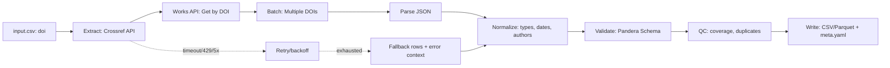

# Pipeline: `document_crossref`

> **Note**: Implementation status: **planned**. All file paths referencing `src/bioetl/` in this document describe the intended architecture and are not yet implemented in the codebase.

This document describes the `document_crossref` pipeline, which is responsible for extracting document metadata from Crossref REST API.

**Note:** This pipeline is not yet implemented. This document serves as a specification for its future implementation.

## 1. Identification

| Item              | Value                                                                                              | Status                |
| ----------------- | -------------------------------------------------------------------------------------------------- | --------------------- |
| **Pipeline Name** | `document_crossref`                                                                                 | Not Implemented       |
| **CLI Command**   | `python -m bioetl.cli.main document_crossref`                                                       | Not Implemented       |
| **Config File**   | [ref: repo:src/bioetl/configs/pipelines/crossref/document_crossref.yaml@refactoring_001]     | Not Implemented       |
| **CLI Registration** | [ref: repo:src/bioetl/cli/registry.py@refactoring_001]                                          | Not Implemented       |

## 2. Purpose and Scope

### Purpose

The `document_crossref` pipeline extracts publication metadata from Crossref REST API. Crossref is a DOI registration agency providing comprehensive bibliographic metadata for scholarly works.

### Scope

The pipeline extracts:
- **Core metadata**: DOI, title, container title (journal), publication dates
- **Bibliographic details**: volume, issue, pages, ISSN (print/electronic)
- **Publisher information**: publisher name, member ID
- **Author information**: authors list with ORCID IDs
- **Publication metadata**: type, language, license
- **Citation information**: reference count (if available)

### Limitations

- Does not extract full-text articles
- Does not extract author affiliations
- Does not extract reference lists
- Requires DOI for lookups (no title-based search)

### Non-Goals

- Full-text extraction
- Author affiliation extraction
- Complete citation network analysis
- Real-time updates (uses cached data)

## 3. Architecture and Data Flow



### Components

**Extract Stage:**
- Crossref REST API Client
- Batch DOI retrieval (up to 200 per request)
- Polite Pool support
- TTL cache (24 hours)
- Circuit breaker
- Fallback manager

**Transform Stage:**
- JSON Parser (Crossref JSON format)
- Normalize: dates, authors, journal names
- Type coercion and validation

**Validate Stage:**
- Pandera schema validation
- QC coverage checks
- Duplicate detection

**Write Stage:**
- Atomic writer (run_id-scoped temp dirs)
- Canonical serialization (hash generation)
- Metadata builder (full provenance)

## 4. Crossref REST API

### Base URL

```text
https://api.crossref.org
```

### Endpoints

#### Get Work by DOI

**Endpoint:** `GET /works/{doi}`

**Purpose:** Retrieve a single work by DOI.

**Parameters:**
- `doi`: DOI (e.g., `10.1234/example`)

**Headers:**
- `User-Agent`: Required, should include `mailto:` for Polite Pool
- `Accept`: `application/json` (default)

**Example:**
```bash
curl -H "User-Agent: bioactivity_etl/1.0 (mailto:owner@example.org)" \
  "https://api.crossref.org/works/10.1234/example"
```

#### Batch Get Works by DOIs

**Endpoint:** `POST /works`

**Purpose:** Retrieve multiple works by DOIs in a single request.

**Parameters:**
- `ids`: Comma-separated list of DOIs (max: 200 per request)

**Headers:**
- `User-Agent`: Required, should include `mailto:` for Polite Pool
- `Content-Type`: `application/json`

**Body:**
```json
{
  "ids": ["10.1234/example1", "10.5678/example2"]
}
```

**Example:**
```bash
curl -X POST \
  -H "User-Agent: bioactivity_etl/1.0 (mailto:owner@example.org)" \
  -H "Content-Type: application/json" \
  -d '{"ids":["10.1234/example1","10.5678/example2"]}' \
  "https://api.crossref.org/works"
```

### Polite Pool

Crossref provides two access pools:

**Public Pool (without identification):**
- Rate limit: ~50 requests/second
- Unstable performance
- May throttle under high load

**Polite Pool (recommended):**
- Add `mailto=` in query string or User-Agent header
- Rate limit: up to 50+ requests/second with priority
- Stable performance
- Recommended for production use

**How to Use Polite Pool:**
1. Include `mailto=` in User-Agent header: `User-Agent: app/version (mailto:owner@example.org)`
2. Or include `mailto=` in query string: `?mailto=owner@example.org`

### Rate Limiting

**Our Strategy (Conservative):**
- Default: 2 requests/second (Polite Pool)
- With burst capacity: up to 5 requests in burst
- Workers: 2-4 parallel threads
- Timeout: connect 10s, read 30s

### Cursor-based Pagination

For large lists, cursor-based pagination is recommended:

**First request:**
```bash
curl "https://api.crossref.org/works?filter=doi:10.1371/*&rows=1000&cursor=*"
```

**Next requests:**
```bash
curl "https://api.crossref.org/works?filter=doi:10.1371/*&rows=1000&cursor={value_from_previous_response}"
```

### JSON Response Structure

**Example response:**
```json
{
  "DOI": "10.1371/journal.pone.0000000",
  "type": "journal-article",
  "title": ["Article Title Here"],
  "container-title": ["PLoS ONE"],
  "published-print": {"date-parts": [[2023, 3, 15]]},
  "published-online": {"date-parts": [[2023, 3, 1]]},
  "volume": "18",
  "issue": "3",
  "page": "e0000000",
  "ISSN": ["1932-6203"],
  "publisher": "Public Library of Science",
  "member": "340",
  "author": [
    {
      "given": "John",
      "family": "Doe",
      "sequence": "first",
      "affiliation": [{"name": "Department of Biology"}],
      "ORCID": "https://orcid.org/0000-0001-2345-6789"
    }
  ]
}
```

### Date Extraction Priority

**Priority order:**
1. `published-print.date-parts` - print publication date (preferred)
2. `published-online.date-parts` - online publication date
3. `issued.date-parts` - issued date (if available)
4. `created.date-parts` - date of record creation in Crossref

### ISSN Extraction (Print vs Electronic)

```python
def extract_issn(record):
    """Extract ISSN from Crossref record"""
    issn_data = {}
    
    if 'ISSN' in record:
        issn_list = record['ISSN']
        if len(issn_list) > 0:
            issn_data['issn_print'] = issn_list[0]
        if len(issn_list) > 1:
            issn_data['issn_electronic'] = issn_list[1]
    
    # Check issn-type array
    if 'issn-type' in record:
        for issn_obj in record['issn-type']:
            issn_type = issn_obj.get('type')
            issn_value = issn_obj.get('value')
            
            if issn_type == 'print':
                issn_data['issn_print'] = issn_value
            elif issn_type == 'electronic':
                issn_data['issn_electronic'] = issn_value
    
    return issn_data
```

### ORCID Normalization

```python
def normalize_orcid(orcid_value):
    """Normalize ORCID value"""
    if not orcid_value:
        return None
    
    orcid = orcid_value.replace('https://orcid.org/', '')
    orcid = orcid.replace('http://orcid.org/', '')
    
    if re.match(r'^\d{4}-\d{4}-\d{4}-\d{3}[0-9X]$', orcid):
        return orcid
    
    return None
```

### Error Handling

**404 Not Found:** Create tombstone record
**400 Bad Request:** Invalid DOI format
**503 Service Unavailable:** Retry with exponential backoff
**429 Rate Limiting:** Exponential backoff with jitter

### Licensing

Crossref metadata under CC0 (public domain):
- Can be used freely
- Attribution: "Data from Crossref"
- Link to Terms of Use is required

## 5. Configuration

### 5.1 Required Parameters

This pipeline follows the standard `docs/configs/00-typed-configs-and-profiles.md`.

Configuration file: `configs/pipelines/crossref-document.yaml` (`extends: "../base.yaml"`).

### 5.2 Main Configuration Overrides

| Section | Key | Value | Constraint | Comment |
|--------|------|----------|-------------|-------------|
| Pipeline | `pipeline.name` | `document_crossref` | — | Used in logs and `run_config.yaml`. |
| Sources / Crossref | `sources.crossref.base_url` | `https://api.crossref.org` | — | Base URL for Crossref REST API. |
| Sources / Crossref | `sources.crossref.batching.dois_per_request` | `100` | `≤ 200` | Maximum batch DOI for batch request. |
| Sources / Crossref | `sources.crossref.batching.use_cursor` | `true` | — | Use cursor-based pagination for large lists. |
| Sources / Crossref | `sources.crossref.rate_limit.max_calls_per_sec` | `2` | — | Conservative strategy: 2 requests/second (polite pool). |
| Sources / Crossref | `sources.crossref.rate_limit.burst_capacity` | `5` | — | Maximum number of requests in burst. |
| Sources / Crossref | `sources.crossref.workers` | `2-4` | `2-4` | Parallel threads for processing requests. |
| Sources / Crossref | `sources.crossref.polite_pool` | `true` | — | Use Polite Pool (recommended). |
| Sources / Crossref | `sources.crossref.http.timeout_sec` | `60.0` | — | Timeout for HTTP requests. |
| Sources / Crossref | `sources.crossref.http.connect_timeout_sec` | `10.0` | — | Timeout for connection. |
| Sources / Crossref | `sources.crossref.http.read_timeout_sec` | `30.0` | — | Timeout for reading response. |
| Sources / Crossref | `sources.crossref.http.headers.User-Agent` | `"bioactivity_etl/1.0 (mailto:owner@example.org)"` | — | User-Agent with mailto for Polite Pool. |
| Sources / Crossref | `sources.crossref.identify.mailto` | — | Recommended | Email for Polite Pool (passed via User-Agent or query string). |
| Sources / Crossref | `sources.crossref.identify.plus_token` | — | Optional | Crossref Plus token for increased limits and additional metadata. |
| Cache | `cache.namespace` | `"crossref"` | Not empty | Ensures cache isolation. |
| Cache | `cache.ttl` | `86400` | — | Cache TTL in seconds (24 hours). |

### 5.3 CLI Overrides and Environment Variables

#### CLI Examples

- `--set sources.crossref.batching.dois_per_request=150` — change batch size.
- `--set sources.crossref.rate_limit.max_calls_per_sec=3` — increase request limit.
- `--set sources.crossref.polite_pool=false` — use Public Pool (not recommended).

#### Environment Variables

- `CROSSREF_MAILTO` or `BIOETL_SOURCES__CROSSREF__IDENTIFY__MAILTO` — email for Polite Pool (recommended).
- `CROSSREF_PLUS_TOKEN` or `BIOETL_SOURCES__CROSSREF__IDENTIFY__PLUS_TOKEN` — Crossref Plus token (optional).

### 5.4 Example Configuration

```yaml
extends:
  - ../profiles/base.yaml
  - ../profiles/determinism.yaml

pipeline:
  name: document_crossref
  entity: document
  version: "1.0.0"

materialization:
  root: "data/output"
  format: "parquet"
  pipeline_subdir: "document_crossref"

sources:
  crossref:
    base_url: "https://api.crossref.org"
    batching:
      dois_per_request: 100
      use_cursor: true
    rate_limit:
      max_calls_per_sec: 2
      burst_capacity: 5
      period: 1.0
    polite_pool: true
    workers: 3
    http:
      timeout_sec: 60.0
      connect_timeout_sec: 10.0
      read_timeout_sec: 30.0
      headers:
        User-Agent: "bioactivity_etl/1.0 (mailto:owner@example.org)"  # or from env: CROSSREF_MAILTO
    identify:
      mailto: "owner@example.org"  # or from env: CROSSREF_MAILTO
      plus_token: null  # or from env: CROSSREF_PLUS_TOKEN

cache:
  enabled: true
  namespace: "crossref"
  directory: "http_cache"
  ttl: 86400

determinism:
  enabled: true
  sort:
    by: ["doi"]
    ascending: [true]
    na_position: "last"
  column_order:
    - "doi"
    - "title"
    - "container_title"
    - "published_print_date"
    - "published_online_date"
    - "volume"
    - "issue"
    - "page"
    - "issn_print"
    - "issn_electronic"
    - "publisher"
    - "member"
    - "authors"
    - "orcid"
    - "source"
    - "run_id"
    - "git_commit"
    - "config_hash"
    - "pipeline_version"
    - "extracted_at"
    - "hash_business_key"
    - "hash_row"
    - "index"

qc:
  enabled: true
  min_doi_coverage: 0.95
  max_404_rate: 0.05
```

### 5.5 Validation Rules

- Uses `PipelineConfig.validate_yaml('configs/pipelines/crossref-document.yaml')`.

- Additional checks:
  - `sources.crossref.batching.dois_per_request` ≤ 200 (maximum Crossref batch).
  - `sources.crossref.rate_limit.max_calls_per_sec` ≥ 1 (minimum 1 request/second).
  - `sources.crossref.workers` ≥ 1 and ≤ 4 (optimal range).
  - When `sources.crossref.polite_pool=true`, `sources.crossref.identify.mailto` is required.
  - `qc` thresholds cannot be negative and must be in range [0, 1].

### 5.6 Special Features

#### Polite Pool vs Public Pool

**Public Pool (without identification):**
- Rate limit: ~50 requests/second
- Unstable performance
- May throttle under high load

**Polite Pool (recommended):**
- Add `mailto=` in query string or User-Agent header
- Rate limit: up to 50+ requests/second with priority
- Stable performance

**Crossref Plus (with API token):**
- Requires registration and token
- Additional metadata
- Increased limits

#### Cursor-based Pagination

For large lists, cursor-based pagination is recommended:
- First request: `cursor=*`
- Next requests: `cursor={value_from_previous_response}`

#### Rate Limiting

**Our strategy (conservative):**
- Default: 2 requests/second (polite pool)
- With burst capacity: up to 5 requests in burst
- Workers: 2-4 parallel threads
- Timeout: connect 10s, read 30s

## 6. Inputs (CLI/Configs/Profiles)

### CLI Flags

The pipeline supports the following standard CLI flags:

| Flag              | Description                                                                 |
| ----------------- | --------------------------------------------------------------------------- |
| `--config`        | Path to a pipeline-specific configuration file.                               |
| `--output-dir`    | Directory to write the output artifacts to.                                 |
| `--dry-run`       | Run the pipeline without writing any output.                                |
| `--limit`         | Limit the number of records to process.                                     |
| `--profile`       | Apply a configuration profile (e.g., `determinism`).                         |

### Configuration Merge Order

The configuration is loaded in the following order, with later sources overriding earlier ones:

1.  **Base Profile:** `src/bioetl/configs/profiles/base.yaml`
2.  **Profile:** e.g., `src/bioetl/configs/profiles/determinism.yaml` (activated by `--profile determinism`)
3.  **Explicit Config:** The file specified by the `--config` flag.
4.  **CLI Flags:** Any flags that override configuration values (e.g., `--limit`).

### Configuration Keys

The following table describes the expected keys in the `document_crossref.yaml` configuration file. See [ref: repo:src/bioetl/configs/models.py@refactoring_001] for the underlying configuration models.

| Key                             | Type    | Required | Default | Description                                                                 |
| ------------------------------- | ------- | -------- | ------- | --------------------------------------------------------------------------- |
| `pipeline.name`                 | string  | Yes      |         | The name of the pipeline (e.g., `document_crossref`).                           |
| `pipeline.version`              | string  | Yes      |         | The version of the pipeline.                                                |
| `sources.crossref.base_url`     | string  | No       | `https://api.crossref.org` | The base URL for Crossref API.                                           |
| `sources.crossref.batching.dois_per_request` | integer | No       | `100`       | Maximum number of DOIs per batch request (max: 200).                                 |
| `sources.crossref.batching.use_cursor` | boolean | No       | `true`       | Use cursor-based pagination (for large lists).                                 |
| `sources.crossref.rate_limit.max_calls_per_sec` | float | No       | `2.0`       | Rate limit (conservative strategy, Polite Pool).                                 |
| `sources.crossref.rate_limit.burst_capacity` | integer | No       | `5`       | Maximum number of requests in burst.                                 |
| `sources.crossref.workers`      | integer | No       | `3`       | Number of parallel workers (2-4 recommended).                                 |
| `sources.crossref.polite_pool` | boolean | No       | `true`       | Use Polite Pool (recommended).                                 |
| `sources.crossref.http.headers.User-Agent` | string | Yes      |         | User-Agent with mailto for Polite Pool.                                 |
| `sources.crossref.identify.mailto` | string | No       |         | Email for Polite Pool (recommended).                                 |
| `sources.crossref.identify.plus_token` | string | No       |         | Crossref Plus token for increased limits (optional).                                 |
| `cache.namespace`                | string  | Yes      |         | Cache namespace for isolation.         |
| `cache.ttl`                      | integer | No       | `86400`  | Cache TTL in seconds (24 hours).         |
| `materialization.pipeline_subdir` | string  | Yes      |         | The subdirectory within the output directory to write artifacts to.         |

### Input Data Format

**Minimum Requirements:**
- `doi` (string, unique) - DOI

**Pandera InputSchema:**

```python
class DocumentCrossrefInputSchema(pa.DataFrameModel):
    doi: Series[str] = pa.Field(
        regex=r"^10\.\d+/[^\s]+$",
        nullable=False,
        unique=True
    )

    class Config:
        strict = True
        ordered = True
        coerce = True
```

## 6. Extraction (Client → Batch Processor → Parser)

The extraction process uses Crossref REST API components:

### Client

The `CrossrefClient` ([ref: repo:src/bioetl/sources/crossref/client/client.py@refactoring_001]) handles:
- HTTP requests to Crossref API
- Timeouts, retries with exponential backoff
- Rate limiting (2 rps with burst capacity)
- Polite Pool support (User-Agent with mailto)
- Batch DOI retrieval (up to 200 per request)

### Batch Processor

For multiple DOIs:
1. **Batch requests**: Group DOIs into batches (max 200 per request)
2. **POST request**: Use `/works` endpoint with JSON body
3. **Error handling**: Split batch on errors, retry individual DOIs

### Parser

The parser ([ref: repo:src/bioetl/sources/crossref/parser/parser.py@refactoring_001]) extracts:
- DOI, title, container title (journal)
- Publication dates (print/online)
- Volume, issue, pages, ISSN (print/electronic)
- Publisher, member ID
- Authors with ORCID IDs
- Type, language, license

## 7. Normalization and Validation

### Normalizer

The `CrossrefNormalizer` ([ref: repo:src/bioetl/sources/crossref/normalizer/normalizer.py@refactoring_001]) performs:
- Date normalization (ISO 8601 format)
- DOI validation and normalization
- Author name formatting
- Journal name standardization
- ISSN validation

### Pandera Schema

A Pandera schema ([ref: repo:src/bioetl/sources/crossref/schema/schema.py@refactoring_001]) validates:
- Data types and constraints
- Required fields
- Business key uniqueness (DOI)
- Column order
- Nullable policy

**Schema Configuration:**
- `strict=True`
- `ordered=True`
- `coerce=True`

## 8. Outputs and Determinism

### Artifact Format

The pipeline produces output files:
- `document_crossref_{date}.csv` or `.parquet` - Main dataset
- `document_crossref_{date}_quality_report.csv` - QC metrics
- `document_crossref_{date}_meta.yaml` - Metadata and provenance

### Sort Keys

Output data is sorted by:
- Primary: `doi` (ascending)

### Hashing

Each row includes:
- `hash_row`: SHA-256 hash of entire row data
- `hash_business_key`: SHA-256 hash of business key (`doi`)

### Meta.yaml

The `meta.yaml` file contains:

```yaml
dataset: document_crossref
pipeline:
  name: document_crossref
  version: "1.0.0"
schema_version: "1.0.0"
column_order:
  - doi
  - title
  - container_title
  # ... (full column list)
row_count: 12345
business_key:
  - doi
hash_algo: sha256
inputs:
  - input.csv
outputs:
  - document_crossref_20250128.csv
  - document_crossref_20250128_quality_report.csv
config_fingerprint: abc123...
generated_at_utc: "2025-01-28T12:00:00Z"
```

## 9. QC Metrics

The following QC metrics are collected and reported:

| Metric                  | Description                                                                 |
| ----------------------- | --------------------------------------------------------------------------- |
| `total_records`         | Total number of records processed.                |
| `successful_fetches`    | Number of successful API calls.                   |
| `failed_fetches`        | Number of failed API calls.            |
| `doi_coverage`          | Percentage of input DOIs successfully retrieved.                 |
| `title_coverage`        | Percentage of records with title.                 |
| `container_title_coverage` | Percentage of records with journal/venue.                 |
| `authors_coverage`      | Percentage of records with authors.                 |
| `404_rate`              | Percentage of records with 404 (not found).                 |
| `duplicate_count`       | Number of duplicate records (based on DOI).            |
| `retry_events`          | Number of retry attempts.                 |

### QC Thresholds

Configuration thresholds:
- `qc.min_doi_coverage`: Minimum DOI coverage (default: 0.95)
- `qc.max_404_rate`: Maximum 404 rate (default: 0.05)

## 10. Errors and Exit Codes

The pipeline uses the following exit codes:

| Exit Code | Category                | Description                                                                 |
| --------- | ----------------------- | --------------------------------------------------------------------------- |
| 0         | Success                 | The pipeline completed successfully.                                        |
| 1         | Application Error       | A fatal error occurred, such as a network error or a bug in the code.       |
| 2         | Usage Error             | An error occurred due to invalid configuration or command-line arguments.   |

### Error Handling

**Network Errors:**
- Retry with exponential backoff
- Maximum 5 retries
- Fallback to cached data if available

**API Errors:**
- 429 (Too Many Requests): Wait and retry with backoff
- 400 (Bad Request): Log error and skip record
- 404 (Not Found): Log warning and continue (DOI may not exist)
- 500 (Server Error): Retry with backoff

**Validation Errors:**
- Schema validation failures: Log error and skip record
- QC threshold violations: Fail pipeline with detailed report

## 11. Usage Examples

### Minimal Run

```bash
python -m bioetl.cli.main document_crossref \
  --config configs/pipelines/crossref/document_crossref.yaml \
  --output-dir data/output/document_crossref
```

### Dry Run

```bash
python -m bioetl.cli.main document_crossref \
  --config configs/pipelines/crossref/document_crossref.yaml \
  --output-dir data/output/document_crossref \
  --dry-run
```

### With Determinism Profile

```bash
python -m bioetl.cli.main document_crossref \
  --config configs/pipelines/crossref/document_crossref.yaml \
  --output-dir data/output/document_crossref \
  --profile determinism
```

### With Environment Variables

```bash
export CROSSREF_MAILTO="owner@example.org"
export CROSSREF_PLUS_TOKEN="your_plus_token_here"

python -m bioetl.cli.main document_crossref \
  --config configs/pipelines/crossref/document_crossref.yaml \
  --output-dir data/output/document_crossref
```

### Override Configuration

```bash
python -m bioetl.cli.main document_crossref \
  --config configs/pipelines/crossref/document_crossref.yaml \
  --output-dir data/output/document_crossref \
  --set sources.crossref.batching.dois_per_request=150 \
  --set sources.crossref.rate_limit.max_calls_per_sec=3 \
  --set sources.crossref.polite_pool=false
```

## 12. References

- Configuration: [`docs/pipelines/sources/crossref/00-configuration.md`](sources/crossref/00-configuration.md)
- Crossref API: [Crossref REST API](https://api.crossref.org/)
- Polite Pool Guidelines: [Crossref Polite Pool Guidelines](https://www.crossref.org/documentation/retrieve-metadata/rest-api/tips-for-using-metadata-maker/)
- ChEMBL Document Pipeline: [`docs/pipelines/document-chembl/09-document-chembl-extraction.md`](document-chembl/09-document-chembl-extraction.md)
