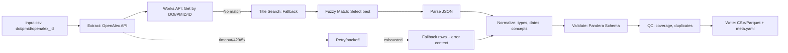

# Pipeline: `document_openalex`

> **Note**: Implementation status: **planned**. All file paths referencing `src/bioetl/` in this document describe the intended architecture and are not yet implemented in the codebase.

This document describes the `document_openalex` pipeline, which is responsible for extracting document metadata from OpenAlex Works API.

**Note:** This pipeline is not yet implemented. This document serves as a specification for its future implementation.

## 1. Identification

| Item              | Value                                                                                              | Status                |
| ----------------- | -------------------------------------------------------------------------------------------------- | --------------------- |
| **Pipeline Name** | `document_openalex`                                                                                 | Not Implemented       |
| **CLI Command**   | `python -m bioetl.cli.app document_openalex`                                                       | Not Implemented       |
| **Config File**   | [ref: repo:src/bioetl/configs/pipelines/openalex/document_openalex.yaml@refactoring_001]     | Not Implemented       |
| **CLI Registration** | [ref: repo:src/bioetl/cli/registry.py@refactoring_001]                                          | Not Implemented       |

## 2. Purpose and Scope

### Purpose

The `document_openalex` pipeline extracts publication metadata from OpenAlex Works API. OpenAlex is a free, open-source database of scholarly works with comprehensive metadata including citations, concepts, and open access status.

### Scope

The pipeline extracts:

- **Core metadata**: OpenAlex ID, DOI, PMID, title, abstract, publication dates
- **Bibliographic details**: journal/venue, type, language
- **Open access information**: OA status, OA URL, license
- **Author information**: authors list with ORCID IDs
- **Subject indexing**: concepts (top 3 by score), fields of study
- **Citation metrics**: citation counts (if available)

### Limitations

- Does not extract full-text articles
- Does not extract author affiliations
- Does not extract full reference lists
- Title-based search is used as fallback when DOI/PMID unavailable

### Non-Goals

- Full-text extraction
- Author affiliation extraction
- Complete citation network analysis
- Real-time updates (uses cached data)

## 3. Architecture and Data Flow



### Components

**Extract Stage:**

- OpenAlex Works API Client
- Cursor-based pagination
- TTL cache (24 hours)
- Circuit breaker
- Fallback manager

**Transform Stage:**

- JSON Parser (OpenAlex JSON format)
- Normalize: dates, concepts, OA status, authors
- Title search fallback with fuzzy matching

**Validate Stage:**

- Pandera schema validation
- QC coverage checks
- Duplicate detection

**Write Stage:**

- Atomic writer (run_id-scoped temp dirs)
- Canonical serialization (hash generation)
- Metadata builder (full provenance)

## 4. OpenAlex Works API

### Base URL

```text
https://api.openalex.org
```

### Endpoints

#### Get Work by ID

**Endpoint:** `GET /works/{work_id}`

**Purpose:** Retrieve a single work by OpenAlex ID, DOI, PMID, or MAG ID.

**Parameters:**

- `work_id`: OpenAlex ID (`W1234567890`), DOI (`https://doi.org/10.1234/example`), PMID (`pmid:12345678`), or MAG ID (`mag:1234567890`)

**Example:**

```bash
curl "https://api.openalex.org/works/https://doi.org/10.1234/example"
```

#### Get Works by IDs

**Endpoint:** `GET /works?filter={field}:{value}`

**Purpose:** Retrieve multiple works using filters.

**Parameters:**

- `filter`: Filter criteria (e.g., `doi:10.1234/example|pmid:12345678`)
- `per_page`: Number of results per page (max: 200, default: 25)
- `cursor`: Cursor for pagination (use `*` for first page)

**Example:**

```bash
curl "https://api.openalex.org/works?filter=doi:10.1234/example|10.5678/example&per_page=100&cursor=*"
```

#### Search Works

**Endpoint:** `GET /works?search={query}`

**Purpose:** Search works by title or other fields (fallback method).

**Parameters:**

- `search`: Search query (title, abstract, etc.)
- `per_page`: Number of results per page (max: 200)
- `cursor`: Cursor for pagination

**Example:**

```bash
curl "https://api.openalex.org/works?search=title:Machine%20Learning&per_page=100&cursor=*"
```

### Cursor-based Pagination

OpenAlex uses cursor-based pagination:

1. First request: `cursor=*`
2. Subsequent requests: `cursor={value_from_previous_response}`
3. Continue until `meta.next_cursor` is `null`

### Rate Limiting

**OpenAlex Policy:**

- No API key required (completely open service)
- "Reasonable use" policy
- Recommended: minimum 100ms between requests
- No official rate limit, but recommended: 10 requests/second

**Our Strategy:**

- Conservative: 10 requests/second with token bucket
- 2-4 workers for parallelism
- Exponential backoff on any errors

### Open Data Policy

OpenAlex is a completely open service:

- ✅ **Free**: no API keys
- ✅ **Generous limits**: "reasonable use"
- ✅ **Open data**: under CC0 license
- ✅ **Public code**: GitHub repository

### JSON Response Structure

**Example response:**

```json
{
  "id": "https://openalex.org/W1234567890",
  "doi": "https://doi.org/10.1371/journal.pone.0000000",
  "pmid": "12345678",
  "title": "Article Title Here",
  "abstract": "Abstract text...",
  "publication_date": "2023-03-15",
  "publication_year": 2023,
  "type": "article",
  "type_crossref": "journal-article",
  "language": "en",
  "is_oa": true,
  "oa_status": "gold",
  "oa_url": "https://journals.plos.org/plosone/article?id=10.1371/journal.pone.0000000",
  "concepts": [
    {"id": "C123", "display_name": "Machine Learning", "score": 0.95},
    {"id": "C456", "display_name": "Biology", "score": 0.82},
    {"id": "C789", "display_name": "Medicine", "score": 0.75}
  ],
  "primary_location": {
    "source": {"display_name": "PLoS ONE"},
    "is_oa": true
  }
}
```

### OA Status Values

Possible values for `oa_status`:

- `gold` — article in open access through publisher
- `green` — article available through repository
- `hybrid` — article in hybrid journal
- `bronze` — article available without license
- `closed` — article not in open access

### Concepts and Subject Areas

Extract top 3 concepts by score for `concepts_top3` field:

- Sort by `score` (descending)
- Select first 3 concepts
- Save as array or comma-separated string

### Title-based Search (Fallback)

When DOI or PMID is unavailable, use title-based search:

- Exact match by title
- Fuzzy matching if no exact match
- Select result with similarity score > threshold (default 0.8)

## 5. Configuration

### 5.1 Required Parameters

This pipeline follows the standard `docs/configs/00-typed-configs-and-profiles.md`.

Configuration file: `configs/pipelines/openalex-document.yaml` (`extends: "../base.yaml"`).

### 5.2 Main Configuration Overrides

| Section | Key | Value | Constraint | Comment |
|--------|------|----------|-------------|-------------|
| Pipeline | `pipeline.name` | `document_openalex` | — | Used in logs and `run_config.yaml`. |
| Sources / OpenAlex | `sources.openalex.base_url` | `https://api.openalex.org` | — | Base URL for OpenAlex Works API. |
| Sources / OpenAlex | `sources.openalex.rate_limit.max_calls_per_sec` | `10` | `≤ 10` | Conservative strategy: 10 requests/second. |
| Sources / OpenAlex | `sources.openalex.rate_limit.min_interval_ms` | `100` | `≥ 100` | Minimum 100ms between requests (official recommendation). |
| Sources / OpenAlex | `sources.openalex.workers` | `2-4` | `2-4` | Parallel threads for processing requests. |
| Sources / OpenAlex | `sources.openalex.batching.per_page` | `100` | `≤ 200` | Number of records per page with cursor pagination. |
| Sources / OpenAlex | `sources.openalex.batching.use_cursor` | `true` | — | Use cursor-based pagination (recommended). |
| Sources / OpenAlex | `sources.openalex.http.timeout_sec` | `60.0` | — | Timeout for HTTP requests. |
| Sources / OpenAlex | `sources.openalex.http.connect_timeout_sec` | `10.0` | — | Timeout for connection. |
| Sources / OpenAlex | `sources.openalex.http.read_timeout_sec` | `30.0` | — | Timeout for reading response. |
| Sources / OpenAlex | `sources.openalex.title_search.fuzzy` | `true` | — | Use fuzzy matching for title-based search (fallback). |
| Sources / OpenAlex | `sources.openalex.title_search.threshold` | `0.8` | `0–1` | Similarity threshold for selecting best match by title. |
| Cache | `cache.namespace` | `"openalex"` | Not empty | Ensures cache isolation. |
| Cache | `cache.ttl` | `86400` | — | Cache TTL in seconds (24 hours). |

### 5.3 CLI Overrides and Environment Variables

#### CLI Examples

- `--set sources.openalex.rate_limit.max_calls_per_sec=8` — reduce request limit.
- `--set sources.openalex.batching.per_page=200` — increase page size.
- `--set sources.openalex.title_search.threshold=0.85` — change similarity threshold for title search.

#### Environment Variables

- OpenAlex does not require API keys (completely open service).

### 5.4 Example Configuration

```yaml
extends:
  - ../profiles/base.yaml
  - ../profiles/determinism.yaml

pipeline:
  name: document_openalex
  entity: document
  version: "1.0.0"

materialization:
  root: "data/output"
  format: "parquet"
  pipeline_subdir: "document_openalex"

sources:
  openalex:
    base_url: "https://api.openalex.org"
    rate_limit:
      max_calls_per_sec: 10
      min_interval_ms: 100
      period: 1.0
    workers: 3
    batching:
      per_page: 100
      use_cursor: true
    http:
      timeout_sec: 60.0
      connect_timeout_sec: 10.0
      read_timeout_sec: 30.0
    title_search:
      fuzzy: true
      threshold: 0.8

cache:
  enabled: true
  namespace: "openalex"
  directory: "http_cache"
  ttl: 86400

determinism:
  enabled: true
  sort:
    by: ["openalex_id", "doi"]
    ascending: [true, true]
    na_position: "last"
  column_order:
    - "openalex_id"
    - "doi"
    - "pmid"
    - "title"
    - "publication_date"
    - "publication_year"
    - "type"
    - "type_crossref"
    - "language"
    - "is_oa"
    - "oa_status"
    - "oa_url"
    - "concepts_top3"
    - "source"
    - "run_id"
    - "git_commit"
    - "config_hash"
    - "pipeline_version"
    - "extracted_at"
    - "hash_business_key"
    - "hash_row"
    - "index"

qc:
  enabled: true
  min_doi_coverage: 0.8
  max_title_fallback_rate: 0.1
```

### 5.5 Validation Rules

- Uses `PipelineConfig.validate_yaml('configs/pipelines/openalex-document.yaml')`.

- Additional checks:
  - `sources.openalex.rate_limit.max_calls_per_sec` ≤ 10 (conservative strategy).
  - `sources.openalex.rate_limit.min_interval_ms` ≥ 100 (official recommendation).
  - `sources.openalex.batching.per_page` ≤ 200 (maximum page size).
  - `sources.openalex.workers` ≥ 1 and ≤ 4 (optimal range).
  - `sources.openalex.title_search.threshold` in range [0, 1].
  - `qc` thresholds cannot be negative and must be in range [0, 1].

### 5.6 Special Features

#### Configuration: Open Data Policy

OpenAlex — completely open service:

- ✅ **Free**: no API keys
- ✅ **Generous limits**: "reasonable use"
- ✅ **Open data**: under CC0 license
- ✅ **Public code**: GitHub repository

#### Configuration: Rate Limiting

**Official recommendations:**

- No more than 100K requests/day per IP
- Minimum 100ms between requests
- Do not use parallel requests in aggressive mode

**Our strategy:**

- 10 requests/second with token bucket
- 2-4 workers for parallelism
- Exponential backoff on any errors

#### Configuration: Cursor-based Pagination

For large lists, cursor-based pagination is recommended:

- First request: `cursor=*`
- Next requests: `cursor={value_from_previous_response}`

#### Configuration: Title-based Search (Fallback)

If no DOI or PMID, use title-based search:

- Exact match by title
- Fuzzy matching if no exact match
- Select result with score > threshold (default 0.8)

#### Configuration: OA Status

Possible values `oa_status`:

- `gold` — article in open access through publisher
- `green` — article available through repository
- `hybrid` — article in hybrid journal
- `bronze` — article available without license
- `closed` — article not in open access

#### Configuration: Concepts and Subject Areas

Extract top 3 concepts by score for `concepts_top3` field:

- Sort by `score` (descending)
- Select first 3 concepts
- Save as array or comma-separated string

## 6. Inputs (CLI/Configs/Profiles)

### CLI Flags

The pipeline supports the following standard CLI flags:

| Flag              | Description                                                                 |
| ----------------- | --------------------------------------------------------------------------- |
| `--config`        | Path to a pipeline-specific configuration file.                               |
| `--output-dir`    | Directory to write the output artifacts to.                                 |
| `--dry-run`       | Run the pipeline without writing any output.                                |
| `--limit`         | Limit the number of records to process.                                     |
| `--profile`       | Apply a configuration profile (e.g., `determinism`).                         |

### Configuration Merge Order

The configuration is loaded in the following order, with later sources overriding earlier ones:

1. **Base Profile:** `src/bioetl/configs/defaults/base.yaml`
2. **Profile:** e.g., `src/bioetl/configs/defaults/determinism.yaml` (activated by `--profile determinism`)
3. **Explicit Config:** The file specified by the `--config` flag.
4. **CLI Flags:** Any flags that override configuration values (e.g., `--limit`).

### Configuration Keys

The following table describes the expected keys in the `document_openalex.yaml` configuration file. See [ref: repo:src/bioetl/configs/models.py@refactoring_001] for the underlying configuration models.

| Key                             | Type    | Required | Default | Description                                                                 |
| ------------------------------- | ------- | -------- | ------- | --------------------------------------------------------------------------- |
| `pipeline.name`                 | string  | Yes      |         | The name of the pipeline (e.g., `document_openalex`).                           |
| `pipeline.version`              | string  | Yes      |         | The version of the pipeline.                                                |
| `sources.openalex.base_url`     | string  | No       | `https://api.openalex.org` | The base URL for OpenAlex API.                                           |
| `sources.openalex.rate_limit.max_calls_per_sec` | float | No       | `10.0`       | Rate limit (conservative strategy).                                 |
| `sources.openalex.rate_limit.min_interval_ms` | integer | No       | `100`     | Minimum interval between requests (official recommendation).                                   |
| `sources.openalex.workers`      | integer | No       | `3`       | Number of parallel workers (2-4 recommended).                                 |
| `sources.openalex.batching.per_page` | integer | No       | `100`       | Number of records per page (max: 200).                                 |
| `sources.openalex.batching.use_cursor` | boolean | No       | `true`       | Use cursor-based pagination (recommended).                                 |
| `sources.openalex.title_search.fuzzy` | boolean | No       | `true`       | Use fuzzy matching for title-based search (fallback).                                 |
| `sources.openalex.title_search.threshold` | float | No       | `0.8`       | Similarity threshold for title matching (0-1).                                 |
| `cache.namespace`                | string  | Yes      |         | Cache namespace for isolation.         |
| `cache.ttl`                      | integer | No       | `86400`  | Cache TTL in seconds (24 hours).         |
| `materialization.pipeline_subdir` | string  | Yes      |         | The subdirectory within the output directory to write artifacts to.         |

### Input Data Format

**Minimum Requirements:**

- At least one of: `doi`, `pmid`, or `openalex_id`

**Optional:**

- `title` (for fallback search if DOI/PMID unavailable)

**Pandera InputSchema:**

```python
class DocumentOpenAlexInputSchema(pa.DataFrameModel):
    doi: Series[str] = pa.Field(
        nullable=True,
        regex=r"^10\.\d+/[^\s]+$"
    )

    pmid: Series[int] = pa.Field(
        ge=1,
        nullable=True
    )

    openalex_id: Series[str] = pa.Field(
        nullable=True,
        regex=r"^W\d+$"
    )

    title: Series[str] = pa.Field(
        nullable=True
    )

    class Config:
        strict = True
        ordered = True
        coerce = True
```

## 6. Extraction (Client → Paginator → Parser)

The extraction process uses OpenAlex Works API components:

### Client

The `OpenAlexClient` ([ref: repo:src/bioetl/sources/openalex/client/client.py@refactoring_001]) handles:

- HTTP requests to OpenAlex API
- Timeouts, retries with exponential backoff
- Rate limiting (10 rps with token bucket)
- Cursor-based pagination

### Paginator

For large result sets:

1. **First request**: `cursor=*`
2. **Subsequent requests**: Use `meta.next_cursor` from previous response
3. Continue until `meta.next_cursor` is `null`

### Parser

The parser ([ref: repo:src/bioetl/sources/openalex/parser/parser.py@refactoring_001]) extracts:

- OpenAlex ID, DOI, PMID
- Title, abstract, publication dates
- Journal/venue, type, language
- OA status, OA URL, license
- Authors with ORCID IDs
- Concepts (top 3 by score)
- Citation metrics

### Title Search Fallback

If DOI or PMID unavailable:

1. **Exact match**: Search by title
2. **Fuzzy match**: If no exact match, use Jaccard similarity
3. **Select best**: Choose result with similarity > threshold (default: 0.8)
4. **Validate year**: If year available, ensure it matches

## 7. Normalization and Validation

### Normalizer

The `OpenAlexNormalizer` ([ref: repo:src/bioetl/sources/openalex/normalizer/normalizer.py@refactoring_001]) performs:

- Date normalization (ISO 8601 format)
- Concept extraction (top 3 by score)
- OA status normalization (gold, green, hybrid, bronze, closed)
- Author name formatting
- DOI validation and normalization

### Pandera Schema

A Pandera schema ([ref: repo:src/bioetl/sources/openalex/schema/schema.py@refactoring_001]) validates:

- Data types and constraints
- Required fields
- Business key uniqueness (OpenAlex ID or DOI)
- Column order
- Nullable policy

**Schema Configuration:**

- `strict=True`
- `ordered=True`
- `coerce=True`

## 8. Outputs and Determinism

### Artifact Format

The pipeline produces output files:

- `document_openalex_{date}.csv` or `.parquet` - Main dataset
- `document_openalex_{date}_quality_report.csv` - QC metrics
- `document_openalex_{date}_meta.yaml` - Metadata and provenance

### Sort Keys

Output data is sorted by:

- Primary: `openalex_id` (ascending)
- Secondary: `doi` (ascending)

### Hashing

Each row includes:

- `hash_row`: SHA-256 hash of entire row data
- `hash_business_key`: SHA-256 hash of business key (`openalex_id` or `doi`)

### Meta.yaml

The `meta.yaml` file contains:

```yaml
dataset: document_openalex
pipeline:
  name: document_openalex
  version: "1.0.0"
schema_version: "1.0.0"
column_order:
  - openalex_id
  - doi
  - pmid
  - title
  # ... (full column list)
row_count: 12345
business_key:
  - openalex_id
hash_algo: sha256
inputs:
  - input.csv
outputs:
  - document_openalex_20250128.csv
  - document_openalex_20250128_quality_report.csv
config_fingerprint: abc123...
generated_at_utc: "2025-01-28T12:00:00Z"
```

## 9. QC Metrics

The following QC metrics are collected and reported:

| Metric                  | Description                                                                 |
| ----------------------- | --------------------------------------------------------------------------- |
| `total_records`         | Total number of records processed.                |
| `successful_fetches`    | Number of successful API calls.                   |
| `failed_fetches`        | Number of failed API calls.            |
| `doi_coverage`          | Percentage of records with DOI.                 |
| `pmid_coverage`         | Percentage of records with PMID.                 |
| `title_coverage`        | Percentage of records with title.                 |
| `oa_status_coverage`    | Percentage of records with OA status.                 |
| `concepts_coverage`     | Percentage of records with concepts.                 |
| `title_fallback_rate`  | Percentage of records retrieved via title search.                 |
| `duplicate_count`       | Number of duplicate records (based on business key).            |
| `retry_events`          | Number of retry attempts.                 |

### QC Thresholds

Configuration thresholds:

- `qc.min_doi_coverage`: Minimum DOI coverage (default: 0.8)
- `qc.max_title_fallback_rate`: Maximum title fallback rate (default: 0.1)

## 10. Errors and Exit Codes

The pipeline uses the following exit codes:

| Exit Code | Category                | Description                                                                 |
| --------- | ----------------------- | --------------------------------------------------------------------------- |
| 0         | Success                 | The pipeline completed successfully.                                        |
| 1         | Application Error       | A fatal error occurred, such as a network error or a bug in the code.       |
| 2         | Usage Error             | An error occurred due to invalid configuration or command-line arguments.   |

### Error Handling

**Network Errors:**

- Retry with exponential backoff
- Maximum 5 retries
- Fallback to cached data if available

**API Errors:**

- 429 (Too Many Requests): Wait and retry with backoff
- 400 (Bad Request): Log error and skip record
- 404 (Not Found): Log warning and continue (may use title search)
- 500 (Server Error): Retry with backoff

**Validation Errors:**

- Schema validation failures: Log error and skip record
- QC threshold violations: Fail pipeline with detailed report

## 11. Usage Examples

### Minimal Run

```bash
python -m bioetl.cli.app document_openalex \
  --config configs/pipelines/openalex/document_openalex.yaml \
  --output-dir data/output/document_openalex
```

### Dry Run

```bash
python -m bioetl.cli.app document_openalex \
  --config configs/pipelines/openalex/document_openalex.yaml \
  --output-dir data/output/document_openalex \
  --dry-run
```

### With Determinism Profile

```bash
python -m bioetl.cli.app document_openalex \
  --config configs/pipelines/openalex/document_openalex.yaml \
  --output-dir data/output/document_openalex \
  --profile determinism
```

### Override Configuration

```bash
python -m bioetl.cli.app document_openalex \
  --config configs/pipelines/openalex/document_openalex.yaml \
  --output-dir data/output/document_openalex \
  --set sources.openalex.rate_limit.max_calls_per_sec=8 \
  --set sources.openalex.batching.per_page=200 \
  --set sources.openalex.title_search.threshold=0.85
```

## 12. References

- Configuration: [58-document-openalex-config.md](58-document-openalex-config.md)
- OpenAlex API: [OpenAlex API Documentation](https://docs.openalex.org/)
- OpenAlex Use Policy: [OpenAlex API Use Policy](https://docs.openalex.org/api-use-policy)
- ChEMBL Document Pipeline: [`docs/pipelines/document-chembl/09-document-chembl-extraction.md`](document-chembl/09-document-chembl-extraction.md)
