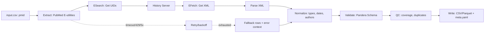

# Pipeline: `document_pubmed`

> **Note**: Implementation status: **planned**. All file paths referencing `src/bioetl/` in this document describe the intended architecture and are not yet implemented in the codebase.

This document describes the `document_pubmed` pipeline, which is responsible for extracting document metadata from PubMed E-utilities API.

**Note:** This pipeline is not yet implemented. This document serves as a specification for its future implementation.

## 1. Identification

| Item              | Value                                                                                              | Status                |
| ----------------- | -------------------------------------------------------------------------------------------------- | --------------------- |
| **Pipeline Name** | `document_pubmed`                                                                                 | Not Implemented       |
| **CLI Command**   | `python -m bioetl.cli.app document_pubmed`                                                       | Not Implemented       |
| **Config File**   | [ref: repo:src/bioetl/configs/pipelines/pubmed/document_pubmed.yaml@refactoring_001]     | Not Implemented       |
| **CLI Registration** | [ref: repo:src/bioetl/cli/registry.py@refactoring_001]                                          | Not Implemented       |

## 2. Purpose and Scope

### Purpose

The `document_pubmed` pipeline extracts publication metadata from PubMed E-utilities API. It provides a deterministic, reproducible way to retrieve bibliographic information including titles, abstracts, authors, journals, publication dates, and MeSH terms.

### Scope

The pipeline extracts:

- **Core metadata**: PMID, DOI, title, abstract, journal, publication dates
- **Bibliographic details**: volume, issue, pages, ISSN
- **Author information**: authors list
- **Subject indexing**: MeSH terms, chemicals, publication types

### Limitations

- Does not extract full-text articles
- Does not extract author affiliations
- Does not extract references/citations
- Relies on PMID or DOI for lookups (no title-based search in this pipeline)

### Non-Goals

- Full-text extraction
- Author affiliation extraction
- Citation network analysis
- Real-time updates (uses cached data)

## 3. Architecture and Data Flow



### Components

**Extract Stage:**

- PubMed E-utilities Client (ESearch, EPost, EFetch)
- History Server for batch operations
- TTL cache (24 hours)
- Circuit breaker
- Fallback manager

**Transform Stage:**

- XML Parser (PubMed XML format)
- Normalize: PMID, DOI, dates, authors, journal
- Type coercion and validation

**Validate Stage:**

- Pandera schema validation
- QC coverage checks
- Duplicate detection

**Write Stage:**

- Atomic writer (run_id-scoped temp dirs)
- Canonical serialization (hash generation)
- Metadata builder (full provenance)

## 4. PubMed E-utilities API

### Base URL

```text
https://eutils.ncbi.nlm.nih.gov/entrez/eutils
```

### Endpoints

#### ESearch

**Endpoint:** `GET /esearch.fcgi`

**Purpose:** Search PubMed database and retrieve UIDs.

**Parameters:**

- `db`: `pubmed` (required)
- `term`: Search query (required)
- `retmax`: Maximum number of results (default: 20, max: 10000)
- `retstart`: Starting position (for pagination)
- `usehistory`: `y` (recommended for large batches)

**Example:**

```bash
curl "https://eutils.ncbi.nlm.nih.gov/entrez/eutils/esearch.fcgi?db=pubmed&term=12345678[PMID]&retmax=1&usehistory=y"
```

#### EPost

**Endpoint:** `GET /epost.fcgi`

**Purpose:** Upload UIDs to History Server.

**Parameters:**

- `db`: `pubmed` (required)
- `id`: Comma-separated list of UIDs (required)
- `webenv`: Web environment (if updating existing history)

**Example:**

```bash
curl "https://eutils.ncbi.nlm.nih.gov/entrez/eutils/epost.fcgi?db=pubmed&id=12345678,23456789"
```

#### EFetch

**Endpoint:** `GET /efetch.fcgi` or `POST /efetch.fcgi`

**Purpose:** Retrieve full records in XML format.

**Parameters:**

- `db`: `pubmed` (required)
- `id`: Comma-separated list of UIDs (or use `query_key` and `webenv`)
- `rettype`: `abstract` or `medline` (default: `abstract`)
- `retmode`: `xml` (required)
- `query_key`: Query key from ESearch/EPost
- `webenv`: Web environment from ESearch/EPost
- `retstart`: Starting position (for pagination)
- `retmax`: Number of records per request (max: 200)

**Important:** For >200 UIDs, use POST method.

**Example:**

```bash
curl "https://eutils.ncbi.nlm.nih.gov/entrez/eutils/efetch.fcgi?db=pubmed&id=12345678&retmode=xml"
```

### History Server

The History Server reduces the number of requests for large batches:

1. **ESearch** or **EPost**: Upload UIDs, receive `query_key` and `webenv`
2. **EFetch**: Use `query_key` and `webenv` to retrieve records in batches

**Benefits:**

- Reduces API calls
- Allows pagination through large result sets
- More efficient for batches >200 records

### Rate Limiting

**Without API Key:**

- 3 requests per second (hard limit)
- NCBI policy strictly enforced

**With API Key:**

- 10 requests per second (hard limit)
- API key required in `tool` parameter

**Identification Parameters (Required):**

- `tool`: Application identifier (required)
- `email`: Contact email (required)
- `api_key`: API key for increased limits (optional)

**Important:** Without `tool` and `email`, NCBI will block requests!

### XML Parsing (DTD-compliant extraction paths)

**XML Structure (PubMed DTD):**
Hierarchy: `PubmedArticleSet` → `PubmedArticle` → `MedlineCitation` + `PubmedData`

**Key field extraction paths (XPath):**

- `PubMed.PMID` from `//MedlineCitation/PMID/text()`

- `PubMed.ArticleTitle` from `//Article/ArticleTitle`

- `PubMed.Abstract` from concatenated `//Abstract/AbstractText` with optional `@Label` or `@NlmCategory`

- `PubMed.Language[]` from `//Article/Language`

- `PubMed.JournalTitle` from `//Journal/Title`

- `PubMed.JournalISOAbbrev` from `//MedlineJournalInfo/MedlineTA`

- `PubMed.ISSN` from `//Journal/ISSN[@IssnType='Print' | @IssnType='Electronic']`

- `PubMed.Volume` from `//JournalIssue/Volume`

- `PubMed.Issue` from `//JournalIssue/Issue`

- `PubMed.StartPage/EndPage` from parsing `//Pagination/MedlinePgn` (e.g., "123-145")

- `PubMed.PublicationType[]` from `//PublicationTypeList/PublicationType`

- `PubMed.Year/Month/Day` from `//Article/Journal/JournalIssue/PubDate/*`

**DOI - multiple possible locations:**

Two possible locations in XML (depending on DTD version):

1. **Primary**: `//PubmedData/ArticleIdList/ArticleId[@IdType='doi']`

2. **Fallback**: `//Article/ELocationID[@EIdType='doi']`

Both locations should be checked and recorded in `doi_source` column for audit.

**Authors:**

`//AuthorList/Author` contains:

- `LastName`, `ForeName`, `Initials`
- `AffiliationInfo/Affiliation`
- `Identifier[@Source='ORCID']` (if available)

**MeSH Terminology:**

`//MeshHeadingList/MeshHeading`:

- `DescriptorName[@UI, @MajorTopicYN]`
- `QualifierName[@UI]`

**Chemical Substances:**

`//ChemicalList/Chemical`:

- `NameOfSubstance[@UI]`
- `RegistryNumber` (CAS number)

### Date Normalization

```python
def normalize_pubmed_date(year, month, day):
    """ISO YYYY-MM-DD with padding"""
    year = str(year).zfill(4) if year else "0000"
    month = str(month).zfill(2) if month else "00"
    day = str(day).zfill(2) if day else "00"
    return f"{year}-{month}-{day}"
```

### Error Handling

**404 Not Found for PMID:**

- Create "tombstone" record: `{pmid, error="NotFound", fetched_at}`
- Continue processing remaining records

**Timeout / 5xx errors:**

- Retries with cap (max 5 attempts)
- Log each attempt with context
- Final fallback to error records

**Malformed XML:**

- Save raw batch in `landing/`
- Emit `parse_error` with `xpath_context`
- Write to `qc/pubmed/errors.csv`

## 5. Configuration

### 5.1 Required Parameters

This pipeline follows the standard `docs/configs/00-typed-configs-and-profiles.md`.

Configuration file: `configs/pipelines/pubmed-document.yaml` (`extends: "../base.yaml"`).

### 5.2 Main Configuration Overrides

| Section | Key | Value | Constraint | Comment |
|--------|------|----------|-------------|-------------|
| Pipeline | `pipeline.name` | `document_pubmed` | — | Used in logs and `run_config.yaml`. |
| Sources / PubMed | `sources.pubmed.history.use_history` | `true` | — | Required for large batches. History Server reduces number of requests. |
| Sources / PubMed | `sources.pubmed.history.batch_size` | `200` | `≤ 200` | Recommended batch size for EFetch. For >200 UID POST is required. |
| Sources / PubMed | `sources.pubmed.rate_limit.max_calls_per_sec_without_key` | `3` | `≤ 3` | Without API key: 3 requests/second (NCBI policy). |
| Sources / PubMed | `sources.pubmed.rate_limit.max_calls_per_sec_with_key` | `10` | `≤ 10` | With API key: 10 requests/second (NCBI policy). |
| Sources / PubMed | `sources.pubmed.rate_limit.jitter` | `true` | — | Use jitter for exponential backoff. |
| Sources / PubMed | `sources.pubmed.workers` | `1` | `≤ 1` | NCBI does not welcome aggressive parallelism. |
| Sources / PubMed | `sources.pubmed.http.timeout_sec` | `60.0` | — | Timeout for HTTP requests. |
| Sources / PubMed | `sources.pubmed.http.connect_timeout_sec` | `10.0` | — | Timeout for connection. |
| Sources / PubMed | `sources.pubmed.http.read_timeout_sec` | `60.0` | — | Timeout for reading response. |
| Sources / PubMed | `sources.pubmed.http.identify.tool` | `"bioactivity_etl"` | — | Required application identifier parameter. |
| Sources / PubMed | `sources.pubmed.http.identify.email` | — | Not empty | Required contact email. |
| Sources / PubMed | `sources.pubmed.http.identify.api_key` | — | Optional | API key for increased limit to 10 rps. |
| Cache | `cache.namespace` | `"pubmed"` | Not empty | Ensures cache isolation. |
| Cache | `cache.ttl` | `86400` | — | Cache TTL in seconds (24 hours). |

### 5.3 CLI Overrides and Environment Variables

#### CLI Examples

- `--set sources.pubmed.history.batch_size=150` — change batch size for EFetch.
- `--set sources.pubmed.rate_limit.max_calls_per_sec_with_key=8` — reduce request limit.
- `--set sources.pubmed.http.identify.tool="my_app"` — change application identifier.

#### Environment Variables

- `PUBMED_TOOL` or `BIOETL_SOURCES__PUBMED__HTTP__IDENTIFY__TOOL` — application identifier (required).
- `PUBMED_EMAIL` or `BIOETL_SOURCES__PUBMED__HTTP__IDENTIFY__EMAIL` — contact email (required).
- `PUBMED_API_KEY` or `BIOETL_SOURCES__PUBMED__HTTP__IDENTIFY__API_KEY` — API key for increased limit (optional).

**Important:** Without `tool` and `email` parameters, NCBI will block requests!

### 5.4 Example Configuration

```yaml
extends:
  - ../profiles/base.yaml
  - ../profiles/determinism.yaml

pipeline:
  name: document_pubmed
  entity: document
  version: "1.0.0"

materialization:
  root: "data/output"
  format: "parquet"
  pipeline_subdir: "document_pubmed"

sources:
  pubmed:
    base_url: "https://eutils.ncbi.nlm.nih.gov/entrez/eutils"
    history:
      use_history: true
      batch_size: 200
    rate_limit:
      max_calls_per_sec_without_key: 3
      max_calls_per_sec_with_key: 10
      jitter: true
    workers: 1
    http:
      timeout_sec: 60.0
      connect_timeout_sec: 10.0
      read_timeout_sec: 60.0
      identify:
        tool: "bioactivity_etl"  # or from env: PUBMED_TOOL
        email: "contact@example.org"  # or from env: PUBMED_EMAIL
        api_key: null  # or from env: PUBMED_API_KEY

cache:
  enabled: true
  namespace: "pubmed"
  directory: "http_cache"
  ttl: 86400

determinism:
  enabled: true
  sort:
    by: ["pmid"]
    ascending: [true]
    na_position: "last"
  column_order:
    - "pmid"
    - "doi"
    - "title"
    - "abstract"
    - "journal"
    - "journal_iso_abbrev"
    - "issn"
    - "volume"
    - "issue"
    - "start_page"
    - "end_page"
    - "year"
    - "month"
    - "day"
    - "authors"
    - "mesh_terms"
    - "chemicals"
    - "publication_types"
    - "source"
    - "run_id"
    - "git_commit"
    - "config_hash"
    - "pipeline_version"
    - "extracted_at"
    - "hash_business_key"
    - "hash_row"
    - "index"

qc:
  enabled: true
  min_pmid_coverage: 0.95
  max_malformed_xml_rate: 0.01
```

### 5.5 Validation Rules

- Uses `PipelineConfig.validate_yaml('configs/pipelines/pubmed-document.yaml')`.

- Additional checks:
  - `sources.pubmed.history.batch_size` ≤ 200 (EFetch limit).
  - `sources.pubmed.rate_limit.max_calls_per_sec_with_key` ≤ 10 (NCBI policy).
  - `sources.pubmed.rate_limit.max_calls_per_sec_without_key` ≤ 3 (NCBI policy).
  - `sources.pubmed.workers` ≤ 1 (NCBI does not welcome aggressive parallelism).
  - `sources.pubmed.http.identify.tool` required and must not be empty.
  - `sources.pubmed.http.identify.email` required and must not be empty.
  - `qc` thresholds cannot be negative and must be in range [0, 1].

### 5.6 Special Features

#### History Server Usage

Using History Server (`use_history: true`) is recommended for large batches:

- Reduces number of requests
- Allows fetching "several hundred records in one EFetch"
- Pagination via `retstart`/`retmax`

#### Rate Limiting Configuration

- **Without API key**: 3 requests/second (strict NCBI limit)
- **With API key**: 10 requests/second (strict NCBI limit)
- Global token bucket limiter
- Exponential backoff with jitter on 429 errors

#### Batch Size

- **Recommendation**: 200 UID in EFetch
- **Acceptable**: several hundred per EFetch
- **POST required**: for >200 UID

## 6. Inputs (CLI/Configs/Profiles)

### CLI Flags

The pipeline supports the following standard CLI flags:

| Flag              | Description                                                                 |
| ----------------- | --------------------------------------------------------------------------- |
| `--config`        | Path to a pipeline-specific configuration file.                               |
| `--output-dir`    | Directory to write the output artifacts to.                                 |
| `--dry-run`       | Run the pipeline without writing any output.                                |
| `--limit`         | Limit the number of records to process.                                     |
| `--profile`       | Apply a configuration profile (e.g., `determinism`).                         |

### Configuration Merge Order

The configuration is loaded in the following order, with later sources overriding earlier ones:

1. **Base Profile:** `src/bioetl/configs/defaults/base.yaml`
2. **Profile:** e.g., `src/bioetl/configs/defaults/determinism.yaml` (activated by `--profile determinism`)
3. **Explicit Config:** The file specified by the `--config` flag.
4. **CLI Flags:** Any flags that override configuration values (e.g., `--limit`).

### Configuration Keys

The following table describes the expected keys in the `document_pubmed.yaml` configuration file. See [ref: repo:src/bioetl/configs/models.py@refactoring_001] for the underlying configuration models.

| Key                             | Type    | Required | Default | Description                                                                 |
| ------------------------------- | ------- | -------- | ------- | --------------------------------------------------------------------------- |
| `pipeline.name`                 | string  | Yes      |         | The name of the pipeline (e.g., `document_pubmed`).                           |
| `pipeline.version`              | string  | Yes      |         | The version of the pipeline.                                                |
| `sources.pubmed.base_url`       | string  | No       | `https://eutils.ncbi.nlm.nih.gov/entrez/eutils` | The base URL for PubMed E-utilities API.                                           |
| `sources.pubmed.history.use_history` | boolean | No       | `true`       | Enable History Server for batch operations.                                 |
| `sources.pubmed.history.batch_size` | integer | No       | `200`     | Maximum number of UIDs per EFetch request (max: 200).                                   |
| `sources.pubmed.rate_limit.max_calls_per_sec_without_key` | float | No       | `3.0`       | Rate limit without API key (NCBI policy).                                 |
| `sources.pubmed.rate_limit.max_calls_per_sec_with_key` | float | No       | `10.0`       | Rate limit with API key (NCBI policy).                                 |
| `sources.pubmed.rate_limit.jitter` | boolean | No       | `true`       | Use jitter for exponential backoff.                                 |
| `sources.pubmed.workers`        | integer | No       | `1`       | Number of parallel workers (max: 1, NCBI policy).                                 |
| `sources.pubmed.http.identify.tool` | string | Yes      |         | Application identifier (required).                                 |
| `sources.pubmed.http.identify.email` | string | Yes      |         | Contact email (required).                                 |
| `sources.pubmed.http.identify.api_key` | string | No       |         | API key for increased rate limits (optional).                                 |
| `cache.namespace`                | string  | Yes      |         | Cache namespace for isolation.         |
| `cache.ttl`                      | integer | No       | `86400`  | Cache TTL in seconds (24 hours).         |
| `materialization.pipeline_subdir` | string  | Yes      |         | The subdirectory within the output directory to write artifacts to.         |

### Input Data Format

**Minimum Requirements:**

- `pmid` (integer, unique) - PubMed ID

**Optional:**

- `doi` (string) - DOI for validation/cross-reference

**Pandera InputSchema:**

```python
class DocumentPubMedInputSchema(pa.DataFrameModel):
    pmid: Series[int] = pa.Field(
        ge=1,
        nullable=False,
        unique=True
    )

    doi: Series[str] = pa.Field(
        nullable=True,
        regex=r"^10\.\d+/[^\s]+$"
    )

    class Config:
        strict = True
        ordered = True
        coerce = True
```

## 6. Extraction (Client → History Server → EFetch → Parser)

The extraction process uses PubMed E-utilities components:

### Client Component

The `PubMedClient` ([ref: repo:src/bioetl/sources/pubmed/client/client.py@refactoring_001]) handles:

- HTTP requests to E-utilities endpoints
- Timeouts, retries with exponential backoff
- Rate limiting (3 rps without key, 10 rps with key)
- Identification parameters (`tool`, `email`, `api_key`)

### History Server Component

For batches >200 UIDs:

1. **EPost**: Upload UIDs, receive `webenv` and `query_key`
2. **EFetch**: Use `webenv` and `query_key` for paginated retrieval

### EFetch (Extraction)

Retrieves records in XML format:

- Batch size: up to 200 UIDs per request
- For >200 UIDs: use POST method
- XML parsing: `xml.etree.ElementTree` or `lxml`

### Parser

The parser ([ref: repo:src/bioetl/sources/pubmed/parser/parser.py@refactoring_001]) extracts:

- PMID, DOI, title, abstract
- Journal, volume, issue, pages, ISSN
- Publication dates (year, month, day)
- Authors list
- MeSH terms, chemicals, publication types

## 7. Normalization and Validation

### Normalizer

The `PubMedNormalizer` ([ref: repo:src/bioetl/sources/pubmed/normalizer/normalizer.py@refactoring_001]) performs:

- Date normalization (ISO 8601 format)
- Author name formatting (Last, First Middle)
- DOI validation and normalization
- Journal name standardization
- MeSH term extraction and formatting

### Pandera Schema

A Pandera schema ([ref: repo:src/bioetl/sources/pubmed/schema/schema.py@refactoring_001]) validates:

- Data types and constraints
- Required fields
- Business key uniqueness (PMID)
- Column order
- Nullable policy

**Schema Configuration:**

- `strict=True`
- `ordered=True`
- `coerce=True`

## 8. Outputs and Determinism

### Artifact Format

The pipeline produces output files:

- `document_pubmed_{date}.csv` or `.parquet` - Main dataset
- `document_pubmed_{date}_quality_report.csv` - QC metrics
- `document_pubmed_{date}_meta.yaml` - Metadata and provenance

### Sort Keys

Output data is sorted by:

- Primary: `pmid` (ascending)

### Hashing

Each row includes:

- `hash_row`: SHA-256 hash of entire row data
- `hash_business_key`: SHA-256 hash of business key (`pmid`)

### Meta.yaml

The `meta.yaml` file contains:

```yaml
dataset: document_pubmed
pipeline:
  name: document_pubmed
  version: "1.0.0"
schema_version: "1.0.0"
column_order:
  - pmid
  - doi
  - title
  # ... (full column list)
row_count: 12345
business_key:
  - pmid
hash_algo: sha256
inputs:
  - input.csv
outputs:
  - document_pubmed_20250128.csv
  - document_pubmed_20250128_quality_report.csv
config_fingerprint: abc123...
generated_at_utc: "2025-01-28T12:00:00Z"
```

## 9. QC Metrics

The following QC metrics are collected and reported:

| Metric                  | Description                                                                 |
| ----------------------- | --------------------------------------------------------------------------- |
| `total_records`         | Total number of records processed.                |
| `successful_fetches`    | Number of successful API calls.                   |
| `failed_fetches`        | Number of failed API calls.            |
| `pmid_coverage`         | Percentage of input PMIDs successfully retrieved.                         |
| `doi_coverage`          | Percentage of records with DOI.                 |
| `title_coverage`        | Percentage of records with title.                 |
| `abstract_coverage`     | Percentage of records with abstract.                 |
| `duplicate_count`       | Number of duplicate records (based on PMID).            |
| `malformed_xml_count`   | Number of records with malformed XML.                         |
| `retry_events`          | Number of retry attempts.                 |

### QC Thresholds

Configuration thresholds:

- `qc.min_pmid_coverage`: Minimum PMID coverage (default: 0.95)
- `qc.max_malformed_xml_rate`: Maximum malformed XML rate (default: 0.01)

## 10. Errors and Exit Codes

The pipeline uses the following exit codes:

| Exit Code | Category                | Description                                                                 |
| --------- | ----------------------- | --------------------------------------------------------------------------- |
| 0         | Success                 | The pipeline completed successfully.                                        |
| 1         | Application Error       | A fatal error occurred, such as a network error or a bug in the code.       |
| 2         | Usage Error             | An error occurred due to invalid configuration or command-line arguments.   |

### Error Handling Details

**Network Errors:**

- Retry with exponential backoff
- Maximum 5 retries
- Fallback to cached data if available

**API Errors:**

- 429 (Too Many Requests): Wait and retry with backoff
- 400 (Bad Request): Log error and skip record
- 404 (Not Found): Log warning and continue
- 500 (Server Error): Retry with backoff

**Validation Errors:**

- Schema validation failures: Log error and skip record
- QC threshold violations: Fail pipeline with detailed report

## 11. Usage Examples

### Minimal Run

```bash
python -m bioetl.cli.app document_pubmed \
  --config configs/pipelines/pubmed/document_pubmed.yaml \
  --output-dir data/output/document_pubmed
```

### Dry Run

```bash
python -m bioetl.cli.app document_pubmed \
  --config configs/pipelines/pubmed/document_pubmed.yaml \
  --output-dir data/output/document_pubmed \
  --dry-run
```

### With Determinism Profile

```bash
python -m bioetl.cli.app document_pubmed \
  --config configs/pipelines/pubmed/document_pubmed.yaml \
  --output-dir data/output/document_pubmed \
  --profile determinism
```

### With Environment Variables

```bash
export PUBMED_TOOL="bioactivity_etl"
export PUBMED_EMAIL="contact@example.org"
export PUBMED_API_KEY="your_api_key_here"

python -m bioetl.cli.app document_pubmed \
  --config configs/pipelines/pubmed/document_pubmed.yaml \
  --output-dir data/output/document_pubmed
```

### Override Configuration

```bash
python -m bioetl.cli.app document_pubmed \
  --config configs/pipelines/pubmed/document_pubmed.yaml \
  --output-dir data/output/document_pubmed \
  --set sources.pubmed.history.batch_size=150 \
  --set sources.pubmed.rate_limit.max_calls_per_sec_with_key=8
```

## 12. References

- Configuration: [50-document-pubmed-config.md](50-document-pubmed-config.md)
- PubMed E-utilities: [NCBI E-utilities Documentation](https://www.ncbi.nlm.nih.gov/books/NBK25497/)
- PubMed XML DTD: [PubMed XML DTD](https://dtd.nlm.nih.gov/ncbi/pubmed/doc/)
- ChEMBL Document Pipeline: [`docs/pipelines/document-chembl/09-document-chembl-extraction.md`](document-chembl/09-document-chembl-extraction.md)
