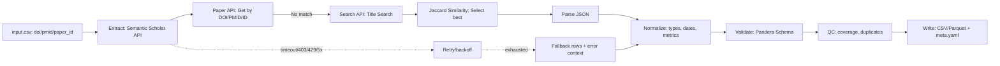

# Pipeline: `document_semantic_scholar`

> **Note**: Implementation status: **planned**. All file paths referencing `src/bioetl/` in this document describe the intended architecture and are not yet implemented in the codebase.

This document describes the `document_semantic_scholar` pipeline, which is responsible for extracting document metadata from Semantic Scholar Graph API.

**Note:** This pipeline is not yet implemented. This document serves as a specification for its future implementation.

## 1. Identification

| Item              | Value                                                                                              | Status                |
| ----------------- | -------------------------------------------------------------------------------------------------- | --------------------- |
| **Pipeline Name** | `document_semantic_scholar`                                                                                 | Not Implemented       |
| **CLI Command**   | `python -m bioetl.cli.main document_semantic_scholar`                                                       | Not Implemented       |
| **Config File**   | [ref: repo:src/bioetl/configs/pipelines/semantic-scholar/document_semantic_scholar.yaml@refactoring_001]     | Not Implemented       |
| **CLI Registration** | [ref: repo:src/bioetl/cli/registry.py@refactoring_001]                                          | Not Implemented       |

## 2. Purpose and Scope

### Purpose

The `document_semantic_scholar` pipeline extracts publication metadata from Semantic Scholar Graph API. Semantic Scholar provides comprehensive bibliographic data including citation metrics, abstract, and fields of study.

### Scope

The pipeline extracts:

- **Core metadata**: Paper ID, DOI, PMID, title, abstract, venue, publication dates
- **Citation metrics**: citation count, influential citation count, reference count
- **Bibliographic details**: year, publication date, type
- **Subject indexing**: fields of study, publication types
- **Open access information**: open access status

### Limitations

- Does not extract full-text articles
- Does not extract author affiliations
- Does not extract reference lists
- Requires API key for production use (highly recommended)
- Title-based search used as fallback when DOI/PMID unavailable

### Non-Goals

- Full-text extraction
- Author affiliation extraction
- Complete citation network analysis
- Real-time updates (uses cached data)

## 3. Architecture and Data Flow



### Components

**Extract Stage:**

- Semantic Scholar Graph API Client
- Paper API (by ID/DOI/PMID)
- Search API (title-based fallback)
- TTL cache (1 hour, data updates frequently)
- Circuit breaker
- Fallback manager
- Access Denied handler

**Transform Stage:**

- JSON Parser (Semantic Scholar JSON format)
- Normalize: dates, citation metrics, fields of study
- Title search fallback with Jaccard similarity

**Validate Stage:**

- Pandera schema validation
- QC coverage checks
- Duplicate detection

**Write Stage:**

- Atomic writer (run_id-scoped temp dirs)
- Canonical serialization (hash generation)
- Metadata builder (full provenance)

## 4. Semantic Scholar Graph API

### Base URL

```text
https://api.semanticscholar.org/graph/v1
```

### Endpoints

#### Get Paper by ID

**Endpoint:** `GET /paper/{paper_id}`

**Purpose:** Retrieve a single paper by Semantic Scholar ID, DOI, or PMID.

**Parameters:**

- `paper_id`: Semantic Scholar ID (`CorpusId:123456`), DOI (`DOI:10.1234/example`), or PMID (`PMID:12345678`)
- `fields`: Comma-separated list of fields to retrieve (optional)

**Headers:**

- `x-api-key`: API key (required for production use)

**Example:**

```bash
curl -H "x-api-key: your_api_key" \
  "https://api.semanticscholar.org/graph/v1/paper/DOI:10.1234/example"
```

#### Get Papers by IDs

**Endpoint:** `POST /paper/batch`

**Purpose:** Retrieve multiple papers by IDs in a single request.

**Parameters:**

- `ids`: Array of paper IDs (DOIs, PMIDs, or Semantic Scholar IDs)

**Headers:**

- `x-api-key`: API key (required for production use)
- `Content-Type`: `application/json`

**Body:**

```json
{
  "ids": ["DOI:10.1234/example1", "DOI:10.5678/example2"]
}
```

**Example:**

```bash
curl -X POST \
  -H "x-api-key: your_api_key" \
  -H "Content-Type: application/json" \
  -d '{"ids":["DOI:10.1234/example1","DOI:10.5678/example2"]}' \
  "https://api.semanticscholar.org/graph/v1/paper/batch"
```

#### Search Papers

**Endpoint:** `GET /paper/search`

**Purpose:** Search papers by title or other fields (fallback method).

**Parameters:**

- `query`: Search query (title, abstract, etc.)
- `limit`: Number of results (max: 100, default: 10)
- `fields`: Comma-separated list of fields to retrieve

**Headers:**

- `x-api-key`: API key (required for production use)

**Example:**

```bash
curl -H "x-api-key: your_api_key" \
  "https://api.semanticscholar.org/graph/v1/paper/search?query=Machine%20Learning&limit=10"
```

### API Key Requirement

**Without API Key (Free Tier):**

- 100 requests per 5 minutes
- 100K requests per month per email
- Rate limit: ~0.33 requests/second

**With API Key (Premium Tier):**

- 5000 requests per 5 minutes
- No monthly limit
- Rate limit: ~16 requests/second

**⚠️ API key is required for production use!** Without a key, limits are very low.

### Rate Limiting

**Our Strategy (Conservative):**

- Default: 0.33 requests/second (without key)
- With API key: 10 requests/second with burst up to 15
- Workers: 1-2 parallel threads
- Timeout: 30s

### Access Denied Handling

Semantic Scholar may return 403 (Access Denied) when:

- Rate limit exceeded
- API key invalid or expired
- Suspicious activity detected

**Handling Strategy:**

- Wait 5 minutes (minimum)
- Maximum 2 retries
- Log each occurrence
- Set QC flag: `qc_flag_s2_access_denied=1`

### JSON Response Structure

**Example response:**

```json
{
  "paperId": "1234567890abcdef",
  "externalIds": {
    "DOI": "10.1371/journal.pone.0000000",
    "PMID": "12345678"
  },
  "title": "Article Title Here",
  "abstract": "Abstract text...",
  "venue": "PLoS ONE",
  "year": 2023,
  "publicationDate": "2023-03-15",
  "referenceCount": 45,
  "citationCount": 120,
  "influentialCitationCount": 5,
  "isOpenAccess": true,
  "publicationTypes": ["JournalArticle"],
  "fieldsOfStudy": ["Medicine", "Biology"]
}
```

### Citation Metrics

Unique Semantic Scholar metrics:

- `citation_count`: total number of citations
- `influential_citations`: influential citations
- `reference_count`: number of references

### Title-based Search (Critical Fallback)

If no DOI or PMID, use title-based search via Search API:

- Exact match by title
- Jaccard similarity on words
- Select result with score > threshold (default 0.85)
- Validate year match if available

### Publication Types Normalization

```python
def normalize_publication_types(types_list):
    """Normalize publication types"""
    if not types_list:
        return []
    
    normalized = [t.lower() for t in types_list]
    return normalized
```

### Licensing

⚠️ **Important:** Semantic Scholar Metadata License

- Non-commercial use OK
- Commercial use requires special agreement
- Attribution required: "Data from Semantic Scholar"
- Terms: <https://www.semanticscholar.org/product/api/api-terms-of-use>

**In production:** consult with legal team!

## 5. Configuration

### 5.1 Required Parameters

This pipeline follows the standard `docs/configs/00-typed-configs-and-profiles.md`.

Configuration file: `configs/pipelines/semantic-scholar-document.yaml` (`extends: "../base.yaml"`).

### 5.2 Main Configuration Overrides

| Section | Key | Value | Constraint | Comment |
|--------|------|----------|-------------|-------------|
| Pipeline | `pipeline.name` | `document_semantic_scholar` | — | Used in logs and `run_config.yaml`. |
| Sources / Semantic Scholar | `sources.semantic_scholar.base_url` | `https://api.semanticscholar.org/graph/v1` | — | Base URL for Semantic Scholar Graph API. |
| Sources / Semantic Scholar | `sources.semantic_scholar.api_key` | — | Required for production | API key for Semantic Scholar. |
| Sources / Semantic Scholar | `sources.semantic_scholar.rate_limit.max_calls_per_sec_without_key` | `0.33` | `≤ 0.33` | Without API key: ~0.33 requests/second (100 requests/5 minutes). |
| Sources / Semantic Scholar | `sources.semantic_scholar.rate_limit.max_calls_per_sec_with_key` | `10` | `≤ 16` | With API key: ~10 requests/second with burst up to 15 (5000 requests/5 minutes). |
| Sources / Semantic Scholar | `sources.semantic_scholar.rate_limit.burst_capacity` | `15` | — | Maximum number of requests in burst (only with API key). |
| Sources / Semantic Scholar | `sources.semantic_scholar.workers` | `1-2` | `1-2` | Parallel threads for processing requests. |
| Sources / Semantic Scholar | `sources.semantic_scholar.http.timeout_sec` | `30.0` | — | Timeout for HTTP requests. |
| Sources / Semantic Scholar | `sources.semantic_scholar.http.connect_timeout_sec` | `10.0` | — | Timeout for connection. |
| Sources / Semantic Scholar | `sources.semantic_scholar.http.read_timeout_sec` | `30.0` | — | Timeout for reading response. |
| Sources / Semantic Scholar | `sources.semantic_scholar.title_search.enabled` | `true` | — | Use title-based search as fallback. |
| Sources / Semantic Scholar | `sources.semantic_scholar.title_search.max_results` | `10` | — | Maximum number of results for title search. |
| Sources / Semantic Scholar | `sources.semantic_scholar.title_search.threshold` | `0.85` | `0–1` | Similarity threshold for selecting best match by title (Jaccard similarity). |
| Sources / Semantic Scholar | `sources.semantic_scholar.access_denied.wait_time_sec` | `300` | — | Wait time on Access Denied (5 minutes). |
| Sources / Semantic Scholar | `sources.semantic_scholar.access_denied.max_retries` | `2` | — | Maximum number of retry attempts on Access Denied. |
| Cache | `cache.namespace` | `"semantic_scholar"` | Not empty | Ensures cache isolation. |
| Cache | `cache.ttl` | `3600` | — | Cache TTL in seconds (1 hour, data updates frequently). |
| QC | `qc.max_s2_access_denied` | `0.05` | `0–1` | Control Semantic Scholar blocks (maximum proportion of records with Access Denied). |

### 5.3 CLI Overrides and Environment Variables

#### CLI Examples

- `--set sources.semantic_scholar.rate_limit.max_calls_per_sec_with_key=8` — reduce request limit.
- `--set sources.semantic_scholar.title_search.threshold=0.9` — increase similarity threshold for title search.
- `--set qc.max_s2_access_denied=0.1` — change threshold for QC Access Denied check.

#### Environment Variables

- `SEMANTIC_SCHOLAR_API_KEY` or `BIOETL_SOURCES__SEMANTIC_SCHOLAR__API_KEY` — API key for Semantic Scholar (required for production).

**Important:** API key is required for production use! Without a key, limits are very low (100 requests/5 minutes).

### 5.4 Example Configuration

```yaml
extends:
  - ../profiles/base.yaml
  - ../profiles/determinism.yaml

pipeline:
  name: document_semantic_scholar
  entity: document
  version: "1.0.0"

materialization:
  root: "data/output"
  format: "parquet"
  pipeline_subdir: "document_semantic_scholar"

sources:
  semantic_scholar:
    base_url: "https://api.semanticscholar.org/graph/v1"
    api_key: null  # required from env: SEMANTIC_SCHOLAR_API_KEY
    rate_limit:
      max_calls_per_sec_without_key: 0.33
      max_calls_per_sec_with_key: 10
      burst_capacity: 15
      period: 1.0
    workers: 2
    http:
      timeout_sec: 30.0
      connect_timeout_sec: 10.0
      read_timeout_sec: 30.0
      headers:
        x-api-key: null  # from env: SEMANTIC_SCHOLAR_API_KEY
    title_search:
      enabled: true
      max_results: 10
      threshold: 0.85
    access_denied:
      wait_time_sec: 300
      max_retries: 2

cache:
  enabled: true
  namespace: "semantic_scholar"
  directory: "http_cache"
  ttl: 3600

determinism:
  enabled: true
  sort:
    by: ["paper_id", "doi", "pmid"]
    ascending: [true, true, true]
    na_position: "last"
  column_order:
    - "paper_id"
    - "doi"
    - "pmid"
    - "title"
    - "abstract"
    - "venue"
    - "year"
    - "publication_date"
    - "reference_count"
    - "citation_count"
    - "influential_citation_count"
    - "is_open_access"
    - "publication_types"
    - "fields_of_study"
    - "source"
    - "run_id"
    - "git_commit"
    - "config_hash"
    - "pipeline_version"
    - "extracted_at"
    - "hash_business_key"
    - "hash_row"
    - "index"

qc:
  enabled: true
  max_s2_access_denied: 0.05
  min_paper_id_coverage: 0.9
  max_title_fallback_rate: 0.15
```

### 5.5 Validation Rules

- Uses `PipelineConfig.validate_yaml('configs/pipelines/semantic-scholar-document.yaml')`.

- Additional checks:
  - `sources.semantic_scholar.api_key` required for production (can be overridden via env).
  - `sources.semantic_scholar.rate_limit.max_calls_per_sec_without_key` ≤ 0.33 (limit without key).
  - `sources.semantic_scholar.rate_limit.max_calls_per_sec_with_key` ≤ 16 (limit with key).
  - `sources.semantic_scholar.workers` ≥ 1 and ≤ 2 (optimal range).
  - `sources.semantic_scholar.title_search.threshold` in range [0, 1].
  - `sources.semantic_scholar.access_denied.wait_time_sec` ≥ 300 (minimum 5 minutes).
  - `qc.max_s2_access_denied` in range [0, 1].
  - `qc` thresholds cannot be negative and must be in range [0, 1].

### 5.6 Special Features

#### API Key Requirement Details

**Basic (without API key):**

- 100 requests/5 minutes
- 100K requests/month per email
- Rate limit: ~0.33 requests/second

**Premium (with API key):**

- 5000 requests/5 minutes
- No monthly limit
- Rate limit: ~16 requests/second

**API key is required for production use!**

#### Rate Limiting Configuration

**Our strategy (conservative):**

- Default: 0.8 requests/second (1.25s between requests) without key
- With API key: 10 requests/second with burst up to 15
- Workers: 1-2 parallel threads
- Timeout: 30s

#### Title-based Search (Critical Fallback) - Implementation

If no DOI or PMID, use title-based search via Search API:

- Exact match by title
- Jaccard similarity on words
- Select result with score > threshold (default 0.85)
- Validate year match if available

#### Citation Metrics - Details

Unique Semantic Scholar metrics:

- `citation_count`: total number of citations
- `influential_citations`: influential citations
- `reference_count`: number of references

#### Access Denied Handling - Implementation

When receiving Access Denied (403):

- Wait 5 minutes (minimum)
- Maximum 2 retry attempts
- Log each occurrence
- QC flag: `qc_flag_s2_access_denied=1`

#### Licensing - Terms

⚠️ **Important:** Semantic Scholar Metadata License

- Non-commercial use OK
- Commercial use requires special agreement
- Attribution required: "Data from Semantic Scholar"
- Terms: <https://www.semanticscholar.org/product/api/api-terms-of-use>

**In production:** consult with legal team!

## 6. Inputs (CLI/Configs/Profiles)

### CLI Flags

The pipeline supports the following standard CLI flags:

| Flag              | Description                                                                 |
| ----------------- | --------------------------------------------------------------------------- |
| `--config`        | Path to a pipeline-specific configuration file.                               |
| `--output-dir`    | Directory to write the output artifacts to.                                 |
| `--dry-run`       | Run the pipeline without writing any output.                                |
| `--limit`         | Limit the number of records to process.                                     |
| `--profile`       | Apply a configuration profile (e.g., `determinism`).                         |

### Configuration Merge Order

The configuration is loaded in the following order, with later sources overriding earlier ones:

1. **Base Profile:** `src/bioetl/configs/profiles/base.yaml`
2. **Profile:** e.g., `src/bioetl/configs/profiles/determinism.yaml` (activated by `--profile determinism`)
3. **Explicit Config:** The file specified by the `--config` flag.
4. **CLI Flags:** Any flags that override configuration values (e.g., `--limit`).

### Configuration Keys

The following table describes the expected keys in the `document_semantic_scholar.yaml` configuration file. See [ref: repo:src/bioetl/configs/models.py@refactoring_001] for the underlying configuration models.

| Key                             | Type    | Required | Default | Description                                                                 |
| ------------------------------- | ------- | -------- | ------- | --------------------------------------------------------------------------- |
| `pipeline.name`                 | string  | Yes      |         | The name of the pipeline (e.g., `document_semantic_scholar`).                           |
| `pipeline.version`              | string  | Yes      |         | The version of the pipeline.                                                |
| `sources.semantic_scholar.base_url`     | string  | No       | `https://api.semanticscholar.org/graph/v1` | The base URL for Semantic Scholar API.                                           |
| `sources.semantic_scholar.api_key` | string | No       |         | API key for Semantic Scholar (required for production).                                 |
| `sources.semantic_scholar.rate_limit.max_calls_per_sec_without_key` | float | No       | `0.33`       | Rate limit without API key.                                 |
| `sources.semantic_scholar.rate_limit.max_calls_per_sec_with_key` | float | No       | `10.0`       | Rate limit with API key.                                 |
| `sources.semantic_scholar.rate_limit.burst_capacity` | integer | No       | `15`       | Maximum number of requests in burst (with API key).                                 |
| `sources.semantic_scholar.workers`      | integer | No       | `2`       | Number of parallel workers (1-2 recommended).                                 |
| `sources.semantic_scholar.title_search.enabled` | boolean | No       | `true`       | Enable title-based search as fallback.                                 |
| `sources.semantic_scholar.title_search.max_results` | integer | No       | `10`       | Maximum number of results for title search.                                 |
| `sources.semantic_scholar.title_search.threshold` | float | No       | `0.85`       | Similarity threshold for title matching (Jaccard similarity, 0-1).                                 |
| `sources.semantic_scholar.access_denied.wait_time_sec` | integer | No       | `300`       | Wait time on Access Denied (5 minutes minimum).                                 |
| `sources.semantic_scholar.access_denied.max_retries` | integer | No       | `2`       | Maximum retries on Access Denied.                                 |
| `cache.namespace`                | string  | Yes      |         | Cache namespace for isolation.         |
| `cache.ttl`                      | integer | No       | `3600`  | Cache TTL in seconds (1 hour, data updates frequently).         |
| `materialization.pipeline_subdir` | string  | Yes      |         | The subdirectory within the output directory to write artifacts to.         |

### Input Data Format

**Minimum Requirements:**

- At least one of: `doi`, `pmid`, or `paper_id`

**Optional:**

- `title` (for fallback search if DOI/PMID unavailable)

**Pandera InputSchema:**

```python
class DocumentSemanticScholarInputSchema(pa.DataFrameModel):
    doi: Series[str] = pa.Field(
        nullable=True,
        regex=r"^10\.\d+/[^\s]+$"
    )
    
    pmid: Series[int] = pa.Field(
        ge=1,
        nullable=True
    )
    
    paper_id: Series[str] = pa.Field(
        nullable=True,
        regex=r"^(CorpusId|DOI|PMID):.+$"
    )
    
    title: Series[str] = pa.Field(
        nullable=True
    )

    class Config:
        strict = True
        ordered = True
        coerce = True
```

## 6. Extraction (Client → Paper API → Search API → Parser)

The extraction process uses Semantic Scholar Graph API components:

### Client Component

The `SemanticScholarClient` ([ref: repo:src/bioetl/sources/semantic_scholar/client/client.py@refactoring_001]) handles:

- HTTP requests to Semantic Scholar API
- Timeouts, retries with exponential backoff
- Rate limiting (0.33 rps without key, 10 rps with key)
- API key authentication
- Access Denied handling

### Paper API

For direct lookups:

1. **Primary**: Try by DOI (`DOI:10.1234/example`)
2. **Secondary**: Try by PMID (`PMID:12345678`)
3. **Tertiary**: Try by Semantic Scholar ID (`CorpusId:123456`)

### Search API (Fallback)

If DOI/PMID unavailable:

1. **Search**: Use title-based search
2. **Jaccard Similarity**: Calculate similarity scores
3. **Select best**: Choose result with similarity > threshold (default: 0.85)
4. **Validate year**: If year available, ensure it matches

### Parser

The parser ([ref: repo:src/bioetl/sources/semantic_scholar/parser/parser.py@refactoring_001]) extracts:

- Paper ID, DOI, PMID
- Title, abstract, venue
- Publication dates, year
- Citation metrics (citation count, influential citations, reference count)
- Fields of study, publication types
- Open access status

## 7. Normalization and Validation

### Normalizer

The `SemanticScholarNormalizer` ([ref: repo:src/bioetl/sources/semantic_scholar/normalizer/normalizer.py@refactoring_001]) performs:

- Date normalization (ISO 8601 format)
- DOI validation and normalization
- Citation metrics normalization
- Fields of study extraction and formatting
- Publication type standardization

### Pandera Schema

A Pandera schema ([ref: repo:src/bioetl/sources/semantic_scholar/schema/schema.py@refactoring_001]) validates:

- Data types and constraints
- Required fields
- Business key uniqueness (paper_id or DOI)
- Column order
- Nullable policy

**Schema Configuration:**

- `strict=True`
- `ordered=True`
- `coerce=True`

## 8. Outputs and Determinism

### Artifact Format

The pipeline produces output files:

- `document_semantic_scholar_{date}.csv` or `.parquet` - Main dataset
- `document_semantic_scholar_{date}_quality_report.csv` - QC metrics
- `document_semantic_scholar_{date}_meta.yaml` - Metadata and provenance

### Sort Keys

Output data is sorted by:

- Primary: `paper_id` (ascending)
- Secondary: `doi` (ascending)
- Tertiary: `pmid` (ascending)

### Hashing

Each row includes:

- `hash_row`: SHA-256 hash of entire row data
- `hash_business_key`: SHA-256 hash of business key (`paper_id` or `doi`)

### Meta.yaml

The `meta.yaml` file contains:

```yaml
dataset: document_semantic_scholar
pipeline:
  name: document_semantic_scholar
  version: "1.0.0"
schema_version: "1.0.0"
column_order:
  - paper_id
  - doi
  - pmid
  - title
  # ... (full column list)
row_count: 12345
business_key:
  - paper_id
hash_algo: sha256
inputs:
  - input.csv
outputs:
  - document_semantic_scholar_20250128.csv
  - document_semantic_scholar_20250128_quality_report.csv
config_fingerprint: abc123...
generated_at_utc: "2025-01-28T12:00:00Z"
```

## 9. QC Metrics

The following QC metrics are collected and reported:

| Metric                  | Description                                                                 |
| ----------------------- | --------------------------------------------------------------------------- |
| `total_records`         | Total number of records processed.                |
| `successful_fetches`    | Number of successful API calls.                   |
| `failed_fetches`        | Number of failed API calls.            |
| `paper_id_coverage`     | Percentage of records with Semantic Scholar paper ID.                 |
| `doi_coverage`          | Percentage of records with DOI.                 |
| `pmid_coverage`         | Percentage of records with PMID.                 |
| `title_coverage`        | Percentage of records with title.                 |
| `citation_count_coverage` | Percentage of records with citation count.                 |
| `title_fallback_rate`  | Percentage of records retrieved via title search.                 |
| `s2_access_denied_rate` | Percentage of records with Access Denied (403).                 |
| `duplicate_count`       | Number of duplicate records (based on business key).            |
| `retry_events`          | Number of retry attempts.                 |

### QC Thresholds

Configuration thresholds:

- `qc.max_s2_access_denied`: Maximum Access Denied rate (default: 0.05)
- `qc.min_paper_id_coverage`: Minimum paper ID coverage (default: 0.9)
- `qc.max_title_fallback_rate`: Maximum title fallback rate (default: 0.15)

## 10. Errors and Exit Codes

The pipeline uses the following exit codes:

| Exit Code | Category                | Description                                                                 |
| --------- | ----------------------- | --------------------------------------------------------------------------- |
| 0         | Success                 | The pipeline completed successfully.                                        |
| 1         | Application Error       | A fatal error occurred, such as a network error or a bug in the code.       |
| 2         | Usage Error             | An error occurred due to invalid configuration or command-line arguments.   |

### Error Handling Details

**Network Errors:**

- Retry with exponential backoff
- Maximum 5 retries
- Fallback to cached data if available

**API Errors:**

- 403 (Access Denied): Wait 5 minutes, retry (max 2 times)
- 429 (Too Many Requests): Wait and retry with backoff
- 400 (Bad Request): Log error and skip record
- 404 (Not Found): Log warning and continue (may use title search)
- 500 (Server Error): Retry with backoff

**Validation Errors:**

- Schema validation failures: Log error and skip record
- QC threshold violations: Fail pipeline with detailed report

## 11. Usage Examples

### Minimal Run

```bash
python -m bioetl.cli.main document_semantic_scholar \
  --config configs/pipelines/semantic-scholar/document_semantic_scholar.yaml \
  --output-dir data/output/document_semantic_scholar
```

### Dry Run

```bash
python -m bioetl.cli.main document_semantic_scholar \
  --config configs/pipelines/semantic-scholar/document_semantic_scholar.yaml \
  --output-dir data/output/document_semantic_scholar \
  --dry-run
```

### With Determinism Profile

```bash
python -m bioetl.cli.main document_semantic_scholar \
  --config configs/pipelines/semantic-scholar/document_semantic_scholar.yaml \
  --output-dir data/output/document_semantic_scholar \
  --profile determinism
```

### With Environment Variables

```bash
export SEMANTIC_SCHOLAR_API_KEY="your_api_key_here"

python -m bioetl.cli.main document_semantic_scholar \
  --config configs/pipelines/semantic-scholar/document_semantic_scholar.yaml \
  --output-dir data/output/document_semantic_scholar
```

### Override Configuration

```bash
python -m bioetl.cli.main document_semantic_scholar \
  --config configs/pipelines/semantic-scholar/document_semantic_scholar.yaml \
  --output-dir data/output/document_semantic_scholar \
  --set sources.semantic_scholar.rate_limit.max_calls_per_sec_with_key=8 \
  --set sources.semantic_scholar.title_search.threshold=0.9 \
  --set qc.max_s2_access_denied=0.1
```

## 12. References

- Configuration: [`docs/pipelines/sources/semantic-scholar/00-configuration.md`](sources/semantic-scholar/00-configuration.md)
- Semantic Scholar API: [Semantic Scholar API](https://api.semanticscholar.org/)
- API Terms of Use: [Semantic Scholar API Terms of Use](https://www.semanticscholar.org/product/api/api-terms-of-use)
- ChEMBL Document Pipeline: [`docs/pipelines/document-chembl/09-document-chembl-extraction.md`](document-chembl/09-document-chembl-extraction.md)
