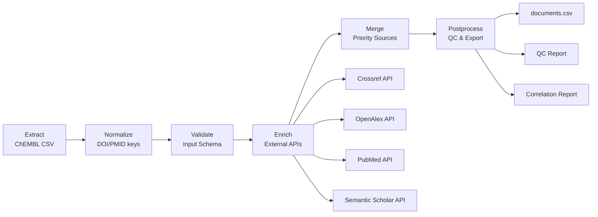

# Пайплайн Documents

## 1. Назначение и границы

### Что делает пайплайн

Пайплайн Documents извлекает и обогащает метаданные научных публикаций из множественных источников для создания единой базы данных документов с максимальной полнотой и качеством информации.

### Входы и выходы

**Входы:**

- CSV файл с базовыми метаданными документов (`data/input/documents.csv`)
- ChEMBL ID, DOI, название документа как минимальные обязательные поля

**Выходы:**

- `documents_<date>.csv` — обогащённые метаданные документов
- `documents_<date>_meta.yaml` — метаданные о процессе обработки
- `documents_<date>_qc.csv` — отчёт о качестве данных
- `documents_<date>_correlation_report/` — корреляционный анализ между источниками

### Место в общей архитектуре

Documents является фундаментальным пайплайном в star-schema архитектуре, предоставляя измерение `document_dim` для фактовых таблиц activities и assays. Обеспечивает референциальную целостность для связей документ-активность и документ-ассей.

## 2. Источники данных и маппинги

### Таблица источников

| Источник | Обязательность | API Endpoint | Rate Limits | Основные поля |
|----------|----------------|--------------|-------------|---------------|
| **ChEMBL** | Обязательный | `/document` | 3 req/15s | `document_chembl_id`, `title`, `doi`, `journal`, `year` |
| **Crossref** | Опциональный | `/works` | 50 req/s | `doi`, `title`, `author`, `published-print`, `ISSN` |
| **OpenAlex** | Опциональный | `/works` | 10 req/s | `openalex_id`, `title`, `publication_year`, `host_venue` |
| **PubMed** | Опциональный | `/eutils/efetch.fcgi` | 3 req/s | `pmid`, `title`, `abstract`, `authors`, `journal` |
| **Semantic Scholar** | Опциональный | `/paper` | 100 req/5min | `paperId`, `title`, `venue`, `year`, `authors` |

### Маппинг полей по источникам

**Обязательные поля (ChEMBL):**

- `document_chembl_id` → первичный ключ
- `title` → заголовок документа
- `doi` → Digital Object Identifier
- `journal` → название журнала
- `year` → год публикации

**Обогащённые поля:**

- **Crossref:** `issued`, `subject`, `ISSN`, `author`
- **OpenAlex:** `openalex_id`, `publication_year`, `host_venue`
- **PubMed:** `pmid`, `abstract`, `authors`, `MeSH_descriptors`
- **Semantic Scholar:** `publication_venue`, `publication_types`, `authors`

### Политика graceful degradation

При недоступности опциональных источников система продолжает работу с доступными источниками, логируя ошибки и предоставляя fallback данные.

## 3. Граф ETL



## 4. Схемы данных

### Входная схема (DocumentInputSchema)

| Поле | Тип | Nullable | Описание |
|------|-----|----------|----------|
| `document_chembl_id` | str | ❌ | Идентификатор документа ChEMBL |
| `doi` | str | ✅ | Digital Object Identifier |
| `title` | str | ❌ | Название документа |
| `abstract` | str | ✅ | Аннотация документа |
| `document_pubmed_id` | int | ✅ | PubMed идентификатор |
| `journal` | str | ✅ | Название журнала |
| `year` | int | ✅ | Год публикации |
| `volume` | float | ✅ | Том журнала |
| `issue` | int | ✅ | Номер выпуска |
| `first_page` | int | ✅ | Номер первой страницы |
| `last_page` | float | ✅ | Номер последней страницы |

### Выходная схема (DocumentOutputSchema)

**Исходные поля ChEMBL** + **Обогащённые поля:**

| Группа полей | Примеры | Источник |
|--------------|---------|----------|
| **PMID** | `chembl_pmid`, `crossref_pmid`, `pubmed_pmid` | Все источники |
| **Названия** | `chembl_title`, `crossref_title`, `openalex_title` | Все источники |
| **DOI** | `chembl_doi`, `crossref_doi`, `openalex_doi` | ChEMBL, Crossref, OpenAlex |
| **Журналы** | `chembl_journal`, `pubmed_journal`, `semantic_scholar_journal` | Все источники |
| **Авторы** | `chembl_authors`, `crossref_authors`, `pubmed_authors` | Все источники |
| **Валидация** | `valid_doi`, `valid_journal`, `invalid_year` | Вычисляемые |

### Политика NA

- **Строки:** пустая строка `""`
- **Числа:** `None`
- **Булевы:** `None`
- **Даты:** `None`

## 5. Конфигурация

### Пример configs/config_documents_full.yaml

```yaml
# HTTP настройки
http:
  global:
    timeout_sec: 60.0
    retries:
      total: 10
      backoff_multiplier: 3.0
      rate_limit:
        max_calls: 3
        period: 15.0

# Источники данных
sources:
  chembl:
    name: chembl
    endpoint: document
    params:
      document_type: article
    pagination:
      size: 200
      max_pages: 50
    http:
      base_url: https://www.ebi.ac.uk/chembl/api/data
      timeout_sec: 120.0
      headers:
        Authorization: "Bearer {chembl_api_token}"

  crossref:
    name: crossref
    http:
      base_url: https://api.crossref.org/works
      headers:
        Crossref-Plus-API-Token: "{crossref_api_key}"

  openalex:
    name: openalex
    http:
      base_url: https://api.openalex.org/works
      retries:
        total: 20
        backoff_multiplier: 5.0

  pubmed:
    name: pubmed
    enabled: true
    rate_limit:
      max_calls: 5
      period: 1.0
    http:
      base_url: https://eutils.ncbi.nlm.nih.gov/entrez/eutils/
      timeout_sec: 120.0
      headers:
        api_key: "{PUBMED_API_KEY}"

  semantic_scholar:
    name: semantic_scholar
    enabled: true
    rate_limit:
      max_calls: 5
      period: 10.0
    http:
      base_url: https://api.semanticscholar.org/graph/v1/paper
      timeout_sec: 120.0
      headers:
        x-api-key: "{SEMANTIC_SCHOLAR_API_KEY}"

# Настройки ввода-вывода
io:
  input:
    documents_csv: data/input/documents.csv
  output:
    dir: data/output/documents
    format: csv
    csv:
      encoding: utf-8
      float_format: "%.3f"
      date_format: "%Y-%m-%dT%H:%M:%SZ"

# Настройки выполнения
runtime:
  workers: 8
  limit: null
  dry_run: false

# Валидация
validation:
  strict: true
  qc:
    max_missing_fraction: 0.02
    max_duplicate_fraction: 0.005
```

### Переменные окружения

```bash
# API ключи (опционально)
CHEMBL_API_TOKEN=your_chembl_token_here
CROSSREF_API_KEY=your_crossref_key_here
PUBMED_API_KEY=your_pubmed_key_here
SEMANTIC_SCHOLAR_API_KEY=your_semantic_scholar_key_here

# Конфигурация
ENV=development
LOG_LEVEL=WARNING
```

### Настройки кэша

- **Кэш HTTP:** автоматическое кэширование ответов API
- **Кэш нормализации:** сохранение результатов нормализации DOI/PMID
- **Кэш валидации:** кэширование результатов валидации полей

## 6. Валидация

### Pandera схемы

```python
from library.schemas.document_input_schema import DocumentInputSchema
from library.schemas.document_output_schema import DocumentOutputSchema

# Валидация входных данных
input_schema = DocumentInputSchema()
validated_input = input_schema.validate(df_input)

# Валидация выходных данных
output_schema = DocumentOutputSchema()
validated_output = output_schema.validate(df_output)
```

### Инварианты

1. **Уникальность:** `document_chembl_id` должен быть уникальным
2. **Обязательные поля:** `document_chembl_id`, `title` не могут быть пустыми
3. **DOI валидность:** если DOI присутствует, должен соответствовать RFC 3986
4. **Год публикации:** должен быть в диапазоне 1800-2030
5. **Референциальная целостность:** все DOI должны быть валидными

### Дедупликация

**Ключи дедупликации:**

1. `document_chembl_id` (первичный ключ)
2. `doi_key` (нормализованный DOI)
3. `pmid_key` (нормализованный PMID)

**Эвристики совпадений:**

- Похожесть заголовков > 95% (вероятный дубль)
- Одинаковые DOI из разных источников
- Конфликтующие метаданные

## 7. Детерминизм

### Сортировка

```python
# Ключи сортировки
sort_columns = ['document_chembl_id', 'doi_key']
sort_ascending = [True, True]
na_position = 'last'
```

### Формат float

```python
float_format = "%.3f"  # 3 знака после запятой
```

### Порядок колонок

Фиксированный порядок определён в `config.determinism.column_order`:

1. Служебные поля (`index`, `extracted_at`, `hash_business_key`)
2. Основные метаданные (`document_chembl_id`, `title`, `doi`)
3. Группированные поля по источникам (ChEMBL, Crossref, OpenAlex, PubMed, Semantic Scholar)
4. Валидационные поля (`valid_*`, `invalid_*`)

### Локаль и таймзона

- **Локаль:** `en_US.UTF-8`
- **Таймзона:** `UTC`
- **Формат дат:** ISO 8601 (`%Y-%m-%dT%H:%M:%SZ`)

## 8. CLI/Make команды

### Стандартизованные цели

```bash
# Извлечение данных
make documents-extract

# Нормализация
make documents-normalize

# Валидация
make documents-validate

# Постпроцессинг
make documents-postprocess

# Полный пайплайн
make documents-all
```

### CLI команды

```bash
# Базовый запуск
bioactivity-data-acquisition get-document-data --config configs/config_documents_full.yaml

# С указанием выходной директории
bioactivity-data-acquisition get-document-data \
  --config configs/config_documents_full.yaml \
  --output data/output/documents

# С генерацией QC отчёта
bioactivity-data-acquisition get-document-data \
  --config configs/config_documents_full.yaml \
  --qc-report metadata/reports/documents_qc.json

# Экспорт в Parquet
bioactivity-data-acquisition get-document-data \
  --config configs/config_documents_full.yaml \
  --format parquet

# Остановка при ошибках QC
bioactivity-data-acquisition get-document-data \
  --config configs/config_documents_full.yaml \
  --fail-on-qc
```

### Параметры командной строки

| Параметр | Описание | По умолчанию |
|----------|----------|--------------|
| `--config` | Путь к конфигурации | Обязательный |
| `--output` | Директория вывода | `data/output/documents` |
| `--qc-report` | Путь к QC отчёту | `None` |
| `--format` | Формат вывода (csv/parquet) | `csv` |
| `--fail-on-qc` | Остановить при ошибках QC | `False` |
| `--dry-run` | Тестовый запуск без записи | `False` |
| `--limit` | Ограничение количества записей | `None` |

## 9. Артефакты

### Куда пишем файлы

```text
data/output/documents/
├── documents_20250121.csv                    # Основной файл с данными
├── documents_20250121.parquet                # Эталонный формат
├── documents_20250121_meta.yaml              # Метаданные процесса
├── documents_20250121_qc.csv                 # QC отчёт
└── documents_20250121_correlation_report/    # Корреляционный анализ
    ├── correlation_summary.csv
    ├── categorical_cramers_v.csv
    └── correlation_insights.json
```

### Формат имён файлов

```python
# Шаблон имени файла
filename_template = "{entity}_{date_tag}.{extension}"

# Примеры
documents_20250121.csv
documents_20250121_meta.yaml
documents_20250121_qc.csv
```

### meta.yaml структура

```yaml
pipeline: documents
version: "0.1.0"
run_id: "run_20250121_103045_abc123"
started_at: "2025-01-21T10:30:45Z"
completed_at: "2025-01-21T10:45:30Z"
duration_seconds: 885

input:
  file: "data/input/documents.csv"
  rows: 1000
  columns: 11

output:
  file: "data/output/documents/documents_20250121.csv"
  rows: 950
  columns: 89

sources:
  chembl:
    enabled: true
    records: 1000
    errors: 0
  crossref:
    enabled: true
    records: 850
    errors: 5
  openalex:
    enabled: true
    records: 720
    errors: 2
  pubmed:
    enabled: true
    records: 680
    errors: 8
  semantic_scholar:
    enabled: true
    records: 650
    errors: 3

quality:
  fill_rate: 0.95
  duplicate_rate: 0.005
  validation_errors: 12
  qc_status: "PASS"
```

### Отчёты в reports/

- `IUPHAR_SYNC_REPORT.md` — отчёт о синхронизации с IUPHAR
- `metadata/manifests/quality_manifest.json` — манифест качества данных
- `metadata/manifests/cleanup_manifest.json` — манифест очистки данных
- `metadata/reports/config_audit.csv` — аудит конфигурации

## 10. Контроль качества

### Чек-лист QC

**Обязательные проверки:**

- [ ] Все тесты проходят
- [ ] Линтеры не выдают ошибок
- [ ] Документация обновлена
- [ ] meta.yaml корректен

**Проверки качества данных:**

- [ ] Fill rate >= 95%
- [ ] Дубликаты <= 0.5%
- [ ] Корреляции валидны
- [ ] Валидация схемы прошла успешно

**Детерминизм:**

- [ ] Повторный запуск даёт тот же CSV (байтово)
- [ ] Имена файлов стабильны
- [ ] Порядок колонок фиксирован

**Отчётность:**

- [ ] QC отчёты сгенерированы
- [ ] Корреляционные отчёты присутствуют
- [ ] Логи структурированы

### Ожидаемые инварианты

1. **Количество записей:** выходные записи ≤ входные записи (из-за дедупликации)
2. **Уникальность:** все `document_chembl_id` уникальны
3. **Валидность DOI:** все DOI соответствуют RFC 3986
4. **Год публикации:** в диапазоне 1800-2030
5. **Заполненность:** обязательные поля не пустые

### Метрики качества

```python
qc_metrics = {
    "row_count": 950,
    "fill_rate": 0.95,
    "duplicate_rate": 0.005,
    "validation_errors": 12,
    "source_coverage": {
        "chembl": 1.0,
        "crossref": 0.85,
        "openalex": 0.72,
        "pubmed": 0.68,
        "semantic_scholar": 0.65
    },
    "qc_status": "PASS"
}
```

## 11. Ограничения и типичные ошибки

### Rate limits API

| API | Лимит | Период | Решение |
|-----|-------|--------|---------|
| ChEMBL | 3 запроса | 15 секунд | Экспоненциальная задержка |
| Crossref | 50 запросов | 1 секунда | Без задержки |
| OpenAlex | 10 запросов | 1 секунда | Консервативная задержка |
| PubMed | 3 запроса | 1 секунда | Строгая задержка |
| Semantic Scholar | 100 запросов | 5 минут | Пакетная обработка |

### Таймауты

- **ChEMBL:** 120 секунд (сложные запросы)
- **Crossref:** 60 секунд (стандартные запросы)
- **OpenAlex:** 60 секунд (стандартные запросы)
- **PubMed:** 120 секунд (медленные ответы)
- **Semantic Scholar:** 120 секунд (AI обработка)

### Типовые фейлы и решения

#### 1. HTTP 429 (Too Many Requests)

```python
# Решение: экспоненциальная задержка
backoff_multiplier = 3.0
total_retries = 10
```

#### 2. HTTP 500 (Internal Server Error)

```python
# Решение: graceful degradation
if source_error:
    log_warning(f"Source {source} unavailable, continuing with others")
    continue_processing()
```

#### 3. Валидация схемы Pandera

```python
# Решение: детальное логирование ошибок
try:
    validated_df = schema.validate(df)
except pa.errors.SchemaError as e:
    log_error(f"Schema validation failed: {e}")
    if strict_mode:
        raise
    else:
        continue_with_warnings()
```

#### 4. Проблемы с кодировкой

```python
# Решение: принудительная UTF-8
df = pd.read_csv(file, encoding='utf-8', errors='replace')
```

#### 5. Проблемы с памятью

```python
# Решение: пакетная обработка
batch_size = 1000
for batch in pd.read_csv(file, chunksize=batch_size):
    process_batch(batch)
```

#### 6. Недоступность API ключей

```python
# Решение: работа без ключей с ограничениями
if not api_key:
    log_warning("API key not provided, using rate-limited access")
    use_rate_limited_access()
```

### Рекомендации по мониторингу

1. **Мониторинг API статуса:** проверка доступности источников
2. **Мониторинг rate limits:** отслеживание использования квот
3. **Мониторинг качества данных:** регулярные QC проверки
4. **Мониторинг производительности:** время выполнения этапов
5. **Мониторинг ошибок:** агрегация и анализ ошибок
