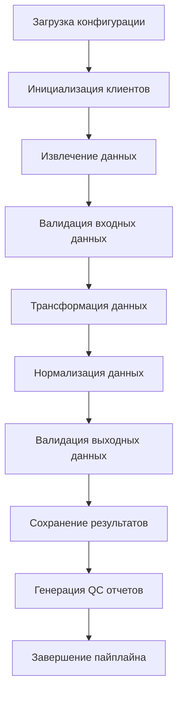

# Пайплайны

## Обзор

Данный раздел содержит документацию по всем ETL-пайплайнам проекта Bioactivity Data Acquisition, включая их назначение, конфигурацию и использование.

## Доступные пайплайны

### 1. Activity Pipeline

**Назначение**: Обработка данных о биологической активности молекул  
**Модуль**: `src/library/activity/pipeline.py`  
**Конфигурация**: `configs/config_activity.yaml`

**Основные функции**:
- Извлечение данных активностей из ChEMBL
- Связывание с молекулами и мишенями
- Корреляционный анализ активностей
- Генерация QC отчетов

### 2. Assay Pipeline

**Назначение**: Обработка данных об экспериментах (ассаях)  
**Модуль**: `src/library/assay/pipeline.py`  
**Конфигурация**: `configs/config_assay.yaml`

**Основные функции**:
- Извлечение метаданных экспериментов
- Нормализация описаний экспериментов
- Классификация типов экспериментов
- Валидация данных экспериментов

### 3. Target Pipeline

**Назначение**: Обработка данных о мишенях (белках)  
**Модуль**: `src/library/target/pipeline.py`  
**Конфигурация**: `configs/config_target.yaml`

**Основные функции**:
- Извлечение данных мишеней из ChEMBL
- Маппинг на UniProt идентификаторы
- Интеграция с STRING базой данных
- Классификация белков по IUPHAR

### 4. Testitem Pipeline

**Назначение**: Обработка данных о молекулах (теститемах)  
**Модуль**: `src/library/testitem/pipeline.py`  
**Конфигурация**: `configs/config_testitem.yaml`

**Основные функции**:
- Извлечение данных молекул из ChEMBL
- Обогащение данными из PubChem
- Нормализация химических структур
- Валидация молекулярных данных

### 5. Documents Pipeline

**Назначение**: Обогащение библиографических данных документов  
**Модуль**: `src/library/documents/pipeline.py`  
**Конфигурация**: `configs/config_documents.yaml`

**Основные функции**:
- Обогащение из PubMed
- Данные о цитированиях из Crossref
- Информация из OpenAlex
- Данные из Semantic Scholar

## Архитектура пайплайнов

### Базовый класс PipelineBase

Все пайплайны наследуются от базового класса:

```python
class PipelineBase[TConfig]:
    """Базовый класс для всех ETL пайплайнов."""
    
    def __init__(self, config: TConfig, logger: BoundLogger):
        self.config = config
        self.logger = logger
    
    def run(self) -> Path:
        """Запускает пайплайн."""
        raise NotImplementedError
```

### Общий поток выполнения



## Конфигурация пайплайнов

### Общие параметры

Все пайплайны поддерживают общие параметры конфигурации:

```yaml
# Общие настройки
version: "1.0.0"
log_level: "INFO"

# Настройки источников данных
sources:
  chembl:
    base_url: "https://www.ebi.ac.uk/chembl/api/data"
    timeout: 60
    retries: 5
    rate_limit: 10

# Настройки ввода/вывода
io:
  input:
    data_path: "data/input/"
  output:
    data_path: "data/output/"
    qc_report_path: "data/output/qc_report.json"

# Настройки трансформации
transforms:
  enable_normalization: true
  enable_enrichment: true
  batch_size: 100

# Настройки валидации
validation:
  enable_pandera_validation: true
  strict_mode: false
```

### Специфичные параметры

Каждый пайплайн имеет свои специфичные параметры:

**Activity Pipeline**:
```yaml
activity:
  correlation_analysis:
    enable_correlation_matrix: true
    correlation_method: "pearson"
    significance_threshold: 0.05
```

**Target Pipeline**:
```yaml
target:
  uniprot_mapping:
    enable_uniprot_mapping: true
    mapping_timeout: 30
  string_integration:
    enable_string_integration: true
    confidence_threshold: 0.7
```

**Documents Pipeline**:
```yaml
documents:
  sources:
    pubmed:
      enabled: true
      rate_limit: 3
    crossref:
      enabled: true
      rate_limit: 50
```

## Запуск пайплайнов

### Через CLI

```bash
# Запуск пайплайна активностей
bioactivity-data-acquisition pipeline --config configs/config_activity.yaml

# Запуск пайплайна документов
bioactivity-data-acquisition get-document-data --config configs/config_documents.yaml
```

### Программно

```python
from library.activity.pipeline import ActivityPipeline
from library.activity.config import ActivityConfig

# Загрузка конфигурации
config = ActivityConfig.from_file("configs/config_activity.yaml")

# Создание и запуск пайплайна
pipeline = ActivityPipeline(config, logger)
output_path = pipeline.run()
```

## Мониторинг и логирование

### Структурированное логирование

Все пайплайны используют структурированное логирование:

```python
from library.logging_setup import get_logger

logger = get_logger("activity_pipeline")

# Логирование этапов
logger.info("Starting activity pipeline", 
           config_file="config.yaml", 
           batch_size=100)

logger.info("Data extraction completed", 
           rows_extracted=5000, 
           sources=["chembl"])

logger.info("Pipeline completed successfully", 
           output_path="data/output/activities.csv",
           processing_time=45.2)
```

### Метрики производительности

```python
import time
from library.telemetry import traced_operation

@traced_operation("activity_pipeline")
def run_activity_pipeline():
    start_time = time.time()
    
    # Выполнение пайплайна
    result = pipeline.run()
    
    end_time = time.time()
    processing_time = end_time - start_time
    
    logger.info("Pipeline metrics",
               processing_time_seconds=processing_time,
               rows_processed=len(result),
               throughput_rows_per_second=len(result) / processing_time)
```

## Обработка ошибок

### Стратегии восстановления

```python
def run_pipeline_with_retry(pipeline, max_retries: int = 3):
    """Запускает пайплайн с повторными попытками."""
    
    for attempt in range(max_retries):
        try:
            return pipeline.run()
        except Exception as e:
            logger.warning(f"Pipeline attempt {attempt + 1} failed: {e}")
            
            if attempt == max_retries - 1:
                logger.error("All pipeline attempts failed")
                raise
            
            # Экспоненциальная задержка
            delay = 2 ** attempt
            time.sleep(delay)
```

### Graceful degradation

```python
def run_pipeline_with_fallback(pipeline):
    """Запускает пайплайн с отказоустойчивостью."""
    
    try:
        # Полный пайплайн
        return pipeline.run_full()
    except Exception as e:
        logger.warning(f"Full pipeline failed: {e}")
        
        try:
            # Упрощенный пайплайн
            return pipeline.run_basic()
        except Exception as e2:
            logger.error(f"Basic pipeline also failed: {e2}")
            raise
```

## Тестирование пайплайнов

### Unit тесты

```python
import pytest
from library.activity.pipeline import ActivityPipeline
from library.activity.config import ActivityConfig

def test_activity_pipeline():
    """Тест пайплайна активностей."""
    
    # Создание тестовой конфигурации
    config = ActivityConfig(
        sources={"chembl": {"base_url": "test_url"}},
        io={"input": {"data_path": "test_input"}}
    )
    
    # Создание пайплайна
    pipeline = ActivityPipeline(config, logger)
    
    # Запуск пайплайна
    result = pipeline.run()
    
    # Проверки
    assert result.exists()
    assert result.suffix == ".csv"
```

### Интеграционные тесты

```python
def test_pipeline_integration():
    """Интеграционный тест пайплайна."""
    
    # Подготовка тестовых данных
    test_data = create_test_data()
    
    # Запуск пайплайна
    result = run_pipeline_with_test_data(test_data)
    
    # Проверка результатов
    assert validate_output_format(result)
    assert validate_data_quality(result)
```

## Лучшие практики

### Производительность

1. **Батчевая обработка**: Используйте подходящий размер батча
2. **Параллелизация**: Настройте количество параллельных процессов
3. **Кэширование**: Кэшируйте промежуточные результаты
4. **Оптимизация памяти**: Мониторьте использование памяти

### Надежность

1. **Валидация данных**: Всегда валидируйте входные и выходные данные
2. **Обработка ошибок**: Реализуйте стратегии восстановления
3. **Логирование**: Ведите детальные логи выполнения
4. **Мониторинг**: Отслеживайте метрики производительности

### Поддерживаемость

1. **Конфигурация**: Используйте внешние конфигурационные файлы
2. **Документация**: Документируйте все параметры и процессы
3. **Тестирование**: Покрывайте код тестами
4. **Версионирование**: Отслеживайте изменения в конфигурации
