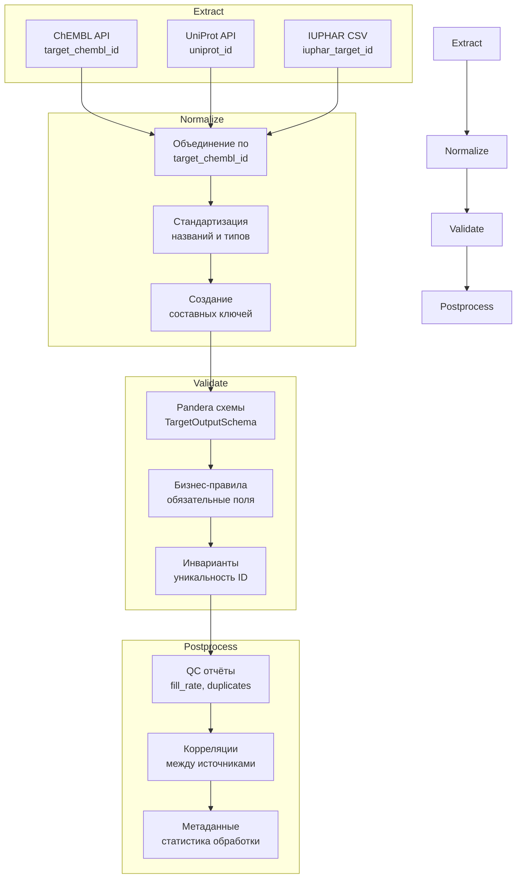

# Пайплайн Targets

Пайплайн для извлечения и обогащения данных о белковых мишенях (targets) из ChEMBL, UniProt и IUPHAR.

## 1. Назначение и границы

### Что делает пайплайн

Пайплайн Targets формирует измерение `target_dim` для звёздной схемы данных, объединяя информацию о белковых мишенях из трёх основных источников:

- **ChEMBL**: Основные данные о мишенях (идентификаторы, названия, типы)
- **UniProt**: Обогащение белковыми данными (функции, локализация, домены)
- **IUPHAR**: Фармакологическая классификация (семейства, подтипы)

### Входы и выходы

**Входы**:

- CSV файл с ChEMBL идентификаторами мишеней (`target_chembl_id`)
- Конфигурация `configs/config_target_full.yaml`

**Выходы**:

- `target_YYYYMMDD.csv` — основные данные мишеней
- `target_YYYYMMDD_qc.csv` — отчёт о качестве данных
- `target_YYYYMMDD_meta.yaml` — метаданные пайплайна
- `target_correlation_report_YYYYMMDD/` — корреляционный анализ

### Место в архитектуре

Пайплайн Targets является одним из пяти основных пайплайнов системы, формируя измерение для звёздной схемы данных. Результаты используются в пайплайне Activities для связывания биоактивностных данных с мишенями.

## 2. Источники данных и маппинги

| Источник | Статус | Endpoint | Основные поля | Обязательность |
|----------|--------|----------|---------------|----------------|
| **ChEMBL** | ✅ Обязательный | `/target` | `target_chembl_id`, `pref_name`, `target_type`, `organism` | Да |
| **UniProt** | ✅ Обязательный | `/uniprot` | `uniprot_id_primary`, `molecular_function`, `cellular_component` | Да |
| **IUPHAR** | ✅ Обязательный | CSV словари | `iuphar_target_id`, `iuphar_type`, `gtop_function_text_short` | Да |

### Маппинг полей

**ChEMBL → target_dim**:

- `target_chembl_id` → `target_chembl_id`
- `pref_name` → `pref_name`
- `target_type` → `target_type`
- `organism` → `target_organism`

**UniProt → target_dim**:

- `uniprot_id` → `uniprot_id_primary`
- `protein_names` → `protein_names`
- `gene_names` → `gene_names`
- `molecular_function` → `molecular_function`

**IUPHAR → target_dim**:

- `iuphar_target_id` → `iuphar_target_id`
- `iuphar_type` → `iuphar_type`
- `family` → `iuphar_family`

## 3. Граф ETL



## 4. Схемы данных

### Входная схема

| Поле | Тип | Nullable | Описание |
|------|-----|----------|----------|
| `target_chembl_id` | str | No | ChEMBL идентификатор мишени |

### Выходная схема

| Поле | Тип | Nullable | Описание | Источник |
|------|-----|----------|----------|----------|
| `target_chembl_id` | str | No | ChEMBL ID мишени | ChEMBL |
| `hgnc_id` | str | Yes | HGNC идентификатор | ChEMBL cross-references |
| `hgnc_name` | str | Yes | HGNC название гена | ChEMBL cross-references |
| `gene_symbol` | str | Yes | Основной символ гена | UniProt API |
| `pref_name` | str | Yes | Предпочтительное название | ChEMBL |
| `target_type` | str | Yes | Тип мишени | ChEMBL |
| `target_organism` | str | Yes | Организм мишени | ChEMBL |
| `uniprot_id_primary` | str | Yes | Основной UniProt ID | UniProt |
| `protein_names` | str | Yes | Названия белков | UniProt |
| `gene_names` | str | Yes | Названия генов | UniProt |
| `molecular_function` | str | Yes | Молекулярная функция | UniProt |
| `cellular_component` | str | Yes | Клеточная локализация | UniProt |
| `iuphar_target_id` | str | Yes | IUPHAR ID мишени | IUPHAR |
| `iuphar_type` | str | Yes | IUPHAR тип | IUPHAR |
| `iuphar_family` | str | Yes | IUPHAR семейство | IUPHAR |
| `gtop_synonyms` | str | Yes | Синонимы GtoPdb | GtoPdb |
| `gtop_natural_ligands_n` | str | Yes | Количество природных лигандов | GtoPdb |
| `gtop_interactions_n` | str | Yes | Количество взаимодействий | GtoPdb |
| `gtop_function_text_short` | str | Yes | Краткое описание функции | GtoPdb |
| `source_system` | str | No | Система-источник | Система |
| `chembl_release` | str | No | Версия ChEMBL | ChEMBL |
| `extracted_at` | datetime | No | Время извлечения | Система |

### Политика NA

- **ChEMBL поля**: Обязательные, NA не допускается
- **HGNC поля**: Опциональные, NA разрешено (извлекаются из ChEMBL cross-references)
- **UniProt поля**: Опциональные, NA разрешено
- **IUPHAR поля**: Опциональные, NA разрешено
- **GtoPdb поля**: Опциональные, NA разрешено
- **Системные поля**: Обязательные, NA не допускается

### Описание новых полей

#### HGNC поля (из ChEMBL cross-references)

- **hgnc_id** (str, nullable): HGNC идентификатор, извлеченный из ChEMBL cross-references
  - Источник: ChEMBL API (`target_component_xrefs`)
  - Пример: `"663"` для ARG1
  - Пустая строка если недоступно
  - Извлекается из поля `xref_id` с удалением префикса "HGNC:"

- **hgnc_name** (str, nullable): HGNC название гена
  - Источник: ChEMBL API (`target_component_xrefs`)
  - Пример: `"ARG1"`
  - Пустая строка если недоступно
  - Извлекается из поля `xref_name`

#### Gene Symbol поле (из UniProt API)

- **gene_symbol** (str, nullable): Основной символ гена из UniProt
  - Источник: UniProt API (`genes[].geneName.value`)
  - Пример: `"LRRK2"`
  - None если недоступно или UniProt fetch не удался
  - Более авторитетный источник для текущей номенклатуры генов чем HGNC
  - Извлекается из первого гена в списке `genes`

## 5. Конфигурация

### Основные настройки

```yaml
# configs/config_target_full.yaml
sources:
  chembl:
    enabled: true  # Обязательно
    endpoint: target
    http:
      base_url: https://www.ebi.ac.uk/chembl/api/data
      timeout_sec: 60.0
      retries:
        total: 5
        backoff_multiplier: 2.0
  
  uniprot:
    enabled: true  # Обязательно
    endpoint: uniprot
    http:
      base_url: https://rest.uniprot.org
      timeout_sec: 45.0
  
  iuphar:
    enabled: true  # Обязательно
    csv_path: configs/dictionary/_target/iuphar_targets.csv

runtime:
  workers: 4
  limit: null  # Без ограничений
  dev_mode: false  # true для тестирования
  allow_incomplete_sources: false  # true для тестирования

validation:
  strict: true
  qc:
    max_missing_fraction: 0.02
    max_duplicate_fraction: 0.005
```

### Переменные окружения

```bash
# Опционально
CHEMBL_API_TOKEN=your_chembl_token_here
```

### Настройки кэша

```yaml
runtime:
  cache_dir: .cache/chembl
  cache_ttl: 86400  # 24 часа
```

## 6. Валидация

### Pandera схемы

```python
# src/library/schemas/target_schema.py
class TargetOutputSchema(pa.DataFrameModel):
    target_chembl_id: Series[str] = pa.Field(description="ChEMBL target identifier")
    pref_name: Series[str] = pa.Field(nullable=True, description="Preferred name")
    target_type: Series[str] = pa.Field(nullable=True, description="Target type")
    # ... остальные поля
```

### Инварианты

1. **Уникальность**: `target_chembl_id` должен быть уникальным
2. **Связность**: Все записи должны иметь данные из ChEMBL
3. **Консистентность**: `uniprot_id_primary` должен быть валидным UniProt ID
4. **Полнота**: Минимум 80% записей должны иметь данные из UniProt

### Дедупликация

- По `target_chembl_id` (основной ключ)
- Автоматическое удаление дубликатов
- Логирование удалённых записей

## 7. Детерминизм

### Сортировка

```yaml
determinism:
  sort:
    by: [target_chembl_id, pref_name]
    ascending: [true, true]
    na_position: last
```

### Формат float

```yaml
io:
  output:
    csv:
      float_format: "%.3f"
      date_format: "%Y-%m-%dT%H:%M:%SZ"
```

### Порядок колонок

```yaml
determinism:
  column_order:
    - target_chembl_id
    - hgnc_id
    - hgnc_name
    - gene_symbol
    - pref_name
    - target_type
    - target_organism
    - uniprot_id_primary
    # ... фиксированный порядок
```

### Локаль и таймзона

- **Локаль**: UTF-8
- **Таймзона**: UTC для всех временных меток
- **Формат даты**: ISO 8601

## 8. CLI/Make команды

### Стандартизованные цели

```bash
# Установка зависимостей
make install-dev

# Валидация конфигурации
make pipeline TYPE=targets CONFIG=configs/config_target_full.yaml --dry-run

# Запуск с примером данных
make pipeline TYPE=targets INPUT=data/input/target.csv CONFIG=configs/config_target_full.yaml

# Тестовый запуск без записи
make pipeline TYPE=targets CONFIG=configs/config_target_full.yaml FLAGS="--dry-run"

# Запуск тестов
make pipeline-test TYPE=targets

# Очистка артефактов
make pipeline-clean TYPE=targets

# Справка
make help
```

### CLI команды

```bash
# Через Typer CLI
python -m library.cli get-target-data \
  --config configs/config_target_full.yaml \
  --targets-csv data/input/target_ids.csv \
  --date-tag 20251020

# Через Python скрипт
python -m library.scripts.get_target_data \
  --config configs/config_target_full.yaml \
  --targets-csv data/input/target_ids.csv \
  --output-dir data/output/target \
  --date-tag 20251020
```

### Параметры командной строки

| Параметр | Описание | Обязательный | По умолчанию |
|----------|----------|--------------|--------------|
| `--config` | Путь к конфигурации | Да | - |
| `--targets-csv` | CSV с target_chembl_id | Да | - |
| `--output-dir` | Директория вывода | Нет | Из конфига |
| `--date-tag` | Тег даты | Нет | Текущая дата |
| `--dev-mode` | Режим разработки | Нет | false |
| `--limit` | Ограничение записей | Нет | null |

## 9. Артефакты

### Структура выходных файлов

```text
data/output/target/
├── target_20251020.csv                    # Основные данные
├── target_20251020_qc.csv                 # QC метрики
├── target_20251020_meta.yaml              # Метаданные
└── target_correlation_report_20251020/    # Корреляционный анализ
    ├── correlation_matrix.csv
    └── correlation_insights.csv
```

### Формат имён файлов

- **Основной CSV**: `target_{YYYYMMDD}.csv`
- **QC отчёт**: `target_{YYYYMMDD}_qc.csv`
- **Метаданные**: `target_{YYYYMMDD}_meta.yaml`
- **Корреляции**: `target_correlation_report_{YYYYMMDD}/`

### meta.yaml структура

```yaml
pipeline:
  name: targets
  version: 1.0.0
  run_date: "2025-10-20T12:00:00Z"
  
sources:
  chembl:
    enabled: true
    records_processed: 150
    records_successful: 148
    records_failed: 2
  
  uniprot:
    enabled: true
    records_processed: 148
    records_successful: 145
    records_failed: 3
  
  iuphar:
    enabled: true
    records_processed: 148
    records_successful: 120
    records_failed: 28

quality:
  total_records: 150
  valid_records: 145
  invalid_records: 5
  fill_rate: 0.967
  duplicate_rate: 0.0
```

### Отчёты в reports/

- **IUPHAR_SYNC_REPORT.md**: Отчёт о синхронизации с IUPHAR
- **metadata/manifests/quality_manifest.json**: Манифест качества данных
- **metadata/reports/config_audit.csv**: Аудит конфигурации

## 10. Контроль качества

### Чек-лист QC

- [ ] Все обязательные источники включены
- [ ] Fill rate >= 80%
- [ ] Дубликаты <= 1%
- [ ] Все ChEMBL записи обработаны
- [ ] UniProt обогащение >= 70%
- [ ] IUPHAR классификация >= 60%

### Ожидаемые инварианты

1. **Полнота ChEMBL**: 100% записей должны иметь данные из ChEMBL
2. **Уникальность**: Нет дубликатов по `target_chembl_id`
3. **Валидность**: Все `target_chembl_id` соответствуют формату CHEMBL\d+
4. **Связность**: UniProt ID должны быть валидными

### Метрики качества

- **Fill Rate**: Процент заполненных полей
- **Source Coverage**: Покрытие по источникам
- **Validation Success**: Процент успешных валидаций
- **Processing Time**: Время обработки

## 11. Ограничения и типичные ошибки

### Rate limits API

| Источник | Лимит | Таймаут | Особенности |
|----------|-------|---------|-------------|
| **ChEMBL** | Нет лимита | 60s | Требует токен для больших объёмов |
| **UniProt** | 10/сек | 45s | Политес API |
| **IUPHAR** | Локальные CSV | - | Нет API лимитов |

### Типовые фейлы и решения

1. **Ошибка "All sources must be enabled"**

   ```bash
   # Решение: Используйте dev режим для тестирования
   python -m library.scripts.get_target_data --dev-mode
   ```

2. **Ошибка валидации входных данных**

   ```bash
   # Решение: Проверьте формат CSV
   head data/input/target_ids.csv
   # Должно быть: target_chembl_id
   # CHEMBL240
   # CHEMBL251
   ```

3. **Проблемы с API**
   - **ChEMBL**: Работает без API ключа с ограничениями
   - **UniProt**: Работает без API ключа
   - **IUPHAR**: Использует CSV словари или API fallback

4. **Медленная обработка**

   ```bash
   # Решение: Ограничьте количество записей
   python -m library.scripts.get_target_data --limit 100
   ```

5. **Ошибки валидации Pandera**

   ```bash
   # Решение: Проверьте логи и исправьте данные
   tail logs/app.log | grep "validation"
   ```

### Troubleshooting

```bash
# Проверка конфигурации
make pipeline TYPE=targets CONFIG=configs/config_target_full.yaml --dry-run

# Проверка зависимостей
make install-dev

# Тестовый запуск
make pipeline TYPE=targets CONFIG=configs/config_target_full.yaml FLAGS="--dry-run"

# Просмотр статистики
make pipeline TYPE=targets CONFIG=configs/config_target_full.yaml FLAGS="--stats"
```

## 12. Детерминизм

### Сортировка данных

```python
# Детерминированная сортировка по составному ключу
df_sorted = df.sort_values([
    'target_chembl_id',
    'hgnc_id',
    'gene_symbol',
    'uniprot_id_primary', 
    'iuphar_target_id'
], na_position='last')
```

### Формат чисел

```python
# Стандартизация числовых полей
df['target_chembl_id'] = df['target_chembl_id'].astype('string')
df['uniprot_id_primary'] = df['uniprot_id_primary'].astype('string')
```

### Порядок колонок

```python
# Фиксированный порядок колонок в выходном CSV
column_order = [
    'target_chembl_id',
    'hgnc_id',
    'hgnc_name',
    'gene_symbol',
    'pref_name',
    'target_type',
    'target_organism',
    'uniprot_id_primary',
    'protein_names',
    'gene_names',
    'molecular_function',
    'iuphar_target_id',
    'iuphar_type',
    'iuphar_family',
    'gtop_synonyms',
    'gtop_natural_ligands_n',
    'gtop_interactions_n',
    'gtop_function_text_short'
]
df_output = df[column_order]
```

### Временные зоны

```python
# Все временные метки в UTC
from datetime import datetime, timezone
timestamp = datetime.now(timezone.utc).isoformat()
```

## 13. Запуск

### CLI команды

```bash
# Полный запуск пайплайна
make run ENTITY=targets CONFIG=configs/config_target_full.yaml

# Через CLI напрямую
bioactivity-data-acquisition pipeline --config configs/config_target_full.yaml

# Тестовый запуск с ограниченными данными
make run ENTITY=targets CONFIG=configs/config_test.yaml
```

### Docker/Compose

```bash
# Запуск в Docker контейнере
docker-compose run --rm bioactivity-pipeline targets

# Или через Makefile
make docker-run ENTITY=targets CONFIG=configs/config_target_full.yaml
```

### Ожидаемые артефакты

После успешного выполнения в `data/output/target_YYYYMMDD/`:

```text
target_20241201/
├── target_20241201.csv                    # Основные данные мишеней
├── target_20241201_meta.yaml             # Метаданные пайплайна
├── target_20241201_qc.csv                # QC отчёт
└── target_correlation_report_20241201/   # Корреляционный анализ
    ├── correlation_matrix.csv
    ├── source_comparison.csv
    └── quality_metrics.csv
```

## 14. QC чек-лист

### Перед запуском

- [ ] Проверить наличие входного файла `data/input/target.csv`
- [ ] Убедиться в корректности конфигурации `configs/config_target_full.yaml`
- [ ] Проверить доступность API (ChEMBL, UniProt)
- [ ] Убедиться в наличии IUPHAR словарей в `configs/dictionary/`

### После выполнения

- [ ] Проверить количество записей в выходном файле
- [ ] Убедиться в отсутствии критических ошибок в QC отчёте
- [ ] Проверить fill rate для обязательных полей (≥80%)
- [ ] Убедиться в отсутствии дубликатов по `target_chembl_id`
- [ ] Проверить корректность связей между источниками

### Специфичные проверки для Targets

- [ ] Все `target_chembl_id` уникальны
- [ ] `pref_name` заполнено для всех записей
- [ ] `target_type` соответствует допустимым значениям
- [ ] `uniprot_id_primary` валидны (формат UniProt)
- [ ] `iuphar_target_id` соответствуют IUPHAR базе

## 15. Ссылки

### Модули в src/

- **Основной пайплайн**: `src/library/target/pipeline.py`
- **API клиенты**:
  - `src/library/clients/chembl.py`
  - `src/library/clients/uniprot.py`
  - `src/library/clients/iuphar.py`
- **Схемы валидации**: `src/library/schemas/target_schema.py`
- **ETL утилиты**: `src/library/etl/`

### Конфигурация

- **Основной конфиг**: `configs/config_target_full.yaml`
- **Тестовый конфиг**: `configs/config_test.yaml`
- **IUPHAR словари**: `configs/dictionary/_target/`

### Тесты

- **Unit тесты**: `tests/test_target_basic.py`
- **Интеграционные тесты**: `tests/integration/test_target_pipeline.py`
- **Тестовые данные**: `tests/fixtures/target.csv`
