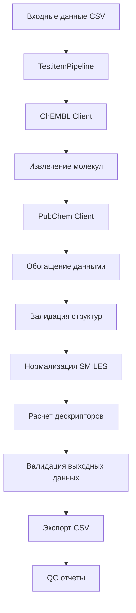

# Testitem Pipeline

## Обзор

Testitem Pipeline обрабатывает данные о молекулах (теститемах), включая извлечение из ChEMBL, обогащение данными из PubChem, нормализацию химических структур и валидацию молекулярных данных.

## Назначение

**Основная цель**: Создание структурированных датасетов молекул с полными химическими и физико-химическими характеристиками.

**Ключевые задачи**:
- Извлечение данных молекул из ChEMBL API
- Обогащение данными из PubChem
- Нормализация химических структур (SMILES, InChI)
- Расчет молекулярных дескрипторов
- Валидация химических структур
- Детерминированный экспорт результатов

## Архитектура

### Основные компоненты



### Модули

**Расположение**: `src/library/testitem/`

- `pipeline.py`: Основной класс пайплайна
- `config.py`: Конфигурация пайплайна
- `clients.py`: API клиенты (ChEMBL, PubChem)
- `extract.py`: Извлечение данных
- `normalize.py`: Нормализация химических структур
- `validate.py`: Валидация молекулярных данных
- `quality.py`: QC анализ
- `writer.py`: Экспорт данных

## Конфигурация

### Базовые параметры

**Файл**: `configs/config_testitem.yaml`

```yaml
version: "1.0.0"

sources:
  chembl:
    base_url: "https://www.ebi.ac.uk/chembl/api/data"
    timeout: 60
    retries: 5
    rate_limit: 10
  
  pubchem:
    base_url: "https://pubchem.ncbi.nlm.nih.gov/rest/pug"
    timeout: 45
    retries: 3
    rate_limit: 5

io:
  input:
    data_path: "data/input/testitems.csv"
  output:
    data_path: "data/output/testitems_processed.csv"
    qc_report_path: "data/output/testitems_qc_report.json"

transforms:
  enable_normalization: true
  enable_enrichment: true
  batch_size: 100

validation:
  enable_pandera_validation: true
  strict_mode: false
```

### Специфичные параметры молекул

```yaml
testitem:
  molecular_descriptors:
    enable_descriptor_calculation: true
    descriptors: ["molecular_weight", "logp", "tpsa", "heavy_atom_count"]
    calculation_method: "rdkit"
  
  structure_validation:
    enable_structure_validation: true
    validate_smiles: true
    validate_inchi: true
    remove_invalid_structures: true
  
  enrichment:
    pubchem_enrichment:
      enabled: true
      fields: ["molecular_formula", "canonical_smiles", "isomeric_smiles"]
      timeout: 30
    
    chembl_enrichment:
      enabled: true
      fields: ["molecule_name", "molecule_synonyms", "molecule_type"]
  
  normalization:
    smiles_normalization:
      canonicalize: true
      remove_stereochemistry: false
      standardize: true
    
    inchi_normalization:
      generate_inchi_key: true
      standardize: true
```

## Входные данные

### Формат входного CSV

**Обязательные поля**:
- `molecule_id`: Уникальный идентификатор молекулы
- `molecule_name`: Название молекулы
- `molecule_smiles`: SMILES структура (опционально)

**Опциональные поля**:
- `molecule_inchi`: InChI структура
- `molecule_synonyms`: Синонимы молекулы
- `molecule_type`: Тип молекулы
- `molecular_formula`: Молекулярная формула
- `molecular_weight`: Молекулярный вес

### Пример входных данных

```csv
molecule_id,molecule_name,molecule_smiles,molecule_inchi
CHEMBL789012,Aspirin,CC(=O)OC1=CC=CC=C1C(=O)O,InChI=1S/C9H8O4/c1-6(10)13-8-5-3-2-4-7(8)9(11)12/h2-5H,1H3,(H,11,12)
CHEMBL789013,Ibuprofen,CC(C)CC1=CC=C(C=C1)C(C)C(=O)O,InChI=1S/C13H18O2/c1-9(2)8-11-4-6-12(7-5-11)10(3)13(14)15/h4-7,9-10H,8H2,1-3H3,(H,14,15)
CHEMBL789014,Paracetamol,CC(=O)Nc1ccc(O)cc1,InChI=1S/C8H9NO2/c1-6(10)9-7-2-4-8(11)5-3-7/h2-5,11H,1H3,(H,9,10)
```

## Процесс обработки

### 1. Извлечение данных из ChEMBL

```python
def extract_molecule_data(client: ChEMBLClient, config: TestitemConfig) -> pd.DataFrame:
    """Извлекает данные молекул из ChEMBL."""
    
    molecules = []
    
    # Извлечение по батчам
    for batch in client.get_molecule_batches(config.batch_size):
        molecules.extend(batch)
    
    return pd.DataFrame(molecules)
```

### 2. Обогащение данными из PubChem

```python
def enrich_with_pubchem(dataframe: pd.DataFrame, client: PubChemClient) -> pd.DataFrame:
    """Обогащает данные молекулами из PubChem."""
    
    enriched_df = dataframe.copy()
    
    for idx, row in enriched_df.iterrows():
        try:
            # Поиск в PubChem по SMILES
            pubchem_data = client.search_by_smiles(row['molecule_smiles'])
            
            if pubchem_data:
                # Обогащение полями из PubChem
                enriched_df.at[idx, 'pubchem_cid'] = pubchem_data.get('cid')
                enriched_df.at[idx, 'canonical_smiles'] = pubchem_data.get('canonical_smiles')
                enriched_df.at[idx, 'isomeric_smiles'] = pubchem_data.get('isomeric_smiles')
                enriched_df.at[idx, 'molecular_formula'] = pubchem_data.get('molecular_formula')
                
        except Exception as e:
            logger.warning(f"Ошибка обогащения молекулы {row['molecule_id']}: {e}")
    
    return enriched_df
```

### 3. Валидация химических структур

```python
def validate_chemical_structures(dataframe: pd.DataFrame) -> pd.DataFrame:
    """Валидирует химические структуры."""
    
    validated_df = dataframe.copy()
    
    for idx, row in validated_df.iterrows():
        smiles = row.get('molecule_smiles')
        
        if smiles and pd.notna(smiles):
            try:
                # Валидация SMILES
                mol = Chem.MolFromSmiles(smiles)
                
                if mol is None:
                    validated_df.at[idx, 'smiles_valid'] = False
                    validated_df.at[idx, 'validation_error'] = "Invalid SMILES"
                else:
                    validated_df.at[idx, 'smiles_valid'] = True
                    validated_df.at[idx, 'validation_error'] = None
                    
            except Exception as e:
                validated_df.at[idx, 'smiles_valid'] = False
                validated_df.at[idx, 'validation_error'] = str(e)
        else:
            validated_df.at[idx, 'smiles_valid'] = False
            validated_df.at[idx, 'validation_error'] = "Missing SMILES"
    
    return validated_df
```

### 4. Нормализация SMILES

```python
def normalize_smiles(dataframe: pd.DataFrame) -> pd.DataFrame:
    """Нормализует SMILES структуры."""
    
    normalized_df = dataframe.copy()
    
    for idx, row in normalized_df.iterrows():
        smiles = row.get('molecule_smiles')
        
        if smiles and pd.notna(smiles) and row.get('smiles_valid', False):
            try:
                # Канонизация SMILES
                mol = Chem.MolFromSmiles(smiles)
                canonical_smiles = Chem.MolToSmiles(mol, canonical=True)
                
                normalized_df.at[idx, 'canonical_smiles'] = canonical_smiles
                
                # Генерация InChI
                inchi = Chem.MolToInchi(mol)
                inchi_key = Chem.InchiToInchiKey(inchi)
                
                normalized_df.at[idx, 'inchi'] = inchi
                normalized_df.at[idx, 'inchi_key'] = inchi_key
                
            except Exception as e:
                logger.warning(f"Ошибка нормализации SMILES для {row['molecule_id']}: {e}")
    
    return normalized_df
```

### 5. Расчет молекулярных дескрипторов

```python
def calculate_molecular_descriptors(dataframe: pd.DataFrame) -> pd.DataFrame:
    """Рассчитывает молекулярные дескрипторы."""
    
    descriptors_df = dataframe.copy()
    
    for idx, row in descriptors_df.iterrows():
        smiles = row.get('canonical_smiles')
        
        if smiles and pd.notna(smiles):
            try:
                mol = Chem.MolFromSmiles(smiles)
                
                if mol is not None:
                    # Расчет дескрипторов
                    descriptors_df.at[idx, 'molecular_weight'] = Descriptors.MolWt(mol)
                    descriptors_df.at[idx, 'logp'] = Descriptors.MolLogP(mol)
                    descriptors_df.at[idx, 'tpsa'] = Descriptors.TPSA(mol)
                    descriptors_df.at[idx, 'heavy_atom_count'] = Descriptors.HeavyAtomCount(mol)
                    descriptors_df.at[idx, 'rotatable_bonds'] = Descriptors.NumRotatableBonds(mol)
                    descriptors_df.at[idx, 'hbd'] = Descriptors.NumHBD(mol)
                    descriptors_df.at[idx, 'hba'] = Descriptors.NumHBA(mol)
                    
            except Exception as e:
                logger.warning(f"Ошибка расчета дескрипторов для {row['molecule_id']}: {e}")
    
    return descriptors_df
```

## Выходные данные

### Структура выходного CSV

**Дополнительные поля**:
- `canonical_smiles`: Каноническая SMILES структура
- `isomeric_smiles`: Изомерная SMILES структура
- `inchi`: InChI структура
- `inchi_key`: InChI ключ
- `molecular_formula`: Молекулярная формула
- `molecular_weight`: Молекулярный вес
- `logp`: Коэффициент распределения октанол/вода
- `tpsa`: Топологическая полярная площадь поверхности
- `heavy_atom_count`: Количество тяжелых атомов
- `rotatable_bonds`: Количество вращающихся связей
- `hbd`: Количество доноров водородных связей
- `hba`: Количество акцепторов водородных связей
- `smiles_valid`: Валидность SMILES структуры
- `validation_error`: Ошибка валидации

### QC отчеты

**Файл**: `data/output/testitems_qc_report.json`

```json
{
  "pipeline_info": {
    "version": "1.0.0",
    "timestamp": "2024-01-15T10:30:00Z",
    "pipeline_type": "testitem"
  },
  "data_overview": {
    "total_molecules": 5678,
    "valid_structures": 5432,
    "invalid_structures": 246,
    "enriched_from_pubchem": 4567
  },
  "structure_validation": {
    "smiles_validation_rate": 0.956,
    "inchi_validation_rate": 0.934,
    "common_validation_errors": [
      "Invalid SMILES syntax",
      "Missing stereochemistry",
      "Unsupported atom types"
    ]
  },
  "molecular_descriptors": {
    "molecular_weight": {
      "mean": 456.78,
      "median": 398.45,
      "std": 234.56,
      "min": 18.02,
      "max": 2000.0
    },
    "logp": {
      "mean": 2.34,
      "median": 2.12,
      "std": 1.89,
      "min": -5.67,
      "max": 8.90
    },
    "tpsa": {
      "mean": 78.45,
      "median": 65.23,
      "std": 45.67,
      "min": 0.0,
      "max": 200.0
    }
  },
  "enrichment_stats": {
    "pubchem_success_rate": 0.804,
    "chembl_success_rate": 0.956,
    "total_enrichment_rate": 0.880
  }
}
```

## Использование

### Запуск через CLI

```bash
# Базовый запуск
bioactivity-data-acquisition pipeline --config configs/config_testitem.yaml

# С дополнительными параметрами
bioactivity-data-acquisition pipeline \
  --config configs/config_testitem.yaml \
  --input data/input/testitems.csv \
  --output data/output/testitems_processed.csv \
  --log-level INFO
```

### Программный запуск

```python
from library.testitem.pipeline import TestitemPipeline
from library.testitem.config import TestitemConfig
from library.logging_setup import get_logger

# Загрузка конфигурации
config = TestitemConfig.from_file("configs/config_testitem.yaml")

# Создание логгера
logger = get_logger("testitem_pipeline")

# Создание и запуск пайплайна
pipeline = TestitemPipeline(config, logger)
output_path = pipeline.run()

print(f"Результаты сохранены в: {output_path}")
```

### Настройка параметров

```python
# Изменение параметров программно
config.testitem.molecular_descriptors.enable_descriptor_calculation = True
config.testitem.structure_validation.validate_smiles = True
config.testitem.enrichment.pubchem_enrichment.enabled = True

# Запуск с измененными параметрами
pipeline = TestitemPipeline(config, logger)
result = pipeline.run()
```

## Мониторинг и отладка

### Логирование

```python
# Структурированное логирование
logger.info("Starting testitem pipeline",
           config_file="config_testitem.yaml",
           batch_size=config.transforms.batch_size)

logger.info("Molecule extraction completed",
           molecules_extracted=5000,
           sources=["chembl"])

logger.info("PubChem enrichment completed",
           molecules_enriched=4000,
           enrichment_rate=0.8)

logger.info("Structure validation completed",
           valid_structures=4800,
           invalid_structures=200)

logger.info("Pipeline completed successfully",
           output_path=str(output_path),
           processing_time=67.8)
```

### Метрики производительности

```python
# Отслеживание метрик
metrics = {
    "molecules_processed": len(processed_data),
    "processing_time_seconds": processing_time,
    "throughput_molecules_per_second": len(processed_data) / processing_time,
    "memory_usage_mb": memory_usage,
    "api_requests": api_request_count,
    "validation_errors": validation_error_count,
    "enrichment_success_rate": enrichment_success_rate
}

logger.info("Pipeline metrics", **metrics)
```

## Обработка ошибок

### Типичные ошибки

1. **Ошибки валидации структур**:
   - Некорректные SMILES структуры
   - Неподдерживаемые атомы
   - Проблемы со стереохимией

2. **Ошибки API**:
   - Превышение лимитов PubChem
   - Таймауты соединения
   - Недоступность ChEMBL API

3. **Ошибки расчета дескрипторов**:
   - Проблемы с RDKit
   - Некорректные молекулярные структуры
   - Ошибки в алгоритмах расчета

### Стратегии восстановления

```python
def run_pipeline_with_error_handling(pipeline: TestitemPipeline):
    """Запускает пайплайн с обработкой ошибок."""
    
    try:
        return pipeline.run()
    except StructureValidationError as e:
        logger.error(f"Ошибка валидации структур: {e}")
        # Попытка исправления структур
        corrected_data = fix_structure_errors(e.invalid_structures)
        return pipeline.run_with_corrected_structures(corrected_data)
    except APIError as e:
        logger.error(f"Ошибка API: {e}")
        # Повторная попытка с экспоненциальной задержкой
        return pipeline.run_with_retry(max_retries=3)
    except DescriptorCalculationError as e:
        logger.error(f"Ошибка расчета дескрипторов: {e}")
        # Запуск без расчета дескрипторов
        return pipeline.run_without_descriptors()
    except Exception as e:
        logger.error(f"Неожиданная ошибка: {e}")
        raise
```

## Тестирование

### Unit тесты

```python
import pytest
from library.testitem.pipeline import TestitemPipeline
from library.testitem.config import TestitemConfig

def test_testitem_pipeline():
    """Тест пайплайна молекул."""
    
    # Создание тестовой конфигурации
    config = TestitemConfig(
        sources={"chembl": {"base_url": "test_url"}},
        io={"input": {"data_path": "test_input"}}
    )
    
    # Создание пайплайна
    pipeline = TestitemPipeline(config, logger)
    
    # Запуск пайплайна
    result = pipeline.run()
    
    # Проверки
    assert result.exists()
    assert result.suffix == ".csv"
```

### Тесты валидации структур

```python
def test_structure_validation():
    """Тест валидации химических структур."""
    
    # Тестовые SMILES
    test_smiles = [
        "CC(=O)OC1=CC=CC=C1C(=O)O",  # Валидный
        "InvalidSMILES",              # Невалидный
        "C1=CC=CC=C1"                 # Валидный
    ]
    
    # Валидация
    validation_results = validate_chemical_structures(test_smiles)
    
    # Проверки
    assert validation_results[0]['smiles_valid'] == True
    assert validation_results[1]['smiles_valid'] == False
    assert validation_results[2]['smiles_valid'] == True
```

## Лучшие практики

### Производительность

1. **Оптимизация размера батча**: Используйте подходящий размер батча для API запросов
2. **Кэширование**: Кэшируйте результаты валидации и расчета дескрипторов
3. **Параллелизация**: Настройте количество параллельных процессов для API запросов
4. **Мониторинг памяти**: Отслеживайте использование памяти при обработке больших структур

### Качество данных

1. **Валидация структур**: Всегда валидируйте химические структуры
2. **Нормализация**: Приводите структуры к каноническому виду
3. **Фильтрация**: Удаляйте некорректные структуры
4. **QC отчеты**: Регулярно анализируйте качество данных

### Надежность

1. **Обработка ошибок**: Реализуйте стратегии восстановления для API ошибок
2. **Логирование**: Ведите детальные логи выполнения
3. **Мониторинг**: Отслеживайте метрики производительности
4. **Тестирование**: Покрывайте код тестами, особенно валидацию структур
