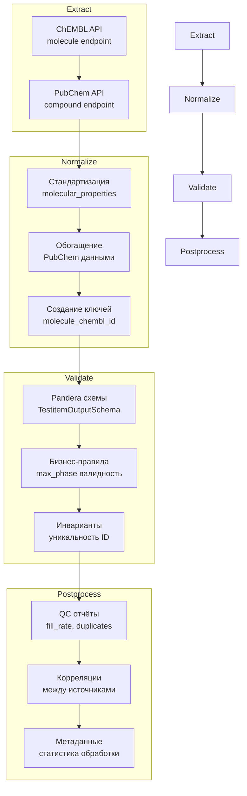
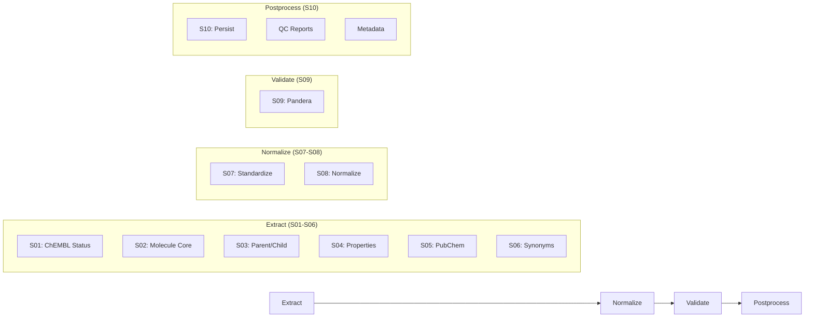

# Пайплайн Testitems

Воспроизводимый, детерминированный конвейер для формирования измерения `testitem_dim` по молекулам из ChEMBL с обогащением из PubChem.

## 1. Назначение и границы

### Что делает пайплайн

Пайплайн Testitems формирует измерение `testitem_dim` для звёздной схемы данных, реализуя полный цикл ETL для извлечения и нормализации молекулярных данных:

- **Extract**: Извлечение данных из ChEMBL и PubChem APIs
- **Normalize**: Нормализация и стандартизация данных
- **Validate**: Валидация с использованием Pandera схем
- **Persist**: Детерминистическое сохранение в CSV формате

### Входы и выходы

**Входы**:

- CSV файл с молекулярными идентификаторами (`molecule_chembl_id`, `molregno`)
- Конфигурация `configs/config_testitem_full.yaml`

**Выходы**:

- `testitem__YYYYMMDD.csv` — основные данные молекул
- `meta.yaml` — метаданные пайплайна
- `qc/testitem_YYYYMMDD_qc.csv` — QC артефакты

### Место в архитектуре

Пайплайн Testitems является одним из пяти основных пайплайнов системы, формируя измерение для звёздной схемы данных. Результаты используются в пайплайне Activities для связывания биоактивностных данных с молекулами.

## 2. Источники данных и маппинги

| Источник | Статус | Endpoint | Основные поля | Обязательность |
|----------|--------|----------|---------------|----------------|
| **ChEMBL** | ✅ Обязательный | `/molecule` | `molecule_chembl_id`, `pref_name`, `max_phase`, `molecular_properties` | Да |
| **PubChem** | ✅ Опциональный | `/compound` | `pubchem_cid`, `molecular_formula`, `canonical_smiles` | Нет |

## 3. Граф ETL



### Маппинг полей

**ChEMBL → testitem_dim**:

- `molecule_chembl_id` → `molecule_chembl_id`
- `molregno` → `molregno`
- `pref_name` → `pref_name`
- `max_phase` → `max_phase`
- `therapeutic_flag` → `therapeutic_flag`
- `molecular_properties` → `mw_freebase`, `alogp`, `hba`, `hbd`, `psa`, `rtb`

**PubChem → testitem_dim**:

- `pubchem_cid` → `pubchem_cid`
- `molecular_formula` → `pubchem_molecular_formula`
- `molecular_weight` → `pubchem_molecular_weight`
- `canonical_smiles` → `pubchem_canonical_smiles`
- `inchi` → `pubchem_inchi`
- `inchi_key` → `pubchem_inchi_key`

## 3. Граф ETL (детализация)



## 4. Схемы данных

### Входная схема

| Поле | Тип | Nullable | Описание |
|------|-----|----------|----------|
| `molecule_chembl_id` | str | No* | ChEMBL идентификатор молекулы |
| `molregno` | int | No* | Регистрационный номер молекулы |
| `parent_chembl_id` | str | Yes | ChEMBL ID родительской молекулы |
| `parent_molregno` | int | Yes | Регистрационный номер родительской молекулы |
| `pubchem_cid` | int | Yes | PubChem идентификатор соединения |

*Обязательно хотя бы одно из `molecule_chembl_id` или `molregno`

### Выходная схема

| Поле | Тип | Nullable | Описание | Источник |
|------|-----|----------|----------|----------|
| `molecule_chembl_id` | str | No | ChEMBL ID молекулы | ChEMBL |
| `molregno` | int | No | Регистрационный номер | ChEMBL |
| `pref_name` | str | Yes | Предпочтительное название | ChEMBL |
| `pref_name_key` | str | No | Ключ для сортировки | Система |
| `parent_chembl_id` | str | Yes | ID родительской молекулы | ChEMBL |
| `parent_molregno` | int | Yes | Регистрационный номер родительской молекулы | ChEMBL |
| `max_phase` | int | Yes | Максимальная фаза разработки | ChEMBL |
| `therapeutic_flag` | bool | Yes | Флаг терапевтического средства | ChEMBL |
| `dosed_ingredient` | bool | Yes | Флаг дозируемого ингредиента | ChEMBL |
| `first_approval` | int | Yes | Год первого одобрения | ChEMBL |
| `structure_type` | str | Yes | Тип структуры | ChEMBL |
| `molecule_type` | str | Yes | Тип молекулы | ChEMBL |
| `mw_freebase` | float | Yes | Молекулярная масса | ChEMBL |
| `alogp` | float | Yes | ALogP | ChEMBL |
| `hba` | int | Yes | Акцепторы водородных связей | ChEMBL |
| `hbd` | int | Yes | Доноры водородных связей | ChEMBL |
| `psa` | float | Yes | Полярная площадь поверхности | ChEMBL |
| `rtb` | int | Yes | Поворотные связи | ChEMBL |
| `pubchem_cid` | int | Yes | PubChem CID | PubChem |
| `pubchem_molecular_formula` | str | Yes | Молекулярная формула | PubChem |
| `pubchem_molecular_weight` | float | Yes | Молекулярная масса | PubChem |
| `pubchem_canonical_smiles` | str | Yes | Канонические SMILES | PubChem |
| `pubchem_inchi` | str | Yes | InChI | PubChem |
| `pubchem_inchi_key` | str | Yes | InChI ключ | PubChem |
| `standardized_inchi` | str | Yes | Стандартизированный InChI | Система |
| `standardized_inchi_key` | str | Yes | Стандартизированный InChI ключ | Система |
| `standardized_smiles` | str | Yes | Стандартизированные SMILES | Система |
| `source_system` | str | No | Система-источник | Система |
| `chembl_release` | str | No | Версия ChEMBL | ChEMBL |
| `extracted_at` | datetime | No | Время извлечения | Система |
| `hash_row` | str | No | Хеш строки | Система |
| `hash_business_key` | str | No | Хеш бизнес-ключа | Система |

### Политика NA

- **ChEMBL обязательные поля**: NA не допускается
- **ChEMBL опциональные поля**: NA разрешено
- **PubChem поля**: NA разрешено (graceful degradation)
- **Системные поля**: Обязательные, NA не допускается

## 5. Конфигурация

### Основные настройки

```yaml
# configs/config_testitem_full.yaml
pipeline:
  version: 1.1.0
  allow_parent_missing: false
  enable_pubchem: true

runtime:
  batch_size: 200
  retries: 5
  timeout_sec: 30
  log_level: INFO
  cache_dir: .cache/chembl
  pubchem_cache_dir: .cache/pubchem

sources:
  chembl:
    name: chembl
    endpoint: molecule
    http:
      base_url: https://www.ebi.ac.uk/chembl/api/data
      timeout_sec: 60.0
      retries:
        total: 5
        backoff_multiplier: 2.0

  pubchem:
    name: pubchem
    endpoint: compound
    http:
      base_url: https://pubchem.ncbi.nlm.nih.gov/rest/pug
      timeout_sec: 45.0
      retries:
        total: 8
        backoff_multiplier: 2.5

determinism:
  sort:
    by: [molecule_chembl_id, molregno, pref_name_key]
    ascending: [true, true, true]
    na_position: last
```

### Переменные окружения

```bash
# Опционально
CHEMBL_API_TOKEN=your_chembl_token_here
```

### Настройки кэша

```yaml
runtime:
  cache_dir: .cache/chembl
  pubchem_cache_dir: .cache/pubchem
  cache_ttl: 86400  # 24 часа
```

## 6. Валидация

### Pandera схемы

```python
# src/library/schemas/testitem_schema.py
class TestitemOutputSchema(pa.DataFrameModel):
    molecule_chembl_id: Series[str] = pa.Field(description="ChEMBL molecule identifier")
    molregno: Series[int] = pa.Field(description="Molecule registration number")
    pref_name: Series[str] = pa.Field(nullable=True, description="Preferred name")
    # ... остальные поля
```

### Инварианты

1. **Уникальность**: `molecule_chembl_id` должен быть уникальным
2. **Связность**: Все записи должны иметь данные из ChEMBL
3. **Консистентность**: `molregno` должен быть положительным числом
4. **Полнота**: Минимум 90% записей должны иметь основные поля

### Дедупликация

- По `molecule_chembl_id` (основной ключ)
- Автоматическое удаление дубликатов
- Логирование удалённых записей

## 7. Детерминизм

### Сортировка

```yaml
determinism:
  sort:
    by: [molecule_chembl_id, molregno, pref_name_key]
    ascending: [true, true, true]
    na_position: last
```

### Формат float

```yaml
io:
  output:
    csv:
      float_format: "%.3f"
      date_format: "%Y-%m-%dT%H:%M:%SZ"
```

### Порядок колонок

```yaml
determinism:
  column_order:
    - molecule_chembl_id
    - molregno
    - pref_name
    - pref_name_key
    - parent_chembl_id
    # ... фиксированный порядок
```

### Локаль и таймзона

- **Локаль**: UTF-8
- **Таймзона**: UTC для всех временных меток
- **Формат даты**: ISO 8601

## 8. CLI/Make команды

### Стандартизованные цели

```bash
# Установка зависимостей
pip install .[dev]

# Валидация конфигурации
python -m library.cli testitem-validate-config --config configs/config_testitem_full.yaml

# Запуск с примером данных
python -m library.cli testitem-run --config configs/config_testitem_full.yaml --input data/input/testitem.csv

# Информация о конвейере
python -m library.cli testitem-info
```

### CLI команды

```bash
# Основная команда
python -m library.cli testitem-run \
  --config configs/config_testitem_full.yaml \
  --input data/input/testitem_keys.csv

# С дополнительными параметрами
python -m library.cli testitem-run \
  --config configs/config_testitem_full.yaml \
  --input data/input/testitem_keys.csv \
  --output data/output/testitem \
  --cache-dir .cache/chembl \
  --pubchem-cache-dir .cache/pubchem \
  --timeout 45 \
  --retries 7 \
  --limit 500 \
  --disable-pubchem false \
  --verbose

# Прямой запуск скрипта
python src/scripts/get_testitem_data.py \
  --config configs/config_testitem_full.yaml \
  --input data/input/testitem_keys.csv
```

### Параметры командной строки

| Параметр | Описание | Обязательный | По умолчанию |
|----------|----------|--------------|--------------|
| `--config` | Путь к конфигурации | Да | - |
| `--input` | CSV с молекулярными ключами | Да | - |
| `--output` | Директория вывода | Нет | Из конфига |
| `--cache-dir` | Директория кэша ChEMBL | Нет | .cache/chembl |
| `--pubchem-cache-dir` | Директория кэша PubChem | Нет | .cache/pubchem |
| `--timeout` | Таймаут запросов | Нет | 30 |
| `--retries` | Количество повторов | Нет | 5 |
| `--limit` | Ограничение записей | Нет | null |
| `--disable-pubchem` | Отключить PubChem | Нет | false |
| `--verbose` | Подробный вывод | Нет | false |

## 9. Артефакты

### Структура выходных файлов

```text
data/output/testitem/
├── testitem__20240101.csv          # Основной датасет
├── meta.yaml                       # Метаданные
└── qc/
    └── testitem_20240101_qc.csv    # QC артефакты

logs/
└── testitem_20240101_1200.jsonl    # Структурированные логи

.cache/
├── chembl/                         # HTTP кэш ChEMBL
└── pubchem/                        # HTTP кэш PubChem
```

### Формат имён файлов

- **Основной CSV**: `testitem__{run_date}.csv`
- **QC отчёт**: `qc/testitem_{run_date}_qc.csv`
- **Метаданные**: `meta.yaml`

Где `run_date` = YYYYMMDD (UTC) из поля `extracted_at` на стадии S10.

### meta.yaml структура

```yaml
pipeline:
  name: testitems
  version: 1.1.0
  run_date: "2024-01-01T12:00:00Z"

sources:
  chembl:
    enabled: true
    records_processed: 1000
    records_successful: 995
    records_failed: 5

  pubchem:
    enabled: true
    records_processed: 995
    records_successful: 890
    records_failed: 105

quality:
  total_records: 1000
  valid_records: 995
  invalid_records: 5
  fill_rate: 0.95
  duplicate_rate: 0.0
  pubchem_enrichment_rate: 0.89
```

### Отчёты в reports/

- **QC отчёты**: Автоматически генерируемые метрики качества
- **Метаданные**: Информация о запуске пайплайна
- **Логи**: Структурированные JSON логи

## 10. Контроль качества

### Чек-лист QC

- [ ] ChEMBL источник включён
- [ ] Fill rate >= 90%
- [ ] Дубликаты <= 0.5%
- [ ] Все molecule_chembl_id валидны
- [ ] PubChem обогащение >= 80%
- [ ] Стандартизация структур >= 95%

### Ожидаемые инварианты

1. **Полнота ChEMBL**: 100% записей должны иметь данные из ChEMBL
2. **Уникальность**: Нет дубликатов по `molecule_chembl_id`
3. **Валидность**: Все `molecule_chembl_id` соответствуют формату CHEMBL\d+
4. **Структурная валидность**: SMILES и InChI должны быть валидными

### Метрики качества

- **Fill Rate**: Процент заполненных полей
- **Source Coverage**: Покрытие по источникам
- **Validation Success**: Процент успешных валидаций
- **Processing Time**: Время обработки
- **PubChem Enrichment**: Процент успешного обогащения PubChem
- **Structure Standardization**: Процент стандартизированных структур

## 11. Ограничения и типичные ошибки

### Rate limits API

| Источник | Лимит | Таймаут | Особенности |
|----------|-------|---------|-------------|
| **ChEMBL** | Нет лимита | 60s | Требует токен для больших объёмов |
| **PubChem** | Нет лимита | 45s | Открытый API |

### Типовые фейлы и решения

1. **Ошибка "Parent molecule missing"**

   ```bash
   # Решение: Включить allow_parent_missing в конфигурации
   pipeline:
     allow_parent_missing: true
   ```

2. **Медленная обработка PubChem**

   ```bash
   # Решение: Отключить PubChem для тестирования
   python -m library.cli testitem-run --disable-pubchem true
   ```

3. **Ошибки валидации структур**

   ```bash
   # Решение: Проверить логи стандартизации
   tail logs/app.log | grep "standardization"
   ```

4. **Проблемы с кэшем**

   ```bash
   # Решение: Очистить кэш
   rm -rf .cache/chembl .cache/pubchem
   ```

5. **Ошибки валидации Pandera**

   ```bash
   # Решение: Проверить схемы и данные
   python -c "from library.schemas.testitem_schema import TestitemOutputSchema; print('Schema loaded')"
   ```

### Troubleshooting

```bash
# Проверка конфигурации
python -m library.cli testitem-validate-config --config configs/config_testitem_full.yaml

# Информация о конвейере
python -m library.cli testitem-info

# Тестовый запуск с ограничением
python -m library.cli testitem-run --config configs/config_testitem_full.yaml --input data/input/testitem.csv --limit 10
```

### Производительность

#### Рекомендации

- Используйте батчевую обработку для оптимизации API запросов
- Настройте HTTP кэширование для повторных запросов
- Ограничивайте количество записей при тестировании
- Используйте PubChem только при необходимости

#### Мониторинг

```bash
# Проверка кэша
ls -la .cache/chembl/ .cache/pubchem/

# Просмотр логов
tail -f logs/app.log | grep "testitem"
```

### Обработка ошибок

Конвейер реализует graceful degradation:

- При недоступности ChEMBL API - возвращает пустые записи с информацией об ошибке
- При недоступности PubChem API - продолжает работу без обогащения
- При ошибках валидации - логирует предупреждения и продолжает обработку
- При критических ошибках - останавливает выполнение с соответствующим кодом выхода

## 12. Детерминизм

### Сортировка данных

```python
# Детерминированная сортировка по molecule_chembl_id
df_sorted = df.sort_values(['molecule_chembl_id'], na_position='last')
```

### Формат чисел

```python
# Стандартизация числовых полей
df['molecule_chembl_id'] = df['molecule_chembl_id'].astype('string')
df['molregno'] = df['molregno'].astype('int64')
df['mw_freebase'] = df['mw_freebase'].astype('float64')
df['alogp'] = df['alogp'].astype('float64')
```

### Порядок колонок

```python
# Фиксированный порядок колонок в выходном CSV
column_order = [
    'molecule_chembl_id',
    'molregno',
    'pref_name',
    'max_phase',
    'therapeutic_flag',
    'mw_freebase',
    'alogp',
    'hba',
    'hbd',
    'psa',
    'rtb',
    'pubchem_cid',
    'pubchem_molecular_formula',
    'canonical_smiles',
    'inchi',
    'inchi_key'
]
df_output = df[column_order]
```

### Временные зоны

```python
# Все временные метки в UTC
from datetime import datetime, timezone
timestamp = datetime.now(timezone.utc).isoformat()
```

## 13. Запуск

### CLI команды

```bash
# Полный запуск пайплайна
make run ENTITY=testitems CONFIG=configs/config_testitem_full.yaml

# Через CLI напрямую
bioactivity-data-acquisition pipeline --config configs/config_testitem_full.yaml

# Тестовый запуск с ограниченными данными
make run ENTITY=testitems CONFIG=configs/config_test.yaml
```

### Docker/Compose

```bash
# Запуск в Docker контейнере
docker-compose run --rm bioactivity-pipeline testitems

# Или через Makefile
make docker-run ENTITY=testitems CONFIG=configs/config_testitem_full.yaml
```

### Ожидаемые артефакты

После успешного выполнения в `data/output/testitem_YYYYMMDD/`:

```text
testitem_20241201/
├── testitem_20241201.csv                    # Основные данные молекул
├── testitem_20241201_meta.yaml             # Метаданные пайплайна
├── testitem_20241201_qc.csv                # QC отчёт
└── testitem_correlation_report_20241201/   # Корреляционный анализ
    ├── correlation_matrix.csv
    ├── source_comparison.csv
    └── quality_metrics.csv
```

## 14. QC чек-лист

### Перед запуском

- [ ] Проверить наличие входного файла `data/input/testitem.csv`
- [ ] Убедиться в корректности конфигурации `configs/config_testitem_full.yaml`
- [ ] Проверить доступность ChEMBL и PubChem API
- [ ] Настроить кэширование при необходимости

### После выполнения

- [ ] Проверить количество записей в выходном файле
- [ ] Убедиться в отсутствии критических ошибок в QC отчёте
- [ ] Проверить fill rate для обязательных полей (≥80%)
- [ ] Убедиться в отсутствии дубликатов по `molecule_chembl_id`
- [ ] Проверить качество PubChem обогащения

### Специфичные проверки для Testitems

- [ ] Все `molecule_chembl_id` уникальны
- [ ] `max_phase` в диапазоне 0-4
- [ ] `therapeutic_flag` булево значение
- [ ] `mw_freebase` в разумных пределах (50-2000 Da)
- [ ] `alogp` в диапазоне -10 до 10
- [ ] SMILES и InChI валидны
- [ ] PubChem обогащение ≥80%

## 15. Ссылки

### Модули в src/

- **Основной пайплайн**: `src/library/testitem/pipeline.py`
- **API клиенты**:
  - `src/library/clients/chembl.py`
  - `src/library/clients/pubchem.py`
- **Схемы валидации**: `src/library/schemas/testitem_schema.py`
- **ETL утилиты**: `src/library/etl/`

### Конфигурация

- **Основной конфиг**: `configs/config_testitem_full.yaml`
- **Тестовый конфиг**: `configs/config_test.yaml`

### Тесты

- **Unit тесты**: `tests/test_testitem_pipeline.py`
- **Интеграционные тесты**: `tests/integration/test_testitem_pipeline.py`
- **Тестовые данные**: `tests/fixtures/testitem.csv`
