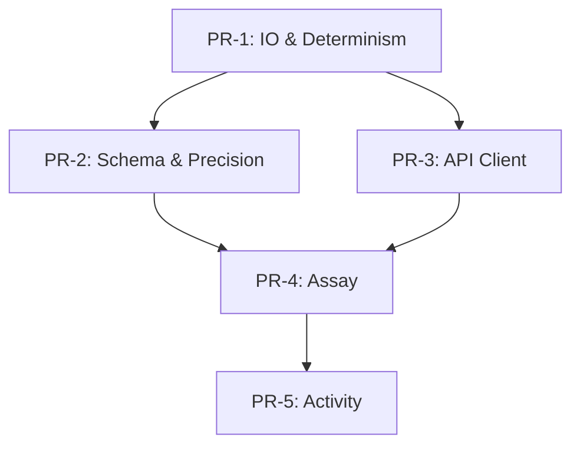

# План серии PR
Серия Pull Requests для внедрения правок из [gaps.md](gaps.md).

## PR-1: IO-протокол и детерминизм
**Цель**: Единый atomic write, запрет partial artifacts, golden-run.

**Файлы**:

- `docs/requirements/02-io-system.md` — норматив atomic write
- `src/library/io/writer.py` — патч 5 (os.replace)
- `src/library/common/hash_utils.py` — патч 1 (канонизация)
- `tests/unit/test_writer.py` — тесты atomic write
- `tests/golden/test_determinism.py` — тесты golden-run

**Изменения**:

- Добавить раздел "Единый протокол записи" в 02-io-system.md
- Реализовать `write_bytes_atomic` с run-scoped temp dir
- Реализовать `canonicalize_row_for_hash`
- Добавить AC1, AC4
- Добавить golden-run CLI флаг

**Тесты**: AC1, AC4, G1, G13, G15

**Риски**:

- Платформенные различия `os.replace` (Windows vs POSIX)
- Performance overhead от temp dir

**Откат**: Вернуть прежний путь записи, убрать temp dir.

**ETA**: 2 дня

---

## PR-2: Schema-registry/NA/precision
**Цель**: column_order как источник истины, семантика drift, NA-policy.

**Файлы**:

- `docs/requirements/04-normalization-validation.md` — централизация column_order
- `docs/requirements/02-io-system.md` — синхронизация NA-policy (R1) ✅
- `src/library/schemas/registry.py` — schema drift detection
- `src/library/schemas/precision_map.py` — precision_policy
- `tests/unit/test_schema_drift.py` — тесты drift
- `tests/unit/test_precision.py` — тесты precision

**Изменения**:

- column_order из схемы, meta.yaml — копия
- Fail-fast при несовместимой major версии
- precision_map и NA-policy обязательны
- CLI флаг `--fail-on-schema-drift` (default=True)
- **Типо-зависимая NA-policy**: строки → "", числа → null (R1) ✅
- **Расширение meta.yaml**: добавлены `run_id`, `config_hash`, `config_snapshot` (R2) ✅

**Тесты**: AC2, AC10, G4, G5

**Риски**:

- Жёсткость валидации может блокировать миграции
- Breaking changes в схемах

**Откат**: Ослабить fail-fast, разрешить отключение через флаг.

**ETA**: 2 дня

**Закрытые риски**: R1 (blocker), R2 (critical)

---

## PR-3: Клиент API (429/Retry-After, limiter)
**Цель**: AC5, логирование retry_after, respect Retry-After инвариант.

**Файлы**:

- `docs/requirements/03-data-extraction.md` — Retry-After стратегия
- `docs/requirements/03-data-extraction.md` — протокол requeue для PartialFailure (R3) ✅
- `src/library/clients/unified_client.py` — патч 3 (retry-after)

- `src/library/clients/rate_limit.py` — TokenBucket acquire
- `tests/integration/test_retry_after.py` — тесты 429 handling

**Изменения**:

- Implement `TokenBucketLimiter.acquire()`
- Логирование retry_after в warning

- Respect Retry-After ≥ указанного
- Запрет ретраев на 4xx (кроме 429)
- **Протокол requeue**: реализация `retry_queue`, `drain_partial_queue()` с лимитом 3 попытки (R3) ✅

**Тесты**: AC5, G11

**Риски**:

- Деградация скорости выгрузки (long waits)
- Накопление таймаутов

**Откат**: Снизить ожидания, уменьшить backoff.

**ETA**: 1 день

**Закрытый риск**: R3 (major)

---

## PR-4: Assay long-format и whitelist
**Цель**: AC7, AC8 — batch≤25, long-format обязателен, whitelist enrichment.

**Файлы**:

- `docs/requirements/05-assay-extraction.md` — batch_size≤25, long-format
- `docs/requirements/00-architecture-overview.md` — whitelist enrichment

- `src/library/pipelines/assay/transform.py` — патч 2 (expand_*_long)
- `src/library/pipelines/assay/config.py` — batch_size validation

- `tests/integration/test_assay_long_format.py` — тесты long-format

**Изменения**:

- batch_size ≤ 25 validation в конфиге
- `expand_assay_parameters_long()`, `expand_variant_sequences_long()`, `expand_classifications_long()`

- RI-чек "assay→target"
- `--strict-enrichment` флаг (whitelist полей)

**Тесты**: AC7, AC8, G6, G7, G8

**Риски**:

- Рост объёма данных (long-format)
- Потеря производительности на explode

**Откат**: Фича-флаг для long-format, отключение strict-enrichment.

**ETA**: 2 дня

---

## PR-5: Activity pagination/QC/sort
**Цель**: AC6, AC9 + фиксация лимита, offset-only pagination.

**Файлы**:

- `docs/requirements/06-activity-data-extraction.md` — offset-only, сортировка, QC duplicates=0
- `src/library/pipelines/activity/extract.py` — offset-only validation

- `src/library/pipelines/activity/validate.py` — duplicates check
- `src/library/pipelines/activity/config.py` — limit fix

- `tests/integration/test_activity_pagination.py` — тесты pagination

**Изменения**:

- Только offset-пагинация, идти по page_meta.next
- Перед записью `df.sort_values(["activity_id"])`

- QC фильтр: `duplicates_activity_id==0`
- Фиксация "безопасного" limit через бинарный поиск

**Тесты**: AC6, AC9, G2, G3, G9, G10

**Риски**:

- Время выгрузки (большой offset range)
- 429 штормы при агрессивной пагинации

**Откат**: Снизить лимит, вернуть смешанную pagination.

**ETA**: 1 день

---

## Последовательность применения



**Порядок**:

1. **PR-1** (основа детерминизма)

2. **PR-2** (схемы, может параллельно с PR-3)

3. **PR-3** (клиент, может параллельно с PR-2)

4. **PR-4** (assay, зависит от PR-1)

5. **PR-5** (activity, финальный)

## Общие требования к PR
### Чеклист PR
- [ ] Код покрыт тестами (>80%)
- [ ] Все AC пройдены

- [ ] Документация обновлена
- [ ] CI зелёный

- [ ] Golden-run проходит
- [ ] Code review одобрен

### Формат commit message

```text

type(scope): краткое описание

- Детали изменений
- Закрываем gap GX

- Проверяем ACY

Refs: #issue-number

```

### Типы commits
- `feat`: новая функциональность
- `fix`: исправление бага

- `docs`: правки документации
- `test`: добавление тестов

- `refactor`: рефакторинг без изменения функциональности

### Размер PR
- Оптимально: 300-500 строк изменений
- Максимум: 1000 строк

- Если больше — разбить на несколько PR

## Дефолтные reviewers
- **Архитектор**: PR-1, PR-2, PR-3
- **Data Eng**: PR-2, PR-5

- **ETL Eng**: PR-4
- **Вед. инженер**: все PR (финальный approval)

## Критерии готовности к merge
1. Все автоматические проверки пройдены (lint, test, format)

2. Code review одобрен минимум 2 reviewers

3. Документация обновлена и проверена

4. Нет конфликтов с main

5. Golden-run сравнение пройдено

6. Gap закрыт (см. gaps.md)

## Роллбэк план
Если PR вызвал проблемы в production:

```bash

# Immediate rollback

git revert <commit-sha>

# Hotfix

git checkout -b hotfix/pr-X-rollback

# Apply rollback

git push origin hotfix/pr-X-rollback

```

## Метрики успеха
После merge всех PR:

- Средний балл ISO/IEC 25010 ≥ 4.0
- Все High-priority gaps закрыты

- 100% AC покрыты тестами
- Зелёный CI pipeline

- Golden-run stable

## Связи с документами
- [gaps.md](gaps.md) — описание проблем
- [acceptance-criteria.md](acceptance-criteria.md) — критерии проверки

- [test-plan.md](test-plan.md) — план тестирования
- [implementation-examples.md](implementation-examples.md) — патчи кода

- `CHANGELOG.md` — фиксация изменений
