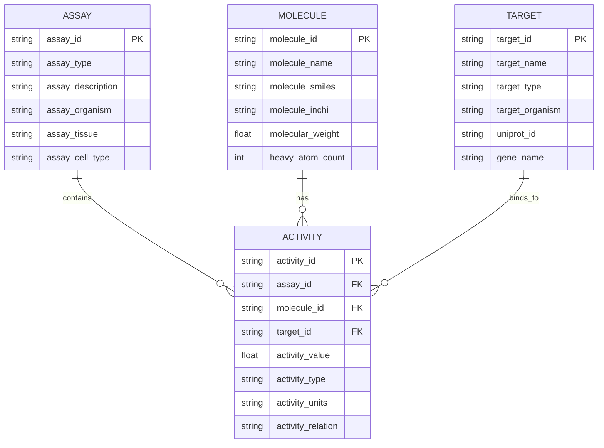

# Схемы биоактивности

## Обзор

Данный документ описывает Pandera схемы для валидации данных биоактивности, включая активности, эксперименты (ассаи), мишени и молекулы (теститемы).

## Основные сущности

### Связи между сущностями



## Схемы данных

### Activity Schema

**Расположение**: `src/library/schemas/activity_schema.py`

**Основные поля**:
- `activity_id`: Уникальный идентификатор активности
- `assay_id`: Ссылка на эксперимент
- `molecule_id`: Ссылка на молекулу
- `target_id`: Ссылка на мишень
- `activity_value`: Значение активности
- `activity_type`: Тип активности (IC50, EC50, Ki и др.)
- `activity_units`: Единицы измерения
- `activity_relation`: Отношение (равно, меньше, больше)

**Пример схемы**:
```python
class ActivitySchema(pa.DataFrameModel):
    """Схема для данных активностей."""
    
    activity_id: pa.typing.Series[str] = pa.Field(
        description="Уникальный идентификатор активности",
        regex=r"^CHEMBL\d+$"
    )
    
    assay_id: pa.typing.Series[str] = pa.Field(
        description="Идентификатор эксперимента",
        regex=r"^CHEMBL\d+$"
    )
    
    molecule_id: pa.typing.Series[str] = pa.Field(
        description="Идентификатор молекулы",
        regex=r"^CHEMBL\d+$"
    )
    
    target_id: pa.typing.Series[str] = pa.Field(
        description="Идентификатор мишени",
        regex=r"^CHEMBL\d+$"
    )
    
    activity_value: pa.typing.Series[float] = pa.Field(
        description="Значение активности",
        ge=0.0,
        le=1000000.0
    )
    
    activity_type: pa.typing.Series[str] = pa.Field(
        description="Тип активности",
        isin=["IC50", "EC50", "Ki", "Kd", "AC50", "Potency"]
    )
    
    activity_units: pa.typing.Series[str] = pa.Field(
        description="Единицы измерения",
        isin=["nM", "uM", "mM", "M", "ng/ml", "ug/ml", "mg/ml"]
    )
    
    activity_relation: pa.typing.Series[str] = pa.Field(
        description="Отношение значения",
        isin=["=", "<", ">", "<=", ">="]
    )
```

### Assay Schema

**Расположение**: `src/library/schemas/assay_schema.py`

**Основные поля**:
- `assay_id`: Уникальный идентификатор эксперимента
- `assay_type`: Тип эксперимента
- `assay_description`: Описание эксперимента
- `assay_organism`: Организм
- `assay_tissue`: Ткань
- `assay_cell_type`: Тип клеток

**Пример схемы**:
```python
class AssaySchema(pa.DataFrameModel):
    """Схема для данных экспериментов."""
    
    assay_id: pa.typing.Series[str] = pa.Field(
        description="Уникальный идентификатор эксперимента",
        regex=r"^CHEMBL\d+$"
    )
    
    assay_type: pa.typing.Series[str] = pa.Field(
        description="Тип эксперимента",
        isin=["B", "F", "A", "T", "P", "U"]
    )
    
    assay_description: pa.typing.Series[str] = pa.Field(
        description="Описание эксперимента",
        min_length=10,
        max_length=1000
    )
    
    assay_organism: pa.typing.Series[str] = pa.Field(
        description="Организм",
        isin=["Homo sapiens", "Mus musculus", "Rattus norvegicus", "Other"]
    )
    
    assay_tissue: pa.typing.Series[str] = pa.Field(
        description="Ткань",
        nullable=True
    )
    
    assay_cell_type: pa.typing.Series[str] = pa.Field(
        description="Тип клеток",
        nullable=True
    )
```

### Target Schema

**Расположение**: `src/library/schemas/target_schema.py`

**Основные поля**:
- `target_id`: Уникальный идентификатор мишени
- `target_name`: Название мишени
- `target_type`: Тип мишени
- `target_organism`: Организм
- `uniprot_id`: UniProt идентификатор
- `gene_name`: Название гена

**Пример схемы**:
```python
class TargetSchema(pa.DataFrameModel):
    """Схема для данных мишеней."""
    
    target_id: pa.typing.Series[str] = pa.Field(
        description="Уникальный идентификатор мишени",
        regex=r"^CHEMBL\d+$"
    )
    
    target_name: pa.typing.Series[str] = pa.Field(
        description="Название мишени",
        min_length=3,
        max_length=200
    )
    
    target_type: pa.typing.Series[str] = pa.Field(
        description="Тип мишени",
        isin=["SINGLE PROTEIN", "PROTEIN COMPLEX", "PROTEIN FAMILY", "UNCHECKED"]
    )
    
    target_organism: pa.typing.Series[str] = pa.Field(
        description="Организм",
        isin=["Homo sapiens", "Mus musculus", "Rattus norvegicus", "Other"]
    )
    
    uniprot_id: pa.typing.Series[str] = pa.Field(
        description="UniProt идентификатор",
        regex=r"^[OPQ][0-9][A-Z0-9]{3}[0-9]|[A-NR-Z][0-9]([A-Z][A-Z0-9]{2}[0-9]){1,2}$",
        nullable=True
    )
    
    gene_name: pa.typing.Series[str] = pa.Field(
        description="Название гена",
        nullable=True
    )
```

### Testitem Schema

**Расположение**: `src/library/schemas/testitem_schema.py`

**Основные поля**:
- `molecule_id`: Уникальный идентификатор молекулы
- `molecule_name`: Название молекулы
- `molecule_smiles`: SMILES структура
- `molecule_inchi`: InChI структура
- `molecular_weight`: Молекулярный вес
- `heavy_atom_count`: Количество тяжелых атомов

**Пример схемы**:
```python
class TestitemSchema(pa.DataFrameModel):
    """Схема для данных молекул."""
    
    molecule_id: pa.typing.Series[str] = pa.Field(
        description="Уникальный идентификатор молекулы",
        regex=r"^CHEMBL\d+$"
    )
    
    molecule_name: pa.typing.Series[str] = pa.Field(
        description="Название молекулы",
        min_length=3,
        max_length=200
    )
    
    molecule_smiles: pa.typing.Series[str] = pa.Field(
        description="SMILES структура",
        nullable=True
    )
    
    molecule_inchi: pa.typing.Series[str] = pa.Field(
        description="InChI структура",
        nullable=True
    )
    
    molecular_weight: pa.typing.Series[float] = pa.Field(
        description="Молекулярный вес",
        ge=0.0,
        le=2000.0
    )
    
    heavy_atom_count: pa.typing.Series[int] = pa.Field(
        description="Количество тяжелых атомов",
        ge=0,
        le=200
    )
```

## Валидация схем

### Базовые проверки

**Типы данных**:
- Строковые поля: проверка длины и формата
- Числовые поля: проверка диапазона значений
- Категориальные поля: проверка допустимых значений

**Ограничения**:
- Обязательные поля: не могут быть NULL
- Уникальные поля: проверка уникальности
- Ссылочная целостность: проверка внешних ключей

### Примеры валидации

**Валидация активности**:
```python
def validate_activity_data(dataframe: pd.DataFrame) -> pd.DataFrame:
    """Валидирует данные активностей."""
    
    try:
        validated = ActivitySchema.validate(dataframe, lazy=True)
        return validated
    except pa.errors.SchemaError as e:
        logger.error(f"Ошибка валидации активностей: {e}")
        raise
```

**Валидация с обработкой ошибок**:
```python
def validate_with_error_handling(dataframe: pd.DataFrame) -> pd.DataFrame:
    """Валидирует данные с детальной обработкой ошибок."""
    
    try:
        validated = ActivitySchema.validate(dataframe, lazy=True)
        return validated
    except pa.errors.SchemaError as e:
        # Логирование ошибок валидации
        for error in e.failure_cases:
            logger.warning(f"Ошибка валидации: {error}")
        
        # Возврат данных с исправленными ошибками
        return fix_validation_errors(dataframe, e.failure_cases)
```

## Связи между схемами

### Внешние ключи

**Activity → Assay**:
```python
def validate_activity_assay_relationship(
    activities: pd.DataFrame,
    assays: pd.DataFrame
) -> bool:
    """Проверяет связь между активностями и экспериментами."""
    
    assay_ids = set(assays['assay_id'])
    activity_assay_ids = set(activities['assay_id'])
    
    return activity_assay_ids.issubset(assay_ids)
```

**Activity → Molecule**:
```python
def validate_activity_molecule_relationship(
    activities: pd.DataFrame,
    molecules: pd.DataFrame
) -> bool:
    """Проверяет связь между активностями и молекулами."""
    
    molecule_ids = set(molecules['molecule_id'])
    activity_molecule_ids = set(activities['molecule_id'])
    
    return activity_molecule_ids.issubset(molecule_ids)
```

**Activity → Target**:
```python
def validate_activity_target_relationship(
    activities: pd.DataFrame,
    targets: pd.DataFrame
) -> bool:
    """Проверяет связь между активностями и мишенями."""
    
    target_ids = set(targets['target_id'])
    activity_target_ids = set(activities['target_id'])
    
    return activity_target_ids.issubset(target_ids)
```

## Нормализация данных

### Стандартизация значений

**Нормализация единиц измерения**:
```python
def normalize_activity_units(value: str) -> str:
    """Нормализует единицы измерения активности."""
    
    unit_mapping = {
        "nmol/L": "nM",
        "umol/L": "uM",
        "mmol/L": "mM",
        "mol/L": "M",
        "ng/mL": "ng/ml",
        "ug/mL": "ug/ml",
        "mg/mL": "mg/ml"
    }
    
    return unit_mapping.get(value, value)
```

**Нормализация типов активности**:
```python
def normalize_activity_type(value: str) -> str:
    """Нормализация типов активности."""
    
    type_mapping = {
        "IC50": "IC50",
        "EC50": "EC50",
        "Ki": "Ki",
        "Kd": "Kd",
        "AC50": "AC50",
        "Potency": "Potency"
    }
    
    return type_mapping.get(value, value)
```

### Обработка отсутствующих значений

**Стратегии заполнения**:
- **Пропуск**: Удаление строк с отсутствующими значениями
- **Заполнение**: Использование значений по умолчанию
- **Интерполяция**: Вычисление значений на основе других данных

**Пример обработки**:
```python
def handle_missing_values(dataframe: pd.DataFrame) -> pd.DataFrame:
    """Обрабатывает отсутствующие значения."""
    
    df = dataframe.copy()
    
    # Заполнение числовых полей
    numeric_columns = df.select_dtypes(include=[np.number]).columns
    df[numeric_columns] = df[numeric_columns].fillna(0)
    
    # Заполнение строковых полей
    string_columns = df.select_dtypes(include=['object']).columns
    df[string_columns] = df[string_columns].fillna("")
    
    return df
```

## Примеры использования

### Создание схемы

```python
from library.schemas import ActivitySchema, AssaySchema, TargetSchema, TestitemSchema

# Создание схем
activity_schema = ActivitySchema
assay_schema = AssaySchema
target_schema = TargetSchema
testitem_schema = TestitemSchema
```

### Валидация данных

```python
# Валидация активностей
validated_activities = activity_schema.validate(activities_df)

# Валидация экспериментов
validated_assays = assay_schema.validate(assays_df)

# Валидация мишеней
validated_targets = target_schema.validate(targets_df)

# Валидация молекул
validated_molecules = testitem_schema.validate(molecules_df)
```

### Проверка связей

```python
# Проверка связей между схемами
is_valid = (
    validate_activity_assay_relationship(validated_activities, validated_assays) and
    validate_activity_molecule_relationship(validated_activities, validated_molecules) and
    validate_activity_target_relationship(validated_activities, validated_targets)
)

if not is_valid:
    raise ValueError("Нарушены связи между схемами")
```

## Мониторинг качества данных

### Метрики качества

**Полнота данных**:
```python
def calculate_completeness(dataframe: pd.DataFrame) -> dict:
    """Вычисляет полноту данных по полям."""
    
    completeness = {}
    total_rows = len(dataframe)
    
    for column in dataframe.columns:
        non_null_count = dataframe[column].count()
        completeness[column] = non_null_count / total_rows
    
    return completeness
```

**Уникальность данных**:
```python
def calculate_uniqueness(dataframe: pd.DataFrame) -> dict:
    """Вычисляет уникальность данных по полям."""
    
    uniqueness = {}
    total_rows = len(dataframe)
    
    for column in dataframe.columns:
        unique_count = dataframe[column].nunique()
        uniqueness[column] = unique_count / total_rows
    
    return uniqueness
```

### Отчеты качества

**Генерация отчета**:
```python
def generate_quality_report(dataframes: dict) -> dict:
    """Генерирует отчет о качестве данных."""
    
    report = {}
    
    for name, df in dataframes.items():
        report[name] = {
            "completeness": calculate_completeness(df),
            "uniqueness": calculate_uniqueness(df),
            "row_count": len(df),
            "column_count": len(df.columns)
        }
    
    return report
```
