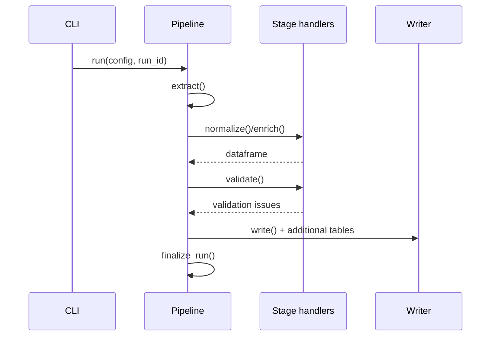

# Архитектура BioETL {#architecture-overview}

## Уровни системы {#system-layers}

```mermaid
graph TD
    cli[CLI (Typer)] --> orchestration[Pipeline orchestration]
    orchestration --> configs[Конфигурации]
    orchestration --> clients[HTTP-клиенты]
    orchestration --> normalizers[Нормализаторы]
    orchestration --> schemas[Pandera схемы]
    orchestration --> writer[Output writer]
    clients --> apis[Внешние API]
    writer --> datasets[Детерминированные наборы данных]
```

- CLI основан на [`typer.Typer`][ref: repo:src/bioetl/cli/main.py@test_refactoring_32] и
  реестре [`PIPELINE_COMMAND_REGISTRY`][ref: repo:src/scripts/__init__.py@test_refactoring_32].
- Оркестрация наследует
  [`PipelineBase`][ref: repo:src/bioetl/pipelines/base.py@test_refactoring_32],
  обеспечивая единый `run()` и контроль стадий.
- Конфигурации валидируются строгими моделями
  [`PipelineConfig`][ref: repo:src/bioetl/configs/models.py@test_refactoring_32].
- HTTP-клиенты разделены по источникам (например,
  [`ActivityChEMBLClient`][ref: repo:src/bioetl/sources/chembl/activity/client/activity_client.py@test_refactoring_32])
  и используют `UnifiedAPIClient`.
- Normalizers/Pandera schemas обеспечивают конверсию и проверку
  ([`ActivityNormalizer`][ref: repo:src/bioetl/sources/chembl/activity/normalizer/activity_normalizer.py@test_refactoring_32],
   [`ActivitySchema`][ref: repo:src/bioetl/schemas/activity.py@test_refactoring_32]).
- Writer выполняет детерминированную материализацию и QC через
  [`bioetl.core.output_writer`][ref: repo:src/bioetl/core/output_writer.py@test_refactoring_32].

## Жизненный цикл пайплайна {#pipeline-lifecycle}



1. `extract()` MUST использовать `read_input_table()` для детерминизма.
2. `normalize()` и обогащения SHOULD возвращать Pandas `DataFrame` с упорядоченными
   столбцами согласно `determinism.column_order`.
3. `validate()` MUST применять Pandera схемы и фиксировать ошибки через
   `record_validation_issue()`.
4. `write()` MUST использовать `OutputWriter` для основного набора, QC и метаданных.
5. `run()` MAY добавлять дополнительные таблицы (например, gold/bronze).

## Поток данных {#data-flow}

```mermaid
graph LR
    input_csv[Входной CSV] --> extract
    extract[extract()] --> normalize
    normalize[normalize()/enrich()] --> validate
    validate[validate()] --> qc[QC metrics]
    validate --> writer[write()]
    writer --> output_main[Детерминированный CSV]
    writer --> qc_reports[QC/metadata JSON]
```

- Входные данные резолвятся через
  [`load_input_frame`][ref: repo:src/bioetl/utils/io.py@test_refactoring_32].
- QC агрегируется функциями
  [`update_summary_metrics`][ref: repo:src/bioetl/utils/qc.py@test_refactoring_32].
- Финализация набора использует
  [`finalize_output_dataset`][ref: repo:src/bioetl/utils/output.py@test_refactoring_32].

## Глоссарий {#glossary}

| Термин | Определение |
| --- | --- |
| Business key | Подмножество колонок, формирующих уникальность сущности. |
| Determinism | Набор правил сортировки, хеширования и фиксации сидов в конфиге. |
| Enrichment stage | Зарегистрированный шаг из
  [`enrichment_stage_registry`][ref: repo:src/bioetl/pipelines/base.py@test_refactoring_32]. |
| Fallback record | Детерминированная заглушка, генерируемая
  [`FallbackRecordBuilder`][ref: repo:src/bioetl/utils/fallback.py@test_refactoring_32]. |
| Materialization tier | Bronze/Silver/Gold таблицы, создаваемые writer-ом пайплайна. |
| Run ID | Детерминированный идентификатор запуска, попадающий в output и логирование. |

## Инварианты {#architecture-invariants}

- Пайплайн MUST регистрировать все HTTP-клиенты через `self._clients` для корректного
  завершения сеансов ([`PipelineBase._clients`][ref: repo:src/bioetl/pipelines/base.py@test_refactoring_32]).
- Любая запись об ошибке SHOULD попадать в `validation_issues` или QC сводку.
- Дополнительные таблицы MAY создаваться, но MUST иметь уникальные имена в
  `additional_tables` ([`AdditionalTableSpec`][ref: repo:src/bioetl/core/output_writer.py@test_refactoring_32]).
