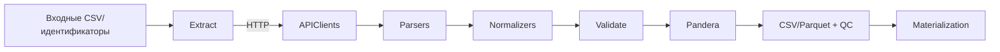

# architecture-overview

## слои-системы

```mermaid
graph TD
    CLI[CLI (Typer)] --> ConfigLoader[Config loader & PipelineConfig]
    ConfigLoader --> Pipelines[PipelineBase subclasses]
    Pipelines --> Stages[extract / transform / validate / write]
    Stages --> Core[Core services: UnifiedAPIClient, logger, output writer]
    Core --> Sources[Source adapters & clients]
    Sources --> Storage[Materialization manager & deterministic outputs]
```

- CLI основан на Typer и реестре [`build_registry()`][ref: repo:src/bioetl/cli/registry.py@test_refactoring_32], что обеспечивает единый вход для всех пайплайнов.

- Конфигурации загружаются через [`PipelineConfig`][ref: repo:src/bioetl/config/models.py@test_refactoring_32] с Pydantic-валидацией и поддержкой include/extends.

- Базовый класс [`PipelineBase`][ref: repo:src/bioetl/pipelines/base.py@test_refactoring_32] реализует стандартные стадии и обработку дополнительных артефактов, что формирует общий контракт выполнения.

- Core-службы ([`UnifiedAPIClient`][ref: repo:src/bioetl/core/api_client.py@test_refactoring_32], [`UnifiedLogger`][ref: repo:src/bioetl/core/logger.py@test_refactoring_32], [`OutputWriter`][ref: repo:src/bioetl/core/output_writer.py@test_refactoring_32]) обеспечивают ретраи, структурированное логирование и детерминированную запись.

## поток-данных



1. [`extract()`][ref: repo:src/bioetl/pipelines/base.py@test_refactoring_32] получает идентификаторы из CSV или API и использует клиентов с `backoff`-ретраями и пагинацией.

2. Парсеры и нормализаторы приводят payload к промежуточным фреймам, применяя правила сопоставления идентификаторов и очистки типов.[ref: repo:src/bioetl/sources/chembl/document/normalizer.py@test_refactoring_32]

3. [`validate()`][ref: repo:src/bioetl/pipelines/base.py@test_refactoring_32] выполняет Pandera-проверки, подстраивая порядок столбцов и собирая QC-метрики.

4. [`export()`][ref: repo:src/bioetl/pipelines/base.py@test_refactoring_32] сохраняет датасеты через [`OutputWriter`][ref: repo:src/bioetl/core/output_writer.py@test_refactoring_32], дополняя метаданными, QC-отчётами и вспомогательными таблицами.

## компоненты

### cli-и-оркестрация

- Typer-команды генерируются динамически и поддерживают общий набор флагов (`--config`, `--input`, `--output`, `--mode`, `--dry-run`).[ref: repo:src/bioetl/cli/command.py@test_refactoring_32]

- Ограничения `limit`/`sample` обрабатываются в базовом классе и логируются.[ref: repo:src/bioetl/pipelines/base.py@test_refactoring_32]

### конфигурация

- YAML-файлы в [`src/bioetl/configs/`][ref: repo:src/bioetl/configs/@test_refactoring_32] используют `extends` и include-фрагменты (`includes/chembl_source.yaml`, `includes/determinism.yaml`).[ref: repo:src/bioetl/configs/pipelines/chembl/activity.yaml@test_refactoring_32]

- [`SourceConfig`][ref: repo:src/bioetl/config/models.py@test_refactoring_32] поддерживает ключи для rate limit, circuit breaker и извлечение секретов из переменных окружения `env:`.

### клиенты-и-адаптеры

- [`UnifiedAPIClient`][ref: repo:src/bioetl/core/api_client.py@test_refactoring_32] инкапсулирует timeout, ретраи, rate limit и кэширование.

- Внешние адаптеры наследуют [`ExternalSourcePipeline`][ref: repo:src/bioetl/pipelines/external_source.py@test_refactoring_32], реализуя батчевую работу и нормализацию (PubMed, Crossref, OpenAlex, Semantic Scholar).[ref: repo:src/bioetl/adapters/crossref.py@test_refactoring_32]

- Специализированные билдеры запросов выполняют требования API (например, [`PubMedRequestBuilder`][ref: repo:src/bioetl/sources/pubmed/request/builder.py@test_refactoring_32] добавляет `tool`/`email`).

### нормализация-и-мерджинг

- Каждая сущность имеет Pandera-схему и порядок колонок, регистрируемые в [`schema_registry`][ref: repo:src/bioetl/schemas/registry.py@test_refactoring_32].[ref: repo:src/bioetl/pipelines/chembl_activity.py@test_refactoring_32]

- Merge-политики (`merge_with_precedence`, сервисы IUPHAR/UniProt) обеспечивают детерминированные приоритеты источников.[ref: repo:src/bioetl/sources/chembl/document/merge/policy.py@test_refactoring_32]

### материализация-и-qc

- [`MaterializationManager`][ref: repo:src/bioetl/core/materialization.py@test_refactoring_32] управляет слоями silver/gold/QC и расширениями датасетов.

- QC-метрики агрегируются функциями [`update_summary_metrics`][ref: repo:src/bioetl/utils/qc.py@test_refactoring_32] и [`duplicate_summary`][ref: repo:src/bioetl/utils/qc.py@test_refactoring_32] для включения в отчёты.

## глоссарий

- **Бизнес-ключ** — минимальный набор колонок, идентифицирующий запись в рамках сущности (например, `document_chembl_id` + `doi_clean`).

- **Энрихер** — внешний источник, добавляющий поля к базовому датасету.

- **Fallback** — детерминированная запись, создаваемая при ошибке запроса.[ref: repo:src/bioetl/utils/fallback.py@test_refactoring_32]

- **Materialization stage** — именованная директория (`silver`, `gold`, `qc`) с определённым форматом и колонками.[ref: repo:src/bioetl/core/materialization.py@test_refactoring_32]

- **Runtime options** — временные флаги исполнения пайплайна (`limit`, `mode`), не влияющие на конфигурацию.

- **Pandera schema** — типизированная схема валидации для DataFrame с поддержкой nullable-политики и диапазонов значений.[ref: repo:src/bioetl/core/unified_schema.py@test_refactoring_32]

- **UnifiedAPIClient** — унифицированный HTTP-клиент с поддержкой backoff, rate limit, кэширования и circuit breaker.[ref: repo:src/bioetl/core/api_client.py@test_refactoring_32]

- **QC (Quality Control)** — контроль качества данных через метрики, отчёты и валидационные проверки.[ref: repo:src/bioetl/utils/qc.py@test_refactoring_32]
