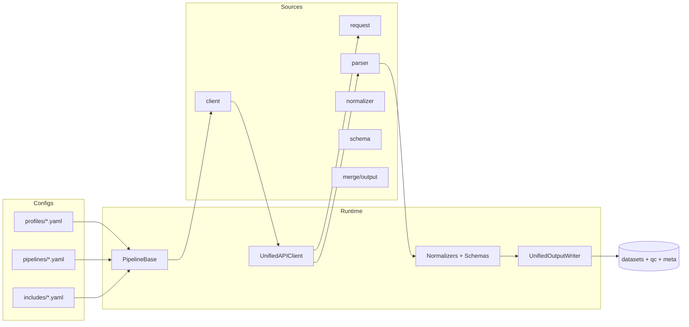

# Архитектура BioETL

## уровни-системы

- **Core** — общие компоненты: `UnifiedLogger`, `UnifiedAPIClient`, `UnifiedOutputWriter`, `PipelineBase` ([ref: repo:src/bioetl/core/@test_refactoring_32], [ref: repo:src/bioetl/pipelines/base.py@test_refactoring_32]).
- **Sources** — адаптеры внешних API и ChEMBL-модулей (`src/bioetl/sources/<name>/`). Каждый источник содержит подпакеты `client`, `request`, `parser`, `normalizer`, `schema`, `output`.
- **Pipelines** — тонкие прокси, связывающие конфиг и реализацию источника (`src/bioetl/pipelines/`).
- **Configs** — слои наследования YAML (`src/bioetl/configs/`) описывают параметры HTTP, детерминизм и материализацию.
- **Tests** — модульные и интеграционные проверки, golden-наборы ([ref: repo:tests/@test_refactoring_32]).

## архитектурная-диаграмма

```mermaid
flowchart LR
    subgraph Configs
        A[profiles/*.yaml]
        B[pipelines/*.yaml]
        C[includes/*.yaml]
    end
    subgraph Runtime
        D[PipelineBase]
        E[UnifiedAPIClient]
        F[Normalizers + Schemas]
        G[UnifiedOutputWriter]
    end
    subgraph Sources
        H[client]
        I[request]
        J[parser]
        K[normalizer]
        L[schema]
        M[merge/output]
    end
    A --> D
    B --> D
    C --> D
    D --> H
    H --> E
    E --> I
    E --> J
    J --> F
    F --> G
    G --> Outputs[(datasets + qc + meta)]
```

## потоки-данных

1. **Инициализация** — загрузка конфигурации через `load_config` ([ref: repo:src/bioetl/config/loader.py@test_refactoring_32]) с валидацией `PipelineConfig`.
2. **Extract** — источники реализуют батчевую загрузку и ретраи. Контакты (`tool/email/mailto`) **MUST** передаваться в каждый HTTP-вызов.
3. **Normalize** (`transform`) — приводятся идентификаторы, единицы, словари; в нормализаторах запрещены побочные эффекты.
4. **Validate** — Pandera-схемы (`schema_registry`) гарантируют типы и обязательные поля.
5. **Write** — `UnifiedOutputWriter` выполняет атомарную запись, формирует QC и `meta.yaml`.

## логирование-и-трассировка

- `UnifiedLogger` конфигурируется через `UnifiedLogger.setup` и **MUST** работать в JSON-режиме в production ([ref: repo:src/bioetl/core/logger.py@test_refactoring_32]).
- Каждое событие **MUST** включать `run_id`, `stage`, `source`.
- Для HTTP-запросов добавляются `request_id`, `endpoint`, `retry_after`.

## детерминизм

- Настройки находятся в `determinism` блоке конфигураций (hash алгоритм, precision, сортировка).
- `resolve_schema_column_order` обеспечивает порядок столбцов, fallback включён для пустых схем ([ref: repo:src/bioetl/utils/dataframe.py@test_refactoring_32]).
- `UnifiedOutputWriter` использует `atomicwrites` и вычисляет SHA256 для каждого артефакта.

## схемы-и-валидация

- Реестр (`schema_registry`) связывает сущности с версиями схем ([ref: repo:src/bioetl/schemas/registry.py@test_refactoring_32]).
- Pandera-классы (`ActivitySchema`, `AssaySchema`, `DocumentSchema`, `TargetSchema`, `TestItemSchema`) описывают типы, nullable-политику и категории.
- Нарушения схемы фиксируются в `self.validation_issues` и поднимают исключение, если `severity` превышает порог `qc.severity_threshold`.

## расширение-источников

- Каждый новый источник **MUST** реализовать структуру каталогов: `client/`, `request/`, `pagination/`, `parser/`, `normalizer/`, `schema/`, `merge/`, `output/`, `pipeline.py`.
- Retry/RateLimit конфигурируются через `Source` модель ([ref: repo:src/bioetl/configs/models.py@test_refactoring_32]).
- Merge-логика оформляется отдельным модулем с явными приоритетами источников.

## интеграция-с-CLI

- Typer-приложение (`bioetl.cli.main`) автоматически подхватывает все пайплайны из `PIPELINE_COMMAND_REGISTRY` ([ref: repo:src/bioetl/cli/main.py@test_refactoring_32], [ref: repo:src/scripts/__init__.py@test_refactoring_32]).
- Команды применяют `PipelineBase.run`, включают валидацию колонок, поддерживают `--sample`, `--dry-run`, `--extended`.

## тестирование-и-QA

- Структура тестов описана в `docs/qc/QA.md`; покрытия golden-наборов обеспечивают бит-идентичность.
- `make docs-verify` и `python src/scripts/validate_columns.py --entity all` **SHOULD** запускаться перед слиянием.

