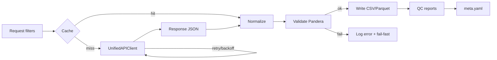

# 6. Извлечение данных Activity (ChEMBL)
## 1. Введение и обзор
### Назначение модуля
Модуль извлекает биологические активности (activity) из ChEMBL Data Web Services, нормализует и валидирует записи, формирует детерминированные артефакты вывода и метаданные.

**Основные функции:**

- Извлечение данных activity через RESTful API ChEMBL

- Нормализация полей (идентификаторы, числовые значения, единицы измерения)

- Валидация через Pandera схемы

- Генерация QC отчетов и correlation анализа

- Формирование метаданных (meta.yaml) с lineage и checksums

### Связи с компонентами
Используются унифицированные компоненты архитектуры:

- **UnifiedAPIClient** (см. [03-data-extraction.md](03-data-extraction.md)) — HTTP запросы, ретраи, кэширование

- **UnifiedSchema** (см. [04-normalization-validation.md](04-normalization-validation.md)) — Pandera-схемы и реестр нормализаторов

- **UnifiedOutputWriter** (см. [02-io-system.md](02-io-system.md)) — атомарная запись CSV/Parquet, meta.yaml, QC-отчеты

- **UnifiedLogger** (см. [01-logging-system.md](01-logging-system.md)) — структурные JSON-логи

### Источник данных
**ChEMBL Data Web Services:**

- Base URL: `https://www.ebi.ac.uk/chembl/api/data`

- Ресурс: `activity` (с пагинацией и фильтрацией)

- Версия API: определяется автоматически через `/status`

**Официальная документация:**

- [ChEMBL Data Web Services](https://www.ebi.ac.uk/chembl/documentation/webservices)

- [Activity endpoint](https://www.ebi.ac.uk/chembl/documentation/webservices#RESOURCE_ACTIVITY)

### Контракт извлечения
**Обязательные требования:**

1. **Только официальные эндпоинты** ChEMBL Data Web Services

2. **Формат ответа:** JSON (предпочтительно) или XML

3. **Все запросы** через `UnifiedAPIClient` с таймаутами, ретраями и кэшированием

   - Handshake `/status.json` для фиксации `chembl_release` выполняется тем же клиентом,
     поэтому при недоступности ChEMBL активируются штатные ретраи, circuit-breaker и
     fallback стратегии (`cache`, `partial_retry`) без обходов через «сырые» HTTP вызовы.

4. **Детерминизм:**

   - Стабильная сортировка по `activity_id`
   - Фиксированный `COLUMN_ORDER` из Pandera-схемы
   - Версии фиксируются в `meta.yaml` (`chembl_release`, `pipeline_version`)

### Примеры базовых запросов
**curl:**

```bash

curl -s "https://www.ebi.ac.uk/chembl/api/data/activity.json?molecule_chembl_id=CHEMBL998&limit=5"

```
**Python (requests):**

```python

import requests

r = requests.get(
    "https://www.ebi.ac.uk/chembl/api/data/activity.json",
    params={"molecule_chembl_id": "CHEMBL998", "limit": 5},
    timeout=30
)
r.raise_for_status()
data = r.json()

```
**Критерии детерминизма/валидности:**

- Версии фиксируются в `meta.yaml` (`chembl_release`, `pipeline_version`)

- Артефакты записываются после полной валидации

- Сортировка по `activity_id` воспроизводима

- Фиксация `chembl_release` через `/status` endpoint

---

## 2. ChEMBL Activity API
### Base URL и endpoints
**Base URL:** `https://www.ebi.ac.uk/chembl/api/data`

**Endpoints:**

- Список: `/activity` (по умолчанию XML; `?format=json` или `.json` для JSON)

- Одна запись: `/activity/{activity_id}` (+ `.json` при необходимости)

- Шаблон `/RESOURCE/ID` официально поддерживается

**Ссылка:** [ChEMBL Blog - Resource URLs](https://www.ebi.ac.uk/chembl/blog/resource-urls)

### Методы HTTP
- **GET** — основной способ получения данных

- **POST** с заголовком `X-HTTP-Method-Override: GET` — для длинных параметров запроса (обход лимита длины URL)

**Контракт:** Использовать только документированные фильтры и шаблон `/RESOURCE/ID`

### Параметры запроса
**Ключевые фильтры:**

- `activity_id` — идентификатор активности

- `molecule_chembl_id` — фильтр по молекуле

- `target_chembl_id` — фильтр по таргету

- `assay_chembl_id` — фильтр по ассею

- `document_chembl_id` — фильтр по документу

**Пагинация:**

- `limit` — количество записей на странице (default: 20, max: см. раздел UNCERTAIN)

- `offset` — смещение для offset-based pagination

**⚠️ Breaking Change (v3.0):** Activity pipeline теперь использует **batch IDs** стратегию (`activity_id__in`) вместо offset-пагинации. См. раздел "Батчевое извлечение" ниже.

**Расширенные фильтры:**

- `field__filter` — стандартные Django-подобные фильтры (например, `pchembl_value__gte`)

- `only` — выборка полей (например, `only=molecule_chembl_id,pchembl_value`)

- `order_by` — сортировка (например, `order_by=-pchembl_value`)

### Батчевое извлечение из ChEMBL API
**Метод:** `ActivityPipeline._extract_from_chembl()`

**Эндпоинт ChEMBL:** `/activity.json?activity_id__in={ids}`

**Размер батча:**

- **Конфиг:** `sources.chembl.batch_size: 25` (ОБЯЗАТЕЛЬНО)

- **Причина:** Жесткое ограничение длины URL в ChEMBL API (~2000 символов)

- **Валидация конфига:**

```python

  if batch_size > 25:
      raise ConfigValidationError(
          "sources.chembl.batch_size must be <= 25 due to ChEMBL API URL length limit"
      )

```
**Алгоритм:**

```python

def _extract_from_chembl(self, data: pd.DataFrame) -> pd.DataFrame:
    """Extract activity data with 25-item batching."""

    # Счетчики метрик

    success_count = 0
    fallback_count = 0
    error_count = 0
    api_calls = 0
    cache_hits = 0

    # Жесткий размер батча

    BATCH_SIZE = 25

    activity_ids = data["activity_id"].tolist()

    # Батчевое извлечение

    for i in range(0, len(activity_ids), BATCH_SIZE):
        batch_ids = activity_ids[i:i + BATCH_SIZE]

        try:

            # Проверка кэша с release-scoping

            cached = self._check_cache(batch_ids, self.chembl_release)
            if cached:
                batch_data = cached
                cache_hits += len(batch_ids)
            else:
                batch_data = chembl_client.fetch_activities_batch(batch_ids)
                api_calls += 1
                self._store_cache(batch_data, self.chembl_release)

            # Обработка ответов

            for activity_id in batch_ids:
                activity_data = batch_data.get(activity_id)
                if activity_data and "error" not in activity_data:
                    if activity_data.get("source_system") == "ChEMBL_FALLBACK":
                        fallback_count += 1
                    else:
                        success_count += 1
                else:
                    error_count += 1

                    # Fallback с расширенными полями

                    activity_data = self._create_fallback_record(activity_id)

        except CircuitBreakerOpenError:

            # Fallback для всего батча

            for activity_id in batch_ids:
                activity_data = self._create_fallback_record(activity_id)
                fallback_count += 1

        except Exception as e:
            error_count += len(batch_ids)
            logger.error(f"Batch failed: {e}")

    # Логирование статистики

    logger.info({
        "total_activities": len(activity_ids),
        "success_count": success_count,
        "fallback_count": fallback_count,
        "error_count": error_count,
        "success_rate": (success_count + fallback_count) / len(activity_ids),
        "api_calls": api_calls,
        "cache_hits": cache_hits
    })

    return extracted_dataframe

```
**Преимущества batch IDs над offset:**

- Детерминированность: одинаковый набор activity_id всегда даёт одинаковый результат

- Кэшируемость: ключ кэша = список ID, не зависит от пагинации

- Производительность: один запрос на 25 записей вместо множества offset-запросов

- Отказоустойчивость: можно повторно запросить конкретный батч без потери контекста

### Примеры запросов
**Single by activity_id:**

```bash

curl -s "https://www.ebi.ac.uk/chembl/api/data/activity/31863.json"

```
Пример ответа (усечен):

```json

{
  "activity_comment": null,
  "activity_id": 31863,
  "assay_chembl_id": "CHEMBL663853",
  "bao_endpoint": "BAO_0000190",
  "bao_format": "BAO_0000357",
  "bao_label": "single protein format",
  "molecule_chembl_id": "CHEMBL113081",
  "document_chembl_id": "CHEMBL1137930",
  "standard_type": "Ki",
  "standard_units": "nM",
  "standard_relation": "=",
  "standard_value": 20.0,
  "pchembl_value": 7.70,
  "canonical_smiles": "c1ccc..."
}

```
**Batch по molecule_chembl_id:**

```bash

curl -s "https://www.ebi.ac.uk/chembl/api/data/activity.json?molecule_chembl_id=CHEMBL998&limit=3"

```
Response содержит `page_meta`: `limit`, `offset`, `next`, `previous`, `total_count`.

**Batch по target_chembl_id с фильтрами:**

```bash

curl -s "https://www.ebi.ac.uk/chembl/api/data/activity.json?target_chembl_id=CHEMBL240&assay_type=B&pchembl_value__gte=6&only=molecule_chembl_id,pchembl_value,assay_chembl_id&order_by=-pchembl_value&limit=5"

```
Фильтры `__gte`, `only`, `order_by` — стандартные для ChEMBL Web Services.

**Критерии:**

- Все примеры должны выполняться

- Статус 200 OK

- `page_meta` присутствует при списковых запросах

---

## 3. Структура данных ChEMBL Activity
### Response schema
**Ключевые поля ресурса activity** (из live-ответов API):

| Поле | Тип | Описание | Nullable |
|---|---|---|---|
| `activity_id` | int | Уникальный ID активности | False |
| `molecule_chembl_id` | string | Ссылка на молекулу | True |
| `assay_chembl_id` | string | Ссылка на assay | True |
| `target_chembl_id` | string | Ссылка на target | True |
| `document_chembl_id` | string | Ссылка на документ | True |
| `standard_type` | string | Тип измерения (Ki, IC50, etc.) | True |
| `standard_value` | float | Стандартизированное значение | True |
| `standard_units` | string | Единицы измерения (nM, μM) | True |
| `standard_relation` | string | Отношение (=, <, >, ~, <=, >=) | True |
| `pchembl_value` | float | -log10(molar IC50, XC50, EC50, AC50, Ki, Kd или Potency) | True |
| `canonical_smiles` | string | Каноническая структура | True |
| `ligand_efficiency` | object | Метрики эффективности лиганда (nested) | True |
| `bao_endpoint` | string | BAO endpoint ID | True |
| `bao_format` | string | BAO format ID | True |
| `bao_label` | string | BAO format label | True |
| `target_organism` | string | Организм таргета | True |
| `target_tax_id` | int | Taxonomy ID | True |
| `data_validity_comment` | string | Комментарии о валидности | True |
| `activity_properties` | array | Вложенные свойства (nested array) | True |

**Nested структуры:**

- `ligand_efficiency` содержит: `BEI`, `LE`, `LLE`, `SEI`

- `activity_properties` — массив объектов с произвольными свойствами

### Контракт сохранения данных
- Сохранять исходные поля API без потери семантики

- При нормализации не терять информацию

- Все поля nullable допустимы (согласно ChEMBL schema)

- BAO, pChEMBL, canonical_smiles подтверждены схемой

**Ссылки:**

- [EMBL-EBI ChEMBL Schema](https://www.ebi.ac.uk/chembl/documentation/chema_data_model)

- [ChEMBL Data Model](https://www.ebi.ac.uk/chembl/documentation)

---

## 4. Маппинг полей CSV → ChEMBL API
### Таблица FIELD_MAPPING
Полная таблица маппинга полей с правилами нормализации и валидации:

| _internal_name | _chembl_field | _datatype | _example | _normalisation | _validation | source_endpoint | notes |
|---|---|---|---|---|---|---|---|
| ACTIVITY.activity_id | activity_id | int | 31863 | as-is | unique, >=1 | /activity | PK поле |
| ACTIVITY.molecule_chembl_id | molecule_chembl_id | string | CHEMBL998 | uppercase; regex ^CHEMBL\d+$ | regex; not null for molecule-linked | /activity | Foreign key |
| ACTIVITY.assay_chembl_id | assay_chembl_id | string | CHEMBL1909156 | uppercase; regex ^CHEMBL\d+$ | regex | /activity | Foreign key |
| ACTIVITY.target_chembl_id | target_chembl_id | string | CHEMBL231 | uppercase; regex ^CHEMBL\d+$ | regex or null | /activity | Foreign key |
| ACTIVITY.document_chembl_id | document_chembl_id | string | CHEMBL1137930 | uppercase; regex ^CHEMBL\d+$ | regex or null | /activity | Foreign key |
| ACTIVITY.standard_type | standard_type | string | Ki | trim; upper-case tokens preserved | isin{IC50,EC50,XC50,AC50,Ki,Kd,Potency,ED50} | /activity | whitelist расширяем |
| ACTIVITY.standard_relation | standard_relation | string | = | map unicode inequalities to ASCII | isin{=,>,<,>=,<=,~} | /activity | - |

| ACTIVITY.standard_value | standard_value | float | 20.0 | to float; NaN if empty | >=0 or NaN | /activity | - |

| ACTIVITY.standard_units | standard_units | string | nM | normalize unit synonyms | isin{nM,µM,mM,%,ratio,...} | /activity | единицы без выдумки |
| ACTIVITY.pchembl_value | pchembl_value | float | 7.70 | as-is | >=0 or NaN | /activity | см. FAQ pChEMBL |
| ACTIVITY.bao_endpoint | bao_endpoint | string | BAO_0000190 | regex ^BAO_\d{7}$ | regex or null | /activity | - |

| ACTIVITY.bao_format | bao_format | string | BAO_0000357 | regex ^BAO_\d{7}$ | regex or null | /activity | - |

| ACTIVITY.bao_label | bao_label | string | single protein format | trim | len<=128 or null | /activity | - |

| ACTIVITY.canonical_smiles | canonical_smiles | string | CC(=O)Oc1ccccc1C(=O)O | canonicalization deferred | non-empty or null | /activity | - |

| ACTIVITY.ligand_efficiency | ligand_efficiency | string | {"LE":0.45,...} | stable json dumps | json parseable or null | /activity | может быть вложенным |
| ACTIVITY.target_organism | target_organism | string | Homo sapiens | title-case | len<=255 or null | /activity | - |

| ACTIVITY.target_tax_id | target_tax_id | int | 9606 | int | >=1 or null | /activity | - |

| ACTIVITY.data_validity_comment | data_validity_comment | string | Outside typical range | trim | enum per FAQ or null | /activity | см. FAQ |
| ACTIVITY.activity_properties | activity_properties | string | {...} | stable json dumps | json parseable or null | /activity | - |

| ACTIVITY.compound_key | compound_key | string | CHEMBL998\|Ki\|CHEMBL231 | concat | len<=256 | derived | бизнес-ключ |
| ACTIVITY.is_citation | is_citation | bool | true | as-is | boolean | derived | по document linkage |
| ACTIVITY.high_citation_rate | high_citation_rate | bool | false | as-is | boolean | derived | евристика |
| ACTIVITY.exact_data_citation | exact_data_citation | bool | true | as-is | boolean | derived | формируем из источника |
| ACTIVITY.rounded_data_citation | rounded_data_citation | bool | false | as-is | boolean | derived | формируем из источника |

### Дополнительные поля (business logic, derived)
Поля, не присутствующие в ChEMBL API, производятся на этапе обогащения:

- `compound_key` — вычисляемый бизнес-ключ (concat молекула + тип + таргет)

- `compound_name` — кастомное имя соединения

- `IUPHAR_class`, `IUPHAR_subclass` — обогащение через IUPHAR API

- `taxon_index`, `gene_index` — индексы для категоризации

- `is_citation`, `high_citation_rate` — флаги QC

- `exact_data_citation`, `rounded_data_citation` — флаги качества данных

**Контракт:**

- Внешние/вычисляемые поля производятся на этапе обогащения

- При отсутствии источника — `null`

**Критерии:**

- Заморозка порядка колонок через `COLUMN_ORDER` из Pandera-схемы

---

## 5. Нормализация данных
### Идентификаторы
**ChEMBL IDs:**

- Regex: `^CHEMBL\d+$`

- Нормализация: uppercase

- Примеры: `CHEMBL998`, `CHEMBL1909156`

**BAO IDs:**

- Regex: `^BAO_\d{7}$`

- Нормализация: uppercase underscore

- Примеры: `BAO_0000190`, `BAO_0000357`

**Taxonomy IDs:**

- Тип: integer

- Валидация: >= 1

- Примеры: `9606` (Homo sapiens), `10141` (Cavia porcellus)

### Числовые значения
**standard_value:**

- Тип: float

- Валидация: >= 0

- Обработка: NaN допустим при отсутствии значения

- Округление: по политике ChEMBL (см. раздел UNCERTAIN)

**pchembl_value:**

- Тип: float

- Валидация: >= 0

- Формула: -log10(molar IC50, XC50, EC50, AC50, Ki, Kd или Potency)

- Диапазон: типично 0-14

### Строки и категории
**standard_type:**

- Whitelist: `IC50`, `EC50`, `XC50`, `AC50`, `Ki`, `Kd`, `Potency`, `ED50`

- Расширяемая политика: новые типы добавляются в схему по мере необходимости

- Нормализация: trim, preserve case

**standard_relation:**

- Enum: `=`, `>`, `<`, `>=`, `<=`, `~`

- Нормализация: map unicode inequalities to ASCII (≤ → <=, ≥ → >=)

**standard_units:**

- Нормализация синонимов: nM, µM, mM, %, ratio

- Примеры: nM, μM (Unicode), uM (ASCII), ug/mL → преобразование к стандарту

### Политика округления
ChEMBL применяет стандартизацию и проверки валидности данных. Детальные правила приведены в [ChEMBL FAQ](https://www.ebi.ac.uk/chembl/documentation/faq).

**Ключевые моменты:**

- Используются флаги `data_validity_comment`, `potential_duplicate`

- Вычисление pChEMBL согласно официальному FAQ

- Проверка на валидность диапазонов значений

### Политика NULL/NA
**Числовые поля:**

- `None` → `null` в JSON

- `None` → пустая строка `""` в CSV

**Строковые поля:**

- `None` → `""` (пустая строка)

**Boolean:**

- `None` → `false` (по умолчанию)

**Контракт:**

- Никаких свободных преобразований

- Только детерминированные правила

- Все проверяется Pandera-схемой

---

## 6. Pandera Schema для Activity
### SCHEMA_VERSION и COLUMN_ORDER
```python

from pandera import DataFrameSchema, Column, Check
import pandera as pa

SCHEMA_VERSION = "1.0.0"
COLUMN_ORDER = [
    "activity_id", "molecule_chembl_id", "assay_chembl_id", "target_chembl_id",
    "document_chembl_id", "standard_type", "standard_relation", "standard_value",
    "standard_units", "pchembl_value", "bao_endpoint", "bao_format", "bao_label",
    "canonical_smiles", "ligand_efficiency", "target_organism", "target_tax_id",
    "data_validity_comment", "activity_properties",
    "compound_key", "is_citation", "high_citation_rate",
    "exact_data_citation", "rounded_data_citation"
]

STANDARD_TYPES = {"IC50", "EC50", "XC50", "AC50", "Ki", "Kd", "Potency", "ED50"}
RELATIONS = {"=", "<", ">", "<=", ">=", "~"}

```
### ActivitySchema
```python

ActivitySchema = DataFrameSchema(
    {
        "activity_id": Column(pa.Int64, Check.ge(1), unique=True, nullable=False),
        "molecule_chembl_id": Column(pa.String, Check.str_matches(r"^CHEMBL\d+$"), nullable=True),
        "assay_chembl_id": Column(pa.String, Check.str_matches(r"^CHEMBL\d+$"), nullable=True),
        "target_chembl_id": Column(pa.String, Check.str_matches(r"^CHEMBL\d+$"), nullable=True),
        "document_chembl_id": Column(pa.String, Check.str_matches(r"^CHEMBL\d+$"), nullable=True),
        "standard_type": Column(pa.String, Check.isin(STANDARD_TYPES), nullable=True),
        "standard_relation": Column(pa.String, Check.isin(RELATIONS), nullable=True),
        "standard_value": Column(pa.Float64, Check.ge(0), nullable=True),
        "standard_units": Column(pa.String, nullable=True),
        "pchembl_value": Column(pa.Float64, Check.ge(0), nullable=True),
        "bao_endpoint": Column(pa.String, Check.str_matches(r"^BAO_\d{7}$"), nullable=True),
        "bao_format": Column(pa.String, Check.str_matches(r"^BAO_\d{7}$"), nullable=True),
        "bao_label": Column(pa.String, nullable=True),
        "canonical_smiles": Column(pa.String, nullable=True),
        "ligand_efficiency": Column(pa.String, nullable=True),
        "target_organism": Column(pa.String, nullable=True),
        "target_tax_id": Column(pa.Int64, Check.ge(1), nullable=True),
        "data_validity_comment": Column(pa.String, nullable=True),
        "activity_properties": Column(pa.String, nullable=True),
        "compound_key": Column(pa.String, nullable=True),
        "is_citation": Column(pa.Bool, nullable=True),
        "high_citation_rate": Column(pa.Bool, nullable=True),
        "exact_data_citation": Column(pa.Bool, nullable=True),
        "rounded_data_citation": Column(pa.Bool, nullable=True),
    },
    ordered=True,
    coerce=True,
    name=f"ActivitySchema_v{SCHEMA_VERSION}",
)

```
### Контракт валидации
- Строгая схема с типами, nullable, unique, диапазонами, regex и isin

- Версионирование и `COLUMN_ORDER` фиксируются в коде

- Изменения схемы требуют bump версии и обновления документации

---

## 7. Rate Limiting и Circuit Breaker
### Контракт клиента
Клиент обязан:

- Ограничивать QPS (запросов в секунду)

- При 429 применять экспоненциальный backoff

- Учитывать `Retry-After` если присутствует в заголовке ответа

- Останавливать ретраи при постоянных 4xx

- При 5xx и таймаутах — ограниченный ретрай с jitter

- Иметь circuit breaker для длительных деградаций

### ChEMBL API конфигурация
```python

from unified_client import APIConfig

chembl_activity_config = APIConfig(
    name="chembl_activity",
    base_url="https://www.ebi.ac.uk/chembl/api/data",
    headers={"Accept": "application/json"},
    cache_enabled=True,
    cache_ttl=3600,  # 1 час

    cache_maxsize=4096,
    rate_limit_max_calls=20,  # консервативно

    rate_limit_period=1.0,
    timeout_connect=5.0,
    timeout_read=90.0,
    retry_total=3,
    retry_backoff_factor=2.0,
    cb_failure_threshold=5,
    cb_timeout=60.0
)

```
### ⚠️ UNCERTAIN: Rate Limits
**Проблема:**

- Официальный фиксированный лимит запросов в сек. не документирован на странице web-services

**План проверки:**

- Нагрузочный прогон с измерением частоты 429

- Инспекция заголовков ответа (`Retry-After`)

- Подобрать безопасный QPS эмпирически

- Зафиксировать результат в Best Practices

---

## 8. Батчинг и пагинация
### Стратегия батчинга
**Offset-based pagination:**

- Параметры: `limit` и `offset`

- Сигналы завершения из `page_meta`: `next == null` или исчерпан `total_count`

- Не полагаться на `total_count` как инвариант при долгих выгрузках

### Псевдокод
```python

offset = 0
limit = 1000  # безопасное значение; при 400/413 уменьшать

while True:
    page = GET("/activity.json", params={**filters, "limit": limit, "offset": offset})
    yield from page["activities"]
    pm = page["page_meta"]
    if not pm.get("next"):
        break
    offset += pm["limit"]

```
### page_meta структура
```json

{
  "limit": 1000,
  "offset": 0,
  "next": "https://www.ebi.ac.uk/chembl/api/data/activity.json?limit=1000&offset=1000",
  "previous": null,
  "total_count": 123456
}

```
### Критерии успешной пагинации
- Логи фиксируют `page`, `offset`, `consumed`, `rate_limiter_state`

- Идти по `next` до `null`

**Инвариант G2, G9:** Только offset-пагинация; идти по page_meta.next до null; перед записью сортировка по activity_id обязательна: `df.sort_values(["activity_id"])`.

**См. также**: [gaps.md](../gaps.md) (G2, G9), [acceptance-criteria.md](../acceptance-criteria.md) (AC6).

### ⚠️ TODO: Максимальный limit для Activity API
**Проблема (AUD-1):**

Внешние источники упоминают 1000 как возможный максимум, но это не подтверждено для `/activity` endpoint. Требуется эмпирическая верификация через бинарный поиск.

**План верификации:**

1. **Бинарный поиск по значениям `limit`**: начать с диапазона [1, 10000]
2. **Критерий остановки**: первая 400/413 ошибка от ChEMBL API
3. **Зафиксировать проверенное значение** в configs/pipelines/activity.yaml (поле `sources.chembl.max_limit`)
4. **Добавить тест** в `tests/integration/test_chembl_limits.py`

**curl команды для проверки:**

```bash

# Низкий лимит (должен работать)

curl -s "https://www.ebi.ac.uk/chembl/api/data/activity.json?molecule_chembl_id=CHEMBL998&limit=100"

# Средний лимит

curl -s "https://www.ebi.ac.uk/chembl/api/data/activity.json?molecule_chembl_id=CHEMBL998&limit=1000"

# Высокий лимит

curl -s "https://www.ebi.ac.uk/chembl/api/data/activity.json?molecule_chembl_id=CHEMBL998&limit=5000"

```
**Ссылка:** [test-plan.md](../test-plan.md), процедура бинарного поиска

---

## 9. Обработка ошибок
### Таблица ERROR_HANDLING
| code | condition | action | retry_policy | log_fields | metric |
|---|---|---|---|---|---|
| 200 | OK | продолжить | n/a | info, "page ok" | counter:page_ok |
| 204 | empty page | завершить по next==null | n/a | info, "empty page" | counter:page_empty |
| 400 | bad request | fail-fast | none | warn, "bad request" | counter:http_400 |
| 404 | not found | warn-and-continue | none | warn, "not found" | counter:http_404 |
| 408 | timeout | retry | exp backoff, max N | warn, "timeout" | counter:http_408 |
| 429 | rate limited | retry | exp backoff + Retry-After | warn, include retry_after | counter:http_429 |

| 500/502/503/504 | server errors | retry | exp backoff + jitter | error | counter:http_5xx |

| else | unexpected | fail-fast | none | error, include body | counter:http_other |

### Log fields
Структурированные поля логов:

- `level` — уровень (info, warn, error)

- `message` — текстовое описание

- `endpoint` — URL эндпоинта

- `params` — параметры запроса

- `attempt` — номер попытки

- `retry_after` — время ожидания в сек. (если есть)

- `duration` — длительность запроса в мс

- `run_id` — уникальный ID запуска

### Примеры логов
```json

{
  "level": "error",
  "code": 429,
  "message": "Rate limited by ChEMBL API",
  "retry_after": 60,
  "endpoint": "/activity.json",
  "params": {"molecule_chembl_id": "CHEMBL318723"},
  "attempt": 2,
  "run_id": "20251028-070000-abc123",
  "duration_ms": 150,
  "timestamp_utc": "2025-10-28T07:01:23.456Z"
}

```
### Контракт обработки ошибок
- Fail-fast на постоянных 4xx

- Ретраи только на 429/5xx/Timeout

- Все ошибки логируются и метрикуются

### Критерии приемки обработки ошибок
- Покрытие в юнит-тестах на моки

- Интеграционные тесты на реальных эндпоинтах

### ⚠️ UNCERTAIN: Поведение Retry-After
**Проблема:**

- Поведение `Retry-After` проверить эмпирически

**План проверки:**

- Прогон с контролируемой нагрузкой

- Логи заголовков ответа

- Верификация корректности интерпретации

---

## 10. Кэширование
### Стратегия кэширования
**TTL-кэш на уровне HTTP-клиента:**

- TTL: 1 час (3600 секунд)

- Max size: 4096 записей

- Key format: `md5(endpoint + '?' + stable_json(sorted(params)))`

- Thread-safe: TTLCache из cachetools

- Invalidation: автоматическая по TTL и при смене `chembl_release`

### Пример генерации cache key
```python

import hashlib
import json

def make_cache_key(endpoint: str, params: dict) -> str:
    """Генерирует стабильный cache key из endpoint и параметров."""
    params_json = json.dumps(params, sort_keys=True, separators=(",", ":"))
    key_str = f"{endpoint}?{params_json}"
    return hashlib.md5(key_str.encode()).hexdigest()

# Пример

cache_key = make_cache_key(
    "/activity.json",
    {"molecule_chembl_id": "CHEMBL998", "limit": 100}
)

# Результат: 'a1b2c3d4e5f6...' (детерминированный для одинаковых параметров)

```
### Контракт кэширования
- Стабильная сериализация параметров (сортировка ключей)

- Нормализованный список значений для `__in` фильтров

- Кэш-хиты/миссы метрикуются

- Инвалидация при смене `chembl_release`

### Критерии эффективности кэша
- Кэш-хиты/миссы логируются в структурированном виде

- Hit rate отслеживается в метриках

---

## 11. Quality Control
### QC метрики для activity
**Обязательные метрики:**

- `total_activities` — общее количество записей

- `activity_type_distribution` — распределение типов (Ki, IC50, EC50)

- `unit_distribution` — распределение единиц (nM, μM)

- `missing_values_count` — количество пропусков по полям

- `duplicate_check` — проверка дубликатов по `activity_id` (должно быть unique)

**Referential integrity:**

- Валидация ссылок на `assay_chembl_id`, `molecule_chembl_id`, `target_chembl_id`, `document_chembl_id`

**Флаги валидности (из ChEMBL FAQ):**

- `data_validity_comment` — комментарии о валидности данных

- `potential_duplicate` — флаг потенциальных дубликатов

### Контракт QC-отчетов
- QC-отчеты обязательны

- Применять QC-фильтры по `data_validity_comment`, `potential_duplicate`

- Отчетность пишется рядом с основным CSV

### Примеры QC фильтров
```python

# Фильтр по валидности данных

valid_activities = df[df['data_validity_comment'].isna() |
                      (df['data_validity_comment'] == '')]

# Фильтр по дубликатам

unique_activities = df[df['potential_duplicate'] == 0]

# Фильтр по заполненности critical полей

complete_activities = df[
    df['standard_value'].notna() &
    df['standard_type'].notna() &
    df['molecule_chembl_id'].notna()
]

```
**Инвариант G10, AC9:** QC-фильтры по validity/duplicates как AC; инвариант duplicates_activity_id==0; проверка перед записью: `df["activity_id"].duplicated().sum()==0`.

```python

# Обязательная проверка перед записью

duplicate_count = df["activity_id"].duplicated().sum()
assert duplicate_count == 0, f"Found {duplicate_count} duplicate activity_id entries"

# QC report

qc_report = {
    "duplicates_activity_id": duplicate_count,
    "threshold": 0,
    "passed": duplicate_count == 0
}

```
**См. также**: [gaps.md](../gaps.md) (G10), [acceptance-criteria.md](../acceptance-criteria.md) (AC9).

### ⚠️ UNCERTAIN: Стабильность BAO полей
**Проблема:**

- Набор (`bao_endpoint`, `bao_format`, `bao_label`) подтвержден схемой, но допускает null

- Доля заполненности неизвестна

**План проверки:**

- Сэмплирование 10k записей

- Оценка заполненности BAO полей

- Документирование результатов

---

## 12. Output Artifacts
### Standard режим (2 файла)
- `activity_{date}.csv` — основной датасет

- `activity_{date}_quality_report.csv` — QC метрики

**Корреляционный анализ опционален**: файл `activity_{date}_correlation_report.csv` создаётся только при `postprocess.correlation.enabled: true` в конфигурации.

### Extended режим (+ metadata и manifest)
- Добавляет `activity_{date}_meta.yaml` — метаданные

- Добавляет `activity_{date}_run_manifest.json` — манифест запуска (опционально)

### META_TEMPLATE.yaml
```yaml

pipeline_version: "activity_etl_1.0.0"
chembl_release: "unknown"  # извлекается из /status

source:
  base_url: "https://www.ebi.ac.uk/chembl/api/data"
  resource: "activity"
  filters:
    molecule_chembl_id: "CHEMBL998"
    target_chembl_id: null
    assay_type: null
  request:
    method: "GET"
    limit: 1000
    pagination: "offset"
    started_at_utc: "2025-10-28T07:00:00Z"
    finished_at_utc: "2025-10-28T07:30:00Z"
execution:
  run_id: "20251028-070000-abc123"
  host: "etl-runner-01"
  python: "3.11"
  client_timeout_s: 60
  retries:
    max_attempts: 5
    strategy: "exponential_backoff"
    base_delay_s: 1.0
artifacts:
  csv_path: "activity_2025-10-28.csv"
  qc_report_path: "activity_2025-10-28_quality_report.csv"

  # corr_report_path: опционально, только при postprocess.correlation.enabled: true

  column_order: [
    "activity_id", "molecule_chembl_id", "assay_chembl_id", "target_chembl_id",
    "document_chembl_id", "standard_type", "standard_relation", "standard_value",
    "standard_units", "pchembl_value", "bao_endpoint", "bao_format", "bao_label",
    "canonical_smiles", "ligand_efficiency", "target_organism", "target_tax_id",
    "data_validity_comment", "activity_properties",
    "compound_key", "is_citation", "high_citation_rate",
    "exact_data_citation", "rounded_data_citation"
  ]
checksums:
  csv_sha256: "13d5deb55a24b8286fb261f6d3c74dff08360089d25f75c6cc2723ef0d126234"
  qc_sha256: "4a8a623f070b039fb82925026b209917a72c87883eb30e3a749f95f3a40eaa9e"

  # corr_sha256: опционально, только при postprocess.correlation.enabled: true

row_count: 123456
qc_summary:
  missing_standard_value_pct: 12.3
  invalid_units_count: 0
  duplicates_activity_id: 0
notes:

  - "Данные получены с использованием фильтров, см. выше."
  - "Детерминизм обеспечен: сортировка по activity_id."

```
### Контракт атомарной записи
- Атомарная запись через временные файлы

- Контроль сумм (SHA256)

- Фиксация `chembl_release` через `/status` endpoint

- Поля соответствуют `META_TEMPLATE.yaml`

### Критерии атомарности записи
- Все артефакты создаются или ни один

- Checksums воспроизводимы при одинаковом вводе

- `chembl_release` извлекается из `/status` endpoint

---

## 13. Примеры использования
### Инициализация и GET-батч
```python

import hashlib
import json
import time
import requests

BASE = "https://www.ebi.ac.uk/chembl/api/data"

def stable_params(d):
    """Стабильная сериализация параметров."""
    return json.dumps(d, sort_keys=True, separators=(",", ":"))

def fetch_activities(filters, limit=1000, sleep_s=1.0):
    """Извлекает activities с пагинацией и rate limiting."""
    offset = 0
    while True:
        params = dict(filters, limit=min(limit, 1000), offset=offset, format="json")
        r = requests.get(f"{BASE}/activity", params=params, timeout=60)

        if r.status_code == 429:

            # exponential backoff

            time.sleep(sleep_s)
            sleep_s = min(sleep_s * 2, 60)
            continue

        r.raise_for_status()
        page = r.json()

        for it in page.get("activities", []):
            yield it

        pm = page.get("page_meta", {})
        if not pm.get("next"):
            break

        offset += pm.get("limit", 0)
        time.sleep(0.2)  # мягкий rate limit

# Использование

for activity in fetch_activities({"target_chembl_id": "CHEMBL240"}):
    print(f"Activity {activity['activity_id']}: {activity['standard_value']}")

```
### POST с X-HTTP-Method-Override (длинные списки __in)
```python

import requests

filters = {
    "assay_chembl_id__in": ",".join([
        "CHEMBL830379",
        "CHEMBL1909156",
        "CHEMBL691450"
    ]),
    "molecule_chembl_id": "CHEMBL998",
    "format": "json",
    "limit": 500
}

r = requests.post(
    f"{BASE}/activity",
    data=filters,
    headers={"X-HTTP-Method-Override": "GET"},
    timeout=60
)
r.raise_for_status()
data = r.json()

print(f"Received {len(data.get('activities', []))} activities")

```
Поддержка POST + X-HTTP-Method-Override: GET описана в [официальной документации ChEMBL](https://www.ebi.ac.uk/chembl/documentation/webservices).

### Полный пайплайн
```python

from unified_client import UnifiedAPIClient
from activity_schema import ActivitySchema
from unified_output import UnifiedOutputWriter
import pandas as pd

# Инициализация

config = load_config("chembl_activity.yaml")
client = UnifiedAPIClient(config.api)
schema = ActivitySchema()
writer = UnifiedOutputWriter(config.output)

# Извлечение

activities = []
for activity in fetch_activities({"target_chembl_id": "CHEMBL240"}):
    activities.append(activity)

# Нормализация

df = pd.DataFrame(activities)
df_normalized = normalize_activities(df)

# Валидация

try:
    schema.validate(df_normalized)
except pa.errors.SchemaErrors as e:
    logger.error("Validation failed", errors=str(e))
    raise

# Запись

writer.write(
    df_normalized,
    output_name="activity",
    schema=schema,
    mode="extended"  # включает meta.yaml

)

```
### Критерии валидности примеров
- Примеры возвращают валидный JSON

- `page_meta` присутствует при списках

- Единицы измерения и типы согласуются с документацией/FAQ

---

## 14. Best Practices
1. **Сужайте выборку фильтрами:** `assay_type`, `target_organism`, `pchembl_value__gte`, `only=...`

2. **При больших выборках используйте POST с override:** для длинных списков в `__in` фильтрах

3. **Логируйте все параметры и page_meta:** для воспроизводимости и отладки

4. **Фиксируйте chembl_release через /status в meta.yaml:** для трассировки версии источника

5. **Применяйте QC-фильтры:** по `data_validity_comment`, `potential_duplicate`

6. **Всегда используйте кэш:** для ChEMBL Activity API (TTL 1 час)

7. **Батчинг по target/assay:** эффективнее чем по molecule

8. **Валидация referential integrity:** критична для целостности данных

9. **Мониторинг rate limits:** ChEMBL имеет жесткие ограничения

10. **Детерминированная сортировка:** по `activity_id` для воспроизводимости

### Примеры Best Practices
**Эффективная фильтрация:**

```python

# Хорошо: суженная выборка

filters = {
    "target_chembl_id": "CHEMBL240",
    "assay_type": "B",
    "pchembl_value__gte": 6,
    "only": "activity_id,molecule_chembl_id,standard_value,standard_type"
}

# Плохо: вся активность

filters = {}  # Будет очень медленно!

```
**Кэширование:**

```python

# Хорошо: используем кэш

client = UnifiedAPIClient(APIConfig(cache_enabled=True, cache_ttl=3600))

# Плохо: без кэша

client = UnifiedAPIClient(APIConfig(cache_enabled=False))

```
---

## 15. Связь с другими компонентами
### Зависимости (cross-reference)
- **UnifiedAPIClient** (см. [03-data-extraction.md](03-data-extraction.md)) — для запросов к API

- **UnifiedSchema** (см. [04-normalization-validation.md](04-normalization-validation.md)) — для валидации

- **UnifiedOutputWriter** (см. [02-io-system.md](02-io-system.md)) — для записи

- **UnifiedLogger** (см. [01-logging-system.md](01-logging-system.md)) — для логирования

### Интеграция с другими сущностями (referential integrity)
**Foreign Keys:**

- Activity → Assay (FK: `assay_chembl_id`)

- Activity → Target (FK: `target_chembl_id`)

- Activity → Molecule/TestItem (FK: `molecule_chembl_id`)

- Activity → Document (FK: `document_chembl_id`)

**Диаграмма связей:**

```text

Activity
├── assay_chembl_id → Assay
├── target_chembl_id → Target
├── molecule_chembl_id → Molecule/TestItem
└── document_chembl_id → Document

```
**Проверка referential integrity:**

```python

def validate_referential_integrity(activities_df, assays_df, targets_df):
    """Проверяет, что все ссылки ссылаются на существующие записи."""

    missing_assays = activities_df[
        ~activities_df['assay_chembl_id'].isin(assays_df['assay_chembl_id'])
    ]

    missing_targets = activities_df[
        ~activities_df['target_chembl_id'].isin(targets_df['target_chembl_id'])
    ]

    if len(missing_assays) > 0 or len(missing_targets) > 0:
        logger.warning(
            "Referential integrity violations",
            missing_assays=len(missing_assays),
            missing_targets=len(missing_targets)
        )

```
---

## 16. Диаграмма потока данных

**Описание:**

1. **Request filters** — входные параметры запроса

2. **Cache** — проверка кэша (TTL)

3. **UnifiedAPIClient** — HTTP запрос с retry/backoff

4. **Response JSON** — ответ от ChEMBL API

5. **Normalize** — нормализация полей

6. **Validate Pandera** — валидация через Pandera схемы

7. **Write CSV/Parquet** — запись основного датасета

8. **QC reports** — генерация QC и correlation отчетов

9. **meta.yaml** — формирование метаданных

10. **Log error + fail-fast** — обработка ошибок валидации

---

## 17. Открытые вопросы (OPEN_QUESTIONS)
### ⚠️ UNCERTAIN пункты, требующие верификации
### 1. Rate limit и Retry-After
**Проблема:**

- Фиксированного лимита в доках не найдено

- Поведение `Retry-After` не документировано явно

**План проверки:**

1. Нагрузочный прогон на `/activity?limit=1000` с ретраями

2. Логировать 429 ошибки и заголовки ответа

3. Подобрать безопасный QPS эмпирически

4. Документировать результаты

### 2. Максимально допустимый limit
**Проблема:**

- Внешние источники упоминают 1000, но это не норматив

**План проверки:**

1. Бинарный поиск по значениям `limit` (1000, 2000, 5000)

2. До первого 400/413 ошибки

3. Зафиксировать предел в Best Practices

### 3. Наличие canonical_smiles в каждом activity
**Проблема:**

- Поле встречается в ответах, но может отсутствовать для отдельных записей

**План проверки:**

1. Выборка случайных страниц (1000 записей × 10 страниц)

2. Расчет доли null значений

3. Документирование результатов

### 4. Стабильность набора полей BAO
**Проблема:**

- Набор (`bao_endpoint`, `bao_format`, `bao_label`) подтвержден схемой, но допускает null

- Доля заполненности неизвестна

**План проверки:**

1. Сэмплирование 10k записей

2. Оценка заполненности BAO полей

3. Документирование статистики

### 5. Политика округления standard_value
**Проблема:**

- В FAQ сказано о стандартизации и флагах качества

- Точные правила округления не уточнены

**План проверки:**

1. Сверка с `ACTIVITY_STDS_LOOKUP` (дамп БД ChEMBL)

2. Выборка примеров с границами округления

3. Документирование паттернов

---

## 18. Ссылки (опорные)
### ChEMBL Data Web Services
- [ChEMBL Data Web Services Documentation](https://www.ebi.ac.uk/chembl/documentation/webservices)

- [Activity endpoint](https://www.ebi.ac.uk/chembl/documentation/webservices#RESOURCE_ACTIVITY)

- [Pagination](https://www.ebi.ac.uk/chembl/documentation/webservices#PAGINATION)

- [Filtering](https://www.ebi.ac.uk/chembl/documentation/webservices#FILTERING)

- [Fields selection (only)](https://www.ebi.ac.uk/chembl/documentation/webservices#FIELDS)

- [Ordering](https://www.ebi.ac.uk/chembl/documentation/webservices#ORDERING)

- [POST with X-HTTP-Method-Override](https://www.ebi.ac.uk/chembl/documentation/webservices#POST)

### Шаблон /RESOURCE/ID
- [ChEMBL Blog - Resource URLs](https://www.ebi.ac.uk/chembl/blog/resource-urls)

### Поля activity
- [EMBL-EBI ChEMBL Data Model](https://www.ebi.ac.uk/chembl/documentation/chema_data_model)

- [ChEMBL Data Model Activities](https://www.ebi.ac.uk/chembl/documentation)

- [BAO Ontology](https://www.bioassayontology.org/)

### pChEMBL
- [ChEMBL FAQ - pChEMBL](https://www.ebi.ac.uk/chembl/documentation/faq)

- [pChEMBL Definition](https://www.ebi.ac.uk/chembl/documentation/faq#pChEMBL)

### Quality и Validity
- [ChEMBL FAQ - Data Validity](https://www.ebi.ac.uk/chembl/documentation/faq)

- [ChEMBL Data Quality Filters](https://www.ebi.ac.uk/chembl/documentation/faq#Quality)

---

**Версия документа:** 1.0
**Дата:** 2025-01-28
**Автор:** ETL Architecture Team

**Следующий раздел:** Интеграция с другими модулями, см. [00-architecture-overview.md](00-architecture-overview.md)
