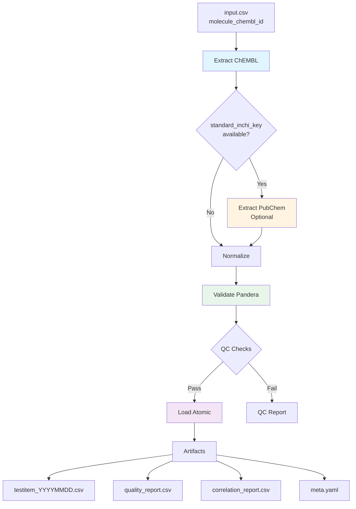

# 7a. Извлечение данных для testitem из ChEMBL

## Оглавление

- [Обзор и архитектура](#обзор-и-архитектура)
- [1. Входные данные](#1-входные-данные)
- [2. Процесс извлечения (Extract)](#2-процесс-извлечения-extract)
- [3. Нормализация данных (Normalize)](#3-нормализация-данных-normalize)
- [4. Валидация и QC](#4-валидация-и-qc)
- [5. Запись результатов (Load)](#5-запись-результатов-load)
- [6. Корреляционный анализ](#6-корреляционный-анализ)
- [7. CLI дополнения](#7-cli-дополнения)
- [8. Сравнение с assay extraction](#8-сравнение-с-assay-extraction)
- [9. Column order (детальный)](#9-column-order-детальный)
- [10. Determinism Checklist](#10-determinism-checklist)
- [11. Best Practices](#11-best-practices)

## Обзор и архитектура

Документ описывает спецификацию извлечения данных testitem (молекул) из ChEMBL API с опциональным обогащением через PubChem PUG-REST API. Обеспечиваются детерминированность, полная воспроизводимость результатов и защита от потери данных.

### Архитектура пайплайна

```text
TestitemPipeline
├── Extract Stage
│   ├── ChEMBLClient (batch_size=25, URL limit)
│   │   ├── /molecule.json?molecule_chembl_id__in={ids}
│   │   └── Flatten nested structures (hierarchy, properties, synonyms)
│   ├── PubChemClient (optional enrichment)
│   │   ├── CID Resolution Strategy (multi-step lookup)
│   │   ├── Batch Properties Fetcher (100 CIDs per request)
│   │   └── Multi-level Caching (in-memory + persistent)
│   ├── CacheManager (TTL, release-scoped invalidation)
│   ├── CircuitBreaker (failure tracking, recovery)
│   └── FallbackManager (extended error metadata)
├── Transform Stage
│   ├── ChEMBL Data Flattening
│   │   ├── molecule_hierarchy → parent_chembl_id, parent_molregno
│   │   ├── molecule_properties → 22 физ-хим свойства
│   │   ├── molecule_structures → canonical_smiles, standard_inchi, standard_inchi_key
│   │   ├── molecule_synonyms → all_names (concat) + JSON
│   │   └── Nested JSON → atc_classifications, cross_references, biotherapeutic
│   ├── PubChem Enrichment (optional)
│   │   ├── Left join by standard_inchi_key
│   │   └── prefix pubchem_ for all fields
│   └── Normalization (strict NA policy)
├── Validate Stage
│   ├── PanderaSchema (80+ fields, strict=True, nullable dtypes)
│   ├── ReferentialIntegrityCheck (parent molecules)
│   └── QualityProfile (fail thresholds)
└── Load Stage
    ├── AtomicWriter (run_id-scoped temp dirs)
    ├── CanonicalSerialization (hash generation)
    └── MetadataBuilder (full provenance)
```

### Диаграмма потока данных



### Интеграция с архитектурой проекта

Пайплайн testitem интегрируется с унифицированными компонентами:

- **UnifiedAPIClient**: Базовый HTTP клиент с rate limiting, retries, circuit breaker
- **UnifiedSchema**: Pandera схемы для входных, сырых и нормализованных данных  
- **UnifiedOutputWriter**: Атомарная запись CSV, QC отчетов, metadata
- **UnifiedLogger**: Структурированное логирование с trace_id, run_id

Cross-references:
- См. [Архитектура проекта](./00-architecture-overview.md) для общей структуры
- См. [Система логирования](./01-logging-system.md) для контракта логов
- См. [Ввод-вывод](./02-io-system.md) для atomic writes
- См. [Извлечение данных](./03-data-extraction.md) для базовых паттернов
- См. [Нормализация и валидация](./04-normalization-validation.md) для QC метрик

### Интеграция источников

**Приоритет источников:**
1. **ChEMBL** (PRIMARY) — базовые данные о молекулах из `/molecule` endpoint
2. **PubChem** (SECONDARY) — дополнительное обогащение через PUG-REST API

**Стратегия обогащения:**
- ChEMBL извлечение выполняется для всех молекул
- PubChem enrichment опционален (config: `sources.pubchem.enabled`)
- Graceful degradation: сбои PubChem не блокируют pipeline
- Merge по `standard_inchi_key` (ChEMBL) ↔ InChIKey lookup (PubChem)

---

## 1. Входные данные

### 1.1 Формат входных данных

**Файл:** CSV или DataFrame

**Обязательные поля:**
- `molecule_chembl_id` (StringDtype, NOT NULL): ChEMBL идентификатор молекулы в формате `CHEMBL\d+`

**Опциональные поля:**
- `nstereo` (Int64Dtype, nullable): количество стереоизомеров
- `salt_chembl_id` (StringDtype, nullable): ChEMBL ID соли

**Схема валидации:**

```python
# src/library/schemas/testitem_schema.py
class TestitemInputSchema(pa.DataFrameModel):
    molecule_chembl_id: Series[pd.StringDtype] = pa.Field(
        str_matches=r'^CHEMBL\d+$',
        nullable=False,
        description="ChEMBL molecule identifier",
        unique=True
    )
    nstereo: Series[pd.Int64Dtype] = pa.Field(
        ge=0,
        nullable=True,
        description="Number of stereoisomers"
    )
    salt_chembl_id: Series[pd.StringDtype] = pa.Field(
        str_matches=r'^CHEMBL\d+$',
        nullable=True,
        description="ChEMBL salt identifier"
    )
    
    class Config:
        strict = False  # Разрешить дополнительные колонки
        coerce = True
```

**Таблица входных полей:**

| Имя | Тип | Обязательность | Пример | Нормализация | Валидация |
|-----|-----|----------------|--------|--------------|-----------|
| molecule_chembl_id | STRING | NOT NULL | CHEMBL25 | trim, uppercase | regex `^CHEMBL\d+$` |
| nstereo | INT | nullable | 2 | int coercion | `>= 0` |
| salt_chembl_id | STRING | nullable | CHEMBL123 | trim, uppercase | regex `^CHEMBL\d+$` |

### 1.2 Конфигурация

**Файл:** `configs/config_testitem.yaml`

**Критические параметры:**

```yaml
# Метаданные пайплайна
pipeline:
  name: "testitems"
  version: "2.0.0"
  entity_type: "testitems"
  description: "ETL pipeline for testitem data from ChEMBL and PubChem"

# HTTP настройки
http:
  global:
    timeout_sec: 60.0
    retries:
      total: 5
      backoff_multiplier: 2.0
      backoff_max: 120.0
      exponential_jitter: true
      respect_retry_after: true
    rate_limit:
      max_calls: 5
      period: 15.0
    headers:
      Accept: "application/json"
      User-Agent: "bioactivity-data-acquisition/0.1.0"
    verify_ssl: true
    follow_redirects: true

# Источники данных
sources:
  chembl:
    name: "chembl"
    enabled: true
    http:
      base_url: "https://www.ebi.ac.uk/chembl/api/data"
      timeout_sec: 60.0
      retries:
        total: 5
        backoff_multiplier: 2.0
    batch_size: 25  # КРИТИЧЕСКИ: жесткое ограничение URL
    # Валидация: config validation должна падать при batch_size > 25
    max_url_length: 2000  # Жесткий лимит ChEMBL API
    
  pubchem:
    name: "pubchem"
    enabled: true  # Опциональный источник
    http:
      base_url: "https://pubchem.ncbi.nlm.nih.gov/rest/pug"
      timeout_sec: 30.0
      retries:
        total: 3
        backoff_multiplier: 2.0
    batch_size: 100  # 100 CIDs per batch request
    max_requests_per_second: 5
    cache_ttl_hours: 720  # 30 дней для persistent CID mapping

# Кэширование
cache:
  enabled: true
  directory: "data/cache/testitem"
  ttl: 86400  # 24 часа
  release_scoped: true  # КРИТИЧЕСКИ: инвалидация при смене release
  namespace: "testitem"

# Детерминизм
determinism:
  sort:
    by: ["molecule_chembl_id"]
    ascending: [true]
    na_position: "last"
  column_order: [...]  # Явный список 80+ колонок (см. §9)

# Валидация
validation:
  enabled: true
  strict: false
  schema_validation: true
  data_quality_checks: true

# Postprocess
postprocess:
  qc:
    enabled: true
    fail_on: ["missing_molecule_chembl_id", "duplicate_primary_keys"]
    thresholds:
      missing_molecule_chembl_id: 0.0
      duplicate_primary_keys: 0.0
      invalid_chembl_id_pattern: 0.05
      missing_molecular_weight: 0.1
  correlation:
    enabled: false  # По умолчанию ВЫКЛЮЧЕН
    methods: ["pearson", "spearman"]
```

**Валидация batch_size:**
```python
if config.sources.chembl.batch_size > 25:
    raise ConfigValidationError(
        "sources.chembl.batch_size must be <= 25 due to ChEMBL API URL length limit"
    )
```

---

## 2. Процесс извлечения (Extract)

### 2.1 Инициализация пайплайна

**Класс:** `TestitemPipeline` (`src/library/testitem/pipeline.py`)

**Наследование:** `PipelineBase[TestitemConfig]`

**Run-level метаданные:**

```python
run_id: str = uuid4().hex[:16]  # UUID для идентификации запуска
git_commit: str = get_git_commit()  # SHA текущего коммита
config_hash: str = sha256(config_yaml).hexdigest()[:16]
python_version: str = sys.version_info[:3]
deps_fingerprint: str = get_deps_fingerprint()  # fingerprint pyproject.toml
chembl_release: str = None  # Фиксируется один раз в начале
chembl_base_url: str  # URL для воспроизводимости
```

**КРИТИЧЕСКИ ВАЖНО:** 

1. Снимок `/status` выполняется **один раз** в начале run
2. `chembl_release` записывается в `run_config.yaml` в output_dir
3. Все последующие запросы **БЛОКИРУЮТСЯ** при смене release
4. Кэш-ключи **ОБЯЗАТЕЛЬНО** содержат release: `testitem:{release}:{molecule_chembl_id}`

**Пример запроса ChEMBL release:**

```bash
curl -H "Accept: application/json" \
  https://www.ebi.ac.uk/chembl/api/data/status.json
```

**Response:**
```json
{
  "chembl_db_version": "CHEMBL_36",
  "status": "UP"
}
```

### 2.2 Батчевое извлечение из ChEMBL API

**Метод:** `TestitemPipeline._extract_from_chembl()`

**Эндпоинт ChEMBL:** `/molecule.json?molecule_chembl_id__in={ids}&fields={fields}`

**Размер батча:**
- **Конфиг:** `sources.chembl.batch_size: 25` (ОБЯЗАТЕЛЬНО)
- **Причина:** Жесткое ограничение длины URL в ChEMBL API (~2000 символов)

**Полный список полей для извлечения (~80+ полей):**

**Базовые идентификаторы (10):**
- molecule_chembl_id, molregno, pref_name, max_phase, therapeutic_flag, structure_type, molecule_type, first_approval, dosed_ingredient, availability_type

**Иерархия молекул (2):**
- parent_chembl_id (из molecule_hierarchy.parent_chembl_id), molecule_hierarchy (JSON)

**Физико-химические свойства из molecule_properties (22):**
- mw_freebase, alogp, hba, hbd, psa, rtb, ro3_pass, num_ro5_violations, acd_most_apka, acd_most_bpka, acd_logp, acd_logd, molecular_species, full_mwt, aromatic_rings, heavy_atoms, qed_weighted, mw_monoisotopic, full_molformula, hba_lipinski, hbd_lipinski, num_lipinski_ro5_violations

**Структуры из molecule_structures (3):**
- canonical_smiles, standard_inchi, standard_inchi_key

**Флаги путей введения и свойств (10):**
- oral, parenteral, topical, black_box_warning, natural_product, first_in_class, chirality, prodrug, inorganic_flag, polymer_flag

**Регистрация и отзыв (9):**
- usan_year, usan_stem, usan_substem, usan_stem_definition, indication_class, withdrawn_flag, withdrawn_year, withdrawn_country, withdrawn_reason

**Механизм действия (3):**
- mechanism_of_action, direct_interaction, molecular_mechanism

**Drug данные (9):**
- drug_chembl_id, drug_name, drug_type, drug_substance_flag, drug_indication_flag, drug_antibacterial_flag, drug_antiviral_flag, drug_antifungal_flag, drug_antiparasitic_flag, drug_antineoplastic_flag, drug_immunosuppressant_flag, drug_antiinflammatory_flag

**Вложенные JSON структуры (8):**
- molecule_synonyms, atc_classifications, cross_references, biotherapeutic, chemical_probe, orphan, veterinary, helm_notation

**Дополнительные ChEMBL поля (4):**
- chirality_chembl, molecule_type_chembl, parent_molregno (из hierarchy), pref_name_key (нормализованное название)

**Примеры запросов:**

*Одиночный molecule:*
```bash
curl -H "Accept: application/json" \
  "https://www.ebi.ac.uk/chembl/api/data/molecule/CHEMBL25.json"
```

*Батч запрос (25 molecules):*
```bash
curl -H "Accept: application/json" \
  "https://www.ebi.ac.uk/chembl/api/data/molecule.json?molecule_chembl_id__in=CHEMBL25,CHEMBL192,CHEMBL941&fields=molecule_chembl_id,molregno,pref_name,max_phase,molecule_hierarchy,molecule_properties,molecule_structures,molecule_synonyms&limit=1000"
```

### 2.3 Распаковка вложенных структур

**ВАЖНО:** Вложенные структуры из ChEMBL должны быть распакованы в плоские колонки без потери данных.

#### 2.3.1 molecule_hierarchy

```python
def _flatten_molecule_hierarchy(molecule: dict) -> dict:
    """Extract parent molecule data from molecule_hierarchy."""
    
    flattened = {}
    
    if "molecule_hierarchy" in molecule and molecule["molecule_hierarchy"]:
        hierarchy = molecule["molecule_hierarchy"]
        flattened["parent_chembl_id"] = hierarchy.get("parent_chembl_id")
        flattened["parent_molregno"] = hierarchy.get("parent_molregno")
        # Сохраняем полный JSON для аудита
        flattened["molecule_hierarchy"] = json.dumps(
            hierarchy, 
            sort_keys=True, 
            separators=(',', ':')
        )
    else:
        flattened["parent_chembl_id"] = None
        flattened["parent_molregno"] = None
        flattened["molecule_hierarchy"] = None
    
    return flattened
```

#### 2.3.2 molecule_properties

**22 физико-химических свойства:**

```python
def _flatten_molecule_properties(molecule: dict) -> dict:
    """Extract 22 molecular properties."""
    
    flattened = {}
    
    if "molecule_properties" in molecule and molecule["molecule_properties"]:
        props = molecule["molecule_properties"]
        
        # Физико-химические свойства (22 поля)
        flattened["mw_freebase"] = props.get("mw_freebase")
        flattened["alogp"] = props.get("alogp")
        flattened["hba"] = props.get("hba")
        flattened["hbd"] = props.get("hbd")
        flattened["psa"] = props.get("psa")
        flattened["rtb"] = props.get("rtb")
        flattened["ro3_pass"] = props.get("ro3_pass")
        flattened["num_ro5_violations"] = props.get("num_ro5_violations")
        flattened["acd_most_apka"] = props.get("acd_most_apka")
        flattened["acd_most_bpka"] = props.get("acd_most_bpka")
        flattened["acd_logp"] = props.get("acd_logp")
        flattened["acd_logd"] = props.get("acd_logd")
        flattened["molecular_species"] = props.get("molecular_species")
        flattened["full_mwt"] = props.get("full_mwt")
        flattened["aromatic_rings"] = props.get("aromatic_rings")
        flattened["heavy_atoms"] = props.get("heavy_atoms")
        flattened["qed_weighted"] = props.get("qed_weighted")
        flattened["mw_monoisotopic"] = props.get("mw_monoisotopic")
        flattened["full_molformula"] = props.get("full_molformula")
        flattened["hba_lipinski"] = props.get("hba_lipinski")
        flattened["hbd_lipinski"] = props.get("hbd_lipinski")
        flattened["num_lipinski_ro5_violations"] = props.get("num_lipinski_ro5_violations")
        
        # Сохраняем JSON
        flattened["molecule_properties"] = json.dumps(
            props, 
            sort_keys=True, 
            separators=(',', ':')
        )
    else:
        # Инициализация всех полей как None
        for field in [
            "mw_freebase", "alogp", "hba", "hbd", "psa", "rtb", "ro3_pass",
            "num_ro5_violations", "acd_most_apka", "acd_most_bpka", "acd_logp",
            "acd_logd", "molecular_species", "full_mwt", "aromatic_rings",
            "heavy_atoms", "qed_weighted", "mw_monoisotopic", "full_molformula",
            "hba_lipinski", "hbd_lipinski", "num_lipinski_ro5_violations"
        ]:
            flattened[field] = None
        flattened["molecule_properties"] = None
    
    return flattened
```

#### 2.3.3 molecule_structures

```python
def _flatten_molecule_structures(molecule: dict) -> dict:
    """Extract canonical molecular structures."""
    
    flattened = {}
    
    if "molecule_structures" in molecule and molecule["molecule_structures"]:
        structures = molecule["molecule_structures"]
        flattened["canonical_smiles"] = structures.get("canonical_smiles")
        flattened["standard_inchi"] = structures.get("standard_inchi")
        flattened["standard_inchi_key"] = structures.get("standard_inchi_key")
        # Сохраняем JSON
        flattened["molecule_structures"] = json.dumps(
            structures,
            sort_keys=True,
            separators=(',', ':')
        )
    else:
        flattened["canonical_smiles"] = None
        flattened["standard_inchi"] = None
        flattened["standard_inchi_key"] = None
        flattened["molecule_structures"] = None
    
    return flattened
```

#### 2.3.4 molecule_synonyms

**Стратегия:** Конкатенация в `all_names` (для поиска) + JSON (для программного доступа)

```python
def _flatten_molecule_synonyms(molecule: dict) -> dict:
    """Extract synonyms with dual strategy."""
    
    flattened = {}
    
    if "molecule_synonyms" in molecule and molecule["molecule_synonyms"]:
        synonyms = molecule["molecule_synonyms"]
        
        if isinstance(synonyms, list) and synonyms:
            # Конкатенация для поиска
            synonym_names = []
            for syn in synonyms:
                if isinstance(syn, dict) and "molecule_synonym" in syn:
                    synonym_names.append(syn["molecule_synonym"])
                elif isinstance(syn, str):
                    synonym_names.append(syn)
            
            flattened["all_names"] = "; ".join(synonym_names) if synonym_names else None
            
            # JSON для программного доступа
            flattened["molecule_synonyms"] = json.dumps(
                synonyms,
                sort_keys=True,
                separators=(',', ':')
            )
        else:
            flattened["all_names"] = None
            flattened["molecule_synonyms"] = None
    else:
        flattened["all_names"] = None
        flattened["molecule_synonyms"] = None
    
    return flattened
```

#### 2.3.5 Вложенные JSON (atc_classifications, cross_references, biotherapeutic)

```python
def _flatten_nested_json(molecule: dict, field_name: str) -> str:
    """Serialize nested JSON structure to canonical string."""
    
    if field_name in molecule and molecule[field_name]:
        return json.dumps(
            molecule[field_name],
            sort_keys=True,
            separators=(',', ':')
        )
    return None

# Использование:
# flattened["atc_classifications"] = _flatten_nested_json(molecule, "atc_classifications")
# flattened["cross_references"] = _flatten_nested_json(molecule, "cross_references")
# flattened["biotherapeutic"] = _flatten_nested_json(molecule, "biotherapeutic")
```

### 2.4 Fallback механизм

**Условия активации:**
- HTTP 5xx ошибки
- Таймауты (ReadTimeout, ConnectTimeout)
- Circuit Breaker в состоянии OPEN
- 429/503 с `Retry-After` header (если exceed max retries)

**Расширенная запись fallback:**

```python
def _create_fallback_record(
    self, 
    molecule_id: str, 
    error: Exception = None
) -> dict:
    """Create fallback record with extended error metadata."""
    
    return {
        "molecule_chembl_id": molecule_id,
        "source_system": "ChEMBL_FALLBACK",
        "extracted_at": datetime.utcnow().isoformat() + "Z",
        
        # Расширенные поля ошибки
        "error_code": getattr(error, 'code', None),
        "http_status": getattr(error, 'status', None),
        "error_message": str(error) if error else "Fallback: API unavailable",
        "retry_after_sec": getattr(error, 'retry_after', None),
        "attempt": getattr(error, 'attempt', None),
        "run_id": self.run_id,
        
        # Все остальные поля: None или "" (см. NA policy)
        **{field: None for field in EXPECTED_FIELDS if field not in [
            "molecule_chembl_id", "source_system", "extracted_at",
            "error_code", "http_status", "error_message", "retry_after_sec",
            "attempt", "run_id"
        ]}
    }
```

**Пример лога fallback:**
```json
{
  "timestamp": "2025-10-28T12:34:56.789Z",
  "level": "WARNING",
  "message": "Fallback activated for molecule",
  "context": {
    "run_id": "a1b2c3d4e5f6",
    "stage": "extract_chembl",
    "molecule_chembl_id": "CHEMBL25",
    "error_type": "ReadTimeout",
    "http_status": null,
    "attempt": 5,
    "retry_after_sec": null,
    "trace_id": "xyz789"
  }
}
```

### 2.5 Извлечение из PubChem API

> **📖 Детальное описание:** См. полную спецификацию PubChem integration в документе [`07b-testitem-data-extraction.md`](./07b-testitem-data-extraction.md) — "Оптимальный подход к извлечению данных testitem из PubChem"

**Base URL:** `https://pubchem.ncbi.nlm.nih.gov/rest/pug`

**Ключевые архитектурные принципы:**
1. ✅ **Optional by Design** — PubChem enrichment никогда не блокирует pipeline
2. ✅ **Graceful Degradation** — продолжение при любых PubChem сбоях
3. ✅ **Cache Aggressively** — многоуровневое кэширование (in-memory + persistent CID mapping)
4. ✅ **Batch When Possible** — до 100 CIDs per batch request
5. ✅ **Monitor Actively** — сбор метрик для проактивного выявления проблем

**Интеграция с ChEMBL pipeline:**

```
ChEMBL Extract → PubChem Enrichment Layer → Normalize → Validate
     ↓                      ↓
molecule_chembl_id    CID Resolution Strategy
standard_inchi_key          ↓
canonical_smiles      Batch Properties Fetch
pref_name                  ↓
                     Merge Strategy
                           ↓
                 Enriched DataFrame
```

**Стратегия обогащения (2-step process):**

*Step 1: CID Resolution (Multi-strategy)*
```python
# Приоритет lookup стратегий (см. 07b § 5):
# 1. Cache lookup (persistent CID mapping, TTL 30 days)
# 2. Direct CID (из ChEMBL cross_references)
# 3. InChIKey lookup → /compound/inchikey/{key}/cids/JSON
# 4. SMILES lookup → /compound/smiles/{smiles}/cids/JSON
# 5. Name-based search → /compound/name/{name}/cids/JSON (fallback)
```

*Step 2: Batch Properties Fetch*
```python
# Endpoint: /compound/cid/{cids}/property/{properties}/JSON
# Batch size: 100 CIDs (comma-separated)
# Properties: MolecularFormula,MolecularWeight,CanonicalSMILES,IsomericSMILES,InChI,InChIKey,IUPACName
```

**Rate limiting:** 5 requests/second (пауза 0.2s между запросами)

**Пример одиночного запроса (InChIKey lookup):**

```bash
# Step 1: Resolve InChIKey → CID
curl -H "Accept: application/json" \
  "https://pubchem.ncbi.nlm.nih.gov/rest/pug/compound/inchikey/BSYNRYMUTXBXSQ-UHFFFAOYSA-N/cids/JSON"

# Response: {"IdentifierList": {"CID": [2244]}}

# Step 2: Fetch properties for CID
curl -H "Accept: application/json" \
  "https://pubchem.ncbi.nlm.nih.gov/rest/pug/compound/cid/2244/property/MolecularFormula,MolecularWeight,CanonicalSMILES,InChI,InChIKey,IUPACName/JSON"
```

**Пример batch запроса (эффективный подход):**

```bash
curl -H "Accept: application/json" \
  "https://pubchem.ncbi.nlm.nih.gov/rest/pug/compound/cid/2244,3672,5353740/property/MolecularFormula,MolecularWeight,CanonicalSMILES,IsomericSMILES,InChI,InChIKey,IUPACName/JSON"
```

**Response структура:**

```json
{
  "PropertyTable": {
    "Properties": [
      {
        "CID": 2244,
        "MolecularFormula": "C9H8O4",
        "MolecularWeight": 180.16,
        "CanonicalSMILES": "CC(=O)OC1=CC=CC=C1C(=O)O",
        "IsomericSMILES": "CC(=O)OC1=CC=CC=C1C(=O)O",
        "InChI": "InChI=1S/C9H8O4/c1-6(10)13-8-5-3-2-4-7(8)9(11)12/h2-5H,1H3,(H,11,12)",
        "InChIKey": "BSYNRYMUTXBXSQ-UHFFFAOYSA-N",
        "IUPACName": "2-acetoxybenzoic acid"
      }
    ]
  }
}
```

**Python реализация (упрощенная, полная версия в 07b § 6-7):**

```python
def _enrich_with_pubchem(
    self,
    df: pd.DataFrame,
    client: PubChemClient
) -> pd.DataFrame:
    """
    Enrich testitem data with PubChem properties.
    
    See detailed implementation in 07b-testitem-data-extraction.md § 5-7
    """
    
    # Step 1: CID Resolution (batch InChIKey lookups)
    inchi_keys = df["standard_inchi_key"].dropna().unique().tolist()
    cid_mapping = self._resolve_cids_batch(inchi_keys, client)
    
    # Step 2: Batch Properties Fetch (100 CIDs per request)
    cids = [cid for cid in cid_mapping.values() if cid]
    properties_data = self._fetch_properties_batch(cids, client)
    
    # Step 3: Merge back to DataFrame
    df = self._merge_pubchem_data(df, cid_mapping, properties_data)
    
    return df
```

**Merge стратегия:**

- Left join по `standard_inchi_key` (ChEMBL) → CID → PubChem properties
- Префикс `pubchem_` для всех полей
- В случае конфликта: **приоритет ChEMBL данным**
- Graceful degradation: пропущенные CIDs не блокируют pipeline

**Метрики успеха:**
- CID resolution rate: ≥85%
- Properties enrichment rate: ≥80%
- Cache hit rate: ≥60%

> **⚠️ Важно:** Полная спецификация включает:
> - Multi-level caching strategy (in-memory + persistent)
> - Parallel processing с ThreadPoolExecutor
> - Service outage detection & cooldown
> - Comprehensive error handling matrix
> - Monitoring & alerting setup
> 
> См. [`07b-testitem-data-extraction.md`](./07b-testitem-data-extraction.md) для деталей.

---

## 3. Нормализация данных (Normalize)

### 3.1 Merge стратегии

**Приоритет источников:**
1. **ChEMBL** (базовые данные) — PRIMARY
2. **PubChem** (дополнительные идентификаторы) — SECONDARY

**ChEMBL data merge:**
```python
def _merge_chembl_data(
    self,
    base_data: pd.DataFrame,
    chembl_data: pd.DataFrame
) -> pd.DataFrame:
    """Merge ChEMBL data into base data."""
    
    if chembl_data.empty:
        logger.warning("No ChEMBL data to merge")
        return base_data
    
    # Remove duplicates (keep='first')
    chembl_data = chembl_data.drop_duplicates(
        subset=["molecule_chembl_id"],
        keep="first"
    )
    
    # Create mapping
    chembl_dict = chembl_data.set_index("molecule_chembl_id").to_dict("index")
    
    # Row-by-row enrichment
    merged_data = base_data.copy()
    for idx, row in merged_data.iterrows():
        mol_id = row["molecule_chembl_id"]
        if mol_id in chembl_dict:
            chembl_row = chembl_dict[mol_id]
            for col, value in chembl_row.items():
                if self._is_valid_value(value):  # NOT NULL, NOT empty
                    merged_data.at[idx, col] = value
    
    return merged_data
```

**PubChem data merge:**
```python
def _merge_pubchem_data(
    self,
    base_data: pd.DataFrame,
    cid_mapping: dict[str, int],
    properties_data: dict[int, dict]
) -> pd.DataFrame:
    """Merge PubChem data into base DataFrame."""
    
    # Create PubChem DataFrame from properties
    pubchem_rows = []
    for inchi_key, cid in cid_mapping.items():
        if cid and cid in properties_data:
            props = properties_data[cid]
            pubchem_rows.append({
                "inchi_key_from_mol": inchi_key,
                "pubchem_cid": props.get("CID"),
                "pubchem_molecular_formula": props.get("MolecularFormula"),
                "pubchem_molecular_weight": props.get("MolecularWeight"),
                "pubchem_canonical_smiles": props.get("CanonicalSMILES"),
                "pubchem_isomeric_smiles": props.get("IsomericSMILES"),
                "pubchem_inchi": props.get("InChI"),
                "pubchem_inchi_key": props.get("InChIKey"),
                "pubchem_iupac_name": props.get("IUPACName")
            })
    
    if not pubchem_rows:
        return base_data
    
    pubchem_df = pd.DataFrame(pubchem_rows)
    
    # Left join
    merged_data = base_data.merge(
        pubchem_df,
        left_on="standard_inchi_key",
        right_on="inchi_key_from_mol",
        how="left",
        suffixes=("", "_pubchem_conflict")
    )
    
    # Log enrichment rate
    enriched_count = merged_data["pubchem_cid"].notna().sum()
    enrichment_rate = enriched_count / len(merged_data) if len(merged_data) > 0 else 0.0
    
    logger.info({
        "pubchem_enrichment": {
            "total": len(merged_data),
            "enriched": int(enriched_count),
            "rate": float(enrichment_rate)
        }
    })
    
    return merged_data
```

### 3.2 Каноническая сериализация для хеширования

**Метод:** `_canonicalize_row_for_hash()`

```python
def _canonicalize_row_for_hash(
    row: dict, 
    column_order: list[str]
) -> str:
    """
    Canonical serialization for deterministic hashing.
    
    Rules:
    1. JSON with sort_keys=True, separators=(',', ':')
    2. ISO8601 UTC for all datetimes
    3. Float format: %.6f
    4. Empty/None values: "" (empty string)
    5. Column order: строго по column_order
    """
    
    canonical = {}
    
    for col in column_order:
        value = row.get(col)
        
        # Convert to canonical representation
        if pd.isna(value):
            canonical[col] = ""
        elif isinstance(value, float):
            canonical[col] = f"{value:.6f}"
        elif isinstance(value, (datetime, pd.Timestamp)):
            canonical[col] = value.isoformat() + "Z"
        elif isinstance(value, (dict, list)):
            canonical[col] = json.dumps(
                value, 
                sort_keys=True, 
                separators=(',', ':')
            )
        else:
            canonical[col] = str(value)
    
    # JSON serialization with strict format
    return json.dumps(canonical, sort_keys=True, separators=(',', ':'))
```

### 3.3 Хеширование

```python
def _calculate_hashes(
    self,
    df: pd.DataFrame
) -> tuple[pd.Series, pd.Series]:
    """Calculate hash_row and hash_business_key."""
    
    hash_row = df.apply(
        lambda row: sha256(
            self._canonicalize_row_for_hash(
                row.to_dict(),
                self.config.determinism.column_order
            ).encode('utf-8')
        ).hexdigest(),
        axis=1
    )
    
    hash_business_key = df["molecule_chembl_id"].apply(
        lambda x: sha256(x.encode('utf-8')).hexdigest()
    )
    
    return hash_row, hash_business_key
```

### 3.4 Системные метаданные

```python
def _add_system_metadata(
    self,
    df: pd.DataFrame
) -> pd.DataFrame:
    """Add system metadata fields."""
    
    # Run metadata
    df["run_id"] = self.run_id
    df["git_commit"] = self.git_commit
    df["config_hash"] = self.config_hash
    df["python_version"] = self.python_version
    df["chembl_base_url"] = self.chembl_base_url
    
    # Pipeline metadata
    df["pipeline_version"] = self.config.pipeline.version
    df["source_system"] = "ChEMBL"  # or "ChEMBL_FALLBACK"
    df["chembl_release"] = self.chembl_release
    df["extracted_at"] = datetime.utcnow().isoformat() + "Z"
    
    # Hashes
    df["hash_row"], df["hash_business_key"] = self._calculate_hashes(df)
    
    # Index
    df["index"] = pd.RangeIndex(len(df), dtype=pd.Int64Dtype())
    
    return df
```

### 3.5 Nullable dtypes

**КРИТИЧЕСКИ:** Использовать nullable dtypes, никаких `object`

| Column | Dtype | Nullable | Example |
|--------|-------|----------|---------|
| molecule_chembl_id | pd.StringDtype() | False | CHEMBL25 |
| molregno | pd.Int64Dtype() | True | 1234 |
| pref_name | pd.StringDtype() | True | Aspirin |
| max_phase | pd.Float64Dtype() | True | 4.0 |
| therapeutic_flag | pd.BooleanDtype() | True | True |
| alogp | pd.Float64Dtype() | True | 1.23 |
| hba | pd.Int64Dtype() | True | 4 |
| pubchem_cid | pd.Int64Dtype() | True | 2244 |
| extracted_at | pd.StringDtype() | False | 2025-10-28T12:00:00Z |
| hash_row | pd.StringDtype() | False | abc123...def |

```python
DTYPES_CONFIG = {
    "molecule_chembl_id": pd.StringDtype(),
    "molregno": pd.Int64Dtype(),
    "max_phase": pd.Float64Dtype(),
    "therapeutic_flag": pd.BooleanDtype(),
    "alogp": pd.Float64Dtype(),
    "hba": pd.Int64Dtype(),
    "hbd": pd.Int64Dtype(),
    "psa": pd.Float64Dtype(),
    "rtb": pd.Int64Dtype(),
    "ro3_pass": pd.BooleanDtype(),
    "qed_weighted": pd.Float64Dtype(),
    "pubchem_cid": pd.Int64Dtype(),
    "pubchem_molecular_weight": pd.Float64Dtype(),
    "extracted_at": pd.StringDtype(),
    "hash_row": pd.StringDtype(),
    "hash_business_key": pd.StringDtype(),
    "index": pd.Int64Dtype(),
    # ... все поля с явными nullable dtypes
}
```

---

## 4. Валидация и QC

### 4.1 Pandera схемы

**TestitemInputSchema** (см. §1.1)

**TestitemRawSchema:**

```python
class TestitemRawSchema(pa.DataFrameModel):
    molecule_chembl_id: Series[pd.StringDtype] = pa.Field(
        str_matches=r'^CHEMBL\d+$',
        nullable=False
    )
    molregno: Series[pd.Int64Dtype] = pa.Field(nullable=True)
    pref_name: Series[pd.StringDtype] = pa.Field(nullable=True)
    parent_chembl_id: Series[pd.StringDtype] = pa.Field(
        str_matches=r'^CHEMBL\d+$',
        nullable=True
    )
    # ... и т.д.
```

**TestitemNormalizedSchema:** (80+ полей, см. `src/library/schemas/testitem_schema.py`)

```python
class TestitemNormalizedSchema(pa.DataFrameModel):
    # Идентификаторы
    molecule_chembl_id: Series[pd.StringDtype] = pa.Field(
        str_matches=r'^CHEMBL\d+$',
        nullable=False,
        unique=True
    )
    
    # Физ-хим свойства (примеры с диапазонами)
    mw_freebase: Series[pd.Float64Dtype] = pa.Field(
        ge=50.0, 
        le=2000.0, 
        nullable=True
    )
    alogp: Series[pd.Float64Dtype] = pa.Field(
        ge=-10.0, 
        le=10.0, 
        nullable=True
    )
    qed_weighted: Series[pd.Float64Dtype] = pa.Field(
        ge=0.0, 
        le=1.0, 
        nullable=True
    )
    
    # PubChem
    pubchem_cid: Series[pd.Int64Dtype] = pa.Field(ge=1, nullable=True)
    pubchem_inchi_key: Series[pd.StringDtype] = pa.Field(
        str_matches=r'^[A-Z]{14}-[A-Z]{10}-[A-Z]$',
        nullable=True
    )
    
    # Метаданные
    index: Series[pd.Int64Dtype] = pa.Field(ge=0, nullable=False)
    pipeline_version: Series[pd.StringDtype] = pa.Field(nullable=False)
    extracted_at: Series[pd.StringDtype] = pa.Field(nullable=False)
    hash_row: Series[pd.StringDtype] = pa.Field(str_length=64, nullable=False)
    hash_business_key: Series[pd.StringDtype] = pa.Field(
        str_length=64, 
        nullable=False
    )
    
    class Config:
        strict = False
        coerce = True
```

### 4.2 QC профили

```python
QC_PROFILE = {
    "checks": [
        {
            "name": "missing_molecule_chembl_id",
            "threshold": 0.0,
            "severity": "ERROR",
            "metric": lambda df: df["molecule_chembl_id"].isna().sum() / len(df)
        },
        {
            "name": "duplicate_primary_keys",
            "threshold": 0.0,
            "severity": "ERROR",
            "metric": lambda df: df["molecule_chembl_id"].duplicated().sum()
        },
        {
            "name": "invalid_chembl_id_pattern",
            "threshold": 0.05,
            "severity": "ERROR",
            "metric": lambda df: (~df["molecule_chembl_id"].str.match(r'^CHEMBL\d+$')).sum() / len(df)
        },
        {
            "name": "missing_molecular_weight",
            "threshold": 0.1,
            "severity": "WARNING",
            "metric": lambda df: df["mw_freebase"].isna().sum() / len(df)
        },
        {
            "name": "pubchem_enrichment_rate",
            "threshold": 0.5,  # Info only, not failing
            "severity": "INFO",
            "metric": lambda df: df["pubchem_cid"].notna().sum() / len(df)
        },
        {
            "name": "invalid_molecular_weight_range",
            "threshold": 0.05,
            "severity": "WARNING",
            "metric": lambda df: ((df["mw_freebase"] < 50) | (df["mw_freebase"] > 2000)).sum() / len(df)
        }
    ]
}
```

### 4.3 Referential Integrity Check

```python
def _check_referential_integrity(
    self,
    df: pd.DataFrame
) -> dict:
    """Check parent_chembl_id presence."""
    
    issues = []
    
    # Check parent molecules exist
    parent_ids = set(df["parent_chembl_id"].dropna().unique())
    all_ids = set(df["molecule_chembl_id"].unique())
    missing_parents = parent_ids - all_ids
    
    if missing_parents:
        issues.append({
            "type": "missing_parent_molecules",
            "count": len(missing_parents),
            "sample_ids": list(missing_parents)[:10]
        })
    
    # Check PubChem enrichment coverage
    total = len(df)
    pubchem_enriched = df["pubchem_cid"].notna().sum()
    enrichment_rate = pubchem_enriched / total if total > 0 else 0.0
    
    if enrichment_rate < 0.5 and self.config.sources.pubchem.enabled:
        issues.append({
            "type": "low_pubchem_enrichment",
            "rate": enrichment_rate,
            "threshold": 0.5
        })
    
    return {
        "total_issues": len(issues),
        "issues": issues
    }
```

---

## 5. Запись результатов (Load)

### 5.1 Atomic Writes

**Механизм:** Временный файл в run_id-scoped директории + atomic rename

```python
def _atomic_write(
    self,
    content: bytes,
    target_path: Path,
    run_id: str
) -> Path:
    """Atomic write with run_id-scoped temp directory."""
    
    # Temp directory per run
    temp_dir = self.output_dir / ".tmp" / run_id
    temp_dir.mkdir(parents=True, exist_ok=True)
    
    # Temp file
    temp_path = temp_dir / f"{target_path.name}.tmp"
    
    # Write
    temp_path.write_bytes(content)
    
    # Validate (optional)
    # self._validate_written_file(temp_path)
    
    # Atomic rename (Windows: os.replace)
    target_path.parent.mkdir(parents=True, exist_ok=True)
    os.replace(str(temp_path), str(target_path))
    
    # Cleanup temp dir
    try:
        temp_dir.rmdir()
    except OSError:
        pass
    
    return target_path
```

### 5.2 Metadata Builder

**Шаблон `meta.yaml`:**

```yaml
pipeline_version: "2.0.0"
run_id: "a1b2c3d4e5f6"
git_commit: "abc123def456..."
config_hash: "def456789abc"
python_version: "3.11.5"
deps_fingerprint: "ghi789..."

chembl_release: "CHEMBL_36"
chembl_base_url: "https://www.ebi.ac.uk/chembl/api/data"

extracted_at: "2025-10-28T12:00:00Z"
processing_time_s: 145.67

row_count: 1234

# Metrics
metrics:
  total_testitems: 1234
  chembl_enriched: 1200
  pubchem_enriched: 950
  fallback_count: 34
  success_rate: 0.972
  pubchem_enrichment_rate: 0.770
  api_calls:
    chembl: 50
    pubchem: 1150
  cache_hits:
    chembl: 1150
    pubchem: 84

# QC summary
qc:
  passed: true
  issues: []
  warnings:
    - type: "low_pubchem_enrichment"
      count: 284
      rate: 0.23

# Output artifacts
output_files:
  csv: "testitem_20251028.csv"
  qc: "testitem_20251028_quality_report.csv"
  correlation: "testitem_20251028_correlation_report.csv"
  meta: "testitem_20251028_meta.yaml"

checksums:
  csv:
    sha256: "abc123def456..."
  qc:
    sha256: "def456789abc..."
  correlation:
    sha256: "ghi789012def..."
```

---

## 6. Корреляционный анализ

**ВАЖНО:** Корреляционный анализ **НЕ часть ETL** и должен быть **опциональным**

```yaml
# config_testitem.yaml
postprocess:
  correlation:
    enabled: false  # По умолчанию ВЫКЛЮЧЕН
    methods: ["pearson", "spearman"]
    min_correlation: 0.5
```

**Причина:** Гарантировать бит-в-бит идентичность с/без корреляций практически невозможно из-за non-deterministic алгоритмов в scipy/numpy.

**Output структура (если enabled):**
```
testitem_correlation_report_20251028/
├── numeric_pearson.csv
├── numeric_spearman.csv
├── numeric_covariance.csv
├── correlation_summary.csv
└── correlation_insights.json
```

---

## 7. CLI дополнения

```bash
# Базовая команда
python scripts/get_testitem_data.py \
  --input data/input/testitem.csv \
  --final-out data/output/testitem.csv \
  --config configs/config_testitem.yaml

# С лимитом и golden compare
python scripts/get_testitem_data.py \
  --input testitems.csv \
  --limit 100 \
  --golden golden_testitem.csv \
  --config configs/config_testitem.yaml

# Управление PubChem
python scripts/get_testitem_data.py \
  --input testitems.csv \
  --enable-pubchem \
  --pubchem-rate-limit 5 \
  --config configs/config_testitem.yaml

# Batch size контроль (ChEMBL)
python scripts/get_testitem_data.py \
  --input testitems.csv \
  --batch-size 25 \
  --config configs/config_testitem.yaml
```

**Новые CLI параметры:**
- `--golden PATH`: Путь к golden файлу для сравнения (бит-в-бит проверка)
- `--enable-pubchem` / `--disable-pubchem`: управление PubChem enrichment (override конфига)
- `--pubchem-rate-limit N`: requests per second для PubChem (default 5)
- `--batch-size N`: размер батча ChEMBL (default 25, max 25, валидация при превышении)
- `--hierarchy-path PATH`: путь к molecule_hierarchy lookup CSV

---

## 8. Сравнение с assay extraction

### 8.1 Таблица сходств и различий

| Аспект | Assay | Testitem |
|--------|-------|----------|
| **Batch size** | 25 (URL limit) | 25 (URL limit) |
| **ChEMBL release scoping** | ✅ `/status` фиксация | ✅ `/status` фиксация |
| **Fallback механизм** | ✅ Расширенные поля | ✅ Расширенные поля |
| **Каноническая сериализация** | ✅ JSON sort_keys | ✅ JSON sort_keys |
| **Atomic writes** | ✅ run_id temp dirs | ✅ run_id temp dirs |
| **Вторичный источник** | Target + AssayClass enrichment | PubChem enrichment |
| **Nested structures** | assay_parameters explode | molecule_* flatten + JSON |
| **Primary focus** | Assay metadata, parameters, variants | Molecular properties, structures |
| **Parent enrichment** | Target hierarchy | Molecule hierarchy |
| **Enrichment strategy** | Whitelist (7 fields per source) | Full flattening + optional PubChem |

### 8.2 Ключевые различия

#### Testitem особенности:
1. **Двойная структура обогащения:**
   - ChEMBL: полное извлечение всех молекулярных свойств
   - PubChem: опциональное обогащение через PUG-REST API

2. **Nested JSON стратегия:**
   - Распаковка в плоские колонки (molecule_properties → 22 поля)
   - Сохранение JSON для аудита и программного доступа
   - Двойное хранение для синонимов (all_names + molecule_synonyms JSON)

3. **Физико-химические свойства:**
   - Фокус на молекулярных дескрипторах (ALogP, HBA, HBD, PSA, QED)
   - Валидация диапазонов (mw_freebase: 50-2000, alogp: -10 to 10)
   - Поддержка Rule of 3/5 violations

4. **PubChem интеграция:**
   - Multi-strategy CID resolution
   - Batch properties fetch (100 CIDs per request)
   - Persistent CID mapping cache (30 days TTL)

#### Assay особенности:
1. **Triple enrichment:**
   - ChEMBL: assay metadata
   - Target: whitelist enrichment (7 fields)
   - AssayClass: whitelist enrichment (7 fields)

2. **Long format explode:**
   - assay_parameters → multiple rows (param_index)
   - variant_sequences → multiple rows (variant_index)
   - assay_classifications → multiple rows (class_index)

3. **Специфические поля:**
   - Assay parameters (type, relation, value, units)
   - Variant sequences (mutation, accession)
   - Bioassay ontology classification (L1/L2/L3)

---

## 9. Column order (детальный)

### 9.1 Полный детерминированный список (80+ колонок)

**Идентификаторы (4):**
- molecule_chembl_id, molregno, pref_name, pref_name_key

**Иерархия (2):**
- parent_chembl_id, parent_molregno

**Разработка и регистрация (4):**
- max_phase, therapeutic_flag, dosed_ingredient, first_approval

**Типы (2):**
- structure_type, molecule_type

**Физико-химические свойства (22):**
- mw_freebase, alogp, hba, hbd, psa, rtb, ro3_pass, num_ro5_violations, acd_most_apka, acd_most_bpka, acd_logp, acd_logd, molecular_species, full_mwt, aromatic_rings, heavy_atoms, qed_weighted, mw_monoisotopic, full_molformula, hba_lipinski, hbd_lipinski, num_lipinski_ro5_violations

**Структуры (3):**
- canonical_smiles, standard_inchi, standard_inchi_key

**Флаги путей введения (3):**
- oral, parenteral, topical

**Флаги свойств (7):**
- black_box_warning, natural_product, first_in_class, chirality, prodrug, inorganic_flag, polymer_flag

**Регистрация USAN (5):**
- usan_year, availability_type, usan_stem, usan_substem, usan_stem_definition

**Индикации и отзыв (5):**
- indication_class, withdrawn_flag, withdrawn_year, withdrawn_country, withdrawn_reason

**Механизм действия (3):**
- mechanism_of_action, direct_interaction, molecular_mechanism

**Drug данные (12):**
- drug_chembl_id, drug_name, drug_type, drug_substance_flag, drug_indication_flag, drug_antibacterial_flag, drug_antiviral_flag, drug_antifungal_flag, drug_antiparasitic_flag, drug_antineoplastic_flag, drug_immunosuppressant_flag, drug_antiinflammatory_flag

**PubChem данные (9):**
- pubchem_cid, pubchem_molecular_formula, pubchem_molecular_weight, pubchem_canonical_smiles, pubchem_isomeric_smiles, pubchem_inchi, pubchem_inchi_key, pubchem_iupac_name, pubchem_registry_id, pubchem_rn

**Стандартизированные структуры (3):**
- standardized_inchi, standardized_inchi_key, standardized_smiles

**Вложенные JSON (13):**
- atc_classifications, biotherapeutic, chemical_probe, cross_references, helm_notation, molecule_hierarchy, molecule_properties, molecule_structures, molecule_synonyms, all_names, orphan, veterinary, chirality_chembl, molecule_type_chembl

**Input поля (2):**
- nstereo, salt_chembl_id

**Метаданные (7):**
- index, pipeline_version, source_system, chembl_release, extracted_at, hash_row, hash_business_key

**Итого: ~95 колонок** (идентификаторы + иерархия + разработка + физ-хим + структуры + флаги + регистрация + механизм + drug + pubchem + стандартизированные + JSON + input + метаданные)

### 9.2 Пример полной конфигурации column_order

```yaml
determinism:
  column_order:
    # === Идентификаторы ===
    - molecule_chembl_id
    - molregno
    - pref_name
    - pref_name_key
    
    # === Иерархия ===
    - parent_chembl_id
    - parent_molregno
    
    # === Разработка ===
    - max_phase
    - therapeutic_flag
    - dosed_ingredient
    - first_approval
    
    # === Типы ===
    - structure_type
    - molecule_type
    
    # === Физико-химические свойства ===
    - mw_freebase
    - alogp
    - hba
    - hbd
    - psa
    - rtb
    - ro3_pass
    - num_ro5_violations
    - acd_most_apka
    - acd_most_bpka
    - acd_logp
    - acd_logd
    - molecular_species
    - full_mwt
    - aromatic_rings
    - heavy_atoms
    - qed_weighted
    - mw_monoisotopic
    - full_molformula
    - hba_lipinski
    - hbd_lipinski
    - num_lipinski_ro5_violations
    
    # === Структуры ===
    - canonical_smiles
    - standard_inchi
    - standard_inchi_key
    
    # === Флаги путей введения ===
    - oral
    - parenteral
    - topical
    
    # === Флаги свойств ===
    - black_box_warning
    - natural_product
    - first_in_class
    - chirality
    - prodrug
    - inorganic_flag
    - polymer_flag
    
    # === Регистрация USAN ===
    - usan_year
    - availability_type
    - usan_stem
    - usan_substem
    - usan_stem_definition
    
    # === Индикации и отзыв ===
    - indication_class
    - withdrawn_flag
    - withdrawn_year
    - withdrawn_country
    - withdrawn_reason
    
    # === Механизм действия ===
    - mechanism_of_action
    - direct_interaction
    - molecular_mechanism
    
    # === Drug данные ===
    - drug_chembl_id
    - drug_name
    - drug_type
    - drug_substance_flag
    - drug_indication_flag
    - drug_antibacterial_flag
    - drug_antiviral_flag
    - drug_antifungal_flag
    - drug_antiparasitic_flag
    - drug_antineoplastic_flag
    - drug_immunosuppressant_flag
    - drug_antiinflammatory_flag
    
    # === PubChem данные ===
    - pubchem_cid
    - pubchem_molecular_formula
    - pubchem_molecular_weight
    - pubchem_canonical_smiles
    - pubchem_isomeric_smiles
    - pubchem_inchi
    - pubchem_inchi_key
    - pubchem_iupac_name
    - pubchem_registry_id
    - pubchem_rn
    
    # === Стандартизированные структуры ===
    - standardized_inchi
    - standardized_inchi_key
    - standardized_smiles
    
    # === Вложенные JSON ===
    - atc_classifications
    - biotherapeutic
    - chemical_probe
    - cross_references
    - helm_notation
    - molecule_hierarchy
    - molecule_properties
    - molecule_structures
    - molecule_synonyms
    - all_names
    - orphan
    - veterinary
    - chirality_chembl
    - molecule_type_chembl
    
    # === Input поля ===
    - nstereo
    - salt_chembl_id
    
    # === Метаданные ===
    - index
    - pipeline_version
    - source_system
    - chembl_release
    - extracted_at
    - hash_row
    - hash_business_key
```

---

## 10. Determinism Checklist

- ✅ **Сортировка:** `molecule_chembl_id` ascending, na_position="last"
- ✅ **Column order:** фиксированный список 95 полей
- ✅ **Float формат:** `%.6f`
- ✅ **Datetime формат:** ISO8601 UTC с 'Z' suffix
- ✅ **Кэш scope:** по `chembl_release`
- ✅ **Batch size:** фиксированный 25 для ChEMBL
- ✅ **JSON сериализация:** `sort_keys=True, separators=(',', ':')`
- ✅ **Hash алгоритм:** SHA256 с каноническим представлением
- ✅ **NA policy:** `None` → `""` (empty string)
- ✅ **Nullable dtypes:** explicit StringDtype(), Int64Dtype(), Float64Dtype()

---

## 11. Best Practices

1. **Кэширование ChEMBL данных:** TTL 24h, invalidation при смене release
2. **Агрегация синонимов:** конкатенация в `all_names` для поиска + JSON для программного доступа
3. **NaN контроль:** использовать nullable dtypes, явная политика NA → `""`
4. **Первичная валидация:** проверка `molecule_chembl_id` формата до API запросов
5. **PubChem merge после ChEMBL:** сначала полное обогащение ChEMBL, затем PubChem lookup
6. **Rate-limit logging:** логировать события 429 с `retry_after_sec` и `trace_id`
7. **Fallback resilience:** сохранять частичные результаты, не падать на ошибках одиночных записей
8. **Parent molecule tracking:** логировать missing parent molecules для RI reporting

---

## Заключение

Данная спецификация обеспечивает:

1. **Детерминизм:** фиксация ChEMBL release, каноническая сериализация, строгий column_order
2. **Воспроизводимость:** метаданные run_id/git_commit/config_hash, atomic writes
3. **Dual-source enrichment:** ChEMBL (базовые данные) + PubChem (доп. идентификаторы)
4. **Fallback resilience:** graceful degradation с детальными error метаданными
5. **Quality gates:** Pandera валидация + QC профили + referential integrity checks
6. **Complete flattening:** nested JSON → flat columns + JSON audit trail

Все изменения направлены на обеспечение **полной прослеживаемости**, **воспроизводимости** и **защиты от потери данных**.

---

## Связанные документы

- [07b-testitem-data-extraction.md](./07b-testitem-data-extraction.md) — Детальная спецификация PubChem integration
- [05-assay-extraction.md](./05-assay-extraction.md) — Сравнительная спецификация для assay
- [00-architecture-overview.md](./00-architecture-overview.md) — Общая архитектура проекта
- [01-logging-system.md](./01-logging-system.md) — Система логирования
- [02-io-system.md](./02-io-system.md) — Ввод-вывод и atomic writes
- [03-data-extraction.md](./03-data-extraction.md) — Паттерны извлечения данных
- [04-normalization-validation.md](./04-normalization-validation.md) — QC и валидация 