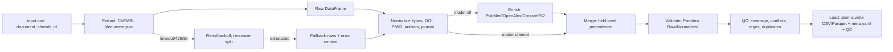

# 9. Извлечение метаданных документов из ChEMBL API

**Версия:** 1.1
**Дата:** 2025-01-28
**Автор:** Data Acquisition Team

## 0. Цели, охват, ограничения

### Цель

Детерминированно извлекать, нормализовать и валидировать метаданные публикаций (documents) из ChEMBL; опционально обогащать данными из PubMed/OpenAlex/Crossref/Semantic Scholar; обеспечить полную трассировку, QC метрики и атомарную запись артефактов.

### Охват

- **Режим `chembl`**: извлечение только из ChEMBL API

- **Режим `all`**: ChEMBL + внешние источники (PubMed, Crossref, OpenAlex, Semantic Scholar)

- Внешние адаптеры со спецификациями в разделах 8-11

### Ограничения

- Не выдумывать эндпоинты ChEMBL

- Любая неуверенность помечается `uncertain:` с конкретным curl для проверки

- Использовать только подтверждённые поля API

### Нон-цели

- Парсинг полнотекстов статей

- Дедупликация статей вне ChEMBL-ID/PMID/DOI

- Извлечение аффилиаций авторов (присутствуют в отдельных источниках)

- Анализ цитирований (базовая поддержка через Semantic Scholar)

## 1. Архитектура и поток данных



### Компоненты

**Extract Stage:**

- ChEMBL Client (batch retrieval с recursive split)

- TTL cache (scoped by chembl_release)

- Circuit breaker

- Fallback manager

**Transform Stage:**

- Normalize: DOI, PMID, year, authors, journal

- Enrich: адаптеры для PubMed/OpenAlex/Crossref/S2

- Merge: field-level precedence

**Validate Stage:**

- Pandera schema validation (Input/Raw/Normalized)

- QC coverage checks

- Conflict detection

**Load Stage:**

- Atomic writer (run_id-scoped temp dirs)

- Canonical serialization (hash generation)

- Metadata builder (full provenance)

## 2. API ChEMBL: контракты и проверка

### Base URL

```text
https://www.ebi.ac.uk/chembl/api/data
```

### Ресурс документов

**Endpoint:** `GET /document.json`

**Параметры:**

- `document_chembl_id__in`: список ID через запятую

- `limit`: количество записей на страницу (опционально)

- `offset`: offset для пагинации (опционально)

- `format`: "json" (рекомендуется)

### ⚠️ TODO: Подтверждение полей `/document.json` (AUD-1)

**Проблема:**

Требуется подтверждение доступных полей в ответе `/document.json` при батчевом запросе `document_chembl_id__in`. Неизвестно, совпадает ли набор полей с single-record endpoint.

**План проверки:**

```bash
curl -sS "https://www.ebi.ac.uk/chembl/api/data/document.json?document_chembl_id__in=CHEMBL1123,CHEMBL1124&limit=50"

```

### Фиксация релиза БД

```bash
curl -sS "https://www.ebi.ac.uk/chembl/api/data/status.json"

```

**Использование релиза:**

- Фиксировать `chembl_db_release` в начале run

- Использовать для scoping кэша (ключи вида: `document:{release}:{id}`)

- Включить в метаданные артефактов

- Блокировать дальнейшие запросы при смене релиза

### Пагинация

**Дефолт:** limit=20, offset=0

**page_meta в ответе:**

```json
{
  "page_meta": {
    "limit": 20,
    "offset": 0,
    "total_count": 15432
  },
  "documents": [...]
}

```

## 3. Вход, батчинг и устойчивость

### 3.1 Входные данные

**Минимальные требования:**

- `document_chembl_id` (строка, regex `^CHEMBL\d+$`, уникальная)

**Фильтрация:**

- Пустые строки, `#N/A`, невалидные ID → отфильтровать до вызова API

- Сохранить `rejected_input.csv` с причинами отклонения

**Pandera InputSchema:**

```python
class DocumentInputSchema(pa.DataFrameModel):
    document_chembl_id: Series[str] = pa.Field(
        regex=r"^CHEMBL\d+$",
        nullable=False,
        unique=True
    )

    class Config:
        strict = True
        ordered = True
        coerce = True

```

### 3.2 Батчинг

**Параметры:**

- `chunk_size` по умолчанию: 10

- **Максимальный размер батча: 25 ID** (жёсткое ограничение)

- URL length limit: 8000 символов (порог для переключения на POST)

**POST override стратегия:**
При `len(ids) > 25` или риске `414 URI Too Long` (URL > 8000 символов) выполняется:

- POST-запрос на `/document.json` с заголовком `X-HTTP-Method-Override: GET`

- Параметр `document_chembl_id__in` передаётся в теле запроса

- При ошибках применяется recursive split до единичных ID

**Алгоритм динамической подстройки:**

```python
def fetch_batch(ids, chunk_size):
    for chunk in split(ids, chunk_size):
        url = build_url(chunk)
        if len(url) > 1800:
            yield from fetch_batch(chunk, chunk_size // 2 or 1)
            continue
        try:
            yield get_json(url)
        except ReadTimeout:
            if len(chunk) == 1:
                raise
            yield from fetch_batch(chunk, max(1, len(chunk)//2))

```

**Реализация в коде:**

```python
def _fetch_documents_chunk(
    chunk_ids: Sequence[str],
    *,
    base_url: str,
    cfg: ApiCfg,
    client: ChemblClient,
    timeout: float,
) -> list[dict[str, Any]]:
    """Return document records with timeout-aware fallback."""
    url = f"{base_url}&document_chembl_id__in={','.join(chunk_ids)}"

    try:
        data = client.request_json(url, cfg=cfg, timeout=timeout)
    except requests.ReadTimeout as exc:
        if len(chunk_ids) <= 1:
            raise
        midpoint = max(1, len(chunk_ids) // 2)
        records = []
        records.extend(_fetch_documents_chunk(chunk_ids[:midpoint], ...))
        records.extend(_fetch_documents_chunk(chunk_ids[midpoint:], ...))
        return records

    items = data.get("documents") or data.get("document") or []
    return [_normalise_document_record(item) for item in items if isinstance(item, Mapping)]

```

### 3.3 Таймауты, ретраи, троттлинг

**Таймауты:**

- Connect: 10 секунд

- Read: 30 секунд

**Ретраи:**

- Попытки: 5

- Backoff: экспоненциальный с jitter (initial=0.5s, max=8s)

- Перехват: 408/429/5xx, сетевые исключения

**429 обработка:**

```python
if response.status_code == 429:
    retry_after_raw = response.headers.get('Retry-After', '60')

    # Поддержка delta-seconds и HTTP-date (RFC 7231)

    try:
        wait_sec = int(retry_after_raw)
    except ValueError:
        try:
            # HTTP-date формат

            from email.utils import parsedate_to_datetime
            retry_date = parsedate_to_datetime(retry_after_raw)
            wait_sec = max(0, int((retry_date - datetime.now(timezone.utc)).total_seconds()))
        except Exception:
            wait_sec = 60

    # Cap на 120 секунд

    wait_sec = min(wait_sec, 120)

    logger.warning(
        "rate_limited",
        retry_after_raw=retry_after_raw,
        retry_after_calculated=wait_sec,
        endpoint=endpoint
    )
    time.sleep(wait_sec)
    raise RateLimitError()

```

**Circuit breaker:**

```python
class CircuitBreaker:
    def __init__(self, failure_threshold=5, reset_timeout=60):
        """
        Circuit breaker для защиты от каскадных сбоев.

        Args:
            failure_threshold: порог сбоев для открытия (по умолчанию 5)
            reset_timeout: таймаут до half-open (по умолчанию 60 сек)
        """
        self.failure_threshold = failure_threshold
        self.reset_timeout = reset_timeout
        self.failure_count = 0
        self.state = "closed"  # closed/open/half-open

        self.last_failure_time = None

    def half_open_probe(self):
        """Half-open состояние: 1 пробный запрос в минуту."""
        if self.state == "half-open":
            now = time.time()
            if self.last_probe_time and (now - self.last_probe_time) < 60:
                raise CircuitBreakerOpen("Probe cooldown active")
            self.last_probe_time = now

# Обязательные лог-поля

logger.error("circuit_breaker_triggered", cb_state=state, cb_failures=failure_count)

```

**Логирование:**
Каждый запрос → JSON запись:

```json
{
  "run_id": "abc123",
  "endpoint": "/document.json",
  "params_hash": "sha256",
  "attempt": 1,
  "status": 200,
  "duration_ms": 234
}

```

## 4. Схема данных ChEMBL и нормализация

### 4.1 Целевые поля из ChEMBL

| Поле | Тип | Nullable | Описание |
|------|-----|----------|----------|
| `document_chembl_id` | StringDtype | NO | PRIMARY KEY |
| `title` | StringDtype | YES | Название статьи |
| `abstract` | StringDtype | YES | Абстракт |
| `doi` | StringDtype | YES | DOI |
| `year` | Int64 | YES | Год публикации |
| `journal` | StringDtype | YES | Полное название журнала |
| `journal_abbrev` | StringDtype | YES | Аббревиатура журнала |
| `volume` | StringDtype | YES | Том журнала |
| `issue` | StringDtype | YES | Выпуск |
| `first_page` | StringDtype | YES | Первая страница |
| `last_page` | StringDtype | YES | Последняя страница |
| `pubmed_id` | Int64 | YES | PMID |
| `authors` | StringDtype | YES | Список авторов |
| `source` | StringDtype | NO | Константа "ChEMBL" |

**⚠️ TODO: Проверка наличия полей (AUD-1):**

Наличие полей `journal_abbrev` и полей пагинации (`page_meta`) требует подтверждения через curl. См. curl команды в разделе выше (§2).

### 4.2 FIELD_MAPPING (расширенный с внешними источниками)

| Источник | Поле | Normalized Field | Нормализация |
|---------|------|------------------|--------------|
| ChEMBL | `document_chembl_id` | `document_chembl_id` | Без изменений |
| ChEMBL | `title` | `title` | Trim, max 1000 chars |
| ChEMBL/PubMed/S2 | `abstract` | `abstract` | Trim, max 5000 chars |
| ChEMBL/PubMed/S2 | `doi` | `doi` | Raw value |
| ChEMBL/PubMed/S2 | `doi` | `doi_clean` | Normalize DOI (§4.3) |
| ChEMBL/PubMed/S2 | `year` | `year` | Coerce to Int64, range [1500, 2100] |
| ChEMBL/PubMed | `journal_full_title` | `journal` | Trim, collapse whitespace |
| ChEMBL/PubMed | `journal` | `journal_abbrev` | Trim |
| ChEMBL/PubMed/Crossref | `volume` | `volume` | Trim, string |
| ChEMBL/PubMed/Crossref | `issue` | `issue` | Trim, string |
| ChEMBL/PubMed/Crossref | `first_page` | `first_page` | Trim, string |
| ChEMBL/PubMed/Crossref | `last_page` | `last_page` | Trim, string |
| ChEMBL/PubMed/S2 | `pubmed_id` | `pubmed_id` | Coerce to Int64 |
| ChEMBL/PubMed/Crossref | `authors` | `authors` | Normalize separators |
| - | - | `authors_count` | Count authors by separator |

| Crossref | `ISSN[0]` | `issn_print` | Trim |
| Crossref | `ISSN[1]` | `issn_electronic` | Trim |
| S2 | `citationCount` | `citation_count` | Int64 |
| S2 | `influentialCitationCount` | `influential_citations` | Int64 |
| OpenAlex | `is_oa` | `is_oa` | Boolean |
| OpenAlex | `oa_status` | `oa_status` | gold\|green\|hybrid\|bronze\|closed |
| OpenAlex | `oa_url` | `oa_url` | URL string |
| S2 | `fieldsOfStudy` | `fields_of_study` | Array as comma-separated |
| OpenAlex | `concepts[0:3]` | `concepts_top3` | Top 3 concepts by score |
| PubMed | `MeshHeading` | `mesh_terms` | Semicolon-separated descriptors |
| PubMed | `Chemical/RegistryNumber` | `chemicals` | Semicolon-separated CAS |
| - | - | `source` | Constant "ChEMBL" |

### 4.3 Нормализация (детерминированная)

#### DOI нормализация

```python
def normalize_doi(doi: str | None) -> tuple[str, bool]:
    """Return (normalized_doi, is_valid)"""
    if not doi or not isinstance(doi, str):
        return "", False

    # Удалить префиксы

    doi = doi.strip().lower()
    for prefix in ["doi:", "https://doi.org/", "http://dx.doi.org/"]:
        if doi.startswith(prefix):
            doi = doi[len(prefix):]

    doi = doi.strip()

    # Валидация regex

    DOI_PATTERN = re.compile(r'^10\.\d{4,9}/\S+$')
    is_valid = bool(DOI_PATTERN.match(doi))

    return doi if is_valid else "", is_valid

```

**Результат:**

- `doi`: исходное значение (для audit)

- `doi_clean`: нормализованное значение (для ключей и merge)

- `qc_flag_invalid_doi`: 1 если невалидный

#### PMID нормализация

```python
def coerce_pmid(value: Any) -> pd.Int64Dtype | None:
    """Coerce to Int64, return NA if invalid."""
    if pd.isna(value) or value in ("", None):
        return None
    try:
        return int(value)
    except (ValueError, TypeError):
        return None

```

#### Year нормализация

```python
def normalize_year(value: Any) -> tuple[int | None, bool]:
    """Return (year, is_valid) with range check [1500, 2100]."""
    if pd.isna(value):
        return None, True
    try:
        year = int(value)
        is_valid = 1500 <= year <= 2100
        return year if is_valid else None, is_valid
    except (ValueError, TypeError):
        return None, False

```

**QC флаг:** `qc_flag_out_of_range_year=1` если year вне диапазона.

#### Authors нормализация

```python
def normalize_authors(authors: Any, separator: str = ", ") -> tuple[str, int]:
    """Normalize author separators and count."""
    if pd.isna(authors):
        return "", 0

    # Нормализация разделителей

    text = str(authors).strip()
    text = re.sub(r';', ',', text)  # ; → ,

    text = re.sub(r'\s+', ' ', text)  # collapse whitespace

    if not text:
        return "", 0

    # Split и count

    parts = text.split(',')
    parts = [p.strip() for p in parts if p.strip()]

    return separator.join(parts), len(parts)

```

**Результат:**

- `authors`: нормализованная строка

- `authors_count`: количество авторов

#### Journal нормализация

```python
def normalize_journal(value: Any, max_len: int = 255) -> str:
    """Trim and collapse whitespace."""
    if pd.isna(value):
        return ""
    text = str(value)
    text = re.sub(r'\s+', ' ', text).strip()
    return text[:max_len] if len(text) > max_len else text

```

### NA политика

- Пустые строки → `pd.NA`

- Сериализация в CSV: пустыми строками (`na_rep=""`)

- Нулевые числа → `pd.NA`

- Сериализация: пустыми строками

## 5. Режимы работы пайплайна

### 5.1 Режим `chembl`

**Вход:** `document_chembl_id`

**Процесс:**

1. Извлечение из ChEMBL (`/document.json`)

2. Нормализация полей (§4)

3. Валидация (Pandera RawSchema)

4. QC проверки (§16)

5. Атомарная запись (§18)

**Выход:**

- Базовый набор полей ChEMBL (14 колонок)

- Системные метаданные (§14)

- QC отчёт

### 5.2 Режим `all`

**Вход:** `document_chembl_id`

**Процесс:**

1. **Извлечение ChEMBL:**

   ```python
   chembl_df = get_documents(document_ids, cfg=cfg, client=client)
   ```

2. **Извлечение ключей обогащения:**

   ```python
   pmids = chembl_df["pubmed_id"].dropna().astype(int).tolist()
   dois = chembl_df["doi_clean"].dropna().tolist()
   ```

3. **Вызов адаптеров** (каждый независимо):

   ```python
   pubmed_df = fetch_pubmed(pmids)
   openalex_df = fetch_openalex(dois)
   crossref_df = fetch_crossref(dois)
   scholar_df = fetch_semantic_scholar(pmids)
   ```

4. **Merge field-level с приоритетами** (§12)

5. **Валидация и QC**

6. **Атомарная запись**

## 6. Интеграция с внешними адаптерами (обновлено)

### Контракты вызова

**PubMed (§8):**

```python
def fetch_pubmed(
    pmids: list[int],
    *,
    cfg: PubMedConfig,
    batch_size: int = 200,
    use_history: bool = True,
) -> Iterator[pd.DataFrame]:
    """
    Fetch metadata from PubMed E-utilities.

    Columns in output:
    - PMID, DOI, ArticleTitle, Abstract, JournalTitle, ISSN, etc.
    - Prefix: PubMed.*
    """

```

**Crossref (§9):**

```python
def fetch_crossref(
    dois: list[str],
    *,
    cfg: CrossrefConfig,
    batch_size: int = 100,
    use_cursor: bool = True,
) -> Iterator[pd.DataFrame]:
    """
    Fetch metadata from Crossref API.

    Columns in output:
    - DOI, title, container-title, authors, ISSN, dates, etc.
    - Prefix: Crossref.*
    """

```

**OpenAlex (§10):**

```python
def fetch_openalex(
    dois: list[str],
    *,
    cfg: OpenAlexConfig,
    per_page: int = 200,
    use_cursor: bool = True,
) -> Iterator[pd.DataFrame]:
    """
    Fetch metadata from OpenAlex Works API.

    Columns in output:
    - openalex_id, DOI, title, is_oa, oa_status, concepts, etc.
    - Prefix: OpenAlex.*
    """

```

**Semantic Scholar (§11):**

```python
def fetch_semantic_scholar(
    pmids: list[int],
    *,
    cfg: SemanticScholarConfig,
    use_title_fallback: bool = True,
) -> Iterator[pd.DataFrame]:
    """
    Fetch metadata from Semantic Scholar Graph API.

    Columns in output:
    - paperId, DOI, PMID, title, citation_count, fieldsOfStudy, etc.
    - Prefix: S2.*
    """

```

**Обязательные колонки для merge:**

- `PubMed.PMID` (для join с ChEMBL)

- `Crossref.DOI`, `OpenAlex.DOI`, `S2.DOI`

- `PubMed.ArticleTitle`, `PubMed.Abstract`, etc.

### Стриминг для больших наборов

```python
with tempfile.TemporaryDirectory(prefix="chembl_metadata_") as tmp_dir:
    tmp_paths = {}

    # Записать стриминг чанков от каждого источника

    for source, frames in [
        ("pubmed", pubmed_frames),
        ("crossref", crossref_frames),
        ("openalex", openalex_frames),
        ("semantic_scholar", s2_frames),
    ]:
        tmp_path = Path(tmp_dir) / f"{source}_metadata.csv"
        write_csv_chunks_deterministic(
            frames,
            tmp_path,
            key_cols=[f"{source.capitalize()}.PMID" if source in ["pubmed", "semantic_scholar"]
                     else f"{source.capitalize()}.DOI"],
            chunksize=batch_size,
            sep=cfg.io.csv_sep,
            encoding=cfg.io.csv_encoding,
        )
        tmp_paths[source] = tmp_path

    # Read chunks для merge

    metadata_iterators = {}
    for source, path in tmp_paths.items():
        metadata_iterators[source] = read_csv_chunks(path, chunk_size=chunk_size)

    # Merge с ChEMBL

    merged = merge_with_chembl(chembl_df, metadata_iterators)

```

### Fallback по DOI

Если нет PMID, использовать `doi_clean` для Crossref/OpenAlex/S2:

```python

# Обогащение документов без PMID через Crossref/OpenAlex/S2 по DOI

if not doc_df.empty and "doi_clean" in doc_df.columns:
    dois = doc_df["doi_clean"].dropna().unique().tolist()
    if dois:
        crossref_df = fetch_crossref_metadata(dois, config=cfg)
        openalex_df = fetch_openalex_metadata(dois, config=cfg)
        scholar_df = fetch_semantic_scholar_by_doi(dois, config=cfg)
        enriched_df = merge_document_metadata(
            doc_df,
            crossref_df=crossref_df,
            openalex_df=openalex_df,
            scholar_df=scholar_df
        )

```

### Обработка ошибок

Все внешние вызовы → retry/backoff, троттлинг, логирование аналогично ChEMBL (§3.3). Детали в разделах 8-11.

## 7. Обработка ошибок и устойчивость

### ERROR MATRIX (расширенный)

| Код | Условие | Действие | Retry | Log Fields |
|-----|---------|----------|-------|------------|
| `E_HTTP_429` | ChEMBL 429 | Sleep by Retry-After, retry | YES | endpoint, retry_after, attempt |
| `E_HTTP_5XX` | 5xx | Retry with backoff | YES | status, attempt |
| `E_TIMEOUT` | ReadTimeout | Recursive split; retry | YES | chunk_size, attempt |
| `E_JSON` | Parse error | Fallback row | NO | body_hash |
| `E_SCHEMA` | Pandera fail | Hard fail | NO | schema, column, check |
| `E_IO` | Write fail | Hard fail | NO | path, errno |
| `E_EMPTY_RESPONSE` | Empty data | Empty DF + qc_flag | NO | chunk_ids |

| `E_INVALID_ID` | Regex fail | Filter + rejected_input.csv | NO | invalid_ids |

| `E_CIRCUIT_BREAKER_OPEN` | Circuit breaker | Sleep cooldown, retry | YES | circuit_state, failures |
| `E_PUBMED_MALFORMED_XML` | PubMed XML parse error | Fallback row | NO | xpath_context |
| `E_PUBMED_HISTORY_EXPIRED` | PubMed WebEnv expired | Retry with new history | YES | attempt |
| `E_CROSSREF_404` | Crossref DOI not found | Tombstone record | NO | doi |
| `E_CROSSREF_CURSOR_INVALID` | Crossref cursor invalid | Retry with offset | YES | cursor |
| `E_OPENALEX_TITLE_NO_MATCH` | Title search no match | Skip title search | NO | title |
| `E_S2_ACCESS_DENIED` | S2 403/access denied | Wait 5 min, retry once | YES | error_msg |
| `E_S2_QUOTA_EXCEEDED` | S2 quota exceeded | Wait until reset | YES | quota_info |

### Fallback строки

При невосстановимой ошибке для chunk:

```python
def create_fallback_row(
    document_chembl_id: str,
    error_type: str,
    error_message: str,
    schema_columns: list[str]
) -> dict[str, Any]:
    """Create fallback row with error context."""
    row = {col: None for col in schema_columns}
    row.update({
        "document_chembl_id": document_chembl_id,
        "error_type": error_type,
        "error_message": error_message,
        "attempted_at": datetime.now(UTC).isoformat(),
    })
    return row

```

### Классификация ошибок

```python
def classify_error(exc: Exception) -> tuple[str, bool]:
    """Return (error_code, should_retry)."""
    if isinstance(exc, requests.Timeout):
        return "E_TIMEOUT", True
    if isinstance(exc, requests.HTTPError):
        if exc.response.status_code == 429:
            return "E_HTTP_429", True
        if 500 <= exc.response.status_code < 600:
            return "E_HTTP_5XX", True
        return "E_HTTP_4XX", False
    if isinstance(exc, ValueError):
        return "E_JSON", False
    return "E_UNKNOWN", False

```

### Централизованное логирование ошибок

```json
{
  "level": "error",
  "error_code": "E_TIMEOUT",
  "endpoint": "/document.json",
  "chunk_size": 5,
  "attempt": 3,
  "message": "ReadTimeout on chunk",
  "timestamp_utc": "2025-01-28T14:23:45.123Z"
}

```

## 8. PubMed E-utilities API

### 8.1 Политика NCBI и обязательные параметры

**Обязательные параметры запросов:**

- `tool=<our_app>` — идентификация приложения (обязательно)

- `email=<contact>` — контактный email (обязательно)

- `api_key=<key>` — для увеличения лимита до 10 rps (опционально)

**Без этих параметров прилетит блокировка от NCBI!**

### 8.2 E-utilities endpoints

**ESearch - поиск по условиям:**

```text
https://eutils.ncbi.nlm.nih.gov/entrez/eutils/esearch.fcgi?
  db=pubmed
  &term=<query>
  &retmax=<n>
  &retstart=<k>
  &usehistory=y
  &tool=bioactivity_etl
  &email=<contact>
  &api_key=<key>
```

**EPost - загрузка UID в историю:**

```text
POST https://eutils.ncbi.nlm.nih.gov/entrez/eutils/epost.fcgi?db=pubmed
Body: id=PMID1,PMID2,...

Возвращает: WebEnv + query_key
```

**EFetch - извлечение полных записей:**

По истории (рекомендуется для больших списков):

```text
https://eutils.ncbi.nlm.nih.gov/entrez/eutils/efetch.fcgi?
  db=pubmed
  &query_key=<key>
  &WebEnv=<env>
  &retmode=xml
  &rettype=abstract
  &retstart=0
  &retmax=200
  &tool=bioactivity_etl
  &email=<contact>
  &api_key=<key>
```

По явному списку ID (POST для >200):

```text
POST https://eutils.ncbi.nlm.nih.gov/entrez/eutils/efetch.fcgi?
  db=pubmed
  &retmode=xml
  &rettype=abstract
  &tool=bioactivity_etl
  &email=<contact>
  &api_key=<key>
Body: id=PMID1,PMID2,...
```

**ELink - связанные ресурсы (опционально):**

```text
dbfrom=pubmed&linkname=pubmed_pmc&id=<PMIDs>  # PMCID маппинг

dbfrom=pubmed&linkname=pubmed_pubmed_refs&id=<PMIDs>  # Список референсов
```

### 8.3 History Server

Использование: `ESearch/EPost → WebEnv + query_key → EFetch`

**Преимущества:**

- Снижает число запросов

- Позволяет выборку "несколько сотен записей за один EFetch"

- Пагинация через `retstart`/`retmax`

### 8.4 Rate limiting

- **Без API ключа**: 3 запроса/секунду

- **С API ключом**: 10 запросов/секунду

**Стратегия:**

- Глобальный token bucket limiter

- `workers=1` (NCBI не приветствует агрессивный параллелизм)

- Exponential backoff с jitter при 429 ошибках

### 8.5 Batch size

- **Рекомендация**: 200 UID в EFetch

- **Допустимо**: несколько сотен за один EFetch

- **Обязательно POST**: при >200 UID

### 8.6 Парсинг XML (DTD-осознанная выборка полей)

**XML структура (PubMed DTD):**
Корень: `PubmedArticleSet` → `PubmedArticle` → `MedlineCitation` + `PubmedData`

**Минимальная карточка (XPath):**

- `PubMed.PMID` → `//MedlineCitation/PMID/text()`

- `PubMed.ArticleTitle` → `//Article/ArticleTitle`

- `PubMed.Abstract` → конкатенация `//Abstract/AbstractText` с учётом `@Label` и `@NlmCategory`

- `PubMed.Language[]` → `//Article/Language`

- `PubMed.JournalTitle` → `//Journal/Title`

- `PubMed.JournalISOAbbrev` → `//MedlineJournalInfo/MedlineTA`

- `PubMed.ISSN` → `//Journal/ISSN[@IssnType='Print' | @IssnType='Electronic']`

- `PubMed.Volume` → `//JournalIssue/Volume`

- `PubMed.Issue` → `//JournalIssue/Issue`

- `PubMed.StartPage/EndPage` → парсинг `//Pagination/MedlinePgn` (формат "123-145")

- `PubMed.PublicationType[]` → `//PublicationTypeList/PublicationType`

- `PubMed.Year/Month/Day` → `//Article/Journal/JournalIssue/PubDate/*`

**DOI - приоритеты извлечения:**

Два источника в XML (согласно DTD):

1. **Приоритетный**: `//PubmedData/ArticleIdList/ArticleId[@IdType='doi']`

2. **Fallback**: `//Article/ELocationID[@EIdType='doi']`

Фиксируем источник в поле `doi_source` для трейсабилити.

**Авторы:**
`//AuthorList/Author` извлекаем:

- `LastName`, `ForeName`, `Initials`

- `AffiliationInfo/Affiliation`

- `Identifier[@Source='ORCID']` (если есть)

**MeSH терминология:**
`//MeshHeadingList/MeshHeading`:

- `DescriptorName[@UI, @MajorTopicYN]`

- `QualifierName[@UI]`

**Химические вещества:**
`//ChemicalList/Chemical`:

- `NameOfSubstance[@UI]`

- `RegistryNumber` (CAS номер)

### 8.7 Нормализация

```python
def normalize_pubmed_date(year, month, day):
    """ISO YYYY-MM-DD с паддингом"""
    year = str(year).zfill(4) if year else "0000"
    month = str(month).zfill(2) if month else "00"
    day = str(day).zfill(2) if day else "00"
    return f"{year}-{month}-{day}"

```

### 8.8 Обработка ошибок

**404 Not Found для PMID:**

- Создать "tombstone" запись: `{pmid, error="NotFound", fetched_at}`

- Продолжить обработку остальных

**Timeout / 5xx ошибки:**

- Retries с капом (max 5 попыток)

- Логирование каждой попытки

- Финальный fallback в error записи

**Malformed XML:**

- Сохранить сырой батч в `landing/`

- Эмитировать `parse_error` с `xpath_context`

- Записать в `qc/pubmed/errors.csv`

## 9. Crossref REST API

### 9.1 Polite Pool vs Public Pool

**Public Pool (без идентификации):**

- Rate limit: ~50 запросов/секунду

- Нестабильная производительность

- Может тротлиться при высокой нагрузке

**Polite Pool (рекомендуется):**

- Добавить `mailto=` в query string или User-Agent header

- Rate limit: до 50+ запросов/секунду с приоритетом

- Стабильная производительность

**Crossref Plus (с API токеном):**

- Требует регистрацию и токен

- Дополнительные метаданные

- Увеличенные лимиты

### 9.2 REST API endpoints

**GET /works/{doi} - извлечение по одному DOI:**

```bash
curl "https://api.crossref.org/works/10.1371/journal.pone.0000000" \
  -H "User-Agent: bioactivity_etl/1.0 (mailto:owner@example.org)"

```

**GET /works - пакетное извлечение:**

```bash
curl "https://api.crossref.org/works?filter=doi:10.1371/journal.pone.0000000,10.1038/nature12345&rows=100" \
  -H "User-Agent: bioactivity_etl/1.0 (mailto:owner@example.org)"

```

**Cursor-based pagination для больших списков:**

```bash

# Первый запрос

curl "https://api.crossref.org/works?filter=doi:10.1371/*&rows=1000&cursor=*"

# Следующая страница (cursor из previous response)

curl "https://api.crossref.org/works?filter=doi:10.1371/*&rows=1000&cursor=AoJ/..."

```

### 9.3 Rate limiting

**Наша стратегия (консервативная):**

- **По умолчанию**: 2 запроса/секунду (polite pool)

- **С burst capacity**: до 5 запросов в burst

- **Workers**: 2-4 параллельных потока

- **Timeout**: connect 10s, read 30s

### 9.4 Извлекаемые поля

```json
{
  "DOI": "10.1371/journal.pone.0000000",
  "type": "journal-article",
  "title": ["Article Title Here"],
  "container-title": ["PLoS ONE"],
  "published-print": {"date-parts": [[2023, 3, 15]]},
  "published-online": {"date-parts": [[2023, 3, 1]]},
  "volume": "18",
  "issue": "3",
  "page": "e0000000",
  "ISSN": ["1932-6203"],
  "publisher": "Public Library of Science",
  "member": "340",
  "author": [
    {
      "given": "John",
      "family": "Doe",
      "sequence": "first",
      "affiliation": [{"name": "Department of Biology"}],
      "ORCID": "https://orcid.org/0000-0001-2345-6789"
    }
  ]
}

```

### 9.5 Приоритеты дат

**Порядок предпочтения:**

1. `published-print.date-parts` — дата печатной версии (приоритет)

2. `published-online.date-parts` — дата онлайн версии

3. `issued.date-parts` — общая дата публикации

4. `created.date-parts` — дата создания записи в Crossref

### 9.6 ISSN нормализация (Print vs Electronic)

```python
def extract_issn(record):
    """Извлечь ISSN с типом"""
    issn_data = {}

    if 'ISSN' in record:
        issn_list = record['ISSN']
        if len(issn_list) > 0:
            issn_data['issn_print'] = issn_list[0]
        if len(issn_list) > 1:
            issn_data['issn_electronic'] = issn_list[1]

    # Альтернативно из issn-type массива

    if 'issn-type' in record:
        for issn_obj in record['issn-type']:
            issn_type = issn_obj.get('type')
            issn_value = issn_obj.get('value')

            if issn_type == 'print':
                issn_data['issn_print'] = issn_value
            elif issn_type == 'electronic':
                issn_data['issn_electronic'] = issn_value

    return issn_data

```

### 9.7 ORCID нормализация

```python
def normalize_orcid(orcid_value):
    """Извлечь чистый ORCID"""
    if not orcid_value:
        return None

    orcid = orcid_value.replace('https://orcid.org/', '')
    orcid = orcid.replace('http://orcid.org/', '')

    if re.match(r'^\d{4}-\d{4}-\d{4}-\d{3}[0-9X]$', orcid):
        return orcid

    return None

```

### 9.8 Обработка ошибок

**404 Not Found:** Tombstone запись
**400 Bad Request:** Валидация DOI перед запросом
**503 Service Unavailable:** Retry с exponential backoff
**429 Rate Limiting:** Exponential backoff с jitter

### 9.9 Лицензирование

Crossref metadata под CC0 (public domain):

- Можно использовать свободно

- Указать источник: "Data from Crossref"

- Ссылка на Terms of Use обязательна

## 10. OpenAlex Works API

### 10.1 Open Data политика

OpenAlex — полностью открытый сервис:

- ✅ **Бесплатный**: нет API ключей

- ✅ **Щедрые лимиты**: "reasonable use"

- ✅ **Открытые данные**: под CC0 лицензией

- ✅ **Публичный код**: GitHub repository

### 10.2 API endpoints

**GET /works/{work_id} - извлечение по OpenAlex ID:**

```bash
curl "https://api.openalex.org/works/W1234567890"

```

**GET /works?filter=... - множественные критерии поиска:**

По DOI:

```bash
curl "https://api.openalex.org/works?filter=doi:10.1371/journal.pone.0000000"

```

По PMID:

```bash
curl "https://api.openalex.org/works?filter=pmid:12345678"

```

По заголовку (title search):

```bash
curl "https://api.openalex.org/works?filter=title.search:prostaglandin"

```

**Cursor-based pagination (рекомендуется):**

```bash

# Первый запрос

curl "https://api.openalex.org/works?filter=doi:10.1371/*&per-page=100&cursor=*"

# Следующая страница

curl "https://api.openalex.org/works?filter=doi:10.1371/*&per-page=100&cursor=MjAyM..."

```

### 10.3 Rate limiting

**Официальные рекомендации:**

- Не более 100K запросов/день на IP

- Минимум 100ms между запросами

- Не использовать параллельные запросы в агрессивном режиме

**Наша стратегия:**

- 10 запросов/секунду с token bucket

- 2-4 workers для параллелизма

- Exponential backoff при any errors

### 10.4 Извлекаемые поля

```json
{
  "id": "https://openalex.org/W1234567890",
  "doi": "https://doi.org/10.1371/journal.pone.0000000",
  "title": "Article Title Here",
  "publication_date": "2023-03-15",
  "publication_year": 2023,
  "type": "article",
  "type_crossref": "journal-article",
  "language": "en",
  "is_oa": true,
  "open_access": {
    "is_oa": true,
    "oa_status": "gold",
    "oa_url": "https://journals.plos.org/..."
  },
  "concepts": [
    {
      "id": "https://openalex.org/C1234567890",
      "display_name": "Medicine",
      "score": 0.9234,
      "level": 0
    }
  ]
}

```

### 10.5 OA статус детализация

Возможные значения: `gold`, `green`, `hybrid`, `bronze`, `closed`

### 10.6 Concepts и Subject Areas

Извлекаем топ-3 концепта по score для поля `concepts_top3`.

### 10.7 Title-based поиск (fallback)

```python
def search_by_title(title, fuzzy=True):
    """Поиск работы по заголовку"""
    exact_results = fetch_openalex_works(
        filter=f"title.search:{title}",
        per_page=10
    )

    if fuzzy and len(exact_results) == 0:
        simplified = simplify_title(title)
        return fetch_openalex_works(
            filter=f"title.search:{simplified}",
            per_page=10
        )

    return exact_results

```

### 10.8 Нормализация

```python
def normalize_openalex_id(openalex_url):
    """Извлечь короткий ID из URL"""
    if not openalex_url:
        return None

    pattern = r'https://openalex\.org/([A-Z]\d+)'
    match = re.match(pattern, openalex_url)

    return match.group(1) if match else None

```

### 10.9 Обработка ошибок

**404 Not Found:** Work не существует, fallback
**429 Too Many Requests:** Retry with delay
**5xx Server Errors:** Retry с exponential backoff

## 11. Semantic Scholar Graph API

### 11.1 API Key requirement

**Базовый (без API ключа):**

- 100 запросов/5 минут

- 100K запросов/месяц на email

- Rate limit: ~0.33 requests/секунду

**Premium (с API ключом):**

- 5000 запросов/5 минут

- Без месячного лимита

- Rate limit: ~16 requests/секунду

**API key обязателен для production использования!**

### 11.2 Rate limiting

**Наша стратегия (консервативная):**

- **По умолчанию**: 0.8 requests/секунду (1.25s между запросами)

- **С API ключом**: 10 requests/секунду с burst до 15

- **Workers**: 1-2 параллельных потока

- **Timeout**: 30s

### 11.3 API endpoints

**GET /graph/v1/paper/{paper_id} - извлечение по ID:**

```bash
curl "https://api.semanticscholar.org/graph/v1/paper/10.1371/journal.pone.0000000" \
  -H "x-api-key: <your_key>"

```

Поддерживаемые IDs:

- DOI: `10.1371/journal.pone.0000000`

- PMID: `PMID:12345678`

- ArXiv: `arXiv:1234.5678`

**Search API (для title fallback):**

```bash
curl "https://api.semanticscholar.org/graph/v1/paper/search?query=prostaglandin&limit=10" \
  -H "x-api-key: <your_key>"

```

### 11.4 Извлекаемые поля

```json
{
  "paperId": "1234567890abcdef",
  "externalIds": {
    "DOI": "10.1371/journal.pone.0000000",
    "PMID": "12345678"
  },
  "title": "Article Title Here",
  "abstract": "Abstract text...",
  "venue": "PLoS ONE",
  "year": 2023,
  "publicationDate": "2023-03-15",
  "referenceCount": 45,
  "citationCount": 120,
  "influentialCitationCount": 5,
  "isOpenAccess": true,
  "publicationTypes": ["JournalArticle"],
  "fieldsOfStudy": ["Medicine", "Biology"]
}

```

### 11.5 Citation metrics

Уникальные метрики Semantic Scholar:

- `citation_count`: общее количество цитирований

- `influential_citations`: влиятельные цитирования

- `reference_count`: количество референсов

### 11.6 Title-based поиск (critical fallback)

```python
def search_by_title(title, max_results=10):
    """Поиск по заголовку через Search API"""
    url = "https://api.semanticscholar.org/graph/v1/paper/search"
    params = {
        'query': title,
        'limit': max_results,
        'fields': 'paperId,title,externalIds,year,venue'
    }

    response = session.get(url, params=params, timeout=30)
    return response.json().get('data', [])

```

**Scoring и выбор:**

- Jaccard similarity на словах

- Выбирать результат с score > 0.85

- Validate year match if available

### 11.7 Нормализация publication types

```python
def normalize_publication_types(types_list):
    """Нормализация типов публикаций"""
    if not types_list:
        return []

    normalized = [t.lower() for t in types_list]
    return normalized

```

### 11.8 Обработка Access Denied

```python
def handle_access_denied(error_response, attempt):
    """Обработка access denied"""
    if is_access_denied_error(str(error_response)):
        wait_time = 300  # 5 minutes minimum

        time.sleep(wait_time)

        if attempt < 2:
            return True

    return False

```

### 11.9 Лицензирование

⚠️ **Важно:** Semantic Scholar Metadata License

- Non-commercial use OK

- Commercial use requires special agreement

- Attribution required: "Data from Semantic Scholar"

- Terms: <https://www.semanticscholar.org/product/api/api-terms-of-use>

**В production:** проконсультироваться с юристами!

## 12. Интеграция и Merge Strategy (расширенный)

### 12.1 Последовательность вызовов адаптеров

```python

# 1. Извлечение из ChEMBL

chembl_df = get_documents(document_ids, cfg=cfg, client=client)

# 2. Извлечение ключей обогащения

pmids = chembl_df["pubmed_id"].dropna().astype(int).tolist()
dois = chembl_df["doi_clean"].dropna().tolist()

# 3. Параллельный вызов адаптеров

with ThreadPoolExecutor(max_workers=cfg.modes.all.workers) as executor:
    pubmed_future = executor.submit(fetch_pubmed, pmids, cfg=cfg)
    crossref_future = executor.submit(fetch_crossref, dois, cfg=cfg)
    openalex_future = executor.submit(fetch_openalex, dois, cfg=cfg)
    scholar_future = executor.submit(fetch_semantic_scholar, pmids, cfg=cfg)

    pubmed_df = pubmed_future.result()
    crossref_df = crossref_future.result()
    openalex_df = openalex_future.result()
    scholar_df = scholar_future.result()

# 4. Merge с приоритетами

merged_df = merge_with_precedence(
    chembl_df, pubmed_df, crossref_df, openalex_df, scholar_df
)

```

### 12.2 Fallback цепочки

**Для идентификаторов:**

- PMID → DOI → title search (OpenAlex/S2)

- Если нет PMID, использовать DOI для all sources

- Если нет DOI, использовать title search только в OpenAlex/S2

### 12.3 Field-level merge с детальными приоритетами

| Поле | Приоритет (слева → справа) | Источники | Обоснование |
|------|---------------------------|-----------|-------------|
| `title` | PubMed > ChEMBL > OpenAlex > Crossref > S2 | 5 | PubMed структурированный для биомеда |
| `abstract` | PubMed > ChEMBL > OpenAlex > Crossref > S2 | 5 | PubMed наиболее полный |
| `journal` | PubMed > Crossref > OpenAlex > ChEMBL > S2 | 5 | PubMed + Crossref для ISSN |

| `journal_abbrev` | PubMed > Crossref > ChEMBL | 3 | PubMed ISO аббревиатуры |
| `authors` | PubMed > Crossref > OpenAlex > ChEMBL > S2 | 5 | Crossref с ORCID |
| `issn_print` | Crossref > PubMed | 2 | Crossref приоритет |
| `issn_electronic` | Crossref > PubMed | 2 | Crossref приоритет |
| `volume` | PubMed > Crossref > ChEMBL | 3 | PubMed структурированный |
| `issue` | PubMed > Crossref > ChEMBL | 3 | PubMed структурированный |
| `first_page` | PubMed > Crossref > ChEMBL | 3 | PubMed парсинг MedlinePgn |
| `last_page` | PubMed > Crossref > ChEMBL | 3 | PubMed парсинг MedlinePgn |
| `year` | PubMed > Crossref > OpenAlex > ChEMBL > S2 | 5 | PubMed completed date |
| `doi_clean` | Crossref > PubMed > OpenAlex > S2 > ChEMBL | 5 | Crossref регистратор |
| `citation_count` | S2 | 1 | S2 авторитет |
| `influential_citations` | S2 | 1 | S2 уникальный |
| `is_oa` | OpenAlex > S2 | 2 | OpenAlex детализация |
| `oa_status` | OpenAlex | 1 | OpenAlex детализация |
| `oa_url` | OpenAlex > S2 | 2 | OpenAlex приоритет |
| `fields_of_study` | S2 | 1 | S2 авторитет |
| `concepts_top3` | OpenAlex | 1 | OpenAlex score-based |
| `mesh_terms` | PubMed | 1 | PubMed уникальный |
| `chemicals` | PubMed | 1 | PubMed CAS номера |

### 12.3.1 Merge-precedence enforcement

**Правила разрешения конфликтов:**

- При наличии значения из нескольких источников используется приоритет из таблицы 12.3

- Поле `*_source` заполняется именем победившего источника

- При конфликтах DOI/PMID выставляются флаги `conflict_doi` / `conflict_pmid`

- Все варианты значений сохраняются в audit trail для трассировки

**Пример:**

```python

# DOI precedence: Crossref > PubMed > OpenAlex > S2 > ChEMBL

doi_sources = {
    "Crossref": "10.1371/journal.pone.0123456",
    "PubMed": "10.1371/journal.pone.0123456",
    "ChEMBL": "10.1371/journal.pone.123456"  # опечатка

}

# Выбирается Crossref, conflict_doi=True (т.к. ChEMBL отличается)

df["doi_clean"] = "10.1371/journal.pone.0123456"
df["doi_clean_source"] = "Crossref"
df["conflict_doi"] = True

```

### 12.4 Алгоритм choose_field

```python
def choose_field(row, field_name: str, precedence: list[str]):
    """Select field value by precedence."""
    for src in precedence:
        col_name = f"{field_name}__{src}"
        if col_name in row.index:
            value = row[col_name]
            if pd.notna(value) and value:
                row[field_name] = value
                row[f"{field_name}_source"] = src
                return row
    row[field_name] = None
    row[f"{field_name}_source"] = None
    return row

# Применение

merged_df = merged_df.apply(
    lambda row: choose_field(row, "title", ["PubMed", "ChEMBL", "OpenAlex", "Crossref", "S2"]),
    axis=1
)

```

### 12.5 Прозрачность источников

Для полей `title`, `abstract`, `journal`, `authors`, `issn_print`, `issn_electronic` добавить `*_source` с именем источника.

### 12.6 Конфликты DOI/PMID

```python
def detect_conflicts(row):
    """Set conflict flags for DOI/PMID mismatches."""
    chembl_doi = row.get("doi_clean__ChEMBL", "")
    pubmed_doi = row.get("doi_clean__PubMed", "")
    crossref_doi = row.get("doi_clean__Crossref", "")

    # Проверка DOI конфликтов

    dois = [d for d in [chembl_doi, pubmed_doi, crossref_doi] if d]
    if len(set(dois)) > 1:
        row["conflict_doi"] = True
    else:
        row["conflict_doi"] = False

    # Проверка PMID конфликтов

    chembl_pmid = row.get("pubmed_id__ChEMBL")
    pubmed_pmid = row.get("pubmed_id__PubMed")

    if pd.notna(chembl_pmid) and pd.notna(pubmed_pmid):
        if int(chembl_pmid) != int(pubmed_pmid):
            row["conflict_pmid"] = True
        else:
            row["conflict_pmid"] = False
    else:
        row["conflict_pmid"] = False

    return row

```

### 12.7 Стриминг для больших наборов

```python
with tempfile.TemporaryDirectory(prefix="chembl_enrichment_") as tmp_dir:
    tmp_paths = {}

    # Записать временные файлы от каждого источника

    for source, frames in [
        ("pubmed", pubmed_frames),
        ("crossref", crossref_frames),
        ("openalex", openalex_frames),
        ("semantic_scholar", s2_frames),
    ]:
        tmp_path = Path(tmp_dir) / f"{source}_metadata.csv"
        write_csv_chunks_deterministic(
            frames,
            tmp_path,
            key_cols=[f"PMID" if source in ["pubmed", "semantic_scholar"] else "DOI"],
            chunksize=cfg.modes.all.batch_size_external,
            sep=cfg.io.csv_sep,
            encoding=cfg.io.csv_encoding,
        )
        tmp_paths[source] = tmp_path

    # Merge по chunks

    merged_chunks = []
    chunk_size = cfg.modes.all.batch_size_external

    for i in range(0, len(chembl_df), chunk_size):
        chembl_chunk = chembl_df.iloc[i:i+chunk_size]

        # Load metadata chunks

        metadata_chunks = {}
        for source, path in tmp_paths.items():
            metadata_chunks[source] = load_metadata_chunk(path, chunk_id=i // chunk_size)

        # Merge chunk

        merged_chunk = merge_with_precedence(
            chembl_chunk, **metadata_chunks
        )
        merged_chunks.append(merged_chunk)

    merged_df = pd.concat(merged_chunks, ignore_index=True)

```

### 12.8 Параллельный вызов адаптеров

**Workers и timeouts:**

```python

# Настройки

workers = cfg.modes.all.workers  # 4 по умолчанию

timeout_per_source = 300  # 5 минут на источник

# С таймаутом

futures = {}
with ThreadPoolExecutor(max_workers=workers) as executor:
    if enable_pubmed:
        futures['pubmed'] = executor.submit(
            fetch_pubmed, pmids, cfg=cfg, timeout=timeout_per_source
        )
    if enable_crossref:
        futures['crossref'] = executor.submit(
            fetch_crossref, dois, cfg=cfg, timeout=timeout_per_source
        )
    if enable_openalex:
        futures['openalex'] = executor.submit(
            fetch_openalex, dois, cfg=cfg, timeout=timeout_per_source
        )
    if enable_semantic_scholar:
        futures['semantic_scholar'] = executor.submit(
            fetch_semantic_scholar, pmids, cfg=cfg, timeout=timeout_per_source
        )

    # Собрать результаты с timeout

    results = {}
    for name, future in futures.items():
        try:
            results[name] = future.result(timeout=timeout_per_source)
        except TimeoutError:
            logger.warning(f"{name} timeout", timeout=timeout_per_source)
            results[name] = pd.DataFrame()

```

## 13. Приоритеты источников и разрешение конфликтов

### 13.1 Матрица приоритетов по полям

См. раздел 12.3 — полная таблица с обоснованиями.

### 13.2 Конфликты метаданных

**DOI mismatch:**

- Сравнение всех источников с DOI

- Флаг `conflict_doi=True` если найдены расхождения

- Логирование всех вариантов для audit

**PMID mismatch:**

- Сравнение ChEMBL PMID с PubMed PMID

- Флаг `conflict_pmid=True` при расхождении

- QC отчёт включает все случаи

**Year conflicts:**

- Диапазон 1500-2100

- Если год отличается более чем на 1 год → флаг

- Log для investigation

### 13.3 Стратегии разрешения

```python
def resolve_field_conflict(row, field_name: str, precedence: list[str]):
    """Resolve conflicts with quality scoring."""
    values = {}
    sources = []

    # Собрать все значения

    for src in precedence:
        col_name = f"{field_name}__{src}"
        if col_name in row.index:
            value = row[col_name]
            if pd.notna(value) and value:
                values[src] = value
                sources.append(src)

    # Выбрать по приоритету

    if len(values) == 0:
        return None, None

    # Если только один источник - возвращаем его

    if len(values) == 1:
        src = list(values.keys())[0]
        return values[src], src

    # Если несколько - выбираем по приоритету

    for src in precedence:
        if src in values:
            return values[src], src

    return None, None

```

### 13.4 Quality scoring

```python
def score_source_quality(source: str, field: str, value: Any) -> float:
    """Compute quality score for field from source."""
    # PubMed: высокий score для биомедицинских полей

    if source == "PubMed" and field in ["title", "abstract", "journal"]:
        return 0.95

    # Crossref: высокий для DOI, ISSN, дат

    if source == "Crossref" and field in ["doi_clean", "issn_print", "issn_electronic"]:
        return 0.98

    # S2: высокий для citation metrics

    if source == "S2" and field in ["citation_count", "influential_citations"]:
        return 1.0

    # OpenAlex: высокий для OA статус

    if source == "OpenAlex" and field in ["is_oa", "oa_status"]:
        return 0.95

    # Default score

    return 0.5

```

### 13.5 Audit trail

**Сохранение всех вариантов:**

```python

# Для каждого поля с конфликтами сохраняем все варианты

audit_trail = {}
for field in ["doi_clean", "pubmed_id", "year"]:
    for source in ["ChEMBL", "PubMed", "Crossref", "OpenAlex", "S2"]:
        col_name = f"{field}__{source}"
        if col_name in row.index:
            value = row[col_name]
            if pd.notna(value):
                if field not in audit_trail:
                    audit_trail[field] = {}
                audit_trail[field][source] = value

# Сохранить в отдельный столбец

row["audit_trail"] = json.dumps(audit_trail, sort_keys=True)

```

## 14. Детерминизм, метаданные и кэш

### 14.1 Сортировка финальная

```python
sort_by = ["document_chembl_id", "pubmed_id", "doi_clean"]
ascending = [True, True, True]
na_position = "last"

df_sorted = df.sort_values(
    by=sort_by,
    ascending=ascending,
    na_position=na_position,
    kind="mergesort"  # стабильная сортировка

)

```

### 14.2 COLUMN_ORDER (расширенный)

```python
COLUMN_ORDER = [
    # Идентификаторы

    "document_chembl_id", "doi", "doi_clean", "pubmed_id",

    # Библиография

    "title", "abstract", "journal", "journal_abbrev", "year",
    "volume", "issue", "first_page", "last_page", "authors", "authors_count",

    # Метаданные от внешних источников

    "mesh_terms", "chemicals", "fields_of_study", "concepts_top3",
    "issn_print", "issn_electronic", "venue_type",

    # Метрики цитирования

    "citation_count", "influential_citations",

    # Open Access

    "is_oa", "oa_status", "oa_url",

    # Источники полей

    "title_source", "abstract_source", "journal_source", "authors_source",
    "issn_print_source", "issn_electronic_source",

    # Конфликты

    "conflict_doi", "conflict_pmid",

    # QC флаги

    "qc_flag_invalid_doi", "qc_flag_out_of_range_year",
    "qc_flag_s2_access_denied", "qc_flag_title_fallback_used",

    # Системные

    "source", "chembl_release", "run_id", "git_commit", "config_hash",
    "pipeline_version", "extracted_at", "hash_business_key", "hash_row", "index",
]

# Применение с типобезопасной NA-policy

df_final = df.reindex(columns=COLUMN_ORDER)

# NA-policy по типам колонок

DTYPES_CONFIG = {
    # Строковые → пустая строка

    "document_chembl_id": "string", "title": "string", "abstract": "string",
    "doi": "string", "doi_clean": "string", "journal": "string",
    # ... остальные строковые

    # Числовые → pd.NA (nullable Int64/Float64)

    "pubmed_id": "Int64", "year": "Int64", "citation_count": "Int64",
    "influential_citations": "Int64", "authors_count": "Int64",

    # Boolean → pd.NA (nullable BooleanDtype)

    "is_oa": "boolean", "conflict_doi": "boolean", "conflict_pmid": "boolean",
}

for col, dtype in DTYPES_CONFIG.items():
    if col not in df_final.columns:
        continue
    if pd.api.types.is_string_dtype(dtype):
        df_final[col] = df_final[col].fillna("").astype(dtype)
    else:
        df_final[col] = df_final[col].astype(dtype)

# Запрещено: object dtypes → ошибка валидации

assert not any(df_final.dtypes == "object"), "Object dtypes forbidden"

```

### 14.3 Хеши

**hash_business_key:**

```python
import hashlib

def compute_hash_business_key(document_chembl_id: str) -> str:
    """Compute SHA256 hash of business key."""
    return hashlib.sha256(document_chembl_id.encode()).hexdigest()

df["hash_business_key"] = df["document_chembl_id"].apply(compute_hash_business_key)

```

**hash_row:**

```python
def canonicalize_row_for_hash(row: pd.Series, column_order: list[str]) -> str:
    """
    Каноническая сериализация строки для хеширования.

    Правила:
    - JSON с sort_keys=True, separators=(',', ':')
    - Даты/время в ISO8601 UTC (YYYY-MM-DDTHH:MM:SSZ)
    - Float с фиксированной точностью %.6f
    - NA-policy: для строк → "", для остальных → null в JSON
    """
    def _normalize_value(v, col_dtype):
        # Float

        if isinstance(v, float):
            if pd.isna(v):
                return None
            return float(f"{v:.6f}")

        # NA/None

        if pd.isna(v):
            # Для строковых колонок → ""

            if pd.api.types.is_string_dtype(col_dtype):
                return ""
            return None

        # Datetime

        if isinstance(v, (pd.Timestamp, datetime)):
            if v.tzinfo:
                return v.tz_convert("UTC").strftime("%Y-%m-%dT%H:%M:%SZ")
            return v.strftime("%Y-%m-%dT%H:%M:%SZ")

        # Dict/List (уже JSON-сериализуемы)

        if isinstance(v, (dict, list)):
            return v

        return str(v)

    # Построение словаря по column_order

    payload = {}
    for col in column_order:
        value = row.get(col)
        col_dtype = row.index.get_loc(col) if col in row.index else None
        payload[col] = _normalize_value(value, col_dtype)

    return json.dumps(payload, sort_keys=True, separators=(",", ":"))

def compute_hash_row(row: pd.Series) -> str:
    """Compute SHA256 hash of canonical row representation."""
    canonical = canonicalize_row_for_hash(row, COLUMN_ORDER)
    return hashlib.sha256(canonical.encode("utf-8")).hexdigest()

df["hash_row"] = df.apply(compute_hash_row, axis=1)

```

### 14.4 Метаданные run

```python
run_metadata = {
    "run_id": uuid4().hex[:16],
    "git_commit": get_git_commit(),
    "config_hash": hashlib.sha256(config_yaml.encode()).hexdigest()[:16],
    "chembl_release": chembl_status["chembl_db_release"],
    "extracted_at": datetime.now(UTC).isoformat(),
    "pipeline_version": "1.0.0",
    "python_version": f"{sys.version_info.major}.{sys.version_info.minor}.{sys.version_info.micro}",
    "sources_enabled": {
        "pubmed": cfg.sources.pubmed.enabled,
        "crossref": cfg.sources.crossref.enabled,
        "openalex": cfg.sources.openalex.enabled,
        "semantic_scholar": cfg.sources.semantic_scholar.enabled,
    }
}

```

### 14.5 Кэш HTTP

**Ключ:**

```python
def cache_key(url: str, params: dict) -> str:
    """Generate cache key for request."""
    sorted_params = sorted(params.items())
    param_str = "&".join(f"{k}={v}" for k, v in sorted_params)
    full = f"GET+{url}+{param_str}"
    return hashlib.sha256(full.encode()).hexdigest()

```

**Scope:**

```python

# ChEMBL cache scoped by release

cache_key = f"document:{chembl_release}:{cache_key(url, params)}"

# TTL

cache_ttl = 86400  # 24 hours

# External sources with their own TTL

source_ttl = {
    "pubmed": 86400,      # 24 hours

    "crossref": 86400,    # 24 hours

    "openalex": 86400,    # 24 hours

    "semantic_scholar": 3600  # 1 hour (часто обновляется)

}

```

**Invalidation:**

- При смене `chembl_release`

- По TTL

- Ручная инвалидация через CLI

### 14.6 Чек-лист детерминизма

- [ ] Сортировка фиксированная по sort_by

- [ ] Column order фиксирован и соответствует COLUMN_ORDER

- [ ] Хеши детерминированные (SHA256)

- [ ] JSON сериализация canonical (sort_keys, separators)

- [ ] NA политика консистентная

- [ ] Timestamps в UTC

- [ ] Float формат фиксированный ("%.6f")

- [ ] ASCII-only encoding (UTF-8 с ASCII subset)

## 15. Схемы данных Pandera (расширенные)

### 15.1 InputSchema

```python
import pandas as pd
import pandera as pa
from pandera.typing import Series

class DocumentInputSchema(pa.DataFrameModel):
    """Input schema for document ChemBL IDs."""

    document_chembl_id: Series[str] = pa.Field(
        regex=r"^CHEMBL\d+$",
        nullable=False,
        unique=True,
        description="ChEMBL document identifier",
    )

    class Config:
        strict = True
        ordered = True
        coerce = True

```

### 15.2 RawSchema (ChEMBL-only)

```python
class DocumentRawSchema(pa.DataFrameModel):
    """Raw schema from ChEMBL API response."""

    document_chembl_id: Series[str] = pa.Field(nullable=False, description="PK")
    title: Series[str] = pa.Field(nullable=True, description="Article title")
    abstract: Series[str] = pa.Field(nullable=True, description="Abstract text")
    doi: Series[str] = pa.Field(nullable=True, description="DOI")
    year: Series[pd.Int64Dtype] = pa.Field(nullable=True, description="Publication year")
    journal: Series[str] = pa.Field(nullable=True, description="Journal name")
    journal_abbrev: Series[str] = pa.Field(nullable=True, description="Journal abbrev")
    volume: Series[str] = pa.Field(nullable=True, description="Volume")
    issue: Series[str] = pa.Field(nullable=True, description="Issue")
    first_page: Series[str] = pa.Field(nullable=True, description="First page")
    last_page: Series[str] = pa.Field(nullable=True, description="Last page")
    pubmed_id: Series[pd.Int64Dtype] = pa.Field(nullable=True, description="PMID")
    authors: Series[str] = pa.Field(nullable=True, description="Author list")
    source: Series[str] = pa.Field(eq="ChEMBL", description="Source marker")

    class Config:
        strict = True
        ordered = True
        coerce = True

```

### 15.3 NormalizedSchema (mode=chembl/all)

```python
class DocumentNormalizedSchema(DocumentRawSchema):
    """Normalized schema with enriched fields."""

    # Нормализованные поля

    doi_clean: Series[str] = pa.Field(nullable=True, description="Normalized DOI")
    authors_count: Series[pd.Int64Dtype] = pa.Field(
        ge=0, nullable=True, description="Number of authors"
    )

    # Метаданные от внешних источников

    mesh_terms: Series[str] = pa.Field(nullable=True, description="MeSH terms")
    chemicals: Series[str] = pa.Field(nullable=True, description="Chemical substances")
    fields_of_study: Series[str] = pa.Field(nullable=True, description="Fields of study")
    concepts_top3: Series[str] = pa.Field(nullable=True, description="Top 3 concepts")
    issn_print: Series[str] = pa.Field(nullable=True, description="ISSN print")
    issn_electronic: Series[str] = pa.Field(nullable=True, description="ISSN electronic")
    venue_type: Series[str] = pa.Field(nullable=True, description="Venue type")
    citation_count: Series[pd.Int64Dtype] = pa.Field(ge=0, nullable=True, description="Citation count")
    influential_citations: Series[pd.Int64Dtype] = pa.Field(ge=0, nullable=True, description="Influential citations")
    is_oa: Series[pd.BooleanDtype] = pa.Field(nullable=True, description="Is Open Access")
    oa_status: Series[str] = pa.Field(nullable=True, description="OA status")
    oa_url: Series[str] = pa.Field(nullable=True, description="OA URL")

    # Источники полей

    title_source: Series[str] = pa.Field(nullable=True, description="Source of title")
    abstract_source: Series[str] = pa.Field(nullable=True, description="Source of abstract")
    journal_source: Series[str] = pa.Field(nullable=True, description="Source of journal")
    authors_source: Series[str] = pa.Field(nullable=True, description="Source of authors")
    issn_print_source: Series[str] = pa.Field(nullable=True, description="Source of ISSN print")
    issn_electronic_source: Series[str] = pa.Field(nullable=True, description="Source of ISSN electronic")

    # Конфликты

    conflict_doi: Series[pd.BooleanDtype] = pa.Field(nullable=True, description="DOI conflict flag")
    conflict_pmid: Series[pd.BooleanDtype] = pa.Field(nullable=True, description="PMID conflict flag")

    # QC флаги

    qc_flag_invalid_doi: Series[pd.Int64Dtype] = pa.Field(
        isin=[0, 1], nullable=True, description="Invalid DOI flag"
    )
    qc_flag_out_of_range_year: Series[pd.Int64Dtype] = pa.Field(
        isin=[0, 1], nullable=True, description="Year out of range flag"
    )
    qc_flag_s2_access_denied: Series[pd.Int64Dtype] = pa.Field(
        isin=[0, 1], nullable=True, description="S2 access denied flag"
    )
    qc_flag_title_fallback_used: Series[pd.Int64Dtype] = pa.Field(
        isin=[0, 1], nullable=True, description="Title fallback used flag"
    )

    # Хеши

    hash_business_key: Series[str] = pa.Field(nullable=False, description="Business key hash")
    hash_row: Series[str] = pa.Field(nullable=False, description="Row hash")

    # Системные

    chembl_release: Series[str] = pa.Field(nullable=True, description="ChEMBL release")
    run_id: Series[str] = pa.Field(nullable=True, description="Run ID")
    git_commit: Series[str] = pa.Field(nullable=True, description="Git commit")
    config_hash: Series[str] = pa.Field(nullable=True, description="Config hash")
    pipeline_version: Series[str] = pa.Field(nullable=True, description="Pipeline version")
    extracted_at: Series[str] = pa.Field(nullable=True, description="Extraction timestamp")
    index: Series[pd.Int64Dtype] = pa.Field(nullable=True, description="Row index")

    class Config:
        strict = True
        ordered = True
        coerce = True

```

### 15.3.1 DocumentOutputSchema (AUD-3)

Формализованная выходная схема с PK и полным списком полей:

```python
class DocumentOutputSchema(pa.DataFrameModel):
    """
    Output schema для Document pipeline.
    Primary Key: document_chembl_id
    Foreign Keys: DOI, PMID (для внешних ссылок)
    """
    
    # === PRIMARY KEY ===
    document_chembl_id: Series[str] = pa.Field(
        regex=r"^CHEMBL\d+$",
        nullable=False,
        unique=True,
        description="ChEMBL document identifier (PRIMARY KEY)"
    )
    
    # === CORE FIELDS ===
    title: Series[str] = pa.Field(nullable=True, str_length_max=1000)
    abstract: Series[str] = pa.Field(nullable=True, str_length_max=5000)
    
    # === IDENTIFIERS (potential FK) ===
    doi: Series[str] = pa.Field(nullable=True, description="DOI identifier")
    doi_clean: Series[str] = pa.Field(nullable=True, description="Normalized DOI")
    pubmed_id: Series[pd.Int64Dtype] = pa.Field(nullable=True, description="PMID identifier")
    
    # === PUBLICATION INFO ===
    year: Series[pd.Int64Dtype] = pa.Field(ge=1500, le=2100, nullable=True)
    journal: Series[str] = pa.Field(nullable=True)
    journal_abbrev: Series[str] = pa.Field(nullable=True)
    volume: Series[str] = pa.Field(nullable=True)
    issue: Series[str] = pa.Field(nullable=True)
    first_page: Series[str] = pa.Field(nullable=True)
    last_page: Series[str] = pa.Field(nullable=True)
    
    # === AUTHORS ===
    authors: Series[str] = pa.Field(nullable=True, description="Concatenated author list")
    authors_count: Series[pd.Int64Dtype] = pa.Field(ge=0, nullable=True)
    
    # === ENRICHMENT FIELDS (mode=all) ===
    mesh_terms: Series[str] = pa.Field(nullable=True)
    chemicals: Series[str] = pa.Field(nullable=True)
    fields_of_study: Series[str] = pa.Field(nullable=True)
    concepts_top3: Series[str] = pa.Field(nullable=True)
    citation_count: Series[pd.Int64Dtype] = pa.Field(ge=0, nullable=True)
    influential_citations: Series[pd.Int64Dtype] = pa.Field(ge=0, nullable=True)
    is_oa: Series[pd.BooleanDtype] = pa.Field(nullable=True)
    oa_status: Series[str] = pa.Field(nullable=True)
    oa_url: Series[str] = pa.Field(nullable=True)
    
    # === ISSN ===
    issn_print: Series[str] = pa.Field(nullable=True)
    issn_electronic: Series[str] = pa.Field(nullable=True)
    
    # === SOURCE TRACKING ===
    title_source: Series[str] = pa.Field(nullable=True)
    abstract_source: Series[str] = pa.Field(nullable=True)
    journal_source: Series[str] = pa.Field(nullable=True)
    authors_source: Series[str] = pa.Field(nullable=True)
    issn_print_source: Series[str] = pa.Field(nullable=True)
    issn_electronic_source: Series[str] = pa.Field(nullable=True)
    
    # === CONFLICTS ===
    conflict_doi: Series[pd.BooleanDtype] = pa.Field(nullable=True)
    conflict_pmid: Series[pd.BooleanDtype] = pa.Field(nullable=True)
    
    # === QC FLAGS ===
    qc_flag_invalid_doi: Series[pd.Int64Dtype] = pa.Field(isin=[0, 1], nullable=True)
    qc_flag_out_of_range_year: Series[pd.Int64Dtype] = pa.Field(isin=[0, 1], nullable=True)
    qc_flag_s2_access_denied: Series[pd.Int64Dtype] = pa.Field(isin=[0, 1], nullable=True)
    qc_flag_title_fallback_used: Series[pd.Int64Dtype] = pa.Field(isin=[0, 1], nullable=True)
    
    # === SOURCE MARKER ===
    source: Series[str] = pa.Field(eq="ChEMBL", nullable=False)
    
    # === HASHES ===
    hash_business_key: Series[str] = pa.Field(nullable=False, str_length=64)
    hash_row: Series[str] = pa.Field(nullable=False, str_length=64)
    
    # === METADATA ===
    chembl_release: Series[str] = pa.Field(nullable=True)
    run_id: Series[str] = pa.Field(nullable=True)
    git_commit: Series[str] = pa.Field(nullable=True)
    config_hash: Series[str] = pa.Field(nullable=True)
    pipeline_version: Series[str] = pa.Field(nullable=True)
    extracted_at: Series[str] = pa.Field(nullable=True)
    index: Series[pd.Int64Dtype] = pa.Field(nullable=True)
    
    class Config:
        strict = True
        ordered = True
        coerce = True
    
    @staticmethod
    def get_column_order() -> list[str]:
        """Возвращает канонический порядок колонок."""
        return [
            "document_chembl_id",  # PK первым
            "title", "abstract",
            "doi", "doi_clean", "pubmed_id",
            "year", "journal", "journal_abbrev",
            "volume", "issue", "first_page", "last_page",
            "authors", "authors_count",
            # ... остальные enrichment поля
            "hash_business_key", "hash_row"  # Хеши последними
        ]


# Schema Registry
DOCUMENT_SCHEMAS = {
    "input": DocumentInputSchema,
    "raw": DocumentRawSchema,
    "normalized": DocumentNormalizedSchema,
    "output": DocumentOutputSchema,
}
```

**Schema ID:** `document.output` v1.0.0

**Ссылка:** См. также [04-normalization-validation.md](04-normalization-validation.md) для column_order и NA-policy.

### 15.4 Валидация

```python
def validate_documents(df: pd.DataFrame, stage: str = "normalized") -> pd.DataFrame:
    """Validate documents DataFrame with Pandera."""
    if stage == "input":
        schema = DocumentInputSchema
    elif stage == "raw":
        schema = DocumentRawSchema
    else:
        schema = DocumentNormalizedSchema

    try:
        validated = schema(df, lazy=True)
        logger.info("validation_success", stage=stage, rows=len(df))
        return validated
    except pa.errors.SchemaErrors as exc:
        logger.error(
            "validation_failed",
            stage=stage,
            failure_count=len(exc.failure_cases),
            failure_cases=exc.failure_cases.to_dict(orient="records"),
        )
        raise

```

### 15.4.1 CLI флаги для строгой валидации

**--fail-on-schema-drift:**
При несовпадении схемы Pandera с `column_order` или изменении типов колонок:

- Exit code: 1

- Лог: детальная информация о расхождениях

- Use case: CI/CD проверки перед деплоем

**--strict-enrichment:**
При ошибках обогащения от внешних источников (403/401 от PubMed/Crossref/OpenAlex/S2):

- Exit code: 1

- QC флаг: `qc_flag_external_access_denied=1`

- Use case: критичные пайплайны, требующие полноты данных

**Пример:**

```bash

# Schema drift detection

python -m scripts.get_document_data \
  --mode all \
  --input documents.csv \
  --fail-on-schema-drift

# Strict enrichment mode

python -m scripts.get_document_data \
  --mode all \
  --input documents.csv \
  --strict-enrichment

```

## 16. QC и метрики качества

### 16.1 Метрики покрытия

```python
def compute_coverage_metrics(df: pd.DataFrame) -> dict[str, float]:
    """Compute coverage metrics for key fields."""
    total = len(df)

    return {
        "doi_coverage": (df["doi_clean"].notna()).sum() / total if total > 0 else 0.0,
        "pmid_coverage": (df["pubmed_id"].notna()).sum() / total if total > 0 else 0.0,
        "title_coverage": (df["title"].notna()).sum() / total if total > 0 else 0.0,
        "journal_coverage": (df["journal"].notna()).sum() / total if total > 0 else 0.0,
        "authors_coverage": (df["authors"].notna()).sum() / total if total > 0 else 0.0,
        "citation_count_coverage": (df["citation_count"].notna()).sum() / total if total > 0 else 0.0,
        "oa_status_coverage": (df["oa_status"].notna()).sum() / total if total > 0 else 0.0,
    }

```

### 16.2 Метрики конфликтов

```python
def compute_conflict_metrics(df: pd.DataFrame) -> dict[str, float]:
    """Compute conflict metrics between sources."""
    total = len(df)

    return {
        "conflicts_doi": (df["conflict_doi"] == True).sum() / total if total > 0 else 0.0,
        "conflicts_pmid": (df["conflict_pmid"] == True).sum() / total if total > 0 else 0.0,
    }

```

### 16.3 Валидность

```python
def compute_validity_metrics(df: pd.DataFrame) -> dict[str, float]:
    """Compute validity metrics for fields."""
    total = len(df)

    return {
        "invalid_doi_rate": (df["qc_flag_invalid_doi"] == 1).sum() / total if total > 0 else 0.0,
        "year_out_of_range_rate": (df["qc_flag_out_of_range_year"] == 1).sum() / total if total > 0 else 0.0,
        "s2_access_denied_rate": (df["qc_flag_s2_access_denied"] == 1).sum() / total if total > 0 else 0.0,
        "title_fallback_rate": (df["qc_flag_title_fallback_used"] == 1).sum() / total if total > 0 else 0.0,
    }

```

### 16.4 Дубликаты

```python
def detect_duplicates(df: pd.DataFrame) -> dict[str, int]:
    """Detect duplicates by different keys."""
    return {
        "duplicates_by_chembl_id": df["document_chembl_id"].duplicated().sum(),
        "duplicates_by_doi_year": df.groupby(["doi_clean", "year"]).size()[lambda x: x > 1].sum(),
        "duplicates_by_pmid": df["pubmed_id"].duplicated().sum(),
    }

```

### 16.5 QC Report генерация

```python
def generate_qc_report(df: pd.DataFrame, output_path: Path) -> pd.DataFrame:
    """Generate QC report DataFrame."""
    metrics = {
        **compute_coverage_metrics(df),
        **compute_conflict_metrics(df),
        **compute_validity_metrics(df),
        **detect_duplicates(df),
    }

    report_df = pd.DataFrame([metrics])
    report_df.to_csv(output_path, index=False)

    return report_df

```

### 16.6 Пороги и проверки

```yaml
qc:
  enable: true
  min_doi_coverage: 0.3
  max_year_out_of_range: 0.01
  max_s2_access_denied: 0.05
  max_title_fallback: 0.1
  fail_on_threshold_violation: false

```

```python
def check_qc_thresholds(metrics: dict[str, float], cfg: Config) -> list[str]:
    """Check QC thresholds and return violations."""
    violations = []

    if metrics["doi_coverage"] < cfg.qc.min_doi_coverage:
        violations.append(
            f"DOI coverage {metrics['doi_coverage']:.2f} < {cfg.qc.min_doi_coverage}"
        )

    if metrics["year_out_of_range_rate"] > cfg.qc.max_year_out_of_range:
        violations.append(
            f"Year out of range {metrics['year_out_of_range_rate']:.2f} > {cfg.qc.max_year_out_of_range}"
        )

    if metrics["s2_access_denied_rate"] > cfg.qc.max_s2_access_denied:
        violations.append(
            f"S2 access denied {metrics['s2_access_denied_rate']:.2f} > {cfg.qc.max_s2_access_denied}"
        )

    if metrics["title_fallback_rate"] > cfg.qc.max_title_fallback:
        violations.append(
            f"Title fallback {metrics['title_fallback_rate']:.2f} > {cfg.qc.max_title_fallback}"
        )

    return violations

```

## 17. Конфигурация

- Следует стандарту `docs/requirements/10-configuration.md`.

- Профильный файл: `configs/pipelines/document.yaml` (`extends: "../base.yaml"`).

### 17.1 Основные переопределения

| Секция | Ключ | Значение | Ограничение | Комментарий |
|--------|------|----------|-------------|-------------|
| Pipeline | `pipeline.name` | `document_chembl` | — | Используется в логах и `run_config.yaml`. |
| Sources / ChEMBL | `sources.chembl.chunk_size` | `10` | `≤ 20` | Гарантирует лимит URL (~1800 символов). |
| Sources / PubMed | `sources.pubmed.history.use_history` | `true` | — | Обязательно для работы с большими батчами. |
| Sources / PubMed | `sources.pubmed.rate_limit.max_calls_per_sec_with_key` | `10` | `≤ 10` | Соответствует политике NCBI. |
| Sources / Crossref | `sources.crossref.batching.dois_per_request` | `100` | `≤ 200` | Максимальный пакет Crossref. |
| Postprocess | `postprocess.priority_matrix` | таблица приоритетов источников | Не пусто | Управляет выбором лучших полей. |
| QC | `qc.max_title_fallback` | `0.15` | `0–1` | Порог предупреждений по полю title. |
| QC | `qc.max_s2_access_denied` | `0.05` | `0–1` | Контроль блокировок Semantic Scholar. |

### 17.2 Переопределения CLI/ENV

- CLI примеры:
  - `--set sources.pubmed.enabled=false` — запуск только ChEMBL/Crossref.
  - `--set postprocess.priority_matrix.title='["PubMed","ChEMBL","Crossref","OpenAlex","S2"]'` — смена порядка приоритетов.

- Переменные окружения:
  - `BIOETL_SOURCES__PUBMED__HTTP__IDENTIFY__TOOL=bioactivity_etl`.
  - `BIOETL_SOURCES__PUBMED__HTTP__IDENTIFY__EMAIL_ENV=PUBMED_EMAIL` (значение берётся из секретов CI).
  - `BIOETL_SOURCES__CROSSREF__IDENTIFY__PLUS_TOKEN_ENV=CROSSREF_PLUS_TOKEN`.

### 17.3 Валидация

- Используется `PipelineConfig.validate_yaml('configs/pipelines/document.yaml')`.

- Дополнительные проверки:
  - `sources.chembl.chunk_size` ≤ `sources.chembl.max_chunk_size`.
  - `postprocess.priority_matrix` должен содержать все поля из §13.
  - `qc` пороги не могут быть отрицательными.

## 18. Выходные артефакты и атомарная запись

### 18.1 Артефакты

1. `documents_{mode}_{date}.csv` или Parquet

2. `documents_{mode}_{date}_quality_report.csv`

3. `documents_{mode}_{date}_correlation_report.csv` (опционально)

4. `documents_{mode}_{date}_meta.yaml`

### 18.2 Содержимое meta.yaml

```yaml
pipeline: document_chembl
pipeline_version: "1.0.0"
run_id: "abc123def456"
git_commit: "abcdef1234567890"
config_hash: "sha256_hash"
chembl_release: "CHEMBL_XX"
extracted_at: "2025-01-28T14:23:45Z"
row_count: 12345

sources:
  pubmed:
    enabled: true
    records_fetched: 5432
  crossref:
    enabled: true
    records_fetched: 5100
  openalex:
    enabled: true
    records_fetched: 4890
  semantic_scholar:
    enabled: true
    records_fetched: 4650

metrics:
  doi_coverage: 0.62
  pmid_coverage: 0.58
  title_coverage: 0.95
  journal_coverage: 0.89
  authors_coverage: 0.91
  citation_count_coverage: 0.34
  oa_status_coverage: 0.41
  conflicts_doi: 0.03
  conflicts_pmid: 0.01
  invalid_doi_rate: 0.01
  year_out_of_range_rate: 0.005
  s2_access_denied_rate: 0.001
  title_fallback_rate: 0.002
  duplicates_by_chembl_id: 0
  duplicates_by_doi_year: 0
  duplicates_by_pmid: 0

output_files:
  csv: "documents_all_20250128.csv"
  qc_report: "documents_all_20250128_quality_report.csv"

checksums:
  csv_sha256: "sha256_checksum"
  qc_report_sha256: "sha256_checksum"

```

### 18.3 Атомарность записи

```python
def atomic_write(df: pd.DataFrame, output_path: Path, run_id: str):
    """Atomic write with temp directory."""
    temp_dir = output_path.parent / ".tmp" / run_id
    temp_dir.mkdir(parents=True, exist_ok=True)

    temp_file = temp_dir / output_path.name

    df.to_csv(temp_file, index=False, na_rep="", ...)

    output_path.parent.mkdir(parents=True, exist_ok=True)
    os.replace(temp_file, output_path)

    shutil.rmtree(temp_dir)

```

## 19. Примеры

### 19.1 ChEMBL batch request

```bash
curl -sS \
  "https://www.ebi.ac.uk/chembl/api/data/document.json?document_chembl_id__in=CHEMBL1123,CHEMBL1124&limit=50"

```

### 19.2 PubMed EPost → EFetch

```python

# Post IDs to history

ctx = pubmed_client.epost(pmids)

# Fetch in batches

for i in range(0, total, 200):
    batch = pubmed_client.efetch_by_history(ctx, retstart=i, retmax=200)
    process_xml(batch)

```

### 19.3 Crossref cursor pagination

```python
cursor = "*"
while cursor:
    response = crossref_client.fetch_with_cursor(
        filter_query="doi:10.1371/*",
        rows=1000,
        cursor=cursor
    )
    process_records(response["items"])
    cursor = response.get("next-cursor")

```

### 19.4 OpenAlex title search fallback

```python

# Try DOI lookup

result = openalex_client.fetch_by_doi(doi)
if not result:
    # Fallback to title search

    title = get_title_from_chEMBL(chembl_id)
    results = openalex_client.search_by_title(title, fuzzy=True)
    # Select best match with score > 0.8

    best = select_best_match(results, title, threshold=0.8)

```

### 19.5 Semantic Scholar with title fallback

```python

# Try PMID lookup

result = s2_client.fetch_by_pmid(f"PMID:{pmid}")
if not result:
    # Fallback to title search

    title = get_title_from_chEMBL(chembl_id)
    results = s2_client.search_by_title(title)
    best = select_best_match(results, title, threshold=0.85)

```

### 19.6 Merge example

```python

# Merge with precedence

merged = merged_df.apply(
    lambda row: choose_field(row, "title", ["PubMed", "ChEMBL", "OpenAlex", "Crossref", "S2"]),
    axis=1
)

# Detect conflicts

merged = merged.apply(detect_conflicts, axis=1)

# Audit trail

merged["audit_trail"] = merged.apply(create_audit_trail, axis=1)

```

## 20. Тест-план и приёмка

### 20.1 Unit тесты

- `normalize_doi()`: префиксы, валидация regex

- `coerce_pmid()`: числовые, нечисловые, NA

- `authors_normalize()`: разделители, count

- `year_range_check()`: диапазон 1500–2100

- `compute_hash_row()`: детерминизм при одинаковом вводе

- `choose_field()`: приоритеты источников

- `detect_conflicts()`: конфликт detection

- `normalize_issn()`: print vs electronic

- `normalize_orcid()`: URL removal, validation

- `normalize_concepts()`: top-3 selection

### 20.2 Integration тесты

**ChEMBL:**

- Фиктивный набор из 30 ID → батчинг и сборка

- Имитированная 429/5xx/timeout с ретраями

- Проверка circuit breaker open/half-open

**PubMed:**

- EPost → EFetch цикл с известными PMID

- XML parsing с различными структурами

- History server expiration handling

**Crossref:**

- Cursor pagination с большим списком DOI

- Polite pool vs public pool

- ISSN extraction для разных форматов

**OpenAlex:**

- Title search fallback с fuzzy matching

- OA status extraction

- Concepts scoring

**Semantic Scholar:**

- Title fallback с scoring

- Access denied recovery

- Citation metrics extraction

**Merge:**

- Field-level merge с приоритетами

- Conflict detection

- Audit trail generation

### 20.3 Golden тесты

```bash
python -m scripts.get_document_data \
  --mode all \
  --input test_ids.csv \
  --golden golden_output.csv

```

Бит-в-бит сравнение, проверка `hash_row`.

### 20.4 QC тесты

- Применение порогов

- Валидация conflict флагов

- Проверка метрик coverage

- Проверка fallback rates

### 20.5 Definition of Done

- [ ] Все разделы документа заполнены

- [ ] Column order зафиксирован и соответствует схемам

- [ ] Pandera схемы компилируются без ошибок

- [ ] ERROR MATRIX присутствует и полная

- [ ] `meta.yaml` содержит `chembl_release` и `checksums`

- [ ] Примеры curl воспроизводимы

- [ ] Mermaid-диаграмма актуальна

- [ ] Таблицы FIELD_MAPPING, ERROR MATRIX, COLUMN_ORDER включены

- [ ] Чек-лист детерминизма присутствует

- [ ] Конфигурация YAML для всех источников

- [ ] Бит-в-бит идентичность CSV/Parquet на повторных запусках

- [ ] Стабильность hash_row (canonical serialization)

- [ ] POST override для батчей > 25 ID реализован и протестирован

- [ ] Retry-After поддерживает delta-seconds и HTTP-date

- [ ] Circuit breaker с фиксированными параметрами (threshold=5, timeout=60s)

- [ ] NA-policy по типам (string→"", numeric/bool→pd.NA, запрет object)

- [ ] CLI флаги --fail-on-schema-drift и --strict-enrichment работают

- [ ] meta.yaml содержит schema_version и hash_policy_version

- [ ] Acceptance criteria AC11-AC20 проходят в CI

## 21. Риски и снижения (расширенные)

| Риск | Вероятность | Влияние | Снижение |
|------|-------------|---------|----------|
| Неполные поля ChEMBL | Высокая | Средняя | Фиксация в `qc_*` и `*_source`; не блокирующая ошибка |
| Несогласованность DOI/PMID между источниками | Средняя | Средняя | `conflict_*` флаги + отчёт QC |

| Лимиты API | Средняя | Высокая | Троттлинг + кэш scoped by `chembl_release` |

| Смена релиза ChEMBL во время run | Низкая | Критическая | Фиксация релиза в начале, блокировка при смене |
| Timeout на больших батчах | Высокая | Низкая | Recursive split до одиночных ID |
| PubMed XML malformed | Средняя | Средняя | Error tracking + fallback rows |

| Crossref cursor invalid | Низкая | Низкая | Retry with offset pagination |
| OpenAlex title search no match | Средняя | Низкая | Fuzzy matching threshold |
| Semantic Scholar access denied | Средняя | Высокая | API key обязателен, 5min wait |
| Semantic Scholar quota exceeded | Низкая | Критическая | Conservative rate limiting |
| Merge конфликты при множественных источниках | Высокая | Средняя | Audit trail + conflict detection |

| Лицензирование S2 для commercial use | Низкая | Критическая | Юридическая консультация |
| Rate limit violations | Средняя | Высокая | Token bucket + exponential backoff |

| Network instability | Средняя | Средняя | Retry policies + circuit breaker |

| Дрейф хешей после смены политики | Средняя | Средняя | Версионирование hash_policy, миграция снапшотов |
| 429 интерпретируется неверно (HTTP-date) | Средняя | Средняя | Парсинг RFC 7231, каппинг на 120s, логирование retry_after_raw |
| POST override не принят прокси | Низкая | Средняя | Фича-флаг, fallback на GET с recursive split |
| NA-policy ломает существующие пайплайны | Средняя | Средняя | Типизация Pandera, миграция схем с semver |

## 22. Приложения

### 22.1 Глоссарий

- **ChEMBL ID**: Уникальный идентификатор документа в формате `CHEMBL\d+`

- **DOI**: Digital Object Identifier для публикаций

- **PMID**: PubMed ID

- **mode**: Режим работы пайплайна (`chembl`, `all`)

- **precedence**: Порядок приоритета источников для merge

- **OA status**: Open Access статус (gold, green, hybrid, bronze, closed)

- **MeSH**: Medical Subject Headings (терминология PubMed)

- **History Server**: NCBI механизм для массивных выборок

- **Polite Pool**: Crossref pool с идентификацией

- **Cursor Pagination**: Cursor-based pagination для стабильности

### 22.2 Ссылки на код

- Реализация: `library/pipelines/document/chembl_document.py`

- CLI: `library/cli/commands/get_document_data.py`

- Схемы: `config/schema/document.yaml`

- Конфиг: `config/pipeline/document.yaml`

- PubMed Client: `library/clients/pubmed.py`

- Crossref Client: `library/clients/crossref.py`

- OpenAlex Client: `library/clients/openalex.py`

- Semantic Scholar Client: `library/clients/semantic_scholar.py`

### 22.3 Ссылки на документацию

**ChEMBL:**

- [ChEMBL Data Web Services](https://www.ebi.ac.uk/chembl/api/data/docs)

- [ChEMBL Interface Documentation](https://chembl.gitbook.io/chembl-interface-documentation/web-services/chembl-data-web-services)

**PubMed:**

- [NCBI E-utilities Documentation](https://www.ncbi.nlm.nih.gov/books/NBK25497/)

- [PubMed XML DTD](https://dtd.nlm.nih.gov/ncbi/pubmed/doc/)

**Crossref:**

- [Crossref REST API](https://api.crossref.org/)

- [Polite Pool Guidelines](https://www.crossref.org/documentation/retrieve-metadata/rest-api/tips-for-using-metadata-maker/)

**OpenAlex:**

- [OpenAlex API Documentation](https://docs.openalex.org/)

- [OpenAlex API Use Policy](https://docs.openalex.org/api-use-policy)

**Semantic Scholar:**

- [Semantic Scholar API](https://api.semanticscholar.org/)

- [Semantic Scholar API Terms of Use](https://www.semanticscholar.org/product/api/api-terms-of-use)
