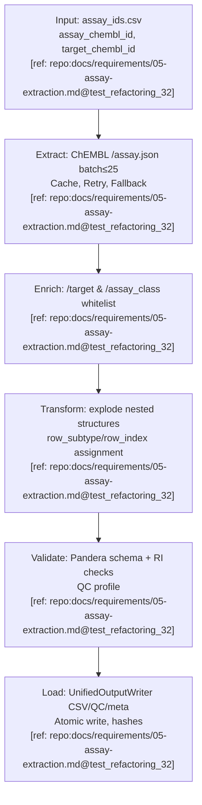
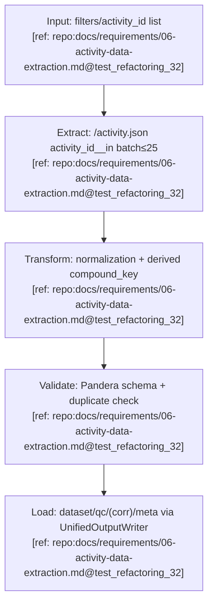
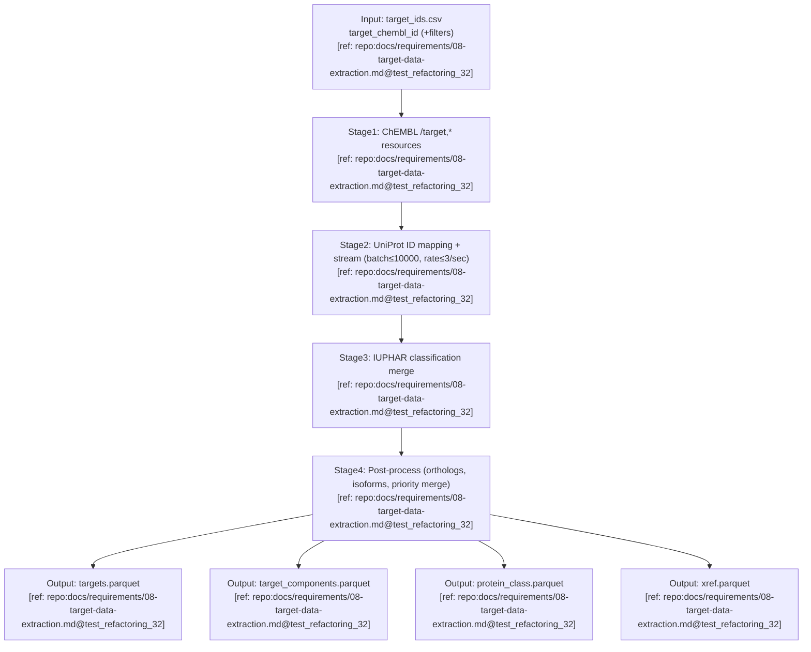

# IO Schemas and Diagrams

## Assay Pipeline

### A) Паспорт пайплайна (Assay)

- **Название:** AssayPipeline
- **Назначение:** детерминированное извлечение, нормализация и выгрузка данных ассая из ChEMBL с whitelist обогащением. [ref: repo:docs/requirements/05-assay-extraction.md@test_refactoring_32]

### B) Диаграмма I/O (Assay)



### C) Input Schema (Assay)

schema:
  name: assay/input
  primary_key: [assay_chembl_id]
  foreign_keys: []
  column_order: [assay_chembl_id, target_chembl_id]
  fields:

```text

- name: assay_chembl_id

  dtype: string
  required: true
  units: null
  allowed_values: []
  constraints:
    regex: '^CHEMBL\\d+$'
  na_policy: forbid
  notes: "Основной идентификатор ассая"
  evidence: "[ref: repo:docs/requirements/05-assay-extraction.md@test_refactoring_32]"

- name: target_chembl_id

  dtype: string
  required: false
  units: null
  allowed_values: []
  constraints:
    regex: '^CHEMBL\\d+$'
  na_policy: allow
  notes: "Опциональный фильтр по таргету"
  evidence: "[ref: repo:docs/requirements/05-assay-extraction.md@test_refactoring_32]"

```

### D) Output Schema (Assay)

schema:
  name: assay/output
  primary_key: [assay_chembl_id, row_subtype, row_index]
  foreign_keys:

```text

- field: target_chembl_id

  references: target(target_chembl_id)

```

  column_order: [assay_chembl_id, row_subtype, row_index, assay_type, assay_category, assay_cell_type, assay_classifications, assay_group, assay_organism, assay_parameters_json, assay_strain, assay_subcellular_fraction, assay_tax_id, assay_test_type, assay_tissue, assay_type_description, assay_description, bao_endpoint, bao_format, bao_label, cell_chembl_id, confidence_description, confidence_score, document_chembl_id, relationship_description, relationship_type, src_assay_id, src_id, target_chembl_id, tissue_chembl_id, variant_sequence_json, assay_param_type, assay_param_relation, assay_param_value, assay_param_units, assay_param_text_value, assay_param_standard_type, assay_param_standard_value, assay_param_standard_units, assay_class_id, assay_class_bao_id, assay_class_type, assay_class_l1, assay_class_l2, assay_class_l3, assay_class_description, variant_id, variant_base_accession, variant_mutation, variant_sequence, variant_accession_reported, pipeline_version, source_system, chembl_release, extracted_at, hash_business_key, hash_row, index]
  fields:

```text

- name: assay_chembl_id

  dtype: string
  required: true
  units: null
  allowed_values: []
  constraints:
    regex: '^CHEMBL\\d+$'
  na_policy: forbid
  notes: "Первичный ключ ассая из ChEMBL API"
  evidence: "[ref: repo:docs/requirements/05-assay-extraction.md@test_refactoring_32]"

- name: row_subtype

  dtype: string
  required: true
  units: null
  allowed_values: ["assay", "param", "variant"]
  constraints: {}
  na_policy: forbid
  notes: "Тип развёрнутой строки"
  evidence: "[ref: repo:docs/requirements/05-assay-extraction.md@test_refactoring_32]"

- name: row_index

  dtype: int
  required: true
  units: null
  allowed_values: []
  constraints:
    min: 0
  na_policy: forbid
  notes: "Индекс для детерминизма"
  evidence: "[ref: repo:docs/requirements/05-assay-extraction.md@test_refactoring_32]"

- name: assay_type

  dtype: string
  required: false
  units: null
  allowed_values: ["B", "F", "A", "P", "T", "U"]
  constraints: {}
  na_policy: allow
  notes: "Тип ассая (B, F, A, P, T, U)"
  evidence: "[ref: repo:docs/requirements/05-assay-extraction.md@test_refactoring_32]"

- name: assay_category

  dtype: string
  required: false
  units: null
  allowed_values: []
  constraints: {}
  na_policy: allow
  notes: "Категория ассая"
  evidence: "[ref: repo:docs/requirements/05-assay-extraction.md@test_refactoring_32]"

- name: assay_cell_type

  dtype: string
  required: false
  units: null
  allowed_values: []
  constraints: {}
  na_policy: allow
  notes: "Тип клеток для ассая"
  evidence: "[ref: repo:docs/requirements/05-assay-extraction.md@test_refactoring_32]"

- name: assay_classifications

  dtype: string
  required: false
  units: null
  allowed_values: []
  constraints: {}
  na_policy: allow
  notes: "Классификации ассая (JSON)"
  evidence: "[ref: repo:docs/requirements/05-assay-extraction.md@test_refactoring_32]"

- name: assay_group

  dtype: string
  required: false
  units: null
  allowed_values: []
  constraints: {}
  na_policy: allow
  notes: "Группа ассая"
  evidence: "[ref: repo:docs/requirements/05-assay-extraction.md@test_refactoring_32]"

- name: assay_organism

  dtype: string
  required: false
  units: null
  allowed_values: []
  constraints: {}
  na_policy: allow
  notes: "Организм для ассая"
  evidence: "[ref: repo:docs/requirements/05-assay-extraction.md@test_refactoring_32]"

- name: assay_parameters_json

  dtype: string
  required: false
  units: null
  allowed_values: []
  constraints: {}
  na_policy: allow
  notes: "Параметры ассая (JSON)"
  evidence: "[ref: repo:docs/requirements/05-assay-extraction.md@test_refactoring_32]"

- name: assay_strain

  dtype: string
  required: false
  units: null
  allowed_values: []
  constraints: {}
  na_policy: allow
  notes: "Штамм организма"
  evidence: "[ref: repo:docs/requirements/05-assay-extraction.md@test_refactoring_32]"

- name: assay_subcellular_fraction

  dtype: string
  required: false
  units: null
  allowed_values: []
  constraints: {}
  na_policy: allow
  notes: "Субклеточная фракция"
  evidence: "[ref: repo:docs/requirements/05-assay-extraction.md@test_refactoring_32]"

- name: assay_tax_id

  dtype: int
  required: false
  units: null
  allowed_values: []
  constraints:
    min: 0
  na_policy: allow
  notes: "Таксономический ID организма"
  evidence: "[ref: repo:docs/requirements/05-assay-extraction.md@test_refactoring_32]"

- name: assay_test_type

  dtype: string
  required: false
  units: null
  allowed_values: []
  constraints: {}
  na_policy: allow
  notes: "Тип теста ассая"
  evidence: "[ref: repo:docs/requirements/05-assay-extraction.md@test_refactoring_32]"

- name: assay_tissue

  dtype: string
  required: false
  units: null
  allowed_values: []
  constraints: {}
  na_policy: allow
  notes: "Ткань для ассая"
  evidence: "[ref: repo:docs/requirements/05-assay-extraction.md@test_refactoring_32]"

- name: assay_type_description

  dtype: string
  required: false
  units: null
  allowed_values: []
  constraints: {}
  na_policy: allow
  notes: "Описание типа ассая"
  evidence: "[ref: repo:docs/requirements/05-assay-extraction.md@test_refactoring_32]"

- name: assay_description

  dtype: string
  required: false
  units: null
  allowed_values: []
  constraints: {}
  na_policy: allow
  notes: "Описание ассая"
  evidence: "[ref: repo:docs/requirements/05-assay-extraction.md@test_refactoring_32]"

- name: bao_endpoint

  dtype: string
  required: false
  units: null
  allowed_values: []
  constraints:
    regex: '^BAO_\\d{7}$'
  na_policy: allow
  notes: "BAO endpoint"
  evidence: "[ref: repo:docs/requirements/05-assay-extraction.md@test_refactoring_32]"

- name: bao_format

  dtype: string
  required: false
  units: null
  allowed_values: []
  constraints:
    regex: '^BAO_\\d+$'
  na_policy: allow
  notes: "BAO format классификация"
  evidence: "[ref: repo:docs/requirements/05-assay-extraction.md@test_refactoring_32]"

- name: bao_label

  dtype: string
  required: false
  units: null
  allowed_values: []
  constraints: {}
  na_policy: allow
  notes: "BAO label классификация"
  evidence: "[ref: repo:docs/requirements/05-assay-extraction.md@test_refactoring_32]"

- name: cell_chembl_id

  dtype: string
  required: false
  units: null
  allowed_values: []
  constraints:
    regex: '^CHEMBL\\d+$'
  na_policy: allow
  notes: "ChEMBL ID клетки"
  evidence: "[ref: repo:docs/requirements/05-assay-extraction.md@test_refactoring_32]"

- name: confidence_description

  dtype: string
  required: false
  units: null
  allowed_values: []
  constraints: {}
  na_policy: allow
  notes: "Описание уверенности"
  evidence: "[ref: repo:docs/requirements/05-assay-extraction.md@test_refactoring_32]"

- name: confidence_score

  dtype: int
  required: false
  units: null
  allowed_values: []
  constraints:
    min: 0
    max: 9
  na_policy: allow
  notes: "Уровень уверенности (0-9)"
  evidence: "[ref: repo:docs/requirements/05-assay-extraction.md@test_refactoring_32]"

- name: document_chembl_id

  dtype: string
  required: false
  units: null
  allowed_values: []
  constraints:
    regex: '^CHEMBL\\d+$'
  na_policy: allow
  notes: "ChEMBL ID документа"
  evidence: "[ref: repo:docs/requirements/05-assay-extraction.md@test_refactoring_32]"

- name: relationship_description

  dtype: string
  required: false
  units: null
  allowed_values: []
  constraints: {}
  na_policy: allow
  notes: "Описание связи"
  evidence: "[ref: repo:docs/requirements/05-assay-extraction.md@test_refactoring_32]"

- name: relationship_type

  dtype: string
  required: false
  units: null
  allowed_values: []
  constraints: {}
  na_policy: allow
  notes: "Тип связи с таргетом"
  evidence: "[ref: repo:docs/requirements/05-assay-extraction.md@test_refactoring_32]"

- name: src_assay_id

  dtype: string
  required: false
  units: null
  allowed_values: []
  constraints: {}
  na_policy: allow
  notes: "ID ассая в источнике"
  evidence: "[ref: repo:docs/requirements/05-assay-extraction.md@test_refactoring_32]"

- name: src_id

  dtype: int
  required: false
  units: null
  allowed_values: []
  constraints: {}
  na_policy: allow
  notes: "ID источника"
  evidence: "[ref: repo:docs/requirements/05-assay-extraction.md@test_refactoring_32]"

- name: target_chembl_id

  dtype: string
  required: false
  units: null
  allowed_values: []
  constraints:
    regex: '^CHEMBL\\d+$'
  na_policy: allow
  notes: "FK на таргет"
  evidence: "[ref: repo:docs/requirements/05-assay-extraction.md@test_refactoring_32]"

- name: tissue_chembl_id

  dtype: string
  required: false
  units: null
  allowed_values: []
  constraints:
    regex: '^CHEMBL\\d+$'
  na_policy: allow
  notes: "ChEMBL ID ткани"
  evidence: "[ref: repo:docs/requirements/05-assay-extraction.md@test_refactoring_32]"

- name: variant_sequence_json

  dtype: string
  required: false
  units: null
  allowed_values: []
  constraints: {}
  na_policy: allow
  notes: "Последовательность варианта (JSON)"
  evidence: "[ref: repo:docs/requirements/05-assay-extraction.md@test_refactoring_32]"

- name: assay_param_type

  dtype: string
  required: false
  units: null
  allowed_values: []
  constraints: {}
  na_policy: allow
  notes: "Тип параметра ассея"
  evidence: "[ref: repo:docs/requirements/05-assay-extraction.md@test_refactoring_32]"

- name: assay_param_relation

  dtype: string
  required: false
  units: null
  allowed_values: ["=", ">", ">=", "<", "<=", "~"]
  constraints: {}
  na_policy: allow
  notes: "Отношение параметра"
  evidence: "[ref: repo:docs/requirements/05-assay-extraction.md@test_refactoring_32]"

- name: assay_param_value

  dtype: float
  required: false
  units: null
  allowed_values: []
  constraints: {}
  na_policy: allow
  notes: "Значение параметра"
  evidence: "[ref: repo:docs/requirements/05-assay-extraction.md@test_refactoring_32]"

- name: assay_param_units

  dtype: string
  required: false
  units: null
  allowed_values: []
  constraints: {}
  na_policy: allow
  notes: "Единицы параметра"
  evidence: "[ref: repo:docs/requirements/05-assay-extraction.md@test_refactoring_32]"

- name: assay_param_text_value

  dtype: string
  required: false
  units: null
  allowed_values: []
  constraints: {}
  na_policy: allow
  notes: "Текстовое значение параметра"
  evidence: "[ref: repo:docs/requirements/05-assay-extraction.md@test_refactoring_32]"

- name: assay_param_standard_type

  dtype: string
  required: false
  units: null
  allowed_values: []
  constraints: {}
  na_policy: allow
  notes: "Стандартизованный тип параметра"
  evidence: "[ref: repo:docs/requirements/05-assay-extraction.md@test_refactoring_32]"

- name: assay_param_standard_value

  dtype: float
  required: false
  units: null
  allowed_values: []
  constraints: {}
  na_policy: allow
  notes: "Стандартизованное значение параметра"
  evidence: "[ref: repo:docs/requirements/05-assay-extraction.md@test_refactoring_32]"

- name: assay_param_standard_units

  dtype: string
  required: false
  units: null
  allowed_values: []
  constraints: {}
  na_policy: allow
  notes: "Единицы стандартизованного параметра"
  evidence: "[ref: repo:docs/requirements/05-assay-extraction.md@test_refactoring_32]"

- name: assay_class_id

  dtype: int
  required: false
  units: null
  allowed_values: []
  constraints: {}
  na_policy: allow
  notes: "Идентификатор класса ассея"
  evidence: "[ref: repo:docs/requirements/05-assay-extraction.md@test_refactoring_32]"

- name: assay_class_bao_id

  dtype: string
  required: false
  units: null
  allowed_values: []
  constraints:
    regex: '^BAO_\\d{7}$'
  na_policy: allow
  notes: "BAO ID класса ассея"
  evidence: "[ref: repo:docs/requirements/05-assay-extraction.md@test_refactoring_32]"

- name: assay_class_type

  dtype: string
  required: false
  units: null
  allowed_values: []
  constraints: {}
  na_policy: allow
  notes: "Тип класса ассея"
  evidence: "[ref: repo:docs/requirements/05-assay-extraction.md@test_refactoring_32]"

- name: assay_class_l1

  dtype: string
  required: false
  units: null
  allowed_values: []
  constraints: {}
  na_policy: allow
  notes: "Иерархия 1 класса ассея"
  evidence: "[ref: repo:docs/requirements/05-assay-extraction.md@test_refactoring_32]"

- name: assay_class_l2

  dtype: string
  required: false
  units: null
  allowed_values: []
  constraints: {}
  na_policy: allow
  notes: "Иерархия 2 класса ассея"
  evidence: "[ref: repo:docs/requirements/05-assay-extraction.md@test_refactoring_32]"

- name: assay_class_l3

  dtype: string
  required: false
  units: null
  allowed_values: []
  constraints: {}
  na_policy: allow
  notes: "Иерархия 3 класса ассея"
  evidence: "[ref: repo:docs/requirements/05-assay-extraction.md@test_refactoring_32]"

- name: assay_class_description

  dtype: string
  required: false
  units: null
  allowed_values: []
  constraints: {}
  na_policy: allow
  notes: "Описание класса ассея"
  evidence: "[ref: repo:docs/requirements/05-assay-extraction.md@test_refactoring_32]"

- name: variant_id

  dtype: int
  required: false
  units: null
  allowed_values: []
  constraints: {}
  na_policy: allow
  notes: "Идентификатор варианта"
  evidence: "[ref: repo:docs/requirements/05-assay-extraction.md@test_refactoring_32]"

- name: variant_base_accession

  dtype: string
  required: false
  units: null
  allowed_values: []
  constraints:
    regex: '^[A-Z0-9]{6,10}(-[0-9]+)?$'
  na_policy: allow
  notes: "UniProt акцессия базовой последовательности"
  evidence: "[ref: repo:docs/requirements/05-assay-extraction.md@test_refactoring_32]"

- name: variant_mutation

  dtype: string
  required: false
  units: null
  allowed_values: []
  constraints: {}
  na_policy: allow
  notes: "Мутация варианта"
  evidence: "[ref: repo:docs/requirements/05-assay-extraction.md@test_refactoring_32]"

- name: variant_sequence

  dtype: string
  required: false
  units: null
  allowed_values: []
  constraints:
    regex: '^[A-Z\\*]+$'
  na_policy: allow
  notes: "Аминокислотная последовательность варианта"
  evidence: "[ref: repo:docs/requirements/05-assay-extraction.md@test_refactoring_32]"

- name: variant_accession_reported

  dtype: string
  required: false
  units: null
  allowed_values: []
  constraints: {}
  na_policy: allow
  notes: "Сообщённая акцессия варианта"
  evidence: "[ref: repo:docs/requirements/05-assay-extraction.md@test_refactoring_32]"

- name: pipeline_version

  dtype: string
  required: true
  units: null
  allowed_values: []
  constraints: {}
  na_policy: forbid
  notes: "Версия пайплайна"
  evidence: "[ref: repo:docs/requirements/05-assay-extraction.md@test_refactoring_32]"

- name: source_system

  dtype: string
  required: true
  units: null
  allowed_values: []
  constraints: {}
  na_policy: forbid
  notes: "Источник данных"
  evidence: "[ref: repo:docs/requirements/05-assay-extraction.md@test_refactoring_32]"

- name: chembl_release

  dtype: string
  required: true
  units: null
  allowed_values: []
  constraints: {}
  na_policy: forbid
  notes: "Версия источника"
  evidence: "[ref: repo:docs/requirements/05-assay-extraction.md@test_refactoring_32]"

- name: extracted_at

  dtype: string
  required: true
  units: null
  allowed_values: []
  constraints: {}
  na_policy: forbid
  notes: "ISO8601 метка времени извлечения"
  evidence: "[ref: repo:docs/requirements/05-assay-extraction.md@test_refactoring_32]"

- name: hash_business_key

  dtype: string
  required: true
  units: null
  allowed_values: []
  constraints:
    regex: '^[0-9a-f]{64}$'
  na_policy: forbid
  notes: "SHA256 от assay_chembl_id"
  evidence: "[ref: repo:docs/requirements/05-assay-extraction.md@test_refactoring_32]"

- name: hash_row

  dtype: string
  required: true
  units: null
  allowed_values: []
  constraints:
    regex: '^[0-9a-f]{64}$'
  na_policy: forbid
  notes: "SHA256 канонической строки"
  evidence: "[ref: repo:docs/requirements/05-assay-extraction.md@test_refactoring_32]"

- name: index

  dtype: int
  required: true
  units: null
  allowed_values: []
  constraints:
    min: 0
  na_policy: forbid
  notes: "Детерминированный индекс строки"
  evidence: "[ref: repo:docs/requirements/05-assay-extraction.md@test_refactoring_32]"

```

### E) Mapping Input→Output (Assay)

| output_field | source_field(s) | transform_rule | unit_conversion | validation_rule | evidence |
|---|---|---|---|---|---|
| assay_chembl_id | assay_chembl_id | passthrough | none | regex `^CHEMBL\d+$` | [ref: repo:docs/requirements/05-assay-extraction.md@test_refactoring_32] |
| row_subtype | derived from nested structure type | assign literal per explode stage | none | value in {assay,param,variant} | [ref: repo:docs/requirements/05-assay-extraction.md@test_refactoring_32] |
| row_index | enumerate within subtype | enumerate starting 0 | none | integer >=0 | [ref: repo:docs/requirements/05-assay-extraction.md@test_refactoring_32] |
| description | ChEMBL assay record.description | whitespace trim | none | optional string | [ref: repo:docs/requirements/05-assay-extraction.md@test_refactoring_32] |
| hash_row | canonicalized row dict | SHA256(JSON, sort_keys, ISO8601, %.6f) | none | length 64 | [ref: repo:docs/requirements/05-assay-extraction.md@test_refactoring_32] |
| hash_business_key | assay_chembl_id | SHA256(assay_chembl_id) | none | length 64 | [ref: repo:docs/requirements/05-assay-extraction.md@test_refactoring_32] |

**Note:** Assay schema содержит все поля из data/output/assay/assay_*.csv включая src_id, src_name, assay_type, assay_organism, assay_tax_id и др. Полный список см. в requirements:05-assay-extraction.md

---

### F) Контракты и детерминизм (Assay)

- Batch запросы `≤25` ID, при превышении — откат к POST+Override; circuit breaker 5/60, retries уважают `Retry-After`. [ref: repo:docs/requirements/05-assay-extraction.md@test_refactoring_32]
- Сортировка `assay_chembl_id,row_subtype,row_index`, nullable dtypes, NA-policy `""/null`. [ref: repo:docs/requirements/05-assay-extraction.md@test_refactoring_32]
- AtomicWriter `os.replace`, run-scoped `.tmp_run_{run_id}`, meta.yaml с SHA256. [ref: repo:docs/requirements/02-io-system.md@test_refactoring_32]

---

## Activity Pipeline

### A) Паспорт пайплайна (Activity)

- **Название:** ActivityPipeline
- **Назначение:** извлечение и нормализация ChEMBL activity c детерминированной выгрузкой и QC. [ref: repo:docs/requirements/06-activity-data-extraction.md@test_refactoring_32]

### B) Диаграмма I/O (Activity)



### C) Input Schema (Activity)

schema:
  name: activity/input
  primary_key: []
  foreign_keys: []
  column_order: [activity_id]
  fields:

```text

- name: activity_id

  dtype: int
  required: false
  units: null
  allowed_values: []
  constraints:
    min: 1
  na_policy: allow
  notes: "Опциональный список идентификаторов для batch извлечения"
  evidence: "[ref: repo:docs/requirements/06-activity-data-extraction.md@test_refactoring_32]"

- name: filter_params

  dtype: string
  required: false
  units: null
  allowed_values: []
  constraints: {}
  na_policy: allow
  notes: "Параметры фильтрации (molecule_chembl_id, target_chembl_id, etc.)"
  evidence: "[ref: repo:docs/requirements/06-activity-data-extraction.md@test_refactoring_32]"

```

### D) Output Schema (Activity)

schema:
  name: activity/output
  primary_key: [activity_id]
  foreign_keys:

```text

- field: molecule_chembl_id

  references: molecule(molecule_chembl_id)

- field: assay_chembl_id

  references: assay(assay_chembl_id)

- field: target_chembl_id

  references: target(target_chembl_id)

- field: document_chembl_id

  references: document(document_chembl_id)

```

  column_order: [activity_id, molecule_chembl_id, assay_chembl_id, target_chembl_id, document_chembl_id, published_type, published_relation, published_value, published_units, standard_type, standard_relation, standard_value, standard_units, standard_flag, lower_bound, upper_bound, is_censored, pchembl_value, activity_comment, data_validity_comment, bao_endpoint, bao_format, bao_label, potential_duplicate, uo_units, qudt_units, src_id, action_type, activity_properties_json, bei, sei, le, lle, pipeline_version, source_system, chembl_release, extracted_at, hash_business_key, hash_row, index]
  fields:

```text

- name: activity_id

  dtype: Int64
  required: true
  units: null
  allowed_values: []
  constraints:
    min: 1
  na_policy: forbid
  notes: "Уникальный идентификатор активности"
  evidence: "[ref: repo:docs/requirements/06-activity-data-extraction.md@test_refactoring_32]"

- name: molecule_chembl_id

  dtype: StringDtype
  required: false
  units: null
  allowed_values: []
  constraints:
    regex: '^CHEMBL\\d+$'
  na_policy: allow
  notes: "FK на молекулу"
  evidence: "[ref: repo:docs/requirements/06-activity-data-extraction.md@test_refactoring_32]"

- name: assay_chembl_id

  dtype: StringDtype
  required: false
  units: null
  allowed_values: []
  constraints:
    regex: '^CHEMBL\\d+$'
  na_policy: allow
  notes: "FK на ассай"
  evidence: "[ref: repo:docs/requirements/06-activity-data-extraction.md@test_refactoring_32]"

- name: target_chembl_id

  dtype: StringDtype
  required: false
  units: null
  allowed_values: []
  constraints:
    regex: '^CHEMBL\\d+$'
  na_policy: allow
  notes: "FK на таргет"
  evidence: "[ref: repo:docs/requirements/06-activity-data-extraction.md@test_refactoring_32]"

- name: document_chembl_id

  dtype: StringDtype
  required: false
  units: null
  allowed_values: []
  constraints:
    regex: '^CHEMBL\\d+$'
  na_policy: allow
  notes: "FK на документ"
  evidence: "[ref: repo:docs/requirements/06-activity-data-extraction.md@test_refactoring_32]"

- name: published_type

  dtype: StringDtype
  required: false
  units: null
  allowed_values: []
  constraints: {}
  na_policy: allow
  notes: "Оригинальный тип опубликованных данных"
  evidence: "[ref: repo:docs/requirements/06-activity-data-extraction.md@test_refactoring_32]"

- name: published_relation

  dtype: StringDtype
  required: false
  units: null
  allowed_values: []
  constraints: {}
  na_policy: allow
  notes: "Соотношение для published_value"
  evidence: "[ref: repo:docs/requirements/06-activity-data-extraction.md@test_refactoring_32]"

- name: published_value

  dtype: Float64
  required: false
  units: "as provided"
  allowed_values: []
  constraints:
    min: 0
  na_policy: allow
  notes: "Оригинальное опубликованное значение"
  evidence: "[ref: repo:docs/requirements/06-activity-data-extraction.md@test_refactoring_32]"

- name: published_units

  dtype: StringDtype
  required: false
  units: null
  allowed_values: []
  constraints: {}
  na_policy: allow
  notes: "Единицы published_value"
  evidence: "[ref: repo:docs/requirements/06-activity-data-extraction.md@test_refactoring_32]"

- name: standard_type

  dtype: StringDtype
  required: false
  units: null
  allowed_values: []
  constraints: {}
  na_policy: allow
  notes: "Стандартизированный тип активности"
  evidence: "[ref: repo:docs/requirements/06-activity-data-extraction.md@test_refactoring_32]"

- name: standard_relation

  dtype: StringDtype
  required: false
  units: null
  allowed_values: []
  constraints: {}
  na_policy: allow
  notes: "Соотношение для standard_value (=, >, <, >=, <=)"
  evidence: "[ref: repo:docs/requirements/06-activity-data-extraction.md@test_refactoring_32]"

- name: standard_value

  dtype: Float64
  required: false
  units: "as provided (nM, µM, etc.)"
  allowed_values: []
  constraints:
    min: 0
  na_policy: allow
  notes: "Стандартизированное значение"
  evidence: "[ref: repo:docs/requirements/06-activity-data-extraction.md@test_refactoring_32]"

- name: standard_units

  dtype: StringDtype
  required: false
  units: null
  allowed_values: []
  constraints: {}
  na_policy: allow
  notes: "Единицы стандартизированного значения"
  evidence: "[ref: repo:docs/requirements/06-activity-data-extraction.md@test_refactoring_32]"

- name: standard_flag

  dtype: Int64
  required: false
  units: null
  allowed_values: []
  constraints: {}
  na_policy: allow
  notes: "Флаг стандартизации (0/1)"
  evidence: "[ref: repo:docs/requirements/06-activity-data-extraction.md@test_refactoring_32]"

- name: lower_bound

  dtype: Float64
  required: false
  units: null
  allowed_values: []
  constraints: {}
  na_policy: allow
  notes: "Нижняя граница стандартизированного значения"
  evidence: "[ref: repo:docs/requirements/06-activity-data-extraction.md@test_refactoring_32]"

- name: upper_bound

  dtype: Float64
  required: false
  units: null
  allowed_values: []
  constraints: {}
  na_policy: allow
  notes: "Верхняя граница стандартизированного значения"
  evidence: "[ref: repo:docs/requirements/06-activity-data-extraction.md@test_refactoring_32]"

- name: is_censored

  dtype: boolean
  required: false
  units: null
  allowed_values: []
  constraints: {}
  na_policy: allow
  notes: "Флаг цензурирования данных"
  evidence: "[ref: repo:docs/requirements/06-activity-data-extraction.md@test_refactoring_32]"

- name: pchembl_value

  dtype: Float64
  required: false
  units: null
  allowed_values: []
  constraints:
    min: 0
  na_policy: allow
  notes: "-log10 нормированное значение"
  evidence: "[ref: repo:docs/requirements/06-activity-data-extraction.md@test_refactoring_32]"

- name: activity_comment

  dtype: StringDtype
  required: false
  units: null
  allowed_values: []
  constraints: {}
  na_policy: allow
  notes: "Комментарий к активности"
  evidence: "[ref: repo:docs/requirements/06-activity-data-extraction.md@test_refactoring_32]"

- name: data_validity_comment

  dtype: StringDtype
  required: false
  units: null
  allowed_values: []
  constraints: {}
  na_policy: allow
  notes: "Комментарий о валидности данных"
  evidence: "[ref: repo:docs/requirements/06-activity-data-extraction.md@test_refactoring_32]"

- name: bao_endpoint

  dtype: StringDtype
  required: false
  units: null
  allowed_values: []
  constraints: {}
  na_policy: allow
  notes: "BAO endpoint (Bioassay Ontology)"
  evidence: "[ref: repo:docs/requirements/06-activity-data-extraction.md@test_refactoring_32]"

- name: bao_format

  dtype: StringDtype
  required: false
  units: null
  allowed_values: []
  constraints: {}
  na_policy: allow
  notes: "BAO format (Bioassay Ontology)"
  evidence: "[ref: repo:docs/requirements/06-activity-data-extraction.md@test_refactoring_32]"

- name: bao_label

  dtype: StringDtype
  required: false
  units: null
  allowed_values: []
  constraints: {}
  na_policy: allow
  notes: "BAO label (Bioassay Ontology)"
  evidence: "[ref: repo:docs/requirements/06-activity-data-extraction.md@test_refactoring_32]"

- name: potential_duplicate

  dtype: Int64
  required: false
  units: null
  allowed_values: [0, 1]
  constraints: {}
  na_policy: allow
  notes: "Возможный дубликат активности"
  evidence: "[ref: repo:docs/requirements/06-activity-data-extraction.md@test_refactoring_32]"

- name: uo_units

  dtype: StringDtype
  required: false
  units: null
  allowed_values: []
  constraints:
    regex: '^UO_\\d{7}$'
  na_policy: allow
  notes: "Unit Ontology ID"
  evidence: "[ref: repo:docs/requirements/06-activity-data-extraction.md@test_refactoring_32]"

- name: qudt_units

  dtype: StringDtype
  required: false
  units: null
  allowed_values: []
  constraints: {}
  na_policy: allow
  notes: "QUDT URI для единиц измерения"
  evidence: "[ref: repo:docs/requirements/06-activity-data-extraction.md@test_refactoring_32]"

- name: src_id

  dtype: Int64
  required: false
  units: null
  allowed_values: []
  constraints: {}
  na_policy: allow
  notes: "ID источника данных"
  evidence: "[ref: repo:docs/requirements/06-activity-data-extraction.md@test_refactoring_32]"

- name: action_type

  dtype: StringDtype
  required: false
  units: null
  allowed_values: []
  constraints: {}
  na_policy: allow
  notes: "Тип действия лиганда"
  evidence: "[ref: repo:docs/requirements/06-activity-data-extraction.md@test_refactoring_32]"

- name: activity_properties_json

  dtype: StringDtype
  required: false
  units: null
  allowed_values: []
  constraints: {}
  na_policy: allow
  notes: "Свойства активности в формате JSON"
  evidence: "[ref: repo:docs/requirements/06-activity-data-extraction.md@test_refactoring_32]"

- name: bei

  dtype: Float64
  required: false
  units: null
  allowed_values: []
  constraints: {}
  na_policy: allow
  notes: "Binding Efficiency Index"
  evidence: "[ref: repo:docs/requirements/06-activity-data-extraction.md@test_refactoring_32]"

- name: sei

  dtype: Float64
  required: false
  units: null
  allowed_values: []
  constraints: {}
  na_policy: allow
  notes: "Surface Efficiency Index"
  evidence: "[ref: repo:docs/requirements/06-activity-data-extraction.md@test_refactoring_32]"

- name: le

  dtype: Float64
  required: false
  units: null
  allowed_values: []
  constraints: {}
  na_policy: allow
  notes: "Ligand Efficiency"
  evidence: "[ref: repo:docs/requirements/06-activity-data-extraction.md@test_refactoring_32]"

- name: lle

  dtype: Float64
  required: false
  units: null
  allowed_values: []
  constraints: {}
  na_policy: allow
  notes: "Lipophilic Ligand Efficiency"
  evidence: "[ref: repo:docs/requirements/06-activity-data-extraction.md@test_refactoring_32]"

- name: extracted_at

  dtype: StringDtype
  required: true
  units: null
  allowed_values: []
  constraints: {}
  na_policy: forbid
  notes: "ISO8601 метка времени извлечения"
  evidence: "[ref: repo:docs/requirements/06-activity-data-extraction.md@test_refactoring_32]"

- name: hash_business_key

  dtype: StringDtype
  required: true
  units: null
  allowed_values: []
  constraints:
    regex: '^[0-9a-f]{64}$'
  na_policy: forbid
  notes: "SHA256 от activity_id"
  evidence: "[ref: repo:docs/requirements/06-activity-data-extraction.md@test_refactoring_32]"

- name: hash_row

  dtype: StringDtype
  required: true
  units: null
  allowed_values: []
  constraints:
    regex: '^[0-9a-f]{64}$'
  na_policy: forbid
  notes: "SHA256 канонической строки"
  evidence: "[ref: repo:docs/requirements/06-activity-data-extraction.md@test_refactoring_32]"

- name: index

  dtype: Int64
  required: true
  units: null
  allowed_values: []
  constraints: {}
  na_policy: forbid
  notes: "Индекс для детерминизма"
  evidence: "[ref: repo:docs/requirements/06-activity-data-extraction.md@test_refactoring_32]"

- name: source_system

  dtype: StringDtype
  required: true
  units: null
  allowed_values: []
  constraints: {}
  na_policy: forbid
  notes: "Источник данных (ChEMBL, ChEMBL_FALLBACK)"
  evidence: "[ref: repo:docs/requirements/06-activity-data-extraction.md@test_refactoring_32]"

- name: chembl_release

  dtype: StringDtype
  required: true
  units: null
  allowed_values: []
  constraints: {}
  na_policy: forbid
  notes: "Версия ChEMBL источника"
  evidence: "[ref: repo:docs/requirements/06-activity-data-extraction.md@test_refactoring_32]"

```

### E) Mapping Input→Output (Activity)

| output_field | source_field(s) | transform_rule | unit_conversion | validation_rule | evidence |
|---|---|---|---|---|---|
| activity_id | API activity_id | passthrough | none | unique, >=1 | [ref: repo:docs/requirements/06-activity-data-extraction.md@test_refactoring_32] |
| standard_value | API standard_value | to Float64 with NaN handling | none | >=0 or null | [ref: repo:docs/requirements/06-activity-data-extraction.md@test_refactoring_32] |
| standard_units | API standard_units | normalize synonyms | convert synonyms to canonical tokens | isin allowed list | [ref: repo:docs/requirements/06-activity-data-extraction.md@test_refactoring_32] |
| hash_row | canonicalized row dict | SHA256(JSON, sort_keys, ISO8601, %.6f) | none | length 64 | [ref: repo:docs/requirements/06-activity-data-extraction.md@test_refactoring_32] |
| hash_business_key | activity_id | SHA256(activity_id) | none | length 64 | [ref: repo:docs/requirements/06-activity-data-extraction.md@test_refactoring_32] |

---

### F) Контракты и детерминизм (Activity)

- Batch `activity_id__in` ≤25, fallback split, respect Retry-After, duplicates запрещены (`duplicated()==0`). [ref: repo:docs/requirements/06-activity-data-extraction.md@test_refactoring_32]
- Сортировка `activity_id`, QC отчёты фиксируют duplicates и coverage. [ref: repo:docs/requirements/06-activity-data-extraction.md@test_refactoring_32]
- OutputWriter стандарт/extended режимы с correlation по feature flag. [ref: repo:docs/requirements/06-activity-data-extraction.md@test_refactoring_32]

---

## Testitem Pipeline

### A) Паспорт пайплайна (Testitem)

- **Название:** TestitemPipeline
- **Назначение:** извлечение молекул ChEMBL с опциональным PubChem enrichment и строгой нормализацией. [ref: repo:docs/requirements/07a-testitem-extraction.md@test_refactoring_32]

### B) Диаграмма I/O (Testitem)

```mermaid

flowchart TB
  IN["Input: testitem_ids.csv<br/>molecule_chembl_id (+nstereo, salt_chembl_id)<br/>[ref: repo:docs/requirements/07a-testitem-extraction.md@test_refactoring_32]"] --> EX["Extract: ChEMBL /molecule.json batch≤25<br/>[ref: repo:docs/requirements/07a-testitem-extraction.md@test_refactoring_32]"]
  EX --> PC{PubChem enabled?<br/>[ref: repo:docs/requirements/07a-testitem-extraction.md@test_refactoring_32]}
  PC -->|Yes| EN["PubChem enrichment (CID resolve, properties)<br/>batch≤100, rate≤5/sec<br/>[ref: repo:docs/requirements/07b-testitem-data-extraction.md@test_refactoring_32]"]
  PC -->|No| TR
  EN --> TR["Transform: flatten hierarchies, merge pubchem_*, apply NA policy<br/>[ref: repo:docs/requirements/07a-testitem-extraction.md@test_refactoring_32]"]
  TR --> VL["Validate: Pandera output schema, QC fail_on duplicates<br/>[ref: repo:docs/requirements/07a-testitem-extraction.md@test_refactoring_32]"]
  VL --> LD["Load: deterministic CSV/QC/(corr)/meta via AtomicWriter<br/>[ref: repo:docs/requirements/07a-testitem-extraction.md@test_refactoring_32]"]

```

### C) Input Schema (Testitem)

schema:
  name: testitem/input
  primary_key: [molecule_chembl_id]
  foreign_keys: []
  column_order: [molecule_chembl_id, nstereo, salt_chembl_id]
  fields:

```text

- name: molecule_chembl_id

  dtype: string
  required: true
  units: null
  allowed_values: []
  constraints:
    regex: '^CHEMBL\\d+$'
  na_policy: forbid
  notes: "Уникальный идентификатор молекулы"
  evidence: "[ref: repo:docs/requirements/07a-testitem-extraction.md@test_refactoring_32]"

- name: nstereo

  dtype: int
  required: false
  units: null
  allowed_values: []
  constraints:
    min: 0
  na_policy: allow
  notes: "Количество стереоизомеров"
  evidence: "[ref: repo:docs/requirements/07a-testitem-extraction.md@test_refactoring_32]"

- name: salt_chembl_id

  dtype: string
  required: false
  units: null
  allowed_values: []
  constraints:
    regex: '^CHEMBL\\d+$'
  na_policy: allow
  notes: "Идентификатор соли"
  evidence: "[ref: repo:docs/requirements/07a-testitem-extraction.md@test_refactoring_32]"

```

### D) Output Schema (Testitem)

schema:
  name: testitem/output
  primary_key: [molecule_chembl_id]
  foreign_keys:

```text

- field: parent_chembl_id

  references: molecule(molecule_chembl_id)

```

  column_order: [molecule_chembl_id, molregno, pref_name, parent_chembl_id, max_phase, structure_type, molecule_type, mw_freebase, qed_weighted, standardized_smiles, standard_inchi, standard_inchi_key, heavy_atoms, aromatic_rings, rotatable_bonds, hba, hbd, lipinski_ro5_violations, lipinski_ro5_pass, all_names, molecule_synonyms, atc_classifications, pubchem_cid, pubchem_synonyms, pipeline_version, source_system, chembl_release, extracted_at, hash_business_key, hash_row, index]
  fields:

```text

- name: molecule_chembl_id

  dtype: string
  required: true
  units: null
  allowed_values: []
  constraints:
    regex: '^CHEMBL\\d+$'
  na_policy: forbid
  notes: "Первичный ключ"
  evidence: "[ref: repo:docs/requirements/07a-testitem-extraction.md@test_refactoring_32]"

- name: molregno

  dtype: int
  required: true
  units: null
  allowed_values: []
  constraints:
    min: 1
  na_policy: forbid
  notes: "Внутренний регистровый номер"
  evidence: "[ref: repo:docs/requirements/07a-testitem-extraction.md@test_refactoring_32]"

- name: pref_name

  dtype: string
  required: false
  units: null
  allowed_values: []
  constraints: {}
  na_policy: allow
  notes: "Предпочтительное название"
  evidence: "[ref: repo:docs/requirements/07a-testitem-extraction.md@test_refactoring_32]"

- name: parent_chembl_id

  dtype: string
  required: false
  units: null
  allowed_values: []
  constraints:
    regex: '^CHEMBL\\d+$'
  na_policy: allow
  notes: "Связь с родительской молекулой"
  evidence: "[ref: repo:docs/requirements/07a-testitem-extraction.md@test_refactoring_32]"

- name: max_phase

  dtype: int
  required: false
  units: null
  allowed_values: []
  constraints:
    min: 0
  na_policy: allow
  notes: "Максимальная стадия разработки"
  evidence: "[ref: repo:docs/requirements/07a-testitem-extraction.md@test_refactoring_32]"

- name: mw_freebase

  dtype: float
  required: false
  units: "as provided"
  allowed_values: []
  constraints:
    min: 0
  na_policy: allow
  notes: "Молекулярная масса"
  evidence: "[ref: repo:docs/requirements/07a-testitem-extraction.md@test_refactoring_32]"

- name: pubchem_cid

  dtype: int
  required: false
  units: null
  allowed_values: []
  constraints:
    min: 1
  na_policy: allow
  notes: "Идентификатор PubChem (enrichment)"
  evidence: "[ref: repo:docs/requirements/07b-testitem-data-extraction.md@test_refactoring_32]"

- name: standardized_smiles

  dtype: string
  required: false
  units: null
  allowed_values: []
  constraints: {}
  na_policy: allow
  notes: "Стандартизированная структура"
  evidence: "[ref: repo:docs/requirements/07a-testitem-extraction.md@test_refactoring_32]"

- name: hash_row

  dtype: string
  required: true
  units: null
  allowed_values: []
  constraints:
    regex: '^[0-9a-f]{64}$'
  na_policy: forbid
  notes: "SHA256 канонической записи"
  evidence: "[ref: repo:docs/requirements/07a-testitem-extraction.md@test_refactoring_32]"

- name: chembl_release

  dtype: string
  required: true
  units: null
  allowed_values: []
  constraints: {}
  na_policy: forbid
  notes: "Версия источника"
  evidence: "[ref: repo:docs/requirements/07a-testitem-extraction.md@test_refactoring_32]"

```

### E) Mapping Input→Output (Testitem)

| output_field | source_field(s) | transform_rule | unit_conversion | validation_rule | evidence |
|---|---|---|---|---|---|
| molecule_chembl_id | molecule_chembl_id | uppercase & trim | none | regex `^CHEMBL\d+$` | [ref: repo:docs/requirements/07a-testitem-extraction.md@test_refactoring_32] |
| molregno | ChEMBL response.molregno | passthrough | none | integer >=1 | [ref: repo:docs/requirements/07a-testitem-extraction.md@test_refactoring_32] |
| pubchem_cid | PubChem properties.CID | first successful CID | none | integer >=1 or null | [ref: repo:docs/requirements/07b-testitem-data-extraction.md@test_refactoring_32] |
| standardized_smiles | molecule_structures + chemistry normalizer | canonicalize SMILES | none | non-empty or null | [ref: repo:docs/requirements/07a-testitem-extraction.md@test_refactoring_32] |
| hash_row | canonicalized row | SHA256 | none | length 64 | [ref: repo:docs/requirements/07a-testitem-extraction.md@test_refactoring_32] |
| hash_business_key | molecule_chembl_id | SHA256(molecule_chembl_id) | none | length 64 | [ref: repo:docs/requirements/07a-testitem-extraction.md@test_refactoring_32] |

**Note:** Testitem schema содержит ~81 поле включая все физико-химические свойства, флаги, drug_*, структуры из requirements:07a-testitem-extraction.md. Полный список полей см. в data/output/testitem/testitem_*.csv

---

### F) Контракты и детерминизм (Testitem)

- ChEMBL batch ≤25, PubChem batch ≤100 (5 req/sec), многоуровневый cache и graceful degradation. [ref: repo:docs/requirements/07a-testitem-extraction.md@test_refactoring_32] [ref: repo:docs/requirements/07b-testitem-data-extraction.md@test_refactoring_32]
- Сортировка `molecule_chembl_id`, column_order фиксирован, NA-policy строгая (nullable dtypes). [ref: repo:docs/requirements/07a-testitem-extraction.md@test_refactoring_32]
- QC fail_on `missing_molecule_chembl_id`, `duplicate_primary_keys`; optional correlation выключен по умолчанию. [ref: repo:docs/requirements/07a-testitem-extraction.md@test_refactoring_32]

---

## Target Pipeline

### A) Паспорт пайплайна (Target)

- **Название:** TargetPipeline
- **Назначение:** объединение ChEMBL таргетов с UniProt и IUPHAR enrichment в четыре согласованные таблицы. [ref: repo:docs/requirements/08-target-data-extraction.md@test_refactoring_32]

### B) Диаграмма I/O (Target)



### C) Input Schema (Target)

schema:
  name: target/input
  primary_key: [target_chembl_id]
  foreign_keys: []
  column_order: [target_chembl_id, organism, target_type]
  fields:

```text

- name: target_chembl_id

  dtype: string
  required: true
  units: null
  allowed_values: []
  constraints:
    regex: '^CHEMBL\\d+$'
  na_policy: forbid
  notes: "Уникальный идентификатор таргета"
  evidence: "[ref: repo:docs/requirements/08-target-data-extraction.md@test_refactoring_32]"

- name: organism

  dtype: string
  required: false
  units: null
  allowed_values: []
  constraints: {}
  na_policy: allow
  notes: "Опциональный фильтр"
  evidence: "[ref: repo:docs/requirements/08-target-data-extraction.md@test_refactoring_32]"

- name: target_type

  dtype: string
  required: false
  units: null
  allowed_values: []
  constraints: {}
  na_policy: allow
  notes: "Опциональный фильтр (SINGLE PROTEIN, COMPLEX и др.)"
  evidence: "[ref: repo:docs/requirements/08-target-data-extraction.md@test_refactoring_32]"

```

### D) Output Schemas (Target)

schema:
  name: target/targets
  primary_key: [target_chembl_id]
  foreign_keys: []
  column_order: [target_chembl_id, pref_name, organism, tax_id, uniprot_id_primary, uniprot_ids_all, gene_symbol, hgnc_id, protein_class_pred_L1, isoform_count, chembl_release]
  fields:

```text

- name: target_chembl_id

  dtype: string
  required: true
  units: null
  allowed_values: []
  constraints:
    regex: '^CHEMBL\\d+$'
  na_policy: forbid
  notes: "Первичный ключ"
  evidence: "[ref: repo:docs/requirements/08-target-data-extraction.md@test_refactoring_32]"

- name: pref_name

  dtype: string
  required: false
  units: null
  allowed_values: []
  constraints: {}
  na_policy: allow
  notes: "Название таргета"
  evidence: "[ref: repo:docs/requirements/08-target-data-extraction.md@test_refactoring_32]"

- name: organism

  dtype: string
  required: false
  units: null
  allowed_values: []
  constraints: {}
  na_policy: allow
  notes: "Организм"
  evidence: "[ref: repo:docs/requirements/08-target-data-extraction.md@test_refactoring_32]"

- name: uniprot_id_primary

  dtype: string
  required: false
  units: null
  allowed_values: []
  constraints:
    regex: '^[A-Z0-9]{6,10}(-[0-9]+)?$'
  na_policy: allow
  notes: "Основной UniProt accession"
  evidence: "[ref: repo:docs/requirements/08-target-data-extraction.md@test_refactoring_32]"

- name: protein_class_pred_L1

  dtype: string
  required: false
  units: null
  allowed_values: []
  constraints: {}
  na_policy: allow
  notes: "Классификация верхнего уровня"
  evidence: "[ref: repo:docs/requirements/08-target-data-extraction.md@test_refactoring_32]"

- name: isoform_count

  dtype: int
  required: false
  units: null
  allowed_values: []
  constraints:
    min: 0
  na_policy: allow
  notes: "Количество изоформ"
  evidence: "[ref: repo:docs/requirements/08-target-data-extraction.md@test_refactoring_32]"

- name: chembl_release

  dtype: string
  required: true
  units: null
  allowed_values: []
  constraints: {}
  na_policy: forbid
  notes: "Версия источника"
  evidence: "[ref: repo:docs/requirements/08-target-data-extraction.md@test_refactoring_32]"

```

schema:

schema:
  name: target/target_components
  primary_key: [target_chembl_id, component_id]
  foreign_keys:

```text

- field: target_chembl_id

  references: targets(target_chembl_id)

```

  column_order: [target_chembl_id, component_id, component_type, accession, sequence, is_canonical, isoform_variant, data_origin]
  fields:

```text

- name: component_id

  dtype: int
  required: true
  units: null
  allowed_values: []
  constraints:
    min: 0
  na_policy: forbid
  notes: "Идентификатор компонента"
  evidence: "[ref: repo:docs/requirements/08-target-data-extraction.md@test_refactoring_32]"

- name: accession

  dtype: string
  required: false
  units: null
  allowed_values: []
  constraints:
    regex: '^[A-Z0-9]{6,10}(-[0-9]+)?$'
  na_policy: allow
  notes: "UniProt accession (canonical/isoform/ortholog)"
  evidence: "[ref: repo:docs/requirements/08-target-data-extraction.md@test_refactoring_32]"

- name: data_origin

  dtype: string
  required: true
  units: null
  allowed_values: ["chembl", "uniprot", "ortholog", "fallback"]
  constraints: {}
  na_policy: forbid
  notes: "Источник компонента"
  evidence: "[ref: repo:docs/requirements/08-target-data-extraction.md@test_refactoring_32]"

```

schema:

schema:
  name: target/protein_class
  primary_key: [target_chembl_id, class_level, class_name]
  foreign_keys:

```text

- field: target_chembl_id

  references: targets(target_chembl_id)

```

  column_order: [target_chembl_id, class_level, class_name, full_path]
  fields:

```text

- name: class_level

  dtype: int
  required: true
  units: null
  allowed_values: []
  constraints:
    min: 1
  na_policy: forbid
  notes: "Уровень иерархии"
  evidence: "[ref: repo:docs/requirements/08-target-data-extraction.md@test_refactoring_32]"

- name: full_path

  dtype: string
  required: true
  units: null
  allowed_values: []
  constraints: {}
  na_policy: forbid
  notes: "Полный путь классификации"
  evidence: "[ref: repo:docs/requirements/08-target-data-extraction.md@test_refactoring_32]"

```

schema:

schema:
  name: target/xref
  primary_key: [target_chembl_id, xref_src_db, xref_id]
  foreign_keys:

```text

- field: target_chembl_id

  references: targets(target_chembl_id)

```

  column_order: [target_chembl_id, xref_src_db, xref_id]
  fields:

```text

- name: xref_src_db

  dtype: string
  required: true
  units: null
  allowed_values: []
  constraints: {}
  na_policy: forbid
  notes: "Источник внешней ссылки"
  evidence: "[ref: repo:docs/requirements/08-target-data-extraction.md@test_refactoring_32]"

- name: xref_id

  dtype: string
  required: true
  units: null
  allowed_values: []
  constraints: {}
  na_policy: forbid
  notes: "Идентификатор во внешней БД"
  evidence: "[ref: repo:docs/requirements/08-target-data-extraction.md@test_refactoring_32]"

```

### E) Mapping Input→Output (Target)

| output_field | source_field(s) | transform_rule | unit_conversion | validation_rule | evidence |
|---|---|---|---|---|---|
| target_chembl_id | input.target_chembl_id | passthrough | none | regex `^CHEMBL\d+$` | [ref: repo:docs/requirements/08-target-data-extraction.md@test_refactoring_32] |
| uniprot_id_primary | UniProt stream.accession | prefer canonical > secondary > ortholog | none | regex UniProt | [ref: repo:docs/requirements/08-target-data-extraction.md@test_refactoring_32] |
| protein_class_pred_L1 | ChEMBL protein_classification.l1 | map to predicted levels | none | string | [ref: repo:docs/requirements/08-target-data-extraction.md@test_refactoring_32] |
| accession (components) | UniProt/ChEMBL mapping | select per priority, mark data_origin | none | regex UniProt or null | [ref: repo:docs/requirements/08-target-data-extraction.md@test_refactoring_32] |
| xref_id | ChEMBL cross_references + UniProt xrefs | normalize IDs, dedupe | none | non-empty string | [ref: repo:docs/requirements/08-target-data-extraction.md@test_refactoring_32] |

### F) Контракты и детерминизм (Target)

- ChEMBL pagination (`limit/offset` with adaptive chunking); UniProt idmapping batch ≤10000 with 5s polling; rate ≤3/sec. [ref: repo:docs/requirements/08-target-data-extraction.md@test_refactoring_32]
- Merge priority: chembl > uniprot > iuphar > ortholog; fallback taxonomy/gene symbol logged WARNING. [ref: repo:docs/requirements/08-target-data-extraction.md@test_refactoring_32]
- AtomicWriter для всех parquet, referential integrity между таблицами, QC coverage ≥80% UniProt, duplicates=0. [ref: repo:docs/requirements/08-target-data-extraction.md@test_refactoring_32]

---

## Document Pipeline

### A) Паспорт пайплайна (Document)

- **Название:** DocumentPipeline
- **Назначение:** извлечение метаданных документов из ChEMBL и внешних источников с детерминированным экспортом. [ref: repo:docs/requirements/09-document-chembl-extraction.md@test_refactoring_32]

### B) Диаграмма I/O

```mermaid

flowchart TB
  IN["Input: document_ids.csv<br/>document_chembl_id<br/>[ref: repo:docs/requirements/09-document-chembl-extraction.md@test_refactoring_32]"] --> EX["Extract: ChEMBL /document.json batch≤25<br/>[ref: repo:docs/requirements/09-document-chembl-extraction.md@test_refactoring_32]"]
  EX --> EN{mode = all?<br/>[ref: repo:docs/requirements/09-document-chembl-extraction.md@test_refactoring_32]}
  EN -->|Yes| EXT["Enrichment adapters: PubMed, Crossref, OpenAlex, S2<br/>independent fetchers<br/>[ref: repo:docs/requirements/09-document-chembl-extraction.md@test_refactoring_32]"]
  EN -->|No| TR
  EXT --> TR["Normalize & merge by DOI/PMID priority<br/>[ref: repo:docs/requirements/09-document-chembl-extraction.md@test_refactoring_32]"]
  TR --> VL["Validate: Pandera raw/normalized schemas, QC coverage/conflicts<br/>[ref: repo:docs/requirements/09-document-chembl-extraction.md@test_refactoring_32]"]
  VL --> LD["Load: dataset/qc/(corr)/meta via AtomicWriter<br/>[ref: repo:docs/requirements/09-document-chembl-extraction.md@test_refactoring_32]"]

```

### C) Input Schema (Document)

schema:
  name: document/input
  primary_key: [document_chembl_id]
  foreign_keys: []
  column_order: [document_chembl_id]
  fields:

```text

- name: document_chembl_id

  dtype: string
  required: true
  units: null
  allowed_values: []
  constraints:
    regex: '^CHEMBL\\d+$'
  na_policy: forbid
  notes: "Уникальный идентификатор документа"
  evidence: "[ref: repo:docs/requirements/09-document-chembl-extraction.md@test_refactoring_32]"

```

### D) Output Schema (Document)

schema:
  name: document/output
  primary_key: [document_chembl_id]
  foreign_keys: []
  column_order: [index, extracted_at, hash_business_key, hash_row, document_chembl_id, document_pubmed_id, document_classification, referenses_on_previous_experiments, original_experimental_document, document_citation, pubmed_mesh_descriptors, pubmed_mesh_qualifiers, pubmed_chemical_list, crossref_subject, chembl_pmid, openalex_pmid, pubmed_pmid, semantic_scholar_pmid, chembl_title, crossref_title, openalex_title, pubmed_article_title, semantic_scholar_title, chembl_abstract, pubmed_abstract, chembl_authors, crossref_authors, openalex_authors, pubmed_authors, semantic_scholar_authors, chembl_doi, crossref_doi, openalex_doi, pubmed_doi, semantic_scholar_doi, chembl_doc_type, crossref_doc_type, openalex_doc_type, openalex_crossref_doc_type, pubmed_doc_type, semantic_scholar_doc_type, openalex_issn, pubmed_issn, semantic_scholar_issn, chembl_journal, pubmed_journal, semantic_scholar_journal, chembl_year, openalex_year, chembl_volume, pubmed_volume, chembl_issue, pubmed_issue, pubmed_first_page, pubmed_last_page, crossref_error, openalex_error, pubmed_error, semantic_scholar_error, pubmed_year_completed, pubmed_month_completed, pubmed_day_completed, pubmed_year_revised, pubmed_month_revised, pubmed_day_revised, publication_date, document_sortorder, valid_doi, valid_journal, valid_year, valid_volume, valid_issue, invalid_doi, invalid_journal, invalid_year, invalid_volume, invalid_issue]
  fields:

```text

- name: index

  dtype: Int64
  required: true
  units: null
  allowed_values: []
  constraints: {}
  na_policy: forbid
  notes: "Индекс строки"
  evidence: "[ref: repo:docs/requirements/09-document-chembl-extraction.md@test_refactoring_32]"

- name: extracted_at

  dtype: StringDtype
  required: true
  units: null
  allowed_values: []
  constraints: {}
  na_policy: forbid
  notes: "ISO8601 метка времени извлечения"
  evidence: "[ref: repo:docs/requirements/09-document-chembl-extraction.md@test_refactoring_32]"

- name: hash_business_key

  dtype: StringDtype
  required: true
  units: null
  allowed_values: []
  constraints:
    regex: '^[0-9a-f]{64}$'
  na_policy: forbid
  notes: "SHA256 от document_chembl_id"
  evidence: "[ref: repo:docs/requirements/09-document-chembl-extraction.md@test_refactoring_32]"

- name: hash_row

  dtype: StringDtype
  required: true
  units: null
  allowed_values: []
  constraints:
    regex: '^[0-9a-f]{64}$'
  na_policy: forbid
  notes: "SHA256 канонической строки"
  evidence: "[ref: repo:docs/requirements/09-document-chembl-extraction.md@test_refactoring_32]"

- name: document_chembl_id

  dtype: StringDtype
  required: true
  units: null
  allowed_values: []
  constraints:
    regex: '^CHEMBL\\d+$'
  na_policy: forbid
  notes: "Первичный ключ"
  evidence: "[ref: repo:docs/requirements/09-document-chembl-extraction.md@test_refactoring_32]"

- name: chembl_title

  dtype: StringDtype
  required: false
  units: null
  allowed_values: []
  constraints: {}
  na_policy: allow
  notes: "Заголовок из ChEMBL"
  evidence: "[ref: repo:docs/requirements/09-document-chembl-extraction.md@test_refactoring_32]"

- name: crossref_title

  dtype: StringDtype
  required: false
  units: null
  allowed_values: []
  constraints: {}
  na_policy: allow
  notes: "Заголовок из Crossref"
  evidence: "[ref: repo:docs/requirements/09-document-chembl-extraction.md@test_refactoring_32]"

- name: openalex_title

  dtype: StringDtype
  required: false
  units: null
  allowed_values: []
  constraints: {}
  na_policy: allow
  notes: "Заголовок из OpenAlex"
  evidence: "[ref: repo:docs/requirements/09-document-chembl-extraction.md@test_refactoring_32]"

- name: pubmed_article_title

  dtype: StringDtype
  required: false
  units: null
  allowed_values: []
  constraints: {}
  na_policy: allow
  notes: "Заголовок из PubMed"
  evidence: "[ref: repo:docs/requirements/09-document-chembl-extraction.md@test_refactoring_32]"

- name: semantic_scholar_title

  dtype: StringDtype
  required: false
  units: null
  allowed_values: []
  constraints: {}
  na_policy: allow
  notes: "Заголовок из Semantic Scholar"
  evidence: "[ref: repo:docs/requirements/09-document-chembl-extraction.md@test_refactoring_32]"

- name: chembl_abstract

  dtype: StringDtype
  required: false
  units: null
  allowed_values: []
  constraints: {}
  na_policy: allow
  notes: "Аннотация из ChEMBL"
  evidence: "[ref: repo:docs/requirements/09-document-chembl-extraction.md@test_refactoring_32]"

- name: pubmed_abstract

  dtype: StringDtype
  required: false
  units: null
  allowed_values: []
  constraints: {}
  na_policy: allow
  notes: "Аннотация из PubMed"
  evidence: "[ref: repo:docs/requirements/09-document-chembl-extraction.md@test_refactoring_32]"

- name: chembl_authors

  dtype: StringDtype
  required: false
  units: null
  allowed_values: []
  constraints: {}
  na_policy: allow
  notes: "Авторы из ChEMBL"
  evidence: "[ref: repo:docs/requirements/09-document-chembl-extraction.md@test_refactoring_32]"

- name: crossref_authors

  dtype: StringDtype
  required: false
  units: null
  allowed_values: []
  constraints: {}
  na_policy: allow
  notes: "Авторы из Crossref"
  evidence: "[ref: repo:docs/requirements/09-document-chembl-extraction.md@test_refactoring_32]"

- name: openalex_authors

  dtype: StringDtype
  required: false
  units: null
  allowed_values: []
  constraints: {}
  na_policy: allow
  notes: "Авторы из OpenAlex"
  evidence: "[ref: repo:docs/requirements/09-document-chembl-extraction.md@test_refactoring_32]"

- name: pubmed_authors

  dtype: StringDtype
  required: false
  units: null
  allowed_values: []
  constraints: {}
  na_policy: allow
  notes: "Авторы из PubMed"
  evidence: "[ref: repo:docs/requirements/09-document-chembl-extraction.md@test_refactoring_32]"

- name: semantic_scholar_authors

  dtype: StringDtype
  required: false
  units: null
  allowed_values: []
  constraints: {}
  na_policy: allow
  notes: "Авторы из Semantic Scholar"
  evidence: "[ref: repo:docs/requirements/09-document-chembl-extraction.md@test_refactoring_32]"

- name: chembl_doi

  dtype: StringDtype
  required: false
  units: null
  allowed_values: []
  constraints: {}
  na_policy: allow
  notes: "DOI из ChEMBL"
  evidence: "[ref: repo:docs/requirements/09-document-chembl-extraction.md@test_refactoring_32]"

- name: crossref_doi

  dtype: StringDtype
  required: false
  units: null
  allowed_values: []
  constraints: {}
  na_policy: allow
  notes: "DOI из Crossref"
  evidence: "[ref: repo:docs/requirements/09-document-chembl-extraction.md@test_refactoring_32]"

- name: openalex_doi

  dtype: StringDtype
  required: false
  units: null
  allowed_values: []
  constraints: {}
  na_policy: allow
  notes: "DOI из OpenAlex"
  evidence: "[ref: repo:docs/requirements/09-document-chembl-extraction.md@test_refactoring_32]"

- name: pubmed_doi

  dtype: StringDtype
  required: false
  units: null
  allowed_values: []
  constraints: {}
  na_policy: allow
  notes: "DOI из PubMed"
  evidence: "[ref: repo:docs/requirements/09-document-chembl-extraction.md@test_refactoring_32]"

- name: semantic_scholar_doi

  dtype: StringDtype
  required: false
  units: null
  allowed_values: []
  constraints: {}
  na_policy: allow
  notes: "DOI из Semantic Scholar"
  evidence: "[ref: repo:docs/requirements/09-document-chembl-extraction.md@test_refactoring_32]"

- name: chembl_pmid

  dtype: Int64
  required: false
  units: null
  allowed_values: []
  constraints: {}
  na_policy: allow
  notes: "PMID из ChEMBL"
  evidence: "[ref: repo:docs/requirements/09-document-chembl-extraction.md@test_refactoring_32]"

- name: pubmed_pmid

  dtype: Int64
  required: false
  units: null
  allowed_values: []
  constraints: {}
  na_policy: allow
  notes: "PMID из PubMed"
  evidence: "[ref: repo:docs/requirements/09-document-chembl-extraction.md@test_refactoring_32]"

- name: chembl_year

  dtype: Int64
  required: false
  units: null
  allowed_values: []
  constraints:
    min: 1800
    max: 2100
  na_policy: allow
  notes: "Год публикации из ChEMBL"
  evidence: "[ref: repo:docs/requirements/09-document-chembl-extraction.md@test_refactoring_32]"

- name: openalex_year

  dtype: Int64
  required: false
  units: null
  allowed_values: []
  constraints: {}
  na_policy: allow
  notes: "Год публикации из OpenAlex"
  evidence: "[ref: repo:docs/requirements/09-document-chembl-extraction.md@test_refactoring_32]"

- name: chembl_journal

  dtype: StringDtype
  required: false
  units: null
  allowed_values: []
  constraints: {}
  na_policy: allow
  notes: "Название журнала из ChEMBL"
  evidence: "[ref: repo:docs/requirements/09-document-chembl-extraction.md@test_refactoring_32]"

- name: pubmed_journal

  dtype: StringDtype
  required: false
  units: null
  allowed_values: []
  constraints: {}
  na_policy: allow
  notes: "Название журнала из PubMed"
  evidence: "[ref: repo:docs/requirements/09-document-chembl-extraction.md@test_refactoring_32]"

- name: semantic_scholar_journal

  dtype: StringDtype
  required: false
  units: null
  allowed_values: []
  constraints: {}
  na_policy: allow
  notes: "Название журнала из Semantic Scholar"
  evidence: "[ref: repo:docs/requirements/09-document-chembl-extraction.md@test_refactoring_32]"

- name: chembl_volume

  dtype: StringDtype
  required: false
  units: null
  allowed_values: []
  constraints: {}
  na_policy: allow
  notes: "Том журнала из ChEMBL"
  evidence: "[ref: repo:docs/requirements/09-document-chembl-extraction.md@test_refactoring_32]"

- name: pubmed_volume

  dtype: StringDtype
  required: false
  units: null
  allowed_values: []
  constraints: {}
  na_policy: allow
  notes: "Том журнала из PubMed"
  evidence: "[ref: repo:docs/requirements/09-document-chembl-extraction.md@test_refactoring_32]"

- name: chembl_issue

  dtype: StringDtype
  required: false
  units: null
  allowed_values: []
  constraints: {}
  na_policy: allow
  notes: "Выпуск журнала из ChEMBL"
  evidence: "[ref: repo:docs/requirements/09-document-chembl-extraction.md@test_refactoring_32]"

- name: pubmed_issue

  dtype: StringDtype
  required: false
  units: null
  allowed_values: []
  constraints: {}
  na_policy: allow
  notes: "Выпуск журнала из PubMed"
  evidence: "[ref: repo:docs/requirements/09-document-chembl-extraction.md@test_refactoring_32]"

- name: pubmed_first_page

  dtype: StringDtype
  required: false
  units: null
  allowed_values: []
  constraints: {}
  na_policy: allow
  notes: "Первая страница из PubMed"
  evidence: "[ref: repo:docs/requirements/09-document-chembl-extraction.md@test_refactoring_32]"

- name: pubmed_last_page

  dtype: StringDtype
  required: false
  units: null
  allowed_values: []
  constraints: {}
  na_policy: allow
  notes: "Последняя страница из PubMed"
  evidence: "[ref: repo:docs/requirements/09-document-chembl-extraction.md@test_refactoring_32]"

- name: crossref_error

  dtype: StringDtype
  required: false
  units: null
  allowed_values: []
  constraints: {}
  na_policy: allow
  notes: "Ошибка Crossref адаптера"
  evidence: "[ref: repo:docs/requirements/09-document-chembl-extraction.md@test_refactoring_32]"

- name: openalex_error

  dtype: StringDtype
  required: false
  units: null
  allowed_values: []
  constraints: {}
  na_policy: allow
  notes: "Ошибка OpenAlex адаптера"
  evidence: "[ref: repo:docs/requirements/09-document-chembl-extraction.md@test_refactoring_32]"

- name: pubmed_error

  dtype: StringDtype
  required: false
  units: null
  allowed_values: []
  constraints: {}
  na_policy: allow
  notes: "Ошибка PubMed адаптера"
  evidence: "[ref: repo:docs/requirements/09-document-chembl-extraction.md@test_refactoring_32]"

- name: semantic_scholar_error

  dtype: StringDtype
  required: false
  units: null
  allowed_values: []
  constraints: {}
  na_policy: allow
  notes: "Ошибка Semantic Scholar адаптера"
  evidence: "[ref: repo:docs/requirements/09-document-chembl-extraction.md@test_refactoring_32]"

```

### E) Mapping Input→Output (Document)

| output_field | source_field(s) | transform_rule | unit_conversion | validation_rule | evidence |
|---|---|---|---|---|---|
| document_chembl_id | input.document_chembl_id | uppercase & trim | none | regex `^CHEMBL\d+$` | [ref: repo:docs/requirements/09-document-chembl-extraction.md@test_refactoring_32] |
| hash_row | canonicalized row dict | SHA256(JSON, sort_keys, ISO8601, %.6f) | none | length 64 | [ref: repo:docs/requirements/09-document-chembl-extraction.md@test_refactoring_32] |
| hash_business_key | document_chembl_id | SHA256(document_chembl_id) | none | length 64 | [ref: repo:docs/requirements/09-document-chembl-extraction.md@test_refactoring_32] |

---

### F) Контракты и детерминизм (Document)

- Batch ≤25, recursive split на timeouts, respect Retry-After, circuit breaker 5/60. [ref: repo:docs/requirements/09-document-chembl-extraction.md@test_refactoring_32]
- mode=all запускает независимые адаптеры с rate limits (PubMed batch 200, Crossref cursor rows≤1000, OpenAlex per_page≤200, Semantic Scholar graceful degradation). [ref: repo:docs/requirements/09-document-chembl-extraction.md@test_refactoring_32]
- QC отчёты: coverage (doi_coverage, pmid_coverage, title_coverage, journal_coverage), conflicts (doi, pmid), duplicates (CHEMBL, DOI+year, PMID), access_denied; meta.yaml фиксирует metrics и checksum. [ref: repo:docs/requirements/09-document-chembl-extraction.md@test_refactoring_32]
- AtomicWriter `.tmp` per run, deterministic CSV/Parquet; correlation report опционален. [ref: repo:docs/requirements/02-io-system.md@test_refactoring_32] [ref: repo:docs/requirements/09-document-chembl-extraction.md@test_refactoring_32]

