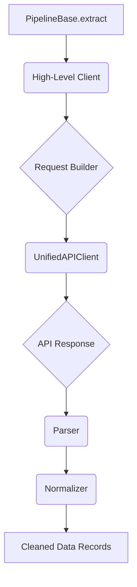

# ChEMBL Source Component Architecture

This document provides a detailed specification for the architecture of ChEMBL data source components. It builds upon the general principles outlined in the main `[ref: repo:docs/sources/00-sources-architecture.md@test_refactoring_32]` document, focusing on the concrete implementation patterns used for all ChEMBL pipelines.

## 1. Core Principles

The ChEMBL source architecture is designed to be modular, reusable, and maintainable. It achieves this by separating the concerns of data fetching, parsing, and normalization into distinct, specialized classes for each pipeline.

All ChEMBL source components are located in a standardized, nested directory structure under `src/bioetl/sources/chembl/`. For example, all components for the `activity` pipeline reside in `src/bioetl/sources/chembl/activity/`.

## 2. Component Stack and Interaction

The interaction between the components follows a clear, linear flow, orchestrated by a high-level client.

**High-Level Client → Request Builder → `UnifiedAPIClient` → Parser → Normalizer**

### 2.1. High-Level Client (e.g., `ActivityChEMBLClient`)

-   **Role**: Acts as the primary orchestrator and entry point for the source. The `PipelineBase.extract()` method calls a method on this client (e.g., `fetch_all_activities`).
-   **Responsibilities**:
    -   Manages the overall fetching logic for a specific ChEMBL entity.
    -   Instantiates and uses a `RequestBuilder` to construct the necessary API requests.
    -   Receives the raw API response from the `UnifiedAPIClient` and passes it to the `Parser`.
    -   Collects the cleaned data records from the parser and returns them to the pipeline.

### 2.2. Request Builder (e.g., `ActivityRequestBuilder`)

-   **Role**: Encapsulates the logic for constructing valid ChEMBL API requests for a specific entity.
-   **Responsibilities**:
    -   Handles API-specific parameter formatting (e.g., batching IDs for an `__in` query).
    -   Manages pagination logic (e.g., calculating `limit` and `offset` parameters).
    -   Constructs the final URL endpoint and query parameters for the `UnifiedAPIClient`.

### 2.3. Parser (e.g., `ActivityParser`)

-   **Role**: Transforms the raw, nested JSON response from the ChEMBL API into a flattened, clean dictionary.
-   **Responsibilities**:
    -   Extracts relevant fields from the nested API response.
    -   Performs initial data cleaning, such as handling nulls or renaming fields.
    -   Invokes `Normalizer` functions to standardize the values of specific fields.
    -   Returns a simple, flat dictionary for each record, ready to be converted into a DataFrame row.

### 2.4. Normalizer (e.g., `ActivityNormalizer`)

-   **Role**: Contains pure functions for canonicalizing the values of specific data fields.
-   **Responsibilities**:
    -   Enforces consistent data types (e.g., converting strings to integers).
    -   Standardizes controlled vocabulary (e.g., case normalization).
    -   Handles complex value transformations (e.g., parsing nested structures).

## 3. Implementation Matrix for ChEMBL Pipelines

The following table maps each of the five core ChEMBL pipelines to their specific architectural components.

| Pipeline | High-Level Client | Request Builder | Parser | Pandera Schema |
|---|---|---|---|---|
| **`activity`** | `ActivityChEMBLClient` | `ActivityRequestBuilder` | `ActivityParser` | `ActivitySchema` |
| **`assay`** | `AssayChEMBLClient` | `AssayRequestBuilder` | `AssayParser` | `AssaySchema` |
| **`document`** | `DocumentChEMBLClient`| `DocumentRequestBuilder`| `DocumentParser` | `DocumentSchema` |
| **`target`** | `TargetChEMBLClient` | `TargetRequestBuilder` | `TargetParser` | `TargetSchema` |
| **`testitem`** | `TestItemChEMBLClient`| `TestItemRequestBuilder`| `TestItemParser` | `TestItemSchema` |
