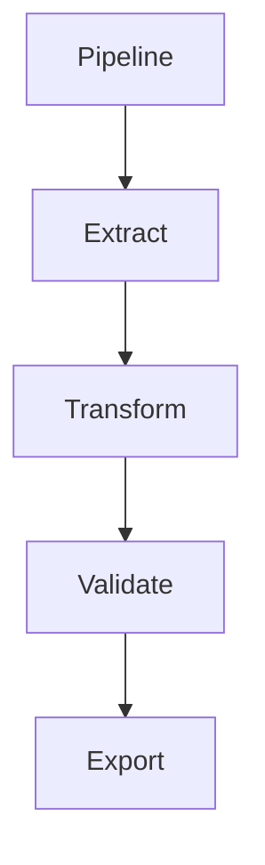

# Documentation Standards

This document defines the standards for documentation in the `bioetl` project. All documentation **MUST** be synchronized with code and schemas.

## Principles

- **Synchronization**: Documentation **MUST** be synchronized with code and schemas.
- **No Manual Editing**: Auto-generated sections **SHALL NOT** be edited manually.
- **Contract Changes**: Any contract changes **MUST** be documented immediately.
- **CHANGELOG**: Breaking changes **MUST** be recorded in CHANGELOG.md.
- **Examples**: All major features **SHOULD** include runnable examples.

## File Naming Conventions

All documentation files **MUST** follow the naming conventions defined in [`00-naming-conventions.md`](./00-naming-conventions.md):

### Sequenced Documents

Documents that are part of a sequence **SHOULD** use numbered prefixes:

- Format: `NN-topic-name.md`
- Examples:
  - `00-cli-overview.md`
  - `01-cli-commands.md`
  - `02-cli-exit-codes.md`

### Index Files

Primary index files **SHOULD** use all-caps names:

- `INDEX.md`: Main index for a directory
- `README.md`: Directory overview

### Valid Examples: Naming

```text
docs/
├── INDEX.md
├── cli/
│   ├── 00-cli-overview.md
│   ├── 01-cli-commands.md
│   └── 02-cli-exit-codes.md
└── pipelines/
    ├── 00-pipeline-base.md
    └── 03-data-extraction.md
```

## Synchronization with Code

### Documentation Update Checklist

Any pull request that changes public-facing artifacts **MUST** update the corresponding documentation and examples:

- New CLI command → update `docs/cli/01-cli-commands.md` and add a runnable example
- New or modified CLI flag → synchronize the options table in `docs/cli/01-cli-commands.md`
- New environment variable → update `docs/configs/config-env.md` and `.env.example`
- New or updated exit codes → refresh `docs/cli/02-cli-exit-codes.md`
- Changed public function signatures → update the API references in `docs/api/`

Pull requests that introduce such changes **SHALL** be rejected if the documentation checklist is not satisfied.

### Schema Documentation

Schema documentation **MUST** be synchronized with Pandera schemas:

```python
# src/bioetl/schemas/activity_schema.py
ActivitySchema = DataFrameSchema(
    columns={
        "activity_id": Column(str, nullable=False),
        "value": Column(float, nullable=False),
    },
    # ... schema definition
)
```

```markdown
<!-- docs/schemas/activity.md -->
## Activity Schema

- `activity_id` (str, required): Unique activity identifier
- `value` (float, required): Activity value
```

### API Documentation

API documentation **MUST** reflect actual function signatures:

```python
# src/bioetl/core/api_client.py
def get(self, endpoint: str, params: dict | None = None) -> Response:
    """Make GET request to API endpoint."""
    pass
```

```markdown
<!-- docs/http/api-client.md -->
## UnifiedAPIClient.get()

**Signature**: `get(endpoint: str, params: dict | None = None) -> Response`

**Description**: Make GET request to API endpoint.
```

## Auto-Generated Sections

Auto-generated sections **SHALL NOT** be edited manually:

### Valid Examples: Auto-Generated Sections

```markdown
<!-- This section is auto-generated. Do not edit manually. -->
<!-- Generated by: scripts/docs/generate_api_reference.py -->

## API Reference

### UnifiedAPIClient

[Auto-generated content]
```

### Invalid Examples

```markdown
<!-- Invalid: manual editing of auto-generated section -->
<!-- This section is auto-generated. Do not edit manually. -->
## API Reference

### UnifiedAPIClient
[Manually edited content]  <!-- SHALL NOT edit auto-generated sections -->
```

## Contract Changes

Any changes to public APIs, CLI, or schemas **MUST** be documented:

### Valid Examples: Contract Updates

1. **Update Function Docstring**:

    ```python
    def process_data(df: pd.DataFrame, batch_size: int = 1000) -> pd.DataFrame:
        """Process data in batches.

        Args:
            df: Input DataFrame
            batch_size: Number of rows per batch (default: 1000, changed from 500 in v1.1.0)

        Returns:
            Processed DataFrame
        """
        pass
    ```

1. **Update CHANGELOG.md**:

    ```markdown
    ## [1.1.0] - 2024-01-01

    ### Changed
    - `process_data()` default `batch_size` changed from 500 to 1000
    ```

1. **Update Documentation**:

    ```markdown
    ## Process Data Function

    The `process_data()` function processes data in batches. The default batch size is now 1000 (changed from 500 in v1.1.0).
    ```

## CHANGELOG.md

Breaking changes **MUST** be recorded in CHANGELOG.md:

### Format

```markdown
# Changelog

All notable changes to this project will be documented in this file.

## [Unreleased]

### Added
- New feature X

### Changed
- Changed behavior Y

### Deprecated
- Feature Z will be removed in v2.0.0

### Removed
- Removed feature W (deprecated in v1.0.0)

### Fixed
- Bug fix A
```

### Valid Examples: Changelog Entries

```markdown
## [1.2.0] - 2024-02-01

### Breaking Changes
- `PipelineConfig.output_dir` is now required (was optional)

### Added
- New `--dry-run` flag for CLI commands

### Changed
- Default batch size increased from 1000 to 2000
```

## Examples and Usage

All major features **SHOULD** include runnable examples:

### Valid Examples: Usage Documentation

- **Python API example**:

    ```python
    from bioetl.pipelines import ActivityPipeline
    from bioetl.config import load_config

    # Load configuration
    config = load_config("configs/pipelines/activity.yaml")

    # Create pipeline
    pipeline = ActivityPipeline(config)

    # Run pipeline
    pipeline.run()
    ```

- **Command line example**:

    ```bash
    python -m bioetl.cli.app activity \
      --config configs/pipelines/activity.yaml \
      --output data/output/activity
    ```

## Diagrams

Diagrams **SHOULD** use Mermaid format:



## Input/Output Documentation

All pipelines **MUST** document inputs and outputs:

### Valid Examples: Input/Output Documentation

```markdown
## Activity Pipeline

### Inputs

- Configuration file: `configs/pipelines/activity.yaml`
- Source data: ChEMBL API

### Outputs

- CSV file: `data/output/activity/activity_v1.csv`
- Metadata: `data/output/activity/activity_v1.meta.yaml`
- QC report: `data/output/activity/activity_v1_qc.csv`

### Schema

| Column | Type | Description |
|--------|------|-------------|
| activity_id | str | Unique activity identifier |
| value | float | Activity value |
```

## Cross-References

Documentation **SHOULD** include cross-references:

```markdown
## Related Documentation

- Pipeline base: [`docs/pipelines/00-pipeline-base.md`](../pipelines/00-pipeline-base.md)
- Schema validation: [`docs/schemas/00-pandera-policy.md`](../schemas/00-pandera-policy.md)
- CLI commands: [`docs/cli/01-cli-commands.md`](../cli/01-cli-commands.md)
```

## Version Information

Documentation **SHOULD** include version information:

```markdown
## Version History

- v1.0.0 (2024-01-01): Initial release
- v1.1.0 (2024-02-01): Added batch processing
- v1.2.0 (2024-03-01): Breaking change: output_dir is now required
```

## References

- Naming conventions: [`00-naming-conventions.md`](./00-naming-conventions.md)
- Main documentation index: [`docs/INDEX.md`](../INDEX.md)
